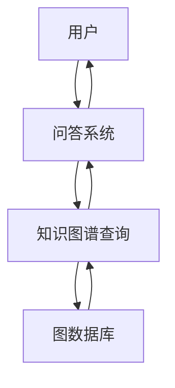

                 


# 知识图谱在金融领域知识问答中的应用

## 关键词：知识图谱、金融问答、自然语言处理、知识库、深度学习

## 摘要：  
知识图谱是一种通过结构化的知识表示和语义关联来支持智能问答的技术，在金融领域具有广泛的应用潜力。本文详细探讨了知识图谱在金融问答中的核心概念、构建方法、算法原理及系统架构，并通过实际案例展示了其在金融领域的应用场景。文章从理论到实践，全面分析了知识图谱如何助力金融领域的智能问答系统，为读者提供了一个系统性、深入的技术解读。

---

# 第一部分: 知识图谱与金融领域知识问答的背景

## 第1章: 知识图谱概述

### 1.1 知识图谱的基本概念

#### 1.1.1 知识图谱的定义
知识图谱是一种通过三元组（实体-关系-实体或实体-属性-值）构建的语义网络，旨在表示现实世界中的实体及其之间的关系。例如，在金融领域，知识图谱可以表示“公司A”与“公司B”之间的“收购”关系。

#### 1.1.2 知识图谱的特点
知识图谱具有以下特点：
- **结构化**：通过标准化的格式表示知识，便于计算机理解和处理。
- **语义化**：通过实体间的关系和属性，揭示数据的深层语义。
- **可扩展性**：支持动态添加新实体和关系，适应金融领域的复杂变化。
- **多模态**：可以整合文本、图像、表格等多种数据类型。

#### 1.1.3 知识图谱的核心要素
知识图谱的核心要素包括：
1. **实体**：金融领域的实体可以是公司、股票、基金、指数等。
2. **属性**：描述实体的特征，例如“公司A的成立时间是2000年”。
3. **关系**：描述实体之间的关联，例如“公司A收购了公司B”。

### 1.2 知识图谱的构建过程

#### 1.2.1 数据采集与预处理
数据来源包括：
- 结构化数据：如数据库中的公司信息。
- 半结构化数据：如新闻文章、财务报告。
- 非结构化数据：如社交媒体上的文本。

预处理步骤包括：
- 数据清洗：去除噪声数据。
- 数据归一化：统一实体表示（例如，公司名称的标准化）。

#### 1.2.2 实体识别与链接
实体识别是通过自然语言处理技术从文本中提取实体。例如，从新闻文章中提取“公司A”和“公司B”。

实体链接是将提取的实体与知识图谱中的实体进行匹配，确保实体的唯一性。例如，将“公司A”链接到知识图谱中的具体节点。

#### 1.2.3 关系抽取与构建
关系抽取是通过模式匹配或深度学习模型从文本中提取实体之间的关系。例如，从新闻文章中提取“公司A收购公司B”的关系。

关系构建是将抽取的关系添加到知识图谱中，形成完整的语义网络。

### 1.3 知识图谱的应用领域

#### 1.3.1 金融领域的应用潜力
知识图谱在金融领域的潜力包括：
- **智能问答**：帮助投资者快速获取公司背景、市场趋势等信息。
- **风险评估**：通过分析公司之间的关系，评估投资风险。
- **舆情分析**：通过分析社交媒体上的情感信息，预测市场走势。

#### 1.3.2 其他领域的应用实例
知识图谱在其他领域的应用包括：
- **医疗领域**：构建疾病-症状-药物的知识图谱。
- **教育领域**：构建课程-知识点-学生的知识图谱。

---

## 第2章: 金融领域知识问答的背景与需求

### 2.1 金融领域的知识特点

#### 2.1.1 金融知识的复杂性
金融领域的知识通常涉及复杂的法律、经济和数学知识。例如，理解“期权”需要对金融衍生品有深入了解。

#### 2.1.2 金融数据的多样性
金融数据包括结构化数据（如股票价格）和非结构化数据（如新闻文章）。这些数据需要通过多种方式整合。

#### 2.1.3 金融场景的多样性
金融场景包括股票交易、风险管理、投资决策等，每个场景都需要不同的知识支持。

### 2.2 金融知识问答的挑战

#### 2.2.1 传统问答系统的局限性
传统问答系统主要依赖关键词匹配，难以理解金融知识的复杂性和关联性。

#### 2.2.2 知识图谱在金融问答中的优势
知识图谱通过语义关联和结构化知识，能够更准确地理解用户的问题，并提供更相关的答案。

### 2.3 知识图谱在金融问答中的应用价值

#### 2.3.1 提高问答系统的准确性
知识图谱通过语义关联，能够准确理解用户意图，提供更精确的答案。

#### 2.3.2 增强系统的可解释性
知识图谱的结构化表示使得回答的生成过程更加透明，用户可以更容易理解答案的来源。

#### 2.3.3 支持复杂金融场景的处理
知识图谱能够处理复杂的金融关系，例如公司并购、关联交易等。

---

# 第二部分: 知识图谱在金融问答中的核心概念与联系

## 第3章: 知识图谱的核心概念与原理

### 3.1 知识图谱的构建原理

#### 3.1.1 数据抽取与清洗
数据抽取是从多种数据源中提取相关信息，清洗过程去除噪声数据，确保数据质量。

#### 3.1.2 实体识别与链接
实体识别是通过自然语言处理技术从文本中提取实体，实体链接是将实体与知识图谱中的节点进行匹配。

#### 3.1.3 知识图谱的存储与管理
知识图谱通常存储在图数据库中，如Neo4j。存储结构包括节点和边，分别表示实体和关系。

### 3.2 知识图谱的表示方法

#### 3.2.1 三元组表示法
三元组表示法将知识表示为（头实体，关系，尾实体），例如（公司A，收购，公司B）。

#### 3.2.2 图结构表示法
图结构表示法通过图中的节点和边表示实体及其关系，形成一个语义网络。

#### 3.2.3 知识图谱的语义网络表示
语义网络表示法通过层次化结构组织知识，例如将金融领域的知识分为公司、市场、产品等层次。

### 3.3 知识图谱的推理与问答

#### 3.3.1 基于图的推理算法
基于图的推理算法通过遍历图结构，找到实体之间的关系路径，支持复杂的问答场景。

#### 3.3.2 知识图谱支持的问答模式
知识图谱支持的问答模式包括：
- 实体属性查询：例如“公司A的成立时间是什么？”
- 实体关系查询：例如“公司A收购了哪些公司？”
- 复杂关系推理：例如“公司A收购的公司B的CEO是谁？”

#### 3.3.3 知识图谱的可扩展性
知识图谱的可扩展性使其能够适应金融领域的快速变化，例如新增公司或新产品。

## 第4章: 知识图谱与金融问答的联系

### 4.1 知识图谱在金融问答中的应用

#### 4.1.1 提供结构化的知识表示
知识图谱将金融知识结构化，使得问答系统能够快速理解用户问题。

#### 4.1.2 支持语义关联分析
知识图谱通过语义关联，能够理解用户问题的深层含义，并提供相关的答案。

#### 4.1.3 提高问答系统的准确性和效率
知识图谱的结构化表示和语义关联使得问答系统能够快速找到准确的答案。

### 4.2 知识图谱与金融问答的结合

#### 4.2.1 金融问答的场景分析
金融问答的场景包括：
- 投资者咨询：例如“如何投资科技公司？”
- 风险评估：例如“公司A的投资风险如何？”
- 市场趋势分析：例如“最近科技股的趋势如何？”

#### 4.2.2 知识图谱在金融问答中的具体应用
知识图谱在金融问答中的具体应用包括：
- 提供公司背景信息：例如“公司A的成立时间是什么？”
- 分析公司关系：例如“公司A收购了哪些公司？”
- 预测市场趋势：例如“科技股的未来走势如何？”

---

## 第5章: 知识图谱的构建与金融问答系统的结合

### 5.1 知识图谱的构建过程

#### 5.1.1 数据来源
数据来源包括：
- 公司信息：如公司官网、新闻报道。
- 财务数据：如财务报表、市场数据。
- 社交媒体：如Twitter、LinkedIn上的讨论。

#### 5.1.2 数据处理
数据处理包括：
- 数据清洗：去除重复或无效数据。
- 数据归一化：统一实体表示。
- 数据标注：标注实体和关系。

#### 5.1.3 知识图谱构建
知识图谱构建包括：
- 实体识别：从文本中提取实体。
- 关系抽取：从文本中提取实体之间的关系。
- 知识图谱存储：将实体和关系存储在图数据库中。

### 5.2 知识图谱与问答系统的结合

#### 5.2.1 问答系统的流程
问答系统的流程包括：
1. 用户输入问题。
2. 系统解析问题，确定需要查询的知识图谱部分。
3. 系统通过图数据库查询相关知识。
4. 系统生成答案。

#### 5.2.2 知识图谱在问答系统中的作用
知识图谱在问答系统中的作用包括：
- 提供结构化的知识表示，支持快速查询。
- 支持语义关联分析，理解用户问题的深层含义。
- 提供准确的答案，避免传统问答系统的模糊性。

### 5.3 知识图谱的扩展与优化

#### 5.3.1 知识图谱的动态更新
知识图谱需要动态更新，以反映金融领域的最新变化。例如，公司并购、新产品发布等。

#### 5.3.2 知识图谱的多模态融合
知识图谱可以通过多模态数据融合，例如结合图像、视频等，提供更丰富的信息。

#### 5.3.3 知识图谱的可解释性
知识图谱的可解释性使其能够清晰地展示答案的来源，增强用户对答案的信任。

---

## 第6章: 金融知识问答系统的实现

### 6.1 系统架构设计

#### 6.1.1 系统功能模块
系统功能模块包括：
- 数据预处理模块：负责数据的清洗和归一化。
- 知识图谱构建模块：负责实体识别、关系抽取和知识图谱存储。
- 问答系统模块：负责解析用户问题，查询知识图谱，生成答案。

#### 6.1.2 系统交互流程
系统交互流程包括：
1. 用户输入问题。
2. 系统解析问题，确定需要查询的知识图谱部分。
3. 系统查询知识图谱，获取相关信息。
4. 系统生成答案并返回给用户。

#### 6.1.3 系统架构图


### 6.2 知识图谱的存储与查询

#### 6.2.1 图数据库的选择
图数据库是知识图谱的核心存储系统。常见的图数据库包括：
- **Neo4j**：支持高效的图遍历和查询。
- **Neo4j Browser**：提供可视化界面，便于管理和查询知识图谱。
- **其他图数据库**：如Dgraph、ArangoDB等。

#### 6.2.2 知识图谱的查询语言
知识图谱的查询语言包括：
- **Cypher**：Neo4j的查询语言，支持高效的图遍历和过滤。
- **SPARQL**：用于查询RDF格式的知识图谱。

### 6.3 知识图谱的问答系统实现

#### 6.3.1 用户问题解析
用户问题解析是问答系统的第一步，需要将自然语言问题转换为知识图谱查询语言。例如，用户问“公司A收购了哪些公司？”系统将其转换为Cypher查询。

#### 6.3.2 知识图谱查询与结果处理
系统通过图数据库查询相关知识，并将结果转换为自然语言回答。例如，系统查询到“公司A收购了公司B”，并生成回答“公司A收购了公司B”。

#### 6.3.3 系统输出
系统输出包括：
- 文本答案：例如“公司A收购了公司B”。
- 结构化结果：例如列表形式显示收购的公司。
- 可视化结果：例如图谱形式展示公司之间的关系。

---

## 第7章: 知识图谱在金融问答中的实际应用

### 7.1 项目背景

#### 7.1.1 项目目标
本项目的目标是构建一个基于知识图谱的金融问答系统，能够回答投资者的常见问题，如公司背景、市场趋势等。

#### 7.1.2 项目需求
项目需求包括：
- 支持多种金融场景的问答。
- 提供准确、高效的问答服务。
- 具备良好的可扩展性和可维护性。

### 7.2 项目实现

#### 7.2.1 数据收集与预处理
数据收集包括：
- 从互联网上爬取公司信息、新闻报道等。
- 数据预处理包括清洗、归一化和标注。

#### 7.2.2 知识图谱构建
知识图谱构建包括：
- 实体识别：从文本中提取公司名称、产品名称等。
- 关系抽取：从文本中提取公司之间的关系，如“收购”、“投资”等。
- 知识图谱存储：将实体和关系存储在图数据库中。

#### 7.2.3 问答系统实现
问答系统实现包括：
- 用户问题解析：将自然语言问题转换为知识图谱查询。
- 知识图谱查询：通过图数据库查询相关知识。
- 结果处理与输出：将查询结果转换为自然语言回答。

### 7.3 项目实战

#### 7.3.1 环境搭建
环境搭建包括：
- 安装Python。
- 安装图数据库（如Neo4j）。
- 安装相关库（如networkx、py2neo）。

#### 7.3.2 核心代码实现

##### 1. 数据预处理代码
```python
import requests
from bs4 import BeautifulSoup

# 示例代码：从网页爬取公司信息
url = 'https://example.com/company-info'
response = requests.get(url)
soup = BeautifulSoup(response.text, 'html.parser')
# 提取公司名称
company_name = soup.find('h1').text
print(company_name)
```

##### 2. 知识图谱构建代码
```python
from py2neo import Graph, Node, Relationship

# 示例代码：将公司信息存储到Neo4j
graph = Graph('bolt://localhost:7687', auth=('neo4j', 'password'))
# 创建公司节点
node_company = Node('Company', name='公司A')
graph.create(node_company)
# 创建关系
relationship = Relationship(node_company, '收购', Node('Company', name='公司B'))
graph.create(relationship)
```

##### 3. 问答系统实现代码
```python
from py2neo import Graph, Node, Relationship, cypher

# 示例代码：查询公司A收购的公司
query = """
MATCH (c:Company {name: '公司A'})-[r:收购]->(target)
RETURN target.name AS 公司名称
"""
result = graph.run(query).data()
print(result)
```

### 7.4 项目分析与总结

#### 7.4.1 项目分析
通过本项目，我们实现了基于知识图谱的金融问答系统，能够准确回答投资者的常见问题。知识图谱的结构化表示和语义关联能力显著提高了问答系统的准确性和效率。

#### 7.4.2 项目总结
知识图谱在金融问答中的应用具有广阔前景。通过构建结构化的知识图谱，问答系统能够更好地理解和回答用户问题，特别是在复杂金融场景下表现尤为突出。未来，随着技术的进步，知识图谱在金融领域的应用将更加广泛和深入。

---

## 第8章: 知识图谱在金融问答中的挑战与未来方向

### 8.1 当前的挑战

#### 8.1.1 数据质量
知识图谱的构建依赖于高质量的数据，数据的不完整性和不一致性会影响知识图谱的准确性。

#### 8.1.2 知识抽取的准确性
知识抽取的准确性直接影响知识图谱的质量，需要依赖先进的自然语言处理技术。

#### 8.1.3 知识图谱的动态更新
金融领域的信息变化迅速，知识图谱需要动态更新，以保持其准确性。

### 8.2 未来的方向

#### 8.2.1 多模态数据的融合
未来的知识图谱将整合多种数据类型，如文本、图像、视频等，提供更丰富的信息。

#### 8.2.2 知识图谱的可解释性
未来的知识图谱需要增强可解释性，使得用户能够理解答案的来源和推理过程。

#### 8.2.3 知识图谱的智能问答优化
未来的智能问答系统将更加智能化，能够理解用户的深层需求，并提供个性化的服务。

---

## 第9章: 知识图谱在金融问答中的最佳实践

### 9.1 最佳实践

#### 9.1.1 数据来源的多样性
尽量从多种数据源获取数据，以提高知识图谱的全面性和准确性。

#### 9.1.2 知识图谱的动态更新
定期更新知识图谱，以反映金融领域的最新变化。

#### 9.1.3 知识图谱的可视化
通过可视化工具展示知识图谱，帮助用户更好地理解和使用知识图谱。

### 9.2 小结

知识图谱在金融问答中的应用是一个充满潜力的领域。通过构建结构化的知识图谱，问答系统能够更准确地理解用户需求，并提供高质量的回答。未来，随着技术的进步，知识图谱在金融领域的应用将更加广泛和深入。

---

## 第10章: 注意事项与扩展阅读

### 10.1 注意事项

#### 10.1.1 数据隐私与安全
在构建知识图谱时，需要注意数据隐私和安全问题，避免泄露敏感信息。

#### 10.1.2 模型的可解释性
在实际应用中，需要关注模型的可解释性，确保用户能够理解答案的来源和推理过程。

#### 10.1.3 系统的可扩展性
在设计系统时，需要考虑系统的可扩展性，以便应对未来数据量和复杂性的增加。

### 10.2 扩展阅读

#### 10.2.1 知识图谱相关书籍
- 《知识图谱：概念、方法与应用》
- 《图论与知识图谱》

#### 10.2.2 金融问答系统相关论文
- "Financial Question Answering with Knowledge Graphs"
- "Deep Learning for Financial Text Understanding"

---

## 第11章: 总结与展望

### 11.1 总结

知识图谱通过结构化的知识表示和语义关联，为金融领域的问答系统提供了强有力的支持。本文详细探讨了知识图谱的构建过程、核心概念、算法原理以及在金融问答中的具体应用，并通过实际案例展示了其在金融领域的潜力。

### 11.2 未来展望

未来的知识图谱将在金融领域发挥更大的作用，特别是在多模态数据融合、智能问答优化和可解释性方面。随着技术的进步，知识图谱将为金融领域带来更多创新和价值。

---

## 作者：AI天才研究院/AI Genius Institute & 禅与计算机程序设计艺术/Zen And The Art of Computer Programming

---

**这篇文章详细探讨了知识图谱在金融领域知识问答中的应用，从背景、核心概念、算法原理到系统实现和实际案例，为读者提供了全面的技术解读。**

