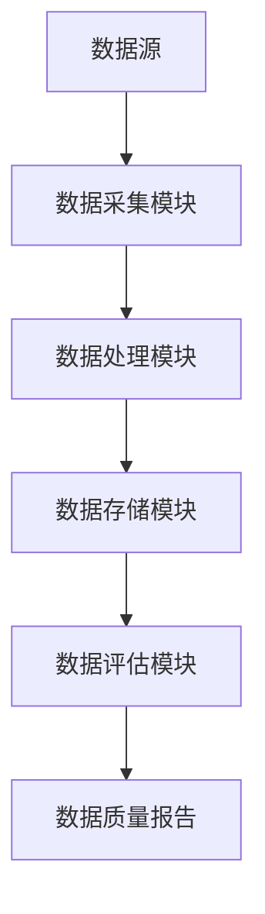
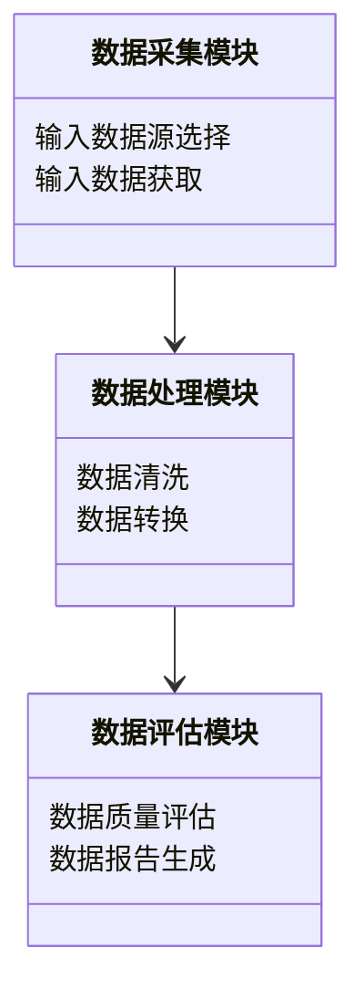
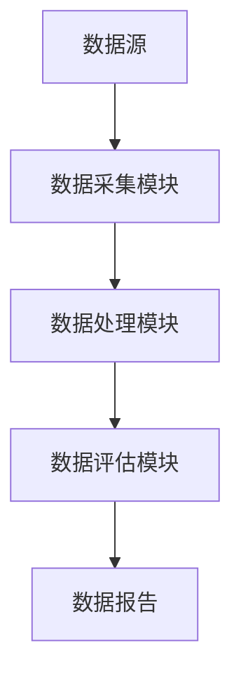
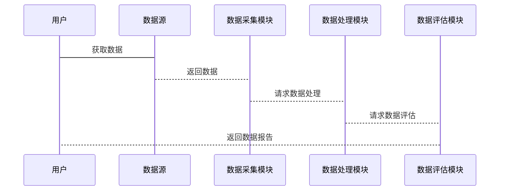

                 


```markdown
# 金融数据质量自动化控制平台

> 关键词：金融数据，数据质量，自动化控制，机器学习，数据清洗，异常检测，平台架构

> 摘要：本文详细探讨了金融数据质量自动化控制平台的设计与实现，涵盖了数据质量的核心要素、自动化控制的实现机制、平台架构的核心设计、数据清洗与异常检测算法、系统分析与架构设计以及项目实战等内容。通过理论与实践相结合的方式，帮助读者深入理解金融数据质量管理的关键技术与方法。

---

# 第1章: 金融数据质量自动化控制平台的背景与意义

## 1.1 问题背景

### 1.1.1 金融数据质量的重要性
金融数据是金融机构进行决策的核心依据，其质量直接影响到业务的准确性和合规性。例如，银行贷款审批、股票交易、风险管理等都需要依赖高质量的金融数据。数据质量问题可能引发重大经济损失甚至法律风险。

### 1.1.2 传统数据质量管理的局限性
传统的数据质量管理主要依赖人工操作，效率低下且容易出错。金融数据的多样性和复杂性使得人工检查不仅耗时，而且难以覆盖所有可能的错误。此外，人工操作还容易受到主观因素的影响，难以保证数据质量的一致性和准确性。

### 1.1.3 自动化控制的必要性
随着金融业务的复杂化和数据量的爆炸式增长，传统的数据质量管理方法已经无法满足需求。自动化控制能够提高数据处理的效率和准确性，减少人为错误，从而显著提升金融数据的质量。

## 1.2 问题描述

### 1.2.1 数据清洗与验证的挑战
金融数据来源多样，包括外部数据接口、内部系统数据以及手动录入数据等。这些数据往往存在格式不一致、缺失值、重复值等问题，需要进行清洗和验证。

### 1.2.2 数据一致性与完整性的保障
金融数据需要满足一致性和完整性要求。一致性是指同一数据在不同系统中的表现一致，完整性是指数据无缺失且符合业务逻辑。

### 1.2.3 数据质量评估的复杂性
数据质量评估不仅需要考虑数据的准确性，还需要考虑数据的及时性、一致性和相关性。这些评估指标往往相互关联，评估过程复杂且耗时。

## 1.3 问题解决与边界

### 1.3.1 自动化控制的核心目标
通过自动化技术实现数据清洗、数据验证、数据修复和数据质量评估，确保金融数据的准确性、一致性和完整性。

### 1.3.2 平台的功能边界与外延
平台主要负责数据质量管理，不直接参与业务逻辑处理。数据质量管理平台可以与其他系统集成，提供数据质量管理服务。

### 1.3.3 核心要素与组成结构
金融数据质量自动化控制平台由数据采集模块、数据处理模块、数据存储模块、数据评估模块和数据报告模块组成。

## 1.4 本章小结
本章介绍了金融数据质量的重要性，分析了传统数据质量管理的局限性，提出了自动化控制的必要性，并详细描述了问题背景和解决思路。

---

# 第2章: 核心概念与原理

## 2.1 数据质量的核心要素

### 2.1.1 数据完整性
数据完整性是指数据无缺失且符合业务逻辑。例如，订单数据必须包含订单号、客户信息、产品信息等字段。

### 2.1.2 数据一致性
数据一致性是指同一数据在不同系统中表现一致。例如，同一客户在不同系统中的客户编号必须一致。

### 2.1.3 数据准确性
数据准确性是指数据内容正确无误。例如，股票代码必须与实际股票市场一致。

### 2.1.4 数据及时性
数据及时性是指数据能够反映最新的业务状态。例如，金融市场数据需要实时更新。

## 2.2 自动化控制的实现机制

### 2.2.1 数据清洗算法
数据清洗算法包括基于规则的清洗、基于统计的清洗和基于机器学习的清洗。例如，使用正则表达式清洗电话号码格式。

### 2.2.2 数据验证规则
数据验证规则包括字段校验、格式校验和业务逻辑校验。例如，验证信用卡号是否符合国际标准。

### 2.2.3 数据修复策略
数据修复策略包括自动修复和人工修复。例如，自动修复缺失值或重复值。

## 2.3 平台架构的核心要素

### 2.3.1 数据采集模块
数据采集模块负责从多种数据源获取数据，例如从API接口获取实时股票数据。

### 2.3.2 数据处理模块
数据处理模块负责数据清洗、数据转换和数据增强。例如，清洗缺失值并进行数据格式转换。

### 2.3.3 数据存储模块
数据存储模块负责存储处理后的数据，例如使用关系型数据库存储清洗后的订单数据。

### 2.3.4 数据评估模块
数据评估模块负责评估数据质量，生成数据质量报告。例如，评估数据的准确性和一致性。

## 2.4 核心概念对比表

| 核心概念 | 数据质量 | 自动化控制 | 平台架构 |
|----------|----------|-----------|----------|
| 定义     | 数据的准确性、完整性、一致性 | 自动化技术实现数据质量管理 | 平台的整体结构与功能模块 |
| 特征     | 可量化的指标 | 算法驱动 | 分层架构 |
| 关系     | 数据质量是平台的目标 | 自动化是实现数据质量的手段 | 平台架构是实现自动化控制的载体 |

## 2.5 ER实体关系图



## 2.6 本章小结
本章详细阐述了数据质量的核心要素，分析了自动化控制的实现机制，并通过对比表和ER图展示了平台架构的核心要素。

---

# 第3章: 数据清洗与异常检测算法

## 3.1 数据清洗算法

### 3.1.1 基于规则的清洗算法
基于规则的清洗算法通过预定义的规则进行数据清洗。例如，使用正则表达式清洗电话号码格式。

```python
import re

def clean_phone_number(phone_number):
    return re.sub(r'\D', '', phone_number)
```

### 3.1.2 基于统计的清洗算法
基于统计的清洗算法通过统计学方法识别异常值。例如，使用均值和标准差检测异常值。

```python
import numpy as np

def detect_outliers(data):
    mean = np.mean(data)
    std = np.std(data)
    outliers = []
    for num in data:
        if abs(num - mean) > 2*std:
            outliers.append(num)
    return outliers
```

### 3.1.3 基于机器学习的清洗算法
基于机器学习的清洗算法通过训练模型识别异常值。例如，使用Isolation Forest算法进行异常检测。

```python
from sklearn.ensemble import IsolationForest

def isolate_outliers(X):
    model = IsolationForest(n_estimators=100, contamination=0.05)
    model.fit(X)
    return model.predict(X)
```

## 3.2 异常检测算法

### 3.2.1 基于统计的异常检测
基于统计的异常检测方法包括Z-score和概率密度函数。例如，使用Z-score方法检测异常值。

$$ Z = \frac{X - \mu}{\sigma} $$

### 3.2.2 基于机器学习的异常检测
基于机器学习的异常检测方法包括聚类、分类和深度学习。例如，使用KNN算法进行异常检测。

### 3.2.3 基于深度学习的异常检测
基于深度学习的异常检测方法包括自动编码器和生成对抗网络。例如，使用自动编码器进行异常检测。

```python
from tensorflow.keras import layers

def autoencoder():
    input_layer = layers.Input(shape=(n_features,))
    encoded = layers.Dense(64, activation='relu')(input_layer)
    decoded = layers.Dense(n_features, activation='sigmoid')(encoded)
    model = models.Model(input_layer, decoded)
    model.compile(optimizer='adam', loss='binary_crossentropy')
    return model
```

## 3.3 算法对比与选择

| 算法类型 | 优点 | 缺点 | 适用场景 |
|----------|------|------|----------|
| 基于规则 | 简单易实现 | 需要手动定义规则 | 数据清洗的初步过滤 |
| 基于统计 | 能够发现数据分布的异常 | 对异常类型敏感 | 数据清洗中的异常检测 |
| 基于机器学习 | 能够自动学习数据特征 | 需要大量数据训练 | 复杂数据环境下的异常检测 |

## 3.4 本章小结
本章详细讲解了数据清洗和异常检测的算法，分析了不同算法的优缺点，并给出了具体的Python实现代码。

---

# 第4章: 系统分析与架构设计

## 4.1 问题场景介绍

### 4.1.1 金融数据的特点
金融数据具有高价值、高敏感性和实时性等特点。例如，股票价格需要实时更新，银行交易数据需要高安全性。

### 4.1.2 数据质量管理的复杂性
金融数据涉及多种数据类型和数据源，数据质量管理的复杂性较高。例如，处理跨系统的数据一致性问题。

## 4.2 系统功能设计

### 4.2.1 领域模型
领域模型展示了金融数据质量管理的核心功能模块。例如，数据采集模块、数据处理模块和数据评估模块。



### 4.2.2 系统架构
系统架构采用分层设计，包括数据采集层、数据处理层和数据评估层。例如，数据采集层负责从多种数据源获取数据。



### 4.2.3 接口设计
系统接口包括数据源接口、数据处理接口和数据评估接口。例如，API接口用于数据获取和数据报告生成。

### 4.2.4 交互流程
交互流程包括数据获取、数据处理、数据评估和数据报告生成。例如，用户通过API接口获取数据报告。



## 4.3 本章小结
本章通过问题场景介绍，分析了金融数据质量管理的复杂性，并通过领域模型和架构图展示了系统设计。

---

# 第5章: 项目实战

## 5.1 环境安装与配置

### 5.1.1 安装Python
安装Python 3.8或更高版本，确保环境支持数据处理和机器学习。

### 5.1.2 安装依赖库
安装Pandas、NumPy、Scikit-learn等库。

```bash
pip install pandas numpy scikit-learn
```

## 5.2 核心代码实现

### 5.2.1 数据清洗模块
实现数据清洗功能，包括去除缺失值和重复值。

```python
import pandas as pd

def clean_data(df):
    # 去除缺失值
    df = df.dropna()
    # 去除重复值
    df = df.drop_duplicates()
    return df
```

### 5.2.2 数据评估模块
实现数据质量评估，生成数据报告。

```python
import pandas as pd

def assess_data_quality(df):
    report = {}
    # 检查数据完整性
    report['完整性'] = df.notna().sum()
    # 检查数据一致性
    report['一致性'] = df.duplicated().sum()
    # 检查数据准确性
    report['准确性'] = df.apply(lambda x: x == x.dtype, axis=0)
    return report
```

## 5.3 代码解读与分析

### 5.3.1 数据清洗模块解读
数据清洗模块通过Pandas库实现，首先去除缺失值，然后去除重复值，确保数据的完整性和唯一性。

### 5.3.2 数据评估模块解读
数据评估模块通过自定义函数实现，评估数据的完整性、一致性和准确性，并生成数据质量报告。

## 5.4 实际案例分析

### 5.4.1 数据清洗案例
案例：清洗银行交易数据中的缺失值和重复值。

```python
df = pd.read_csv('bank.csv')
df_clean = clean_data(df)
print(df_clean)
```

### 5.4.2 数据评估案例
案例：评估清洗后的数据质量。

```python
report = assess_data_quality(df_clean)
print(report)
```

## 5.5 本章小结
本章通过实际案例展示了数据清洗和数据评估的具体实现，帮助读者理解理论知识在实际中的应用。

---

# 第6章: 总结与展望

## 6.1 核心知识点回顾
回顾本文的核心知识点，包括数据质量的核心要素、自动化控制的实现机制、平台架构的设计和项目实战中的具体实现。

## 6.2 挑战与未来展望
当前金融数据质量管理仍面临数据多样性、数据安全性和数据隐私性等挑战。未来，随着人工智能和大数据技术的不断发展，金融数据质量管理将更加智能化和自动化。

## 6.3 学习与实践建议
建议读者深入学习数据清洗和异常检测算法，熟悉数据质量管理工具，并结合实际业务场景进行实践。

## 6.4 本章小结
本章总结了全文的核心内容，并展望了未来的发展方向，为读者提供了进一步学习和实践的方向。

---

# 作者：AI天才研究院/AI Genius Institute & 禅与计算机程序设计艺术 /Zen And The Art of Computer Programming
```

