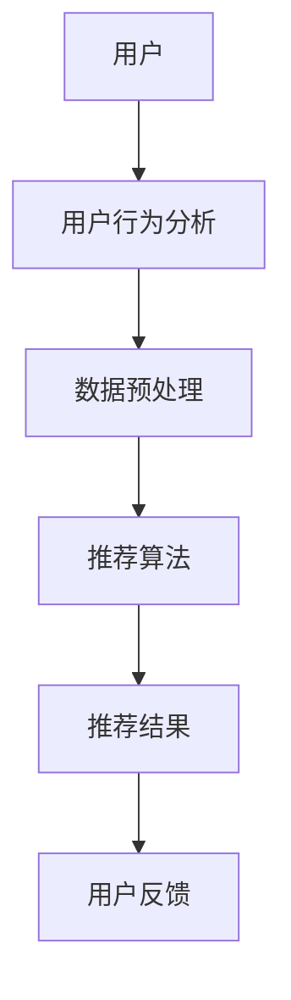
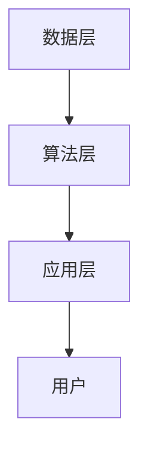
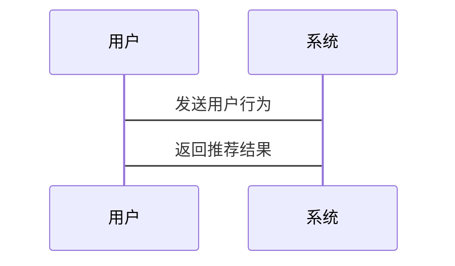

                 


# AI Agent在企业精准营销与个性化推荐中的深度应用

> 关键词：AI Agent, 精准营销, 个性化推荐, 机器学习, 自然语言处理, 知识图谱

> 摘要：本文深入探讨了AI Agent在企业精准营销与个性化推荐中的应用，分析了其核心原理、算法模型、系统架构及实际案例。通过详细的技术分析和代码实现，展示了AI Agent如何助力企业实现高效精准的营销策略。

---

## 第一部分: AI Agent的基本概念与背景介绍

### 第1章: AI Agent的核心概念与背景介绍

#### 1.1 AI Agent的核心概念

##### 1.1.1 什么是AI Agent
AI Agent（人工智能代理）是指能够感知环境、执行任务并做出决策的智能实体。它通过数据驱动的方式，帮助企业在复杂场景中实现自动化决策和优化。

##### 1.1.2 AI Agent的特征与属性
AI Agent具有以下核心特征：
- **智能性**：能够理解上下文并做出合理决策。
- **自主性**：无需人工干预，自主执行任务。
- **适应性**：能够根据环境变化动态调整策略。
- **交互性**：与用户或其他系统进行有效交互。

##### 1.1.3 AI Agent的构成要素
AI Agent的构成包括：
- **感知模块**：用于数据采集和环境感知。
- **推理模块**：基于数据进行分析和推理。
- **决策模块**：生成最优决策方案。
- **执行模块**：将决策转化为实际操作。

#### 1.2 AI Agent在企业营销中的应用背景

##### 1.2.1 传统营销方式的局限性
传统营销方式依赖人工经验，存在以下问题：
- **效率低下**：需要大量人工筛选和分析数据。
- **精准度不足**：难以实现个性化推荐。
- **实时性差**：无法快速响应市场变化。

##### 1.2.2 精准营销的需求与挑战
精准营销的需求：
- 提高转化率。
- 降低营销成本。
- 提升用户体验。

精准营销的挑战：
- 数据量大且复杂。
- 需要实时决策能力。
- 需要高度个性化的推荐策略。

##### 1.2.3 个性化推荐的必要性
个性化推荐能够：
- 提高用户满意度。
- 提升用户粘性。
- 增加转化率。

---

## 第二部分: AI Agent的核心原理与技术实现

### 第2章: AI Agent的核心原理与技术实现

#### 2.1 AI Agent的核心原理

##### 2.1.1 人工智能与机器学习的结合
AI Agent的核心原理依赖于人工智能和机器学习技术，包括：
- **监督学习**：用于分类和回归任务。
- **无监督学习**：用于聚类和降维。
- **强化学习**：用于动态决策。

##### 2.1.2 自然语言处理在AI Agent中的应用
自然语言处理（NLP）用于理解用户意图和生成自然语言回复，主要技术包括：
- **文本分类**：识别文本的情感和主题。
- **序列模型**：如LSTM用于生成式任务。
- **对话系统**：基于预训练模型实现人机对话。

##### 2.1.3 知识图谱与决策树的构建
知识图谱用于构建领域知识，决策树用于快速决策：
- **知识图谱**：将实体和关系表示为图结构。
- **决策树**：基于特征进行分类和决策。

#### 2.2 AI Agent的关键技术

##### 2.2.1 生成式AI在推荐系统中的应用
生成式AI用于生成个性化内容，包括：
- **文本生成**：生成产品描述和推荐理由。
- **图像生成**：生成个性化视觉内容。
- **多模态生成**：结合文本和图像生成推荐方案。

##### 2.2.2 基于深度学习的特征提取
深度学习用于特征提取，包括：
- **卷积神经网络（CNN）**：提取图像特征。
- **循环神经网络（RNN）**：提取序列特征。
- **注意力机制**：关注重要特征。

##### 2.2.3 多目标优化算法
多目标优化算法用于平衡多个目标，例如：
- **多目标进化算法**：在推荐系统中优化多个目标。
- **帕累托前沿**：找到最优的推荐方案。

#### 2.3 AI Agent与传统推荐系统的对比

##### 2.3.1 传统推荐系统的优缺点
- **优点**：实现简单，计算效率高。
- **缺点**：缺乏灵活性和个性化。

##### 2.3.2 AI Agent的核心优势
- **灵活性**：能够适应复杂场景。
- **个性化**：基于用户行为和偏好进行推荐。
- **实时性**：能够快速响应用户需求。

##### 2.3.3 两者的区别与联系
AI Agent在推荐系统中的应用是传统推荐系统的升级版，结合了更高级的算法和技术。

---

## 第三部分: AI Agent的算法原理与数学模型

### 第3章: AI Agent的算法原理与数学模型

#### 3.1 算法原理概述

##### 3.1.1 基于概率论的推荐算法
基于概率论的推荐算法包括：
- **贝叶斯推荐**：基于用户行为的概率模型。
- **马尔可夫链模型**：用于序列推荐。

##### 3.1.2 基于协同过滤的推荐算法
协同过滤算法包括：
- **基于用户的协同过滤（UserCF）**：基于相似用户的推荐。
- **基于物品的协同过滤（ItemCF）**：基于相似物品的推荐。

##### 3.1.3 基于深度学习的推荐算法
深度学习推荐算法包括：
- **神经协同过滤（Neural Collaborative Filtering, NCF）**。
- **深度图嵌入（Deep Graph Embedding）**。

#### 3.2 数学模型与公式

##### 3.2.1 协同过滤算法的数学表达
协同过滤的相似度计算公式：
$$ \text{相似度}(u, v) = \frac{\sum_{i \in I_u \cap I_v} (r_{u,i} - \bar{r}_u)(r_{v,i} - \bar{r}_v)}{\sqrt{\sum_{i \in I_u} (r_{u,i} - \bar{r}_u)^2} \cdot \sqrt{\sum_{i \in I_v} (r_{v,i} - \bar{r}_v)^2}}} $$

##### 3.2.2 基于神经网络的推荐模型
神经网络推荐模型的损失函数：
$$ \mathcal{L} = \sum_{i=1}^N \sum_{j=1}^M \left( y_{ij} - \hat{y}_{ij} \right)^2 $$

##### 3.2.3 多目标优化的数学公式
多目标优化的帕累托前沿表示为：
$$ \text{Pareto Front} = \{ (x, y) \mid y = f(x), x \in X \} $$

#### 3.3 算法实现与代码示例

##### 3.3.1 协同过滤算法的Python实现
```python
import numpy as np

def cosine_similarity(X):
    X_normalized = X / np.linalg.norm(X, axis=1)[:, np.newaxis]
    return np.dot(X_normalized, X_normalized.T)

# 示例数据
X = np.array([[1, 2], [2, 3], [3, 4]])
similarity_matrix = cosine_similarity(X)
print(similarity_matrix)
```

##### 3.3.2 基于深度学习的推荐模型代码
```python
import tensorflow as tf
from tensorflow.keras import layers

model = tf.keras.Sequential([
    layers.Dense(64, activation='relu'),
    layers.Dense(1, activation='sigmoid')
])

model.compile(optimizer='adam', loss='binary_crossentropy', metrics=['accuracy'])
history = model.fit(x_train, y_train, epochs=10, batch_size=32)
```

---

## 第四部分: AI Agent的系统架构与设计

### 第4章: AI Agent的系统架构与设计

#### 4.1 系统架构概述

##### 4.1.1 系统整体架构图


##### 4.1.2 系统功能模块划分
- **用户行为分析模块**：分析用户的点击、浏览等行为。
- **数据预处理模块**：清洗和特征提取。
- **推荐算法实现模块**：基于深度学习的推荐算法。

##### 4.1.3 系统的输入输出流程
用户输入：用户行为数据。
系统输出：个性化推荐列表。

#### 4.2 系统功能设计

##### 4.2.1 用户行为分析模块
用户行为分析包括：
- **行为识别**：识别用户的点击、浏览等行为。
- **行为建模**：建立用户行为模型。

##### 4.2.2 数据预处理模块
数据预处理包括：
- **数据清洗**：去除无效数据。
- **特征提取**：提取用户特征和物品特征。

##### 4.2.3 推荐算法实现模块
推荐算法实现包括：
- **模型训练**：基于深度学习的推荐模型。
- **模型预测**：生成推荐结果。

#### 4.3 系统架构设计

##### 4.3.1 分层架构设计
分层架构包括：
- **数据层**：存储用户和物品数据。
- **算法层**：实现推荐算法。
- **应用层**：展示推荐结果。

##### 4.3.2 系统架构图


##### 4.3.3 系统接口设计
系统接口包括：
- **API接口**：提供推荐结果。
- **数据接口**：接收用户行为数据。

##### 4.3.4 系统交互流程图


---

## 第五部分: AI Agent的项目实战

### 第5章: AI Agent的项目实战

#### 5.1 项目背景与目标

##### 5.1.1 项目背景
以电商推荐为例，目标是实现个性化商品推荐。

##### 5.1.2 项目目标
实现基于深度学习的个性化推荐系统。

#### 5.2 项目环境与工具

##### 5.2.1 环境安装
安装Python、TensorFlow、Keras等工具。

##### 5.2.2 数据准备
收集用户行为数据和商品数据。

#### 5.3 系统实现

##### 5.3.1 数据预处理
```python
import pandas as pd

# 示例数据
data = pd.DataFrame({
    'user_id': [1, 2, 3],
    'item_id': [101, 102, 103],
    'rating': [4, 5, 3]
})

# 数据清洗
data.dropna()
```

##### 5.3.2 推荐算法实现
```python
import tensorflow as tf
from tensorflow.keras import layers

model = tf.keras.Sequential([
    layers.Embedding(input_dim=1000, output_dim=64),
    layers.Dense(64, activation='relu'),
    layers.Dense(1, activation='sigmoid')
])

model.compile(optimizer='adam', loss='binary_crossentropy', metrics=['accuracy'])
```

##### 5.3.3 案例分析与解读
通过实际案例分析，展示AI Agent在电商推荐中的应用效果。

#### 5.4 项目小结

##### 5.4.1 项目总结
总结项目的实现过程和关键点。

##### 5.4.2 成果展示
展示推荐系统的效果和性能指标。

##### 5.4.3 经验与教训
总结项目中的经验和教训。

---

## 第六部分: 最佳实践与小结

### 第6章: 最佳实践与小结

#### 6.1 最佳实践

##### 6.1.1 数据质量的重要性
数据质量直接影响推荐系统的性能。

##### 6.1.2 模型调优技巧
包括超参数优化和模型 ensemble。

##### 6.1.3 系统优化建议
包括算法优化和系统架构优化。

#### 6.2 小结

##### 6.2.1 核心内容回顾
回顾文章的核心内容。

##### 6.2.2 未来趋势
展望AI Agent在精准营销和个性化推荐中的未来发展方向。

##### 6.2.3 注意事项
提醒读者在实际应用中需要注意的问题。

#### 6.3 拓展阅读

##### 6.3.1 推荐系统领域
推荐阅读的经典论文和书籍。

##### 6.3.2 AI Agent相关技术
推荐学习的其他AI相关技术。

---

## 作者：AI天才研究院/AI Genius Institute & 禅与计算机程序设计艺术 /Zen And The Art of Computer Programming

---

这篇博客文章系统地介绍了AI Agent在企业精准营销与个性化推荐中的深度应用，从基本概念到算法原理，再到系统架构和项目实战，为读者提供了全面的知识体系和实践指导。通过丰富的图表和代码示例，帮助读者更好地理解和应用AI Agent技术。

