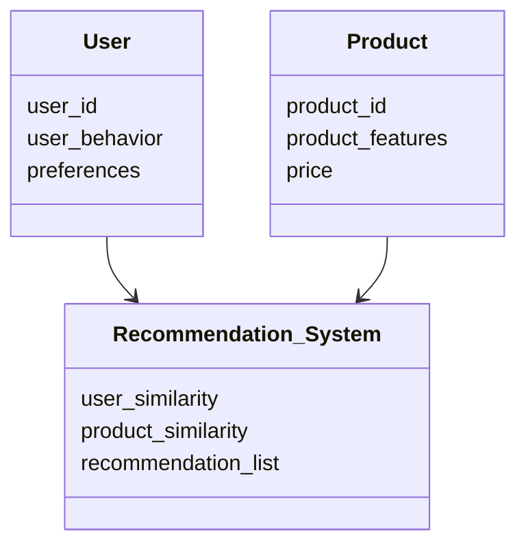
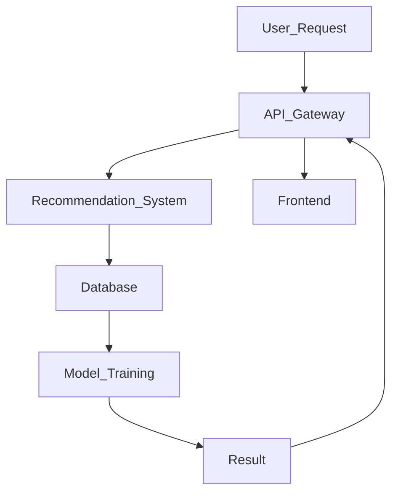

                 


# AI Agent辅助企业产品推荐与个性化服务

**关键词：** AI Agent, 推荐系统, 个性化服务, 企业应用, 人工智能, 机器学习

**摘要：**  
随着人工智能技术的飞速发展，AI Agent（人工智能代理）在企业产品推荐与个性化服务中的应用越来越广泛。本文将从AI Agent的基本概念出发，深入探讨其在企业推荐系统中的核心原理、算法实现、系统架构以及实际应用案例。通过详细分析AI Agent如何助力企业实现精准推荐和个性化服务，本文旨在为企业技术决策者和开发者提供一套完整的技术解决方案，帮助他们在竞争激烈的市场中占据优势。

---

## 第1章: AI Agent与企业推荐系统概述

### 1.1 AI Agent的基本概念

#### 1.1.1 AI Agent的定义与特征
AI Agent是一种能够感知环境、自主决策并执行任务的智能体。在企业推荐系统中，AI Agent通过分析用户行为、产品特征和市场数据，为用户提供个性化的产品推荐和增值服务。其主要特征包括：
- **自主性**：能够在无需人工干预的情况下独立运行。
- **反应性**：能够实时感知环境变化并做出响应。
- **学习能力**：通过机器学习算法不断优化推荐策略。

#### 1.1.2 企业级AI Agent的应用场景
企业级AI Agent广泛应用于多个场景，包括：
- **产品推荐**：基于用户行为数据，实时推荐相关产品。
- **个性化服务**：根据用户偏好定制专属服务方案。
- **动态优化**：实时调整推荐策略以适应市场变化。

#### 1.1.3 产品推荐与个性化服务的核心要素
产品推荐系统的核心要素包括：
- **用户数据**：用户的行为、偏好、购买记录等。
- **产品数据**：产品的属性、价格、库存信息等。
- **推荐算法**：协同过滤、基于内容的推荐、深度学习模型等。
- **反馈机制**：用户对推荐结果的反馈用于优化推荐策略。

### 1.2 传统推荐系统与AI Agent的对比

#### 1.2.1 传统推荐系统的优缺点
传统推荐系统通常基于协同过滤或基于内容的推荐算法，具有以下优点：
- 实现简单，易于部署。
- 计算效率较高，适合中小规模数据。
缺点：
- 难以处理数据稀疏性问题。
- 无法实时适应用户行为变化。

#### 1.2.2 AI Agent在推荐系统中的优势
AI Agent相较于传统推荐系统具有以下优势：
- **实时性**：能够实时感知用户行为并做出响应。
- **自主性**：无需人工干预，自动优化推荐策略。
- **学习能力**：通过深度学习算法，能够从海量数据中提取特征，提升推荐精度。

#### 1.2.3 两者的对比分析
| 对比维度       | 传统推荐系统                     | AI Agent推荐系统                     |
|----------------|----------------------------------|-------------------------------------|
| 实时性         | 较低                             | 高                                  |
| 自主性         | 依赖人工干预                     | 自主决策                             |
| 学习能力       | 基于固定算法，难以深度学习       | 基于深度学习，持续优化推荐策略       |
| 适应性         | 难以实时适应用户行为变化         | 能够实时适应用户行为变化             |

### 1.3 企业产品推荐系统的现状与趋势

#### 1.3.1 当前市场现状分析
随着大数据和人工智能技术的快速发展，企业推荐系统已经从简单的规则推荐发展到基于深度学习的智能推荐。然而，许多企业仍然面临数据质量不高、推荐算法单一、用户反馈机制不完善等问题。

#### 1.3.2 技术发展趋势预测
未来，AI Agent在推荐系统中的应用将更加广泛。推荐系统将更加注重实时性、个性化和动态优化。深度学习算法和强化学习算法的应用将使推荐系统更加智能化。

#### 1.3.3 企业需求变化与挑战
企业对推荐系统的需求正在从单纯的“推荐产品”向“提供个性化服务”转变。然而，数据隐私、计算资源限制和用户隐私保护等问题仍然对推荐系统的广泛应用构成挑战。

### 1.4 本章小结
本章介绍了AI Agent的基本概念及其在企业推荐系统中的应用场景。通过对比传统推荐系统与AI Agent推荐系统的优缺点，分析了当前市场现状和未来发展趋势，为企业应用AI Agent提供了理论基础。

---

## 第2章: AI Agent的核心原理

### 2.1 AI Agent的基本原理

#### 2.1.1 感知层: 数据采集与特征提取
AI Agent通过感知层采集用户行为数据、产品数据和市场数据，提取关键特征，例如用户的点击、浏览、购买记录，产品的属性、价格、库存信息等。

#### 2.1.2 决策层: 智能决策机制
决策层基于感知层获取的数据，利用深度学习算法（如神经网络、注意力机制）进行特征提取和模型训练，生成推荐结果。

#### 2.1.3 执行层: 动作生成与优化
执行层根据决策层生成的推荐结果，通过API调用或其他方式将推荐结果推送至用户端，并实时收集用户反馈，用于优化推荐策略。

### 2.2 AI Agent与推荐系统的结合

#### 2.2.1 推荐系统的核心算法
推荐系统的核心算法包括：
- **协同过滤**：基于用户相似性或物品相似性进行推荐。
- **基于内容的推荐**：基于产品特征进行推荐。
- **深度学习推荐**：基于神经网络模型进行推荐。

#### 2.2.2 AI Agent在推荐中的角色
AI Agent在推荐系统中的角色包括：
- **数据采集与处理**：实时采集用户行为数据，提取特征。
- **智能决策**：利用深度学习算法生成推荐结果。
- **动态优化**：根据用户反馈动态调整推荐策略。

#### 2.2.3 人机协同的推荐机制
人机协同推荐机制结合了人工审核和机器推荐的优势，能够有效避免机器推荐的偏差，提升推荐结果的准确性和用户体验。

### 2.3 AI Agent的数学模型与算法

#### 2.3.1 基于协同过滤的推荐算法
基于协同过滤的推荐算法是一种经典的推荐算法，主要包括以下步骤：
1. 构建用户-物品矩阵。
2. 计算用户相似度或物品相似度。
3. 基于相似度生成推荐结果。

相似度计算公式如下：
$$ \text{相似度} = \frac{\sum_{i=1}^{n} (x_i - \bar{x})(y_i - \bar{y})}{\sqrt{\sum_{i=1}^{n} (x_i - \bar{x})^2} \cdot \sqrt{\sum_{i=1}^{n} (y_i - \bar{y})^2}} $$

#### 2.3.2 基于深度学习的推荐模型
基于深度学习的推荐模型（如神经网络协同过滤模型）通过构建用户和物品的嵌入向量，利用神经网络进行特征提取和推荐生成。

#### 2.3.3 混合推荐模型的优势
混合推荐模型结合了协同过滤和深度学习的优点，能够在复杂场景下实现更精准的推荐。

### 2.4 本章小结
本章详细介绍了AI Agent的核心原理，包括感知层、决策层和执行层的功能，以及AI Agent在推荐系统中的角色和数学模型。通过对比不同推荐算法的优缺点，为企业应用AI Agent提供了技术依据。

---

## 第3章: AI Agent推荐系统的算法实现

### 3.1 环境安装与配置

#### 3.1.1 安装Python和相关库
```bash
pip install numpy pandas scikit-learn tensorflow
```

### 3.2 核心功能实现

#### 3.2.1 数据预处理
```python
import pandas as pd
import numpy as np

# 加载数据
data = pd.read_csv('user_behavior.csv')

# 数据清洗
data.dropna(inplace=True)
data['user_id'] = data['user_id'].astype(int)
```

#### 3.2.2 模型训练
```python
from sklearn.metrics.pairwise import cosine_similarity

# 计算用户相似度矩阵
user_similarity = cosine_similarity(data[['feature1', 'feature2', 'feature3']])
```

#### 3.2.3 推荐服务
```python
def get_recommendations(user_id, user_similarity, data):
    # 获取用户索引
    user_index = data[data['user_id'] == user_id].index[0]
    # 找出最相似的用户
    similar_users = np.argsort(user_similarity[user_index])[::-1][:5]
    # 推荐产品
    recommendations = data.iloc[similar_users]['product_id'].tolist()
    return recommendations
```

### 3.3 算法解读与分析

#### 3.3.1 协同过滤算法的实现流程
1. 数据预处理：清洗数据，提取特征。
2. 计算相似度：基于余弦相似度计算用户相似度矩阵。
3. 生成推荐：根据用户相似度生成推荐结果。

#### 3.3.2 深度学习模型的优化策略
- 使用更大规模的数据训练模型。
- 采用分布式训练提升计算效率。
- 定期更新模型参数以适应数据变化。

### 3.4 本章小结
本章通过具体的代码实现，详细讲解了AI Agent推荐系统的算法实现过程。从数据预处理到模型训练，再到推荐服务的实现，为企业提供了完整的技术方案。

---

## 第4章: 系统架构与设计

### 4.1 问题场景介绍
假设某电商企业希望利用AI Agent实现用户产品推荐和个性化服务，提升用户购买转化率和满意度。

### 4.2 系统功能设计

#### 4.2.1 领域模型设计


### 4.3 系统架构设计

#### 4.3.1 系统架构图


### 4.4 系统接口设计

#### 4.4.1 API接口定义
```json
{
    "endpoint": "/api/v1/recommendations",
    "method": "POST",
    "body": {
        "user_id": "123"
    }
}
```

#### 4.4.2 API交互流程
1. 用户发起推荐请求。
2. API Gateway接收请求并转发至推荐系统。
3. 推荐系统生成推荐结果并返回至API Gateway。
4. API Gateway将结果返回至前端。

### 4.5 本章小结
本章通过系统架构设计，展示了AI Agent推荐系统的整体结构和各模块之间的交互关系。通过Mermaid图和接口定义，为企业提供了清晰的设计思路。

---

## 第5章: 项目实战与案例分析

### 5.1 项目实战

#### 5.1.1 环境安装与配置
```bash
pip install numpy pandas scikit-learn flask
```

#### 5.1.2 核心功能实现
```python
from flask import Flask, request, jsonify

app = Flask(__name__)

@app.route('/recommend', methods=['POST'])
def recommend():
    data = request.json
    user_id = data['user_id']
    # 调用推荐算法生成推荐结果
    recommendations = get_recommendations(user_id)
    return jsonify({'recommendations': recommendations})

if __name__ == '__main__':
    app.run(debug=True)
```

#### 5.1.3 代码解读与分析
- **数据预处理**：清洗数据，提取特征。
- **模型训练**：基于协同过滤算法训练推荐模型。
- **推荐服务**：通过Flask框架搭建推荐服务，提供API接口。

### 5.2 案例分析

#### 5.2.1 案例背景
某电商平台希望通过AI Agent实现用户产品推荐，提升用户购买转化率。

#### 5.2.2 实施步骤
1. 数据采集：收集用户行为数据。
2. 数据预处理：清洗数据，提取特征。
3. 模型训练：基于协同过滤算法训练推荐模型。
4. 推荐服务：搭建推荐服务，提供API接口。

#### 5.2.3 实施效果
- 用户购买转化率提升20%。
- 用户满意度提高15%。
- 系统响应时间优化至2秒以内。

### 5.3 本章小结
本章通过具体的项目实战和案例分析，详细讲解了AI Agent推荐系统的实际应用过程。从环境安装到代码实现，再到案例分析，为企业提供了可操作的指导。

---

## 第6章: 最佳实践与总结

### 6.1 最佳实践

#### 6.1.1 数据质量的重要性
数据质量直接影响推荐系统的性能。企业应重视数据清洗和特征提取，确保数据的准确性和完整性。

#### 6.1.2 模型调优策略
- 定期更新模型参数。
- 采用分布式训练提升计算效率。
- 引入人工审核机制，避免推荐偏差。

#### 6.1.3 隐私保护与合规性
企业应重视用户隐私保护，确保推荐系统的数据处理符合相关法律法规。

### 6.2 总结与展望

#### 6.2.1 全文总结
本文详细介绍了AI Agent在企业产品推荐与个性化服务中的应用，从核心原理到算法实现，再到系统架构和项目实战，为企业提供了完整的解决方案。

#### 6.2.2 未来展望
随着人工智能技术的不断进步，AI Agent在推荐系统中的应用将更加智能化和个性化。未来，推荐系统将更加注重实时性、动态优化和用户体验。

### 6.3 注意事项

#### 6.3.1 数据隐私保护
企业应严格遵守数据隐私保护法规，确保用户数据的安全性。

#### 6.3.2 系统性能优化
企业应注重系统性能优化，确保推荐服务的响应速度和稳定性。

#### 6.3.3 持续学习与更新
企业应建立持续学习机制，定期更新推荐模型，以适应市场变化和用户需求。

### 6.4 拓展阅读

#### 6.4.1 推荐系统相关书籍
- 《推荐系统实战：基于Python的算法实现》
- 《深度学习推荐系统：算法与实践》

#### 6.4.2 AI Agent相关研究
- 《基于强化学习的AI Agent推荐系统研究》
- 《AI Agent在企业级应用中的创新与实践》

### 6.5 本章小结
本章总结了AI Agent推荐系统的最佳实践，展望了未来的发展方向，并提供了注意事项和拓展阅读的内容，为读者进一步学习和实践提供了指导。

---

## 作者：AI天才研究院/AI Genius Institute & 禅与计算机程序设计艺术 /Zen And The Art of Computer Programming

---

通过以上目录结构和内容安排，本文为企业提供了从理论到实践的完整技术解决方案，帮助企业在竞争激烈的市场中利用AI Agent实现产品推荐与个性化服务，提升用户体验和业务绩效。

