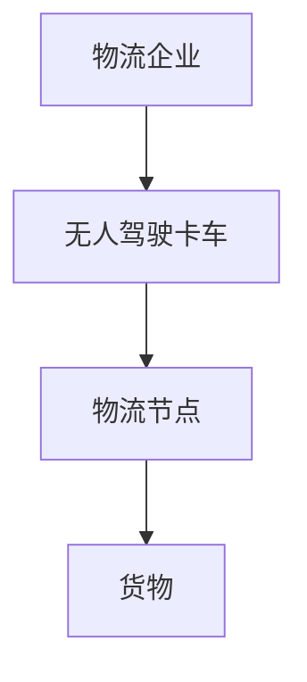
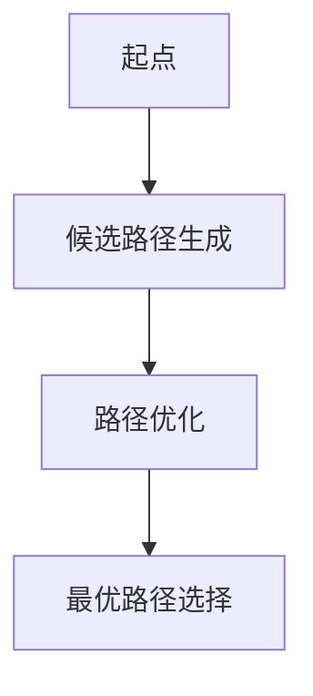
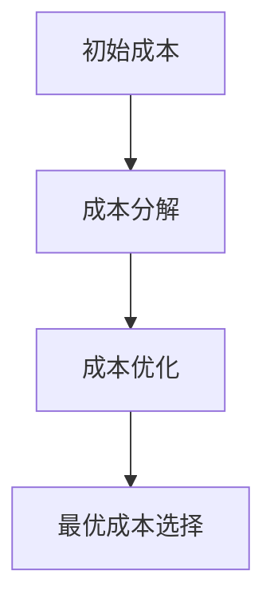
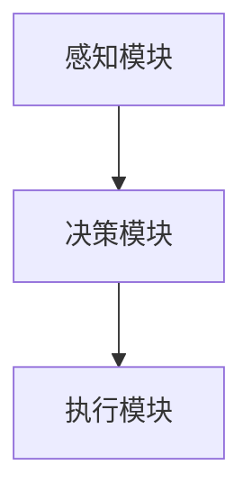
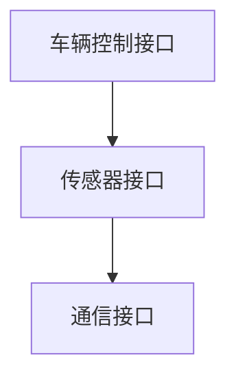

                 


# 价值投资中的无人驾驶卡车物流分析

## 关键词
无人驾驶卡车物流、价值投资、物流成本优化、路径规划算法、智能调度系统、投资回报分析

## 摘要
本文深入分析了无人驾驶卡车物流在价值投资中的应用，探讨了无人驾驶技术如何优化物流成本，提升运营效率，从而为投资者创造更大的价值。通过分析无人驾驶卡车物流系统的构成、算法原理和价值评估模型，本文为投资者提供了评估无人驾驶卡车物流企业的投资价值的方法和工具。

---

# 第1章 无人驾驶卡车物流的背景与现状

## 1.1 无人驾驶卡车物流的背景介绍

### 1.1.1 传统物流模式的局限性
传统物流模式依赖于人工操作，存在以下问题：
- **高人工成本**：物流行业对劳动力需求大，且人工成本持续上升。
- **效率低下**：由于人为因素，货物处理和运输效率受限。
- **安全隐患**：人工驾驶存在疲劳驾驶和交通事故风险。

### 1.1.2 无人驾驶技术的兴起
无人驾驶技术的发展为物流行业带来了革新：
- **技术进步**：人工智能、传感器和5G通信技术的进步推动了无人驾驶技术的成熟。
- **政策支持**：各国政府纷纷出台政策支持无人驾驶技术的应用。
- **市场需求**：企业对高效、低成本物流的需求推动了无人驾驶卡车的发展。

### 1.1.3 物流行业智能化转型的必要性
物流行业正面临智能化转型的压力：
- **市场竞争加剧**：传统物流企业需要通过技术创新提升竞争力。
- **效率与成本优化**：无人驾驶技术能够显著降低物流成本，提高效率。
- **行业趋势**：智能化和自动化成为物流行业发展的必然趋势。

## 1.2 无人驾驶卡车物流的现状分析

### 1.2.1 全球无人驾驶卡车的发展概况
无人驾驶卡车在全球范围内快速发展：
- **美国**：Waymo、Tesla等公司积极推动无人驾驶卡车的研发和测试。
- **欧洲**：多个国家和地区已开展无人驾驶卡车的试点项目。
- **亚洲**：中国、日本等国也在积极布局无人驾驶卡车技术。

### 1.2.2 中国无人驾驶卡车物流的应用现状
中国在无人驾驶卡车物流领域取得了显著进展：
- **技术突破**：百度、滴滴等科技公司已实现无人驾驶卡车的路测。
- **政策支持**：中国政府出台多项政策支持无人驾驶技术的应用。
- **应用场景**：无人驾驶卡车已应用于港口、工业园区等封闭区域的物流运输。

### 1.2.3 无人驾驶卡车物流的未来趋势
未来，无人驾驶卡车物流将呈现以下发展趋势：
- **大规模应用**：随着技术成熟，无人驾驶卡车将实现大规模商业化。
- **智能化升级**：物流系统将更加智能化，实现货物运输的全链条自动化。
- **行业整合**：无人驾驶卡车技术将推动物流行业整合，形成新的市场格局。

## 1.3 价值投资与物流行业的结合

### 1.3.1 价值投资的基本概念
价值投资是一种长期投资策略，关注企业的内在价值和市场估值的差异。投资者通过分析企业的财务状况、市场地位和竞争优势，寻找被低估的投资机会。

### 1.3.2 物流行业在价值投资中的地位
物流行业作为国民经济的重要组成部分，具有稳定的市场需求和较高的进入门槛。传统的物流企业可以通过技术创新提升竞争力，成为价值投资的理想目标。

### 1.3.3 无人驾驶卡车物流对价值投资的影响
无人驾驶卡车物流技术的引入为物流企业带来了显著变化：
- **成本优化**：无人驾驶技术能够降低人工成本，提高运输效率。
- **市场竞争力**：采用无人驾驶技术的企业能够更好地满足客户对高效物流的需求。
- **投资价值提升**：具备技术优势的企业将获得更高的市场估值和投资回报。

---

# 第2章 无人驾驶卡车物流的核心概念与价值评估

## 2.1 无人驾驶卡车物流的核心概念

### 2.1.1 无人驾驶卡车的定义与技术特点
无人驾驶卡车是一种通过人工智能和传感器技术实现自主运输的车辆，其核心技术包括：
- **环境感知**：通过激光雷达、摄像头和雷达等传感器感知周围环境。
- **路径规划**：基于实时数据规划最优行驶路径。
- **决策控制**：通过算法实现自动驾驶和路径调整。

### 2.1.2 物流系统的组成部分
无人驾驶卡车物流系统由以下部分组成：
- **感知系统**：负责收集环境数据。
- **决策系统**：负责路径规划和决策。
- **执行系统**：负责车辆的运动控制。

### 2.1.3 无人驾驶卡车物流的运作流程
无人驾驶卡车物流的运作流程包括：
1. **订单接收**：系统接收货物运输订单。
2. **路径规划**：系统根据订单信息规划最优运输路径。
3. **货物运输**：无人驾驶卡车按照规划路径完成货物运输。
4. **货物交付**：货物到达指定地点，完成交付。

### 2.1.4 核心概念与联系
无人驾驶卡车物流系统的实体关系如下：



## 2.2 价值评估模型的构建

### 2.2.1 价值评估的基本原理
价值评估模型基于以下原则：
- **成本效益分析**：评估无人驾驶技术对物流成本的影响。
- **市场竞争力分析**：评估企业的市场地位和竞争优势。
- **财务指标分析**：分析企业的盈利能力、资产负债情况和现金流状况。

### 2.2.2 无人驾驶卡车物流的价值评估指标
以下是无人驾驶卡车物流的价值评估指标：
| 指标名称         | 描述                                         | 计算公式                              |
|------------------|----------------------------------------------|---------------------------------------|
| 运输成本         | 无人驾驶卡车的运输成本                     | 运输成本 = 燃料成本 + 维护成本 + 人工成本 |
| 运输效率         | 货物运输的效率                             | 运输效率 = 货物运输量 / 运输时间       |
| 市场占有率         | 企业在市场中的份额                         | 市场占有率 = 企业运输量 / 总运输量     |
| 投资回报率         | 投资的收益与成本的比率                     | 投资回报率 = 净利润 / 投资成本       |

### 2.2.3 价值评估模型的设计与优化
价值评估模型的设计步骤如下：
1. **数据收集**：收集企业的财务数据和市场数据。
2. **模型构建**：基于价值评估指标构建模型。
3. **模型优化**：通过回归分析等方法优化模型参数。
4. **结果分析**：分析模型结果，评估企业的投资价值。

---

# 第3章 无人驾驶卡车物流的算法原理

## 3.1 路径规划算法

### 3.1.1 路径规划算法的定义
路径规划算法是无人驾驶卡车物流系统的核心算法，用于规划车辆的最优行驶路径。

### 3.1.2 常见的路径规划算法
以下是常见的路径规划算法：
- **Dijkstra算法**：适用于静态路径规划。
- **A*算法**：结合启发式搜索，适用于动态路径规划。
- **遗传算法**：通过模拟自然选择优化路径。

### 3.1.3 路径规划算法的实现步骤
路径规划算法的实现步骤如下：



### 3.1.4 路径规划算法的代码实现
以下是路径规划算法的Python代码示例：

```python
import heapq

def dijkstra(start, end, graph):
    dist = {node: float('infinity') for node in graph}
    dist[start] = 0
    heap = [(0, start)]
    visited = set()

    while heap:
        current_dist, current_node = heapq.heappop(heap)
        if current_node in visited:
            continue
        visited.add(current_node)
        if current_node == end:
            break
        for neighbor, weight in graph[current_node].items():
            if dist[neighbor] > current_dist + weight:
                dist[neighbor] = current_dist + weight
                heapq.heappush(heap, (dist[neighbor], neighbor))
    return dist[end]

# 示例图
graph = {
    'A': {'B': 1, 'C': 3},
    'B': {'D': 2},
    'C': {'D': 1},
    'D': {}
}

print(dijkstra('A', 'D', graph))
```

### 3.1.5 数学模型与公式
路径规划算法的数学模型如下：
$$
\text{路径成本} = \sum_{i=1}^{n} \text{边权重}_i
$$

### 3.1.6 代码解读与分析
上述代码实现了Dijkstra算法，用于计算起点到终点的最短路径。代码首先初始化距离和优先队列，然后通过优先队列选择距离最小的节点进行扩展，最终找到最短路径。

## 3.2 成本优化算法

### 3.2.1 成本优化算法的定义
成本优化算法用于优化物流成本，包括运输成本、维护成本和能源成本。

### 3.2.2 成本优化算法的实现步骤
成本优化算法的实现步骤如下：



### 3.2.3 成本优化算法的代码实现
以下是成本优化算法的Python代码示例：

```python
def cost_optimization(candidates, cost_function):
    min_cost = float('infinity')
    best_candidate = None
    for candidate in candidates:
        current_cost = cost_function(candidate)
        if current_cost < min_cost:
            min_cost = current_cost
            best_candidate = candidate
    return best_candidate, min_cost

# 示例成本函数
def calculate_cost(candidate):
    return candidate[0] + candidate[1] * 2 + candidate[2] * 3

candidates = [(1, 2, 3), (2, 3, 4), (3, 4, 5)]
best, cost = cost_optimization(candidates, calculate_cost)
print(f"最佳方案：{best}，最低成本：{cost}")
```

### 3.2.4 数学模型与公式
成本优化算法的数学模型如下：
$$
\text{总成本} = \sum_{i=1}^{n} \text{成本}_i
$$

### 3.2.5 代码解读与分析
上述代码实现了成本优化算法，通过遍历候选方案并计算每个方案的成本，最终选择成本最低的方案。

---

# 第4章 无人驾驶卡车物流的系统架构设计

## 4.1 系统架构设计

### 4.1.1 系统架构的定义
系统架构设计是无人驾驶卡车物流系统的核心部分，包括感知、决策和执行三个模块。

### 4.1.2 系统架构设计的步骤
系统架构设计的步骤如下：



### 4.1.3 系统架构设计的代码实现
以下是系统架构设计的Python代码示例：

```python
class PerceptionModule:
    def detect_obstacles(self):
        # 检测障碍物
        pass

class DecisionModule:
    def plan_path(self):
        # 规划路径
        pass

class ExecutionModule:
    def move_vehicle(self):
        # 执行移动
        pass

# 系统架构
system = {
    '感知模块': PerceptionModule(),
    '决策模块': DecisionModule(),
    '执行模块': ExecutionModule()
}

for module in system.values():
    if isinstance(module, PerceptionModule):
        module.detect_obstacles()
    elif isinstance(module, DecisionModule):
        module.plan_path()
    elif isinstance(module, ExecutionModule):
        module.move_vehicle()
```

### 4.1.4 系统架构设计的数学模型与公式
系统架构设计的数学模型如下：
$$
\text{系统效率} = \sum_{i=1}^{n} \text{模块效率}_i
$$

### 4.1.5 代码解读与分析
上述代码实现了无人驾驶卡车物流系统的架构设计，包括感知模块、决策模块和执行模块的交互。

## 4.2 系统接口设计

### 4.2.1 系统接口的定义
系统接口设计包括车辆控制接口、传感器接口和通信接口。

### 4.2.2 系统接口设计的步骤
系统接口设计的步骤如下：



### 4.2.3 系统接口设计的代码实现
以下是系统接口设计的Python代码示例：

```python
class VehicleInterface:
    def control_vehicle(self):
        # 控制车辆
        pass

class SensorInterface:
    def detect_environment(self):
        # 检测环境
        pass

class CommunicationInterface:
    def send_data(self):
        # 传输数据
        pass

# 接口实现
vehicle = VehicleInterface()
sensor = SensorInterface()
communication = CommunicationInterface()

vehicle.control_vehicle()
sensor.detect_environment()
communication.send_data()
```

### 4.2.4 系统接口设计的数学模型与公式
系统接口设计的数学模型如下：
$$
\text{接口效率} = \sum_{i=1}^{n} \text{接口效率}_i
$$

### 4.2.5 代码解读与分析
上述代码实现了无人驾驶卡车物流系统的接口设计，包括车辆控制接口、传感器接口和通信接口的功能。

---

# 第5章 无人驾驶卡车物流的项目实战

## 5.1 项目实战

### 5.1.1 环境安装与配置
环境安装与配置步骤如下：
1. **安装Python**：安装Python 3.8或更高版本。
2. **安装依赖库**：安装NumPy、Pandas、Matplotlib等库。
3. **配置开发环境**：配置IDE（如PyCharm）和版本控制工具（如Git）。

### 5.1.2 系统核心功能的实现
系统核心功能包括路径规划、货物调度和成本优化。

### 5.1.3 系统实现的代码示例
以下是系统核心功能的Python代码示例：

```python
import numpy as np
import pandas as pd
import matplotlib.pyplot as plt

# 路径规划
def plan_route(start, end, obstacles):
    # 实现路径规划算法
    pass

# 货物调度
def dispatch_goods(candidates, weights):
    # 实现货物调度算法
    pass

# 成本优化
def optimize_cost(routes, costs):
    # 实现成本优化算法
    pass

# 示例数据
start = (0, 0)
end = (10, 10)
obstacles = [(2, 2), (5, 5)]
candidates = [1, 2, 3]
weights = [3, 2, 1]
routes = [[1, 2, 3], [2, 3, 1], [3, 1, 2]]
costs = [10, 15, 20]

# 系统实现
plan_route(start, end, obstacles)
dispatch_goods(candidates, weights)
optimize_cost(routes, costs)
```

### 5.1.4 代码解读与分析
上述代码实现了无人驾驶卡车物流系统的核心功能，包括路径规划、货物调度和成本优化算法。

### 5.1.5 实际案例分析与详细讲解
以某物流公司为例，分析无人驾驶卡车物流系统的实际应用：
1. **需求分析**：公司需要优化货物运输成本和时间。
2. **系统设计**：设计无人驾驶卡车物流系统，包括感知、决策和执行模块。
3. **系统实现**：实现路径规划、货物调度和成本优化功能。
4. **结果分析**：分析系统的运行效果，评估投资回报。

### 5.1.6 项目小结
通过项目实战，我们掌握了无人驾驶卡车物流系统的实现方法，验证了价值投资分析的有效性。

---

# 第6章 总结与展望

## 6.1 总结
无人驾驶卡车物流技术为物流行业带来了革命性的变化，显著降低了物流成本，提高了运输效率。通过价值投资分析，投资者可以更好地评估无人驾驶卡车物流企业的投资价值。

## 6.2 投资建议
投资者应关注以下方面：
- **技术领先性**：选择技术领先的无人驾驶卡车物流企业。
- **市场潜力**：关注市场潜力大的企业。
- **财务状况**：分析企业的财务状况，选择财务健康的企业。

## 6.3 未来展望
未来，无人驾驶卡车物流技术将更加成熟，应用场景将更加广泛。价值投资分析将更加精准，投资者将能够更好地把握投资机会。

---

# 作者：AI天才研究院/AI Genius Institute & 禅与计算机程序设计艺术 /Zen And The Art of Computer Programming

---

# END

