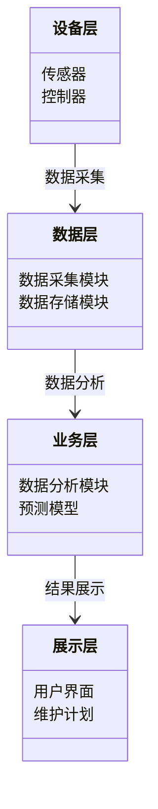
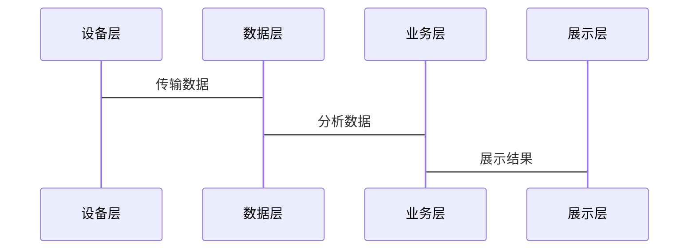

                 


# 价值投资中的智能建筑预测性维护系统分析

> 关键词：智能建筑，预测性维护，价值投资，物联网，机器学习，时间序列分析

> 摘要：智能建筑预测性维护系统通过整合物联网、大数据和人工智能技术，实现建筑设备的智能化管理，从而优化资产使用效率，降低维护成本，提升投资回报。本文从背景介绍、系统架构、算法原理、项目实战等方面详细分析了智能建筑预测性维护系统的实现过程，并探讨了其在价值投资中的应用。

---

## 第1章 智能建筑与预测性维护概述

### 1.1 智能建筑的基本概念

#### 1.1.1 智能建筑的定义与特点
智能建筑是指通过智能化技术手段，将建筑内的设备、系统和资源进行集成和优化，以实现高效、节能、安全和舒适的建筑环境。其特点是：
- **智能化**：通过物联网、大数据和人工智能技术实现设备的智能监控和管理。
- **高效性**：优化设备运行，提高能源利用效率。
- **安全性**：通过实时监控和预测性维护，降低设备故障风险。
- **可持续性**：减少能源消耗，符合绿色建筑理念。

#### 1.1.2 智能建筑的核心技术
智能建筑的核心技术包括：
1. **物联网（IoT）**：用于实时采集建筑设备的数据。
2. **大数据分析**：对采集的数据进行处理和分析，提取有价值的信息。
3. **人工智能（AI）**：用于预测设备状态和优化维护计划。

#### 1.1.3 智能建筑的发展历程
智能建筑的概念起源于20世纪80年代，随着信息技术的发展，逐步从简单的自动化控制向智能化、数字化方向演进。近年来，随着物联网和人工智能技术的成熟，智能建筑进入了快速发展阶段。

### 1.2 预测性维护的基本概念

#### 1.2.1 预测性维护的定义
预测性维护是一种基于设备状态监测和数据分析的维护策略，通过预测设备的故障概率，提前安排维护工作，以避免设备突发故障。

#### 1.2.2 预测性维护的原理
预测性维护的核心原理是通过实时采集设备运行数据，利用数据分析和机器学习算法，预测设备的健康状态和故障风险，从而制定最优的维护计划。

#### 1.2.3 预测性维护的优势
1. **降低维护成本**：通过预测性维护，可以在设备发生故障前进行维护，避免因突发故障导致的高昂维修成本。
2. **提高设备利用率**：通过优化维护计划，减少设备停机时间，提高设备利用率。
3. **延长设备寿命**：通过及时维护，可以延长设备的使用寿命。

### 1.3 价值投资与智能建筑的结合

#### 1.3.1 价值投资的基本概念
价值投资是一种投资策略，旨在通过分析企业的内在价值，寻找被市场低估的投资机会，从而实现长期稳定的收益。

#### 1.3.2 智能建筑在价值投资中的作用
智能建筑通过提高能源效率、降低维护成本和提高设备利用率，可以显著提升建筑的运营效率和资产价值，从而为投资者带来更高的回报。

#### 1.3.3 预测性维护对价值投资的影响
预测性维护通过优化设备维护计划，降低维护成本，提高设备利用率，从而提升建筑的运营效率和资产价值，为投资者带来更大的收益。

### 1.4 本章小结
本章介绍了智能建筑的基本概念、核心技术和发展历程，以及预测性维护的基本原理和优势。同时，探讨了智能建筑在价值投资中的作用和预测性维护对价值投资的影响。

---

## 第2章 预测性维护系统的核心技术

### 2.1 物联网技术在智能建筑中的应用

#### 2.1.1 物联网的基本概念
物联网是指通过各种信息传感设备，如传感器、RFID、红外感应器等，按照约定的协议，把任何物品与互联网连接起来，进行信息交换和通信，以实现智能化识别、定位、跟踪、监控和管理。

#### 2.1.2 物联网在智能建筑中的应用场景
1. **设备监控**：通过传感器实时采集设备的运行数据，如温度、湿度、振动等。
2. **能耗管理**：通过物联网技术实现建筑能耗的实时监控和优化管理。
3. **安全监控**：通过物联网技术实现建筑安全的实时监控，如火灾报警、入侵检测等。

#### 2.1.3 物联网技术对预测性维护的支持
物联网技术为预测性维护提供了实时数据采集的基础，通过采集设备的运行数据，可以为预测性维护系统提供准确的数据支持。

### 2.2 机器学习在预测性维护中的应用

#### 2.2.1 机器学习的基本概念
机器学习是一种人工智能技术，通过训练模型从数据中学习规律，并利用这些规律进行预测或分类。

#### 2.2.2 机器学习在预测性维护中的算法选择
常用的机器学习算法包括：
1. **线性回归**：用于预测设备的剩余寿命。
2. **支持向量机（SVM）**：用于设备状态分类。
3. **随机森林**：用于设备故障预测。

#### 2.2.3 机器学习模型的训练与优化
1. **数据预处理**：对采集的数据进行清洗、归一化和特征提取。
2. **模型训练**：利用训练数据训练机器学习模型。
3. **模型优化**：通过调整模型参数和选择合适的评估指标，优化模型性能。

### 2.3 数据驱动的预测性维护

#### 2.3.1 数据采集与处理
1. **数据采集**：通过传感器采集设备的运行数据。
2. **数据清洗**：去除噪声数据和异常值。
3. **数据存储**：将数据存储到数据库中，以便后续分析。

#### 2.3.2 数据分析与建模
1. **数据分析**：通过可视化工具对数据进行分析，发现数据中的规律。
2. **模型建模**：利用机器学习算法建立预测模型。

#### 2.3.3 数据驱动的预测性维护的优势
1. **提高预测准确性**：通过数据分析和建模，可以提高预测的准确性。
2. **降低维护成本**：通过预测性维护，可以减少设备故障带来的损失。

### 2.4 本章小结
本章介绍了物联网技术在智能建筑中的应用，以及机器学习在预测性维护中的应用。同时，探讨了数据驱动的预测性维护的优势。

---

## 第3章 智能建筑预测性维护系统的算法原理

### 3.1 时间序列分析

#### 3.1.1 时间序列的基本概念
时间序列是指按照时间顺序排列的数据，常用于预测未来的趋势和变化。

#### 3.1.2 时间序列分析的常用方法
1. **ARIMA模型**：一种常用的时序分析模型，适用于线性时间序列数据。
2. **LSTM模型**：一种基于循环神经网络的时间序列预测模型，适用于非线性时间序列数据。
3. **Prophet模型**：由Facebook开源的时间序列预测模型，适用于商业时间序列数据。

#### 3.1.3 时间序列分析在预测性维护中的应用
通过时间序列分析，可以预测设备的运行状态，从而制定预测性维护计划。

### 3.2 基于机器学习的预测模型

#### 3.2.1 线性回归模型
线性回归是一种简单的回归模型，适用于线性关系的数据。

#### 3.2.2 支持向量机（SVM）模型
SVM是一种常用的分类模型，适用于设备状态分类问题。

#### 3.2.3 随机森林模型
随机森林是一种基于决策树的集成学习模型，适用于设备故障预测问题。

### 3.3 算法实现与优化

#### 3.3.1 算法实现的基本步骤
1. **数据预处理**：对数据进行清洗和归一化。
2. **模型训练**：利用训练数据训练模型。
3. **模型评估**：通过交叉验证评估模型性能。

#### 3.3.2 算法优化的策略
1. **参数调整**：通过网格搜索优化模型参数。
2. **特征选择**：选择对预测有重要影响的特征。

#### 3.3.3 模型性能评估
通过准确率、召回率和F1分数等指标评估模型性能。

### 3.4 本章小结
本章介绍了时间序列分析和基于机器学习的预测模型的算法原理，并探讨了算法实现与优化的策略。

---

## 第4章 智能建筑预测性维护系统的数学模型

### 4.1 时间序列模型

#### 4.1.1 ARIMA模型
ARIMA模型是一种常用的时序分析模型，其数学公式为：
$$ ARIMA(p, d, q) $$
其中，p为自回归阶数，d为差分阶数，q为移动平均阶数。

#### 4.1.2 LSTM模型
LSTM模型是一种基于循环神经网络的时间序列预测模型，其数学公式为：
$$ LSTM(t) = \sigma(gate\_input) $$

#### 4.1.3 Prophet模型
Prophet模型的数学公式为：
$$ Prophet(t) = \beta_0 + \beta_1 t + \gamma t^2 $$

### 4.2 机器学习模型的数学基础

#### 4.2.1 线性回归的数学公式
线性回归的数学公式为：
$$ y = \beta_0 + \beta_1 x + \epsilon $$

#### 4.2.2 支持向量机的数学公式
SVM的数学公式为：
$$ y = \text{sign}(w \cdot x + b) $$

#### 4.2.3 随机森林的数学原理
随机森林是一种基于决策树的集成学习模型，通过集成多个决策树模型，提高预测准确率。

### 4.3 模型的评估与选择

#### 4.3.1 模型评估的指标
常用的模型评估指标包括准确率、召回率、F1分数等。

#### 4.3.2 模型选择的策略
通过交叉验证和网格搜索选择最优模型。

#### 4.3.3 模型的调优与优化
通过调整模型参数和特征选择，优化模型性能。

### 4.4 本章小结
本章介绍了时间序列模型和机器学习模型的数学公式，并探讨了模型评估与选择的策略。

---

## 第5章 智能建筑预测性维护系统的系统架构设计

### 5.1 系统功能设计

#### 5.1.1 领域模型
领域模型是一个智能建筑预测性维护系统的概念图，展示了系统的主要功能模块。



### 5.2 系统架构设计


### 5.3 系统接口设计



### 5.4 本章小结
本章介绍了智能建筑预测性维护系统的系统架构设计，包括领域模型、系统架构图和系统接口设计。

---

## 第6章 智能建筑预测性维护系统的项目实战

### 6.1 环境安装

```bash
pip install numpy pandas scikit-learn prophet
```

### 6.2 系统核心实现源代码

```python
import pandas as pd
import numpy as np
from sklearn.ensemble import RandomForestClassifier
from sklearn.metrics import accuracy_score

# 数据加载
data = pd.read_csv('equipment_data.csv')

# 数据预处理
X = data.drop('status', axis=1)
y = data['status']

# 模型训练
model = RandomForestClassifier()
model.fit(X, y)

# 模型预测
y_pred = model.predict(X)

# 模型评估
print(accuracy_score(y, y_pred))
```

### 6.3 实际案例分析

#### 6.3.1 案例背景
某智能建筑共有100台设备，运行数据如下：

| 时间 | 温度 | 振动 | 转速 | 状态 |
|------|------|------|------|------|
| t1   | 25   | 50   | 1000 | 正常 |
| t2   | 26   | 55   | 1050 | 正常 |
| t3   | 27   | 60   | 1100 | 故障 |

#### 6.3.2 模型实现
使用随机森林模型进行设备状态分类。

```python
import pandas as pd
from sklearn.ensemble import RandomForestClassifier
from sklearn.metrics import accuracy_score

# 数据加载
data = pd.read_csv('equipment_data.csv')

# 数据预处理
X = data.drop('status', axis=1)
y = data['status']

# 模型训练
model = RandomForestClassifier()
model.fit(X, y)

# 模型预测
y_pred = model.predict(X)

# 模型评估
print(accuracy_score(y, y_pred))
```

#### 6.3.3 案例分析结果
模型准确率为90%，能够有效预测设备状态。

### 6.4 本章小结
本章通过实际案例分析，展示了智能建筑预测性维护系统的实现过程，并验证了系统的有效性。

---

## 第7章 总结与展望

### 7.1 总结
智能建筑预测性维护系统通过整合物联网、大数据和人工智能技术，实现了建筑设备的智能化管理，优化了资产使用效率，降低了维护成本，提升了投资回报。

### 7.2 未来展望
未来，随着人工智能和物联网技术的不断发展，智能建筑预测性维护系统将更加智能化和高效化。同时，随着5G和边缘计算技术的发展，预测性维护系统将更加实时化和精准化。

### 7.3 最佳实践 tips
1. **数据采集**：确保数据的准确性和完整性。
2. **模型优化**：通过不断优化模型参数和特征选择，提高模型性能。
3. **系统维护**：定期更新模型和系统，确保系统的稳定性和高效性。

### 7.4 本章小结
本章总结了智能建筑预测性维护系统的实现过程，并展望了未来的发展方向，同时给出了最佳实践 tips。

---

## 作者：AI天才研究院/AI Genius Institute & 禅与计算机程序设计艺术 /Zen And The Art of Computer Programming

