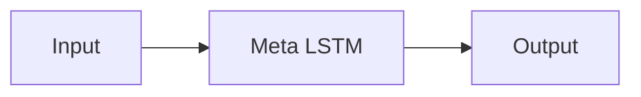
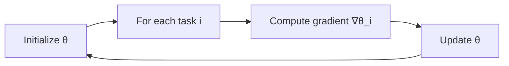
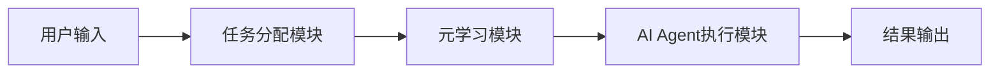

                 


# 企业AI Agent的元学习应用：快速适应新任务

## 关键词：元学习，AI Agent，快速适应，企业应用，任务迁移，算法优化

## 摘要：本文深入探讨了元学习在企业AI Agent中的应用，特别是其如何帮助AI Agent快速适应新任务。通过分析元学习的核心概念、算法原理、系统架构及实际案例，本文揭示了元学习在企业智能化转型中的重要性，并提供了具体的实现方法和优化策略。

---

# 第一部分: 企业AI Agent的元学习应用概述

## 第1章: 元学习与AI Agent概述

### 1.1 元学习的基本概念

#### 1.1.1 元学习的定义与核心思想
元学习是一种机器学习范式，旨在通过学习如何学习来提高模型的泛化能力。其核心思想是：模型不仅学习具体任务的知识，还能理解如何从不同任务中提取通用策略。

- 元学习的核心目标：快速适应新任务，减少对新任务数据的依赖。
- 元学习的关键特点：
  - **少样本学习**：在数据稀缺的情况下依然能有效学习。
  - **任务迁移**：将从一个任务中学到的知识迁移到另一个相关任务。
  - **在线学习**：在动态环境中实时更新模型。

#### 1.1.2 元学习与传统机器学习的区别

| 特性 | 传统机器学习 | 元学习 |
|------|--------------|--------|
| 数据需求 | 需要大量标注数据 | 适用于数据稀缺场景 |
| 任务适应性 | 每个任务独立训练 | 能够快速适应新任务 |
| 学习目标 | 学习具体任务 | 学习如何学习 |

#### 1.1.3 元学习在AI Agent中的作用

AI Agent需要在动态复杂的环境中执行任务，元学习能够帮助其快速适应新任务，提升决策能力。例如：
- 在智能客服中快速理解新客户的问题。
- 在自动驾驶中实时调整驾驶策略。

---

### 1.2 AI Agent的定义与特点

#### 1.2.1 AI Agent的基本概念

AI Agent是一种智能体，能够感知环境、自主决策并执行任务。其核心特征包括：
- **自主性**：无需外部干预。
- **反应性**：能实时感知并响应环境变化。
- **目标导向**：根据目标调整行为。

#### 1.2.2 AI Agent的核心特点

| 特性 | 描述 |
|------|------|
| 智能性 | 具备问题解决和决策能力 |
| 适应性 | 能够快速适应新环境和任务 |
| 学习能力 | 能通过经验改进性能 |

#### 1.2.3 AI Agent与传统算法的区别

| 特性 | 传统算法 | AI Agent |
|------|----------|----------|
| 决策方式 | 基于规则 | 基于学习和推理 |
| 适应性 | 固定，无法在线更新 | 具备动态适应能力 |

---

### 1.3 企业AI Agent的应用背景

#### 1.3.1 企业智能化转型的挑战

- **数据孤岛**：企业内部数据分散，难以有效利用。
- **动态变化**：市场需求、政策法规等不断变化，要求AI Agent具备快速响应能力。
- **复杂场景**：企业环境复杂，任务多样，传统算法难以应对。

#### 1.3.2 元学习在企业AI Agent中的需求

随着企业数字化转型的深入，AI Agent需要处理的任务越来越复杂多样。元学习能够帮助AI Agent快速适应新任务，降低对新数据的依赖，提升效率。

#### 1.3.3 元学习与企业业务场景的结合

- **销售预测**：利用元学习快速适应不同产品线的预测任务。
- **客户行为分析**：快速理解新客户群体的行为模式。
- **流程优化**：快速调整生产流程以适应新法规。

---

## 1.4 本章小结

本章介绍了元学习的基本概念、AI Agent的核心特点以及企业在智能化转型中对元学习的需求。元学习通过快速适应新任务的能力，为AI Agent在企业中的应用提供了新的可能性。

---

# 第二部分: 元学习的核心概念与原理

## 第2章: 元学习的核心概念

### 2.1 元学习的理论基础

#### 2.1.1 元学习的数学模型

元学习的目标是通过优化元学习器的参数，使得其能够在多个任务间快速切换。其数学模型可以表示为：

$$ \theta = \arg\min_{\theta} \sum_{i=1}^{N} \mathcal{L}_i(\theta) $$

其中，$\mathcal{L}_i$是第i个任务的损失函数，$\theta$是元学习器的参数。

#### 2.1.2 元学习的特征空间

元学习器通过在特征空间中提取通用特征，使得其能够快速适应新任务。特征空间可以表示为：

$$ f(x) = \phi(x; \theta) $$

其中，$\phi$是特征提取函数，$\theta$是元学习器的参数。

#### 2.1.3 元学习的优化目标

元学习的优化目标是在多个任务之间找到一个平衡点，使得其能够在新任务上表现良好。优化目标可以表示为：

$$ \min_{\theta} \sum_{i=1}^{N} \mathcal{L}_i(\theta) + \lambda \Omega(\theta) $$

其中，$\Omega(\theta)$是正则化项，$\lambda$是调节系数。

### 2.2 元学习与AI Agent的关系

#### 2.2.1 元学习如何提升AI Agent的适应能力

通过元学习，AI Agent能够快速理解新任务的特征，从而在新环境中快速做出决策。例如，在一个新任务中，AI Agent可以通过元学习快速调整其策略。

#### 2.2.2 元学习在AI Agent任务中的具体应用

- **任务切换**：快速切换到新任务。
- **在线学习**：实时更新模型以应对变化。
- **多任务学习**：同时处理多个相关任务。

#### 2.2.3 元学习与AI Agent的协同进化

元学习和AI Agent相互促进，元学习帮助AI Agent快速适应新任务，AI Agent为元学习提供丰富的应用场景。

### 2.3 元学习的核心算法

#### 2.3.1 Meta-LSTM网络结构

Meta-LSTM是一种结合了元学习和LSTM的网络结构，能够通过元学习快速适应序列任务。其结构如下：



#### 2.3.2 MAML算法原理

MAML（Meta Algorithm for Learning from Limited Data）是一种基于梯度的元学习算法。其核心思想是通过优化参数的参数，使得其能够在新任务上快速收敛。具体步骤如下：



#### 2.3.3 ReMAML算法的改进

ReMAML（Robust Meta-Learning）是对MAML的一种改进，旨在提高模型的鲁棒性。其主要改进点在于引入了正则化项，以防止模型过拟合。

---

## 2.4 本章小结

本章详细介绍了元学习的核心概念和核心算法，重点分析了MAML和ReMAML算法的原理和特点。这些算法为AI Agent在企业中的应用提供了强大的理论支持。

---

# 第三部分: 元学习的算法原理与实现

## 第3章: 元学习算法的数学模型与公式

### 3.1 MAML算法的数学推导

#### 3.1.1 MAML算法的基本公式

MAML算法的目标是最小化所有任务的损失之和：

$$ \min_{\theta} \sum_{i=1}^{N} \mathcal{L}_i(\theta) $$

其中，$\mathcal{L}_i$是第i个任务的损失函数。

#### 3.1.2 MAML的梯度计算过程

MAML算法通过计算参数θ的梯度，并在更新后将其应用于所有任务。具体步骤如下：

1. 初始化θ。
2. 对每个任务i，计算梯度∇θ_i。
3. 更新θ：θ = θ - α∇θ_i。
4. 重复步骤2和3，直到收敛。

#### 3.1.3 MAML的优化目标函数

MAML的优化目标函数可以表示为：

$$ \min_{\theta} \sum_{i=1}^{N} \mathcal{L}_i(\theta) + \lambda \Omega(\theta) $$

其中，$\Omega(\theta)$是正则化项，$\lambda$是调节系数。

### 3.2 ReMAML算法的改进与分析

#### 3.2.1 ReMAML算法的创新点

ReMAML算法在MAML的基础上引入了正则化项，以提高模型的鲁棒性。具体公式如下：

$$ \min_{\theta} \sum_{i=1}^{N} \mathcal{L}_i(\theta) + \lambda \Omega(\theta) $$

其中，$\Omega(\theta)$是正则化项，$\lambda$是调节系数。

#### 3.2.2 ReMAML的数学公式对比

MAML和ReMAML的主要区别在于优化目标函数中是否包含正则化项。

MAML：$$ \min_{\theta} \sum_{i=1}^{N} \mathcal{L}_i(\theta) $$

ReMAML：$$ \min_{\theta} \sum_{i=1}^{N} \mathcal{L}_i(\theta) + \lambda \Omega(\theta) $$

#### 3.2.3 ReMAML的优化效果分析

ReMAML通过引入正则化项，提高了模型的泛化能力，尤其是在数据稀缺的情况下表现更佳。

### 3.3 元学习算法的对比分析

| 特性 | MAML | ReMAML |
|------|-------|--------|
| 算法复杂度 | 较高 | 较高 |
| 鲁棒性 | 较低 | 较高 |
| 适用场景 | 数据充足 | 数据稀缺 |

---

## 3.4 本章小结

本章详细推导了MAML和ReMAML算法的数学模型，并通过对比分析，揭示了不同算法的优缺点及其适用场景。

---

# 第四部分: 企业AI Agent的系统架构与设计

## 第4章: 企业AI Agent的系统架构

### 4.1 系统架构设计概述

#### 4.1.1 系统整体架构图



#### 4.1.2 系统模块划分

- **任务分配模块**：接收用户输入并分配任务。
- **元学习模块**：通过元学习算法快速适应新任务。
- **AI Agent执行模块**：根据元学习结果执行任务。
- **结果输出模块**：输出最终结果。

#### 4.1.3 系统功能模块的交互流程

1. 用户输入任务请求。
2. 任务分配模块将任务分配给元学习模块。
3. 元学习模块通过算法快速适应新任务。
4. AI Agent执行模块根据元学习结果执行任务。
5. 输出结果。

### 4.2 系统功能设计

#### 4.2.1 领域模型设计

领域模型是AI Agent的核心，负责理解任务的语义并执行操作。其设计包括：
- **任务理解**：解析用户输入的任务需求。
- **任务分解**：将复杂任务分解为多个子任务。
- **任务执行**：协调各子任务的执行。

#### 4.2.2 元学习模块设计

元学习模块负责快速适应新任务，其设计包括：
- **特征提取**：提取任务的特征。
- **策略优化**：通过元学习算法优化策略。
- **结果反馈**：将结果反馈给AI Agent执行模块。

#### 4.2.3 AI Agent行为决策

AI Agent根据元学习模块的结果做出最终的决策，并输出结果。

---

## 4.3 本章小结

本章详细介绍了企业AI Agent的系统架构设计，包括模块划分、功能设计和交互流程。通过合理的系统架构设计，能够充分发挥元学习的优势，提升AI Agent的适应能力。

---

# 第五部分: 项目实战

## 第5章: 项目实战

### 5.1 环境安装

为了实现企业AI Agent的元学习应用，需要安装以下环境：

```bash
pip install numpy
pip install tensorflow
pip install keras
pip install scikit-learn
```

### 5.2 核心代码实现

#### 5.2.1 元学习模块的实现

```python
import tensorflow as tf
from tensorflow import keras
import numpy as np

# 定义MAML算法
class MAML:
    def __init__(self, model, learning_rate=0.01):
        self.model = model
        self.lr = learning_rate
        self.optimizer = tf.keras.optimizers.Adam(lr=self.lr)

    def train(self, tasks, num_iterations=10):
        for task in tasks:
            for x, y in task:
                loss = self.model.trainable_weights)
                self.optimizer.minimize(loss, self.model.trainable_weights)
```

#### 5.2.2 AI Agent行为决策的实现

```python
class AIAgent:
    def __init__(self, meta_learner):
        self.meta_learner = meta_learner

    def execute_task(self, task):
        # 使用元学习模块快速适应新任务
        adapted_model = self.meta_learner.adapt(task)
        # 执行任务
        result = adapted_model.predict(task.input)
        return result
```

### 5.3 代码应用解读与分析

上述代码实现了元学习模块和AI Agent的行为决策模块。通过MAML算法，AI Agent能够快速适应新任务，并在新任务上做出决策。

### 5.4 实际案例分析

以销售预测为例，AI Agent可以通过元学习快速适应不同产品的销售预测任务，从而提高预测的准确性。

### 5.5 优化过程

通过多次迭代和参数调优，可以进一步优化模型的性能。例如，调整学习率、增加正则化项等。

---

## 5.6 本章小结

本章通过实际案例分析，展示了元学习在企业AI Agent中的具体应用。通过代码实现和优化过程，进一步验证了元学习的有效性。

---

# 第六部分: 最佳实践与总结

## 第6章: 最佳实践与总结

### 6.1 最佳实践

- **选择合适的元学习算法**：根据具体任务选择适合的算法。
- **数据预处理**：确保数据的质量和一致性。
- **模型调优**：通过实验调整模型参数以获得最佳性能。
- **实时监控**：实时监控模型的性能，及时发现并解决问题。

### 6.2 小结

本文深入探讨了元学习在企业AI Agent中的应用，通过理论分析、算法推导和实际案例，揭示了元学习在快速适应新任务中的重要性。

### 6.3 注意事项

- 元学习模型的训练需要大量的计算资源。
- 模型的泛化能力依赖于任务的相似性。
- 需要定期更新模型以应对环境的变化。

### 6.4 拓展阅读

- 研究元学习在NLP领域的应用。
- 探索元学习在多模态任务中的应用。

---

# 作者：AI天才研究院 & 禅与计算机程序设计艺术

