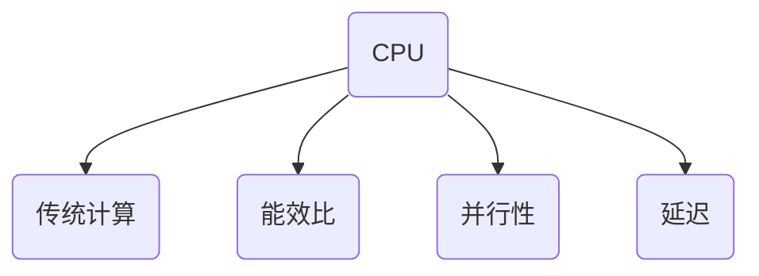
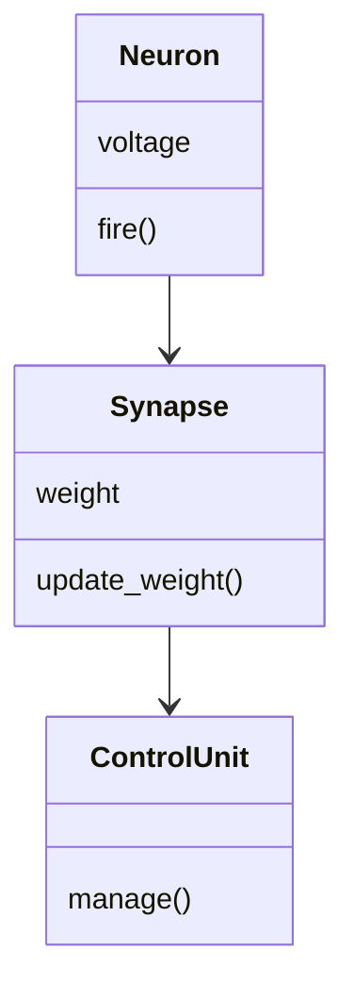
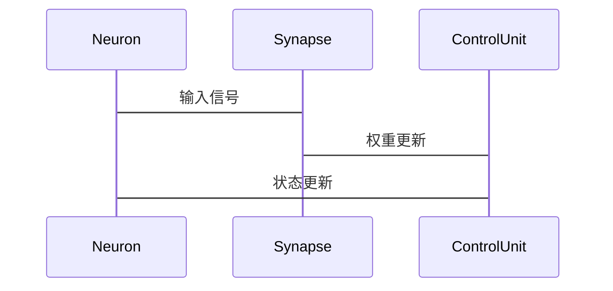

                 


---

# 如何识别企业的神经形态计算芯片优势

> 关键词：神经形态计算芯片、企业识别方法、性能评估、算法分析、架构设计、应用案例

> 摘要：神经形态计算芯片是一种模拟人脑神经网络结构和功能的新型计算芯片，具有高能效、高并行性和低延迟等优势。本文将从神经形态计算芯片的核心概念、算法原理、系统架构设计、项目实战等多个方面，详细分析如何识别和评估企业的神经形态计算芯片优势，为企业在选择和应用神经形态计算芯片时提供实用的指导。

---

# 第一部分: 神经形态计算芯片的背景与概念

## 第1章: 神经形态计算芯片的背景介绍

### 1.1 问题背景
#### 1.1.1 传统计算芯片的局限性
传统计算芯片（如CPU和GPU）在处理复杂任务时面临以下问题：
- 高能耗：传统芯片的计算效率低下，尤其是在处理大规模并行计算任务时，能耗过高。
- 瓶颈：在处理需要实时反馈的任务（如自动驾驶、机器人控制等）时，传统芯片的延迟较高，难以满足实时性要求。

#### 1.1.2 神经形态计算的起源与发展
神经形态计算的概念起源于20世纪60年代，旨在模拟人脑的神经网络结构和信息处理方式。近年来，随着人工智能和深度学习的快速发展，神经形态计算芯片逐渐成为研究热点。

#### 1.1.3 神经形态计算在企业中的应用价值
神经形态计算芯片在企业中的应用价值主要体现在以下几个方面：
- 高能效：相比传统芯片，神经形态芯片在完成相同任务时能耗更低。
- 高并行性：神经形态芯片能够同时处理大量数据，适合处理复杂的并行任务。
- 灵活性：神经形态芯片可以通过动态调整权重和连接方式，适应不同的应用场景。

### 1.2 问题描述
#### 1.2.1 传统芯片在复杂任务中的不足
传统芯片在处理复杂任务时，往往需要依赖大量的并行计算资源，这不仅增加了计算成本，还导致能耗过高。

#### 1.2.2 神经形态芯片的定义与特点
神经形态芯片是一种模拟人脑神经网络结构的芯片，具有以下特点：
- 高能效：神经形态芯片通过模拟生物神经元的特性，能够在低能耗下完成复杂的计算任务。
- 高并行性：神经形态芯片能够同时处理大量数据，适合处理复杂的并行任务。
- 灵活性：神经形态芯片可以通过动态调整权重和连接方式，适应不同的应用场景。

#### 1.2.3 神经形态计算的核心目标与应用场景
神经形态计算的核心目标是通过模拟人脑的神经网络结构，实现高效、低能耗的计算。其应用场景包括：
- 智能机器人
- 自动驾驶
- 实时数据分析
- 物联网设备

### 1.3 问题解决
#### 1.3.1 神经形态计算芯片的设计理念
神经形态芯片的设计理念是通过模拟生物神经元的特性，实现高效、低能耗的计算。其设计理念包括：
- 模拟生物神经元的特性
- 高效的并行计算
- 动态调整权重和连接方式

#### 1.3.2 神经形态计算与传统计算的对比
以下是神经形态计算与传统计算的对比：

| 对比维度      | 神经形态计算       | 传统计算       |
|---------------|-------------------|----------------|
| 计算模型       | 模拟生物神经网络   | 串行指令处理   |
| 能效比         | 高                | 低              |
| 并行性         | 高                | 中              |
| 延迟           | 低                | 高              |

#### 1.3.3 神经形态计算芯片的优势与不足
神经形态芯片的优势：
- 高能效
- 高并行性
- 低延迟

神经形态芯片的不足：
- 开发难度大
- 生态系统不完善
- 需要特定的应用场景

### 1.4 边界与外延
#### 1.4.1 神经形态计算的边界条件
神经形态计算的边界条件包括：
- 计算任务的复杂性
- 能效比要求
- 实时性要求

#### 1.4.2 神经形态计算与其他计算范式的区别
神经形态计算与其他计算范式的区别主要体现在：
- 计算模型：神经形态计算模拟生物神经网络，而传统计算基于串行指令。
- 能效比：神经形态计算具有更高的能效比。
- 并行性：神经形态计算具有更高的并行性。

#### 1.4.3 神经形态计算的未来发展
神经形态计算的未来发展将主要集中在以下几个方面：
- 提高能效比
- 优化系统架构
- 扩展应用场景

### 1.5 概念结构与核心要素
#### 1.5.1 神经形态计算的核心要素
神经形态计算的核心要素包括：
- 神经元模型
- 突触模型
- 忆阻器原理

#### 1.5.2 神经形态计算的系统架构
神经形态计算的系统架构包括：
- 神经元层
- 突触层
- 控制层

#### 1.5.3 神经形态计算的性能指标
神经形态计算的性能指标包括：
- 计算效率
- 能效比
- 延迟

---

# 第二部分: 神经形态计算芯片的核心概念与联系

## 第2章: 神经形态计算芯片的核心概念

### 2.1 神经元模型
#### 2.1.1 神经元的基本结构与功能
神经元的基本结构包括：
- 树突：接收输入信号
- 轴突：传递输出信号
- 细胞体：处理输入信号并生成输出信号

#### 2.1.2 神经元的数学模型（如LIF模型）
LIF模型（Leaky Integrate-and-Fire）是神经元的一种常用数学模型，描述神经元在接受输入时的电位变化过程。其数学表达式如下：

$$
\frac{dv}{dt} = \frac{v_{\text{rest}} - v}{\tau} + I
$$

其中，$v$ 是膜电位，$v_{\text{rest}}$ 是静息电位，$\tau$ 是时间常数，$I$ 是输入电流。

#### 2.1.3 神经元的动态特性
神经元的动态特性包括：
- 电位变化
- 突触传递
- 神经递质释放

### 2.2 突触模型
#### 2.2.1 突触的基本功能
突触的基本功能是传递神经信号，包括：
- 接收输入信号
- 调整突触权重
- 传递输出信号

#### 2.2.2 突触权重的调整机制
突触权重的调整机制包括：
- 长期 potentiation (LTP)
- 长期 depression (LTD)

#### 2.2.3 突触的时序依赖性
突触的时序依赖性包括：
- 输入先后顺序的影响
- 突触权重的动态调整

### 2.3 忆阻器原理
#### 2.3.1 忆阻器的基本特性
忆阻器的基本特性包括：
- 非线性电阻特性
- 状态可切换性
- 状态可恢复性

#### 2.3.2 忆阻器在神经形态芯片中的应用
忆阻器在神经形态芯片中的应用包括：
- 突触权重存储
- 神经元状态存储
- 系统配置

#### 2.3.3 忆阻器的材料与工艺
忆阻器的材料包括：
- 氧化物材料
- 金属材料
- 纳米材料

---

## 第3章: 神经形态计算芯片的核心属性对比

### 3.1 神经形态芯片与传统芯片的对比
以下是神经形态芯片与传统芯片的对比：

| 对比维度      | 神经形态芯片       | 传统芯片       |
|---------------|-------------------|----------------|
| 计算模型       | 模拟生物神经网络   | 串行指令处理   |
| 能效比         | 高                | 低              |
| 并行性         | 高                | 中              |
| 延迟           | 低                | 高              |

### 3.2 神经形态芯片的性能特征
神经形态芯片的性能特征包括：
- 高能效比
- 高并行性
- 低延迟

### 3.3 神经形态芯片的实体关系
以下是神经形态芯片的实体关系图：



---

# 第三部分: 神经形态计算芯片的算法原理

## 第4章: 神经形态计算芯片的算法原理

### 4.1 神经形态计算算法的基本原理
神经形态计算算法的基本原理是通过模拟生物神经网络的结构和功能，实现高效的计算。其核心算法包括：
- 突触权重调整算法
- 神经元激活算法

### 4.2 突触权重调整算法
突触权重调整算法是神经形态计算中的核心算法之一。以下是一个简单的突触权重调整算法示例：

```python
def update_synaptic_weights(input, output, weights):
    delta_weights = input * (output - target)
    weights += delta_weights
    return weights
```

### 4.3 神经元激活算法
神经元激活算法是神经形态计算中的另一个核心算法。以下是一个简单的神经元激活算法示例：

```python
def activate_neuron(input, weights, threshold):
    net_input = sum(input * weights)
    if net_input > threshold:
        return 1
    else:
        return 0
```

### 4.4 神经形态计算算法的数学模型
神经形态计算算法的数学模型包括：
- 突触权重调整模型
- 神经元激活模型

以下是一个突触权重调整模型的数学表达式：

$$
w_{\text{new}} = w_{\text{old}} + \alpha (x \odot y)
$$

其中，$w_{\text{new}}$ 是新的突触权重，$w_{\text{old}}$ 是旧的突触权重，$\alpha$ 是学习率，$x$ 和 $y$ 是输入和输出。

---

# 第四部分: 神经形态计算芯片的系统架构设计

## 第5章: 神经形态计算芯片的系统架构设计

### 5.1 系统需求分析
神经形态计算芯片的系统需求分析包括：
- 计算任务的复杂性
- 能效比要求
- 实时性要求

### 5.2 系统功能设计
神经形态计算芯片的系统功能设计包括：
- 神经元层
- 突触层
- 控制层

以下是系统功能设计的类图：



### 5.3 系统架构设计
神经形态计算芯片的系统架构设计包括：
- 神经元层
- 突触层
- 控制层

以下是系统架构设计的架构图：


### 5.4 系统接口设计
神经形态计算芯片的系统接口设计包括：
- 输入接口
- 输出接口
- 控制接口

### 5.5 系统交互设计
神经形态计算芯片的系统交互设计包括：
- 神经元激活
- 突触权重调整
- 系统控制

以下是系统交互设计的序列图：



---

# 第五部分: 神经形态计算芯片的项目实战

## 第6章: 神经形态计算芯片的项目实战

### 6.1 环境搭建
神经形态计算芯片的环境搭建包括：
- 硬件环境：神经形态芯片开发板
- 软件环境：神经形态芯片开发工具链

### 6.2 核心代码实现
以下是神经形态计算芯片的核心代码实现：

```python
def simulate_neuron(input, weights, threshold):
    net_input = sum(input * weights)
    if net_input > threshold:
        return 1
    else:
        return 0
```

### 6.3 案例分析
以下是神经形态计算芯片的一个实际案例分析：

#### 案例背景
某企业希望利用神经形态计算芯片实现低能耗的实时数据分析任务。

#### 案例分析
1. **需求分析**：实时数据分析任务需要低能耗、高并行性。
2. **系统设计**：设计神经形态计算芯片的神经元层、突触层和控制层。
3. **实现与测试**：实现核心代码并进行测试。
4. **结果分析**：分析系统的能效比、并行性和延迟。

### 6.4 项目总结
神经形态计算芯片的项目总结包括：
- 项目目标的实现情况
- 系统性能的评估结果
- 项目中的经验与教训

---

# 第六部分: 神经形态计算芯片的最佳实践与总结

## 第7章: 神经形态计算芯片的最佳实践

### 7.1 选择合适的神经形态芯片
选择合适的神经形态芯片需要考虑以下因素：
- 能效比
- 并行性
- 延迟

### 7.2 神经形态芯片的开发工具链
神经形态芯片的开发工具链包括：
- 芯片开发板
- 芯片开发工具链
- 芯片模拟器

### 7.3 神经形态芯片的生态系统
神经形态芯片的生态系统包括：
- 开发社区
- 应用案例
- 技术支持

### 7.4 神经形态芯片的未来发展
神经形态芯片的未来发展将主要集中在以下几个方面：
- 提高能效比
- 优化系统架构
- 扩展应用场景

---

## 第8章: 神经形态计算芯片的总结与展望

### 8.1 总结
神经形态计算芯片是一种模拟人脑神经网络结构和功能的新型计算芯片，具有高能效、高并行性和低延迟等优势。本文详细分析了神经形态计算芯片的核心概念、算法原理、系统架构设计、项目实战等内容，为企业在选择和应用神经形态计算芯片时提供了实用的指导。

### 8.2 展望
随着人工智能和深度学习的快速发展，神经形态计算芯片的应用场景将更加广泛。未来，神经形态计算芯片将在智能机器人、自动驾驶、实时数据分析等领域发挥重要作用。

---

# 作者

作者：AI天才研究院/AI Genius Institute & 禅与计算机程序设计艺术 /Zen And The Art of Computer Programming

---

