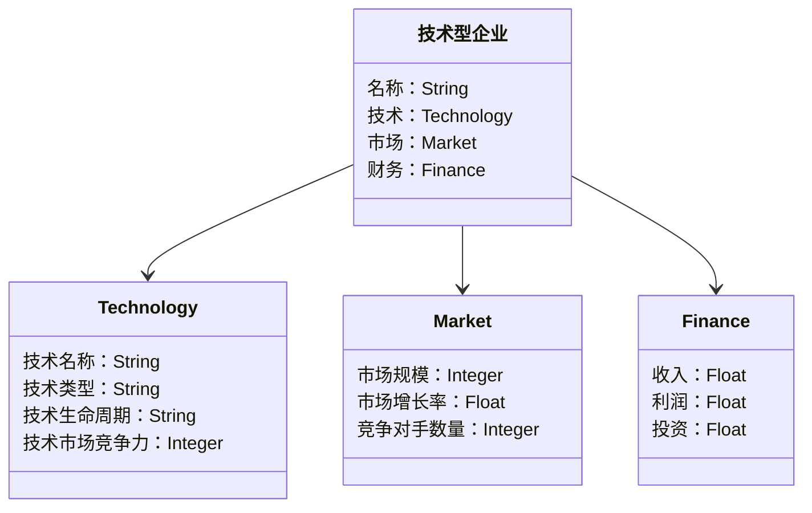
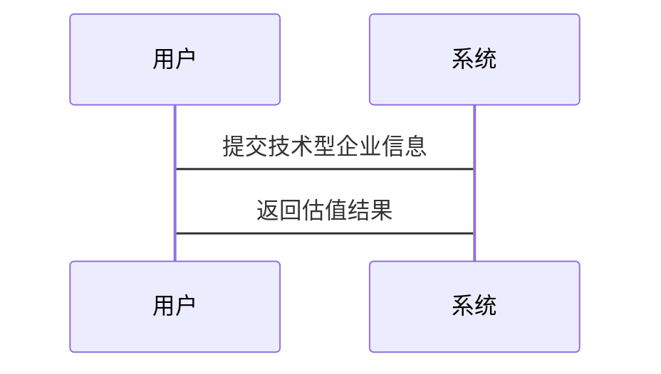

                 


# 技术型企业的特殊估值考虑

## 关键词：技术型企业，特殊估值，DCF模型，可比公司法，技术生命周期

## 摘要：  
技术型企业由于其高度依赖技术创新和知识产权，其估值具有特殊性。本文从技术型企业的定义、特殊性出发，详细探讨了技术型企业估值的核心概念、算法原理、系统架构设计及项目实战。通过DCF模型和可比公司法的对比分析，结合Python代码实现，深入讲解了技术型企业估值的数学模型和流程。最后，通过实际案例分析，总结了技术型企业估值的最佳实践和注意事项。

---

## 第1章：技术型企业的定义与特殊性

### 1.1 技术型企业的定义

#### 1.1.1 技术型企业的核心特征
- 技术型企业是指以技术创新为核心驱动力的企业，通常涉及软件开发、人工智能、大数据等领域。
- 技术型企业依赖知识产权，其价值往往体现在无形资产上。
- 技术型企业具有高成长性和高风险性，其成功与否取决于技术创新和市场应用能力。

#### 1.1.2 技术型企业与传统企业的区别
- 传统企业主要依赖于实体经济和有形资产，而技术型企业依赖于技术、知识和创新能力。
- 技术型企业的市场价值更多地体现在未来的盈利能力和技术的潜在价值，而传统企业的价值更多体现在当前的资产和收益。

#### 1.1.3 技术型企业面临的特殊问题
- 技术型企业需要考虑技术的生命周期，技术的更新迭代速度快，容易被替代。
- 技术型企业需要面对市场竞争的不确定性，技术优势可能迅速被竞争对手模仿或超越。
- 技术型企业需要考虑技术的可量化性和市场接受度，技术的价值往往难以直接量化。

---

### 1.2 技术型企业的特殊性

#### 1.2.1 技术创新的核心地位
- 技术创新是技术型企业的核心驱动力，企业的价值往往取决于技术的先进性和市场竞争力。
- 技术创新需要大量的研发投入，技术型企业通常需要投入大量的资金和资源用于技术研发。

#### 1.2.2 技术型企业的高成长性
- 技术型企业通常具有较高的成长性，尤其是在人工智能、大数据等领域，技术的广泛应用可以带来指数级增长。
- 技术型企业的市场潜力巨大，随着技术的不断进步和应用，企业的收入和利润有望快速增长。

#### 1.2.3 技术型企业的高风险性
- 技术型企业的技术可能面临快速迭代和被替代的风险，技术的生命周期较短，企业的市场地位可能迅速变化。
- 技术型企业的研发投入较大，但如果技术无法商业化或市场接受度低，企业可能面临较大的财务风险。

---

### 1.3 技术型企业估值的背景

#### 1.3.1 技术型企业估值的重要性
- 技术型企业估值是企业融资、并购和上市的重要前提，准确的估值可以帮助企业制定合理的战略决策。
- 技术型企业估值是投资者评估企业价值的重要依据，可以帮助投资者做出理性的投资决策。

#### 1.3.2 技术型企业估值的难点
- 技术型企业价值的不确定性：技术的市场价值难以准确量化，技术的未来收益具有较大的不确定性。
- 技术型企业的研发投入高：技术型企业需要大量的研发投入，研发投入的回报具有较大的不确定性。
- 技术型企业的市场风险高：技术型企业的市场风险较高，技术的快速变化和市场竞争的不确定性增加了估值的难度。

#### 1.3.3 技术型企业估值的现状
- 随着技术的快速发展，技术型企业估值的需求日益增长，尤其是在人工智能、大数据等领域。
- 技术型企业估值的方法和工具也在不断进步，尤其是基于大数据和人工智能的估值模型的应用越来越广泛。

---

## 第2章：技术型企业估值的核心概念与联系

### 2.1 技术型企业估值的原理

#### 2.1.1 估值的基本原理
- 估值的基本原理是通过分析企业的未来现金流和市场价值，确定企业的当前价值。
- 技术型企业估值需要考虑技术的未来收益和市场潜力，尤其是在技术生命周期的不同阶段，技术的价值可能会有很大的变化。

#### 2.1.2 技术型企业的特殊估值方法
- 技术型企业的估值需要考虑技术的市场竞争力、技术的生命周期、技术的可量化性等因素。
- 技术型企业估值需要结合定量分析和定性分析，尤其是需要考虑技术的未来收益和市场潜力。

---

### 2.2 技术型企业估值的核心要素

#### 2.2.1 技术的可量化性
- 技术的可量化性是指技术的价值可以通过具体的指标和数据进行量化评估。
- 技术的可量化性是技术型企业估值的基础，只有能够量化技术的价值，才能进行准确的估值。

#### 2.2.2 技术的市场竞争力
- 技术的市场竞争力是指技术在市场上的竞争力，包括技术的独特性、技术的先进性、技术的市场接受度等。
- 技术的市场竞争力是技术型企业估值的重要因素，技术的竞争力越强，企业的市场价值越高。

#### 2.2.3 技术的生命周期
- 技术的生命周期是指技术从研发到市场应用，再到被淘汰或被替代的整个过程。
- 技术的生命周期对技术型企业估值有重要影响，尤其是在技术生命周期的不同阶段，技术的价值可能会有很大的变化。

---

### 2.3 技术型企业估值的边界与外延

#### 2.3.1 估值的边界条件
- 估值的边界条件是指在估值过程中需要考虑的限制条件，包括技术的生命周期、市场的接受度、技术的可量化性等。
- 在技术型企业估值中，需要明确估值的边界条件，尤其是在技术生命周期的不同阶段，技术的价值可能会有很大的变化。

#### 2.3.2 估值的外延范围
- 估值的外延范围是指在估值过程中需要考虑的范围，包括技术的市场潜力、技术的未来收益、技术的竞争对手等。
- 技术型企业估值的外延范围越广，估值的准确性越高，尤其是在技术市场潜力较大的情况下，需要考虑更多的外部因素。

#### 2.3.3 估值的适用场景
- 估值的适用场景是指在不同的市场环境下，技术型企业估值的方法和工具可能会有所不同。
- 在技术型企业估值中，需要根据具体的市场环境和企业的实际情况，选择合适的估值方法和工具。

---

## 第3章：技术型企业估值的算法原理

### 3.1 技术型企业估值的数学模型

#### 3.1.1 现金流折现法（DCF模型）

##### DCF模型的基本原理
- DCF模型是一种常用的估值方法，通过预测企业未来的现金流，将其折现到当前时点，以确定企业的当前价值。
- DCF模型的核心是预测企业的未来现金流，并选择合适的折现率。

##### DCF模型的数学公式
$$
\text{企业价值} = \sum_{t=1}^{n} \frac{\text{现金流}_t}{(1 + r)^t}
$$
其中，$r$是折现率，$n$是预测的年数，$\text{现金流}_t$是第$t$年的现金流。

##### DCF模型的应用步骤
1. 预测企业的未来现金流。
2. 选择合适的折现率。
3. 计算未来现金流的现值。
4. 将现值加总，得到企业的当前价值。

##### DCF模型的优缺点
- 优点：DCF模型可以将企业的未来现金流折现到当前时点，帮助企业合理评估企业的当前价值。
- 缺点：DCF模型需要预测企业的未来现金流，具有较大的不确定性，尤其是在技术型企业中，技术的未来收益难以准确预测。

#### 3.1.2 相对估值法（可比公司法）

##### 可比公司法的基本原理
- 可比公司法是通过比较同类企业的市场价值和财务指标，确定企业的相对价值。
- 可比公司法的核心是比较企业的市盈率、市净率等财务指标。

##### 可比公司法的数学公式
$$
\text{目标企业价值} = \frac{\text{可比企业平均市盈率} \times \text{目标企业净利润}}{\text{可比企业平均市盈率}}
$$

##### 可比公司法的应用步骤
1. 确定可比企业。
2. 计算可比企业的平均市盈率或市净率。
3. 计算目标企业的价值。

##### 可比公司法的优缺点
- 优点：可比公司法简单易行，适用于市场数据较为充足的情况下。
- 缺点：可比公司法依赖于可比企业的选择，具有较大的主观性，尤其是在技术型企业中，技术的差异可能导致可比企业难以选择。

#### 3.1.3 综合估值模型

##### 综合估值模型的基本原理
- 综合估值模型是结合现金流折现法和相对估值法的一种综合估值方法。
- 综合估值模型的核心是将两种方法的结果进行加权平均，以得到更准确的估值结果。

##### 综合估值模型的数学公式
$$
\text{综合估值} = \alpha \times \text{DCF估值} + (1 - \alpha) \times \text{可比公司估值}
$$
其中，$\alpha$是DCF估值的权重，通常在0.4到0.6之间。

##### 综合估值模型的应用步骤
1. 计算DCF估值和可比公司估值。
2. 根据实际情况确定DCF估值和可比公司估值的权重。
3. 计算综合估值。

##### 综合估值模型的优缺点
- 优点：综合估值模型结合了两种方法的优势，能够提高估值的准确性。
- 缺点：综合估值模型需要更多的数据和计算，尤其是在技术型企业中，技术的差异可能导致综合估值模型的应用较为复杂。

---

## 第4章：技术型企业估值的系统架构设计

### 4.1 问题场景介绍

#### 4.1.1 技术型企业的估值需求
- 技术型企业通常需要进行估值，以支持企业的融资、并购和上市等战略决策。
- 技术型企业的估值需求具有较强的时效性和针对性，尤其是在技术快速迭代的背景下，企业需要及时了解技术的市场价值。

#### 4.1.2 技术型企业的估值挑战
- 技术型企业的估值需要考虑技术的生命周期、技术的市场竞争力、技术的可量化性等因素。
- 技术型企业的估值需要结合定量分析和定性分析，尤其是在技术生命周期的不同阶段，技术的价值可能会有很大的变化。

### 4.2 系统功能设计

#### 4.2.1 领域模型设计
- 领域模型是系统设计的核心，用于描述系统的功能和数据流。
- 领域模型通常包括企业信息管理、技术评估、市场分析、估值计算等模块。

##### 领域模型的类图


#### 4.2.2 系统架构设计
- 系统架构设计是系统设计的重要部分，用于描述系统的结构和模块之间的关系。
- 系统架构通常包括数据采集、模型构建、结果展示等模块。

##### 系统架构的架构图
```mermaid
archiecture
    title 技术型企业估值系统架构
    client --> 数据采集模块: 提交技术型企业信息
    数据采集模块 --> 数据处理模块: 处理数据
    数据处理模块 --> 模型构建模块: 构建估值模型
    模型构建模块 --> 结果展示模块: 显示估值结果
```

#### 4.2.3 系统接口设计
- 系统接口设计是系统设计的重要部分，用于描述系统与其他系统的交互。
- 系统接口通常包括数据输入接口、模型调用接口、结果输出接口等。

#### 4.2.4 系统交互设计
- 系统交互设计是系统设计的重要部分，用于描述用户与系统之间的交互。
- 系统交互通常包括用户登录、数据提交、结果查询等步骤。

##### 系统交互的交互图


---

## 第5章：技术型企业估值的项目实战

### 5.1 环境安装

#### 5.1.1 安装Python和相关库
- 需要安装Python 3.8或更高版本。
- 安装必要的Python库，如numpy、pandas、scikit-learn等。

#### 5.1.2 安装其他工具
- 安装Jupyter Notebook用于数据可视化和分析。
- 安装Git用于版本控制。

### 5.2 核心代码实现

#### 5.2.1 DCF模型实现
- DCF模型的实现代码如下：
```python
import numpy as np
import pandas as pd

def dcf_valuation(cash_flows, discount_rate):
    present_value = np.sum(cash_flows / (1 + discount_rate)**np.arange(len(cash_flows)))
    return present_value

# 示例数据
cash_flows = [100, 200, 300, 400, 500]
discount_rate = 0.1

valuation = dcf_valuation(cash_flows, discount_rate)
print("DCF估值结果为：", valuation)
```

#### 5.2.2 可比公司法实现
- 可比公司法的实现代码如下：
```python
import pandas as pd

def comparable_companies_valuation(target_profit, comparable_avg_pe, comparable_avg_pb):
    target_valuation_pe = comparable_avg_pe * target_profit
    target_valuation_pb = comparable_avg_pb * target_profit
    return (target_valuation_pe + target_valuation_pb) / 2

# 示例数据
target_profit = 100
comparable_avg_pe = 20
comparable_avg_pb = 15

valuation = comparable_companies_valuation(target_profit, comparable_avg_pe, comparable_avg_pb)
print("可比公司估值结果为：", valuation)
```

### 5.3 项目实战总结

#### 5.3.1 项目小结
- 通过项目实战，我们可以看到技术型企业估值的复杂性和挑战性。
- 技术型企业估值需要结合定量分析和定性分析，尤其是在技术生命周期的不同阶段，技术的价值可能会有很大的变化。

#### 5.3.2 项目经验总结
- 技术型企业估值需要考虑技术的市场竞争力、技术的生命周期、技术的可量化性等因素。
- 技术型企业估值需要结合实际情况，选择合适的估值方法和工具。

---

## 第6章：技术型企业估值的最佳实践

### 6.1 总结与小结

#### 6.1.1 本文总结
- 本文从技术型企业的定义、特殊性出发，详细探讨了技术型企业估值的核心概念、算法原理、系统架构设计及项目实战。
- 通过DCF模型和可比公司法的对比分析，结合Python代码实现，深入讲解了技术型企业估值的数学模型和流程。

#### 6.1.2 注意事项
- 技术型企业估值需要考虑技术的生命周期，技术的市场竞争力，技术的可量化性等因素。
- 技术型企业估值需要结合实际情况，选择合适的估值方法和工具。
- 技术型企业估值需要结合定量分析和定性分析，尤其是在技术生命周期的不同阶段，技术的价值可能会有很大的变化。

### 6.2 拓展阅读

#### 6.2.1 技术型企业估值的其他方法
- 技术型企业的估值还可以采用其他方法，如情景分析法、风险中性定价法等。
- 技术型企业的估值还可以结合市场趋势和行业分析，以提高估值的准确性。

#### 6.2.2 技术型企业估值的未来趋势
- 随着人工智能和大数据技术的发展，技术型企业估值的方法和工具将更加智能化和自动化。
- 技术型企业估值的未来趋势是更加注重技术的市场竞争力和未来的收益潜力，尤其是在技术生命周期的不同阶段，技术的价值可能会有很大的变化。

---

## 作者：AI天才研究院/AI Genius Institute & 禅与计算机程序设计艺术 /Zen And The Art of Computer Programming

---

通过以上思考步骤，我们可以系统地撰写出一篇关于《技术型企业的特殊估值考虑》的技术博客文章，涵盖技术型企业的特殊性、估值的核心概念、算法原理、系统架构设计及项目实战等内容，帮助读者全面理解技术型企业的特殊估值问题。

