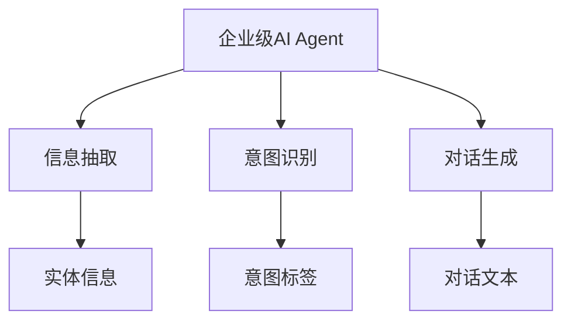
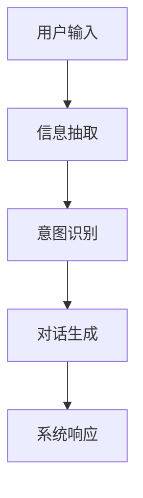
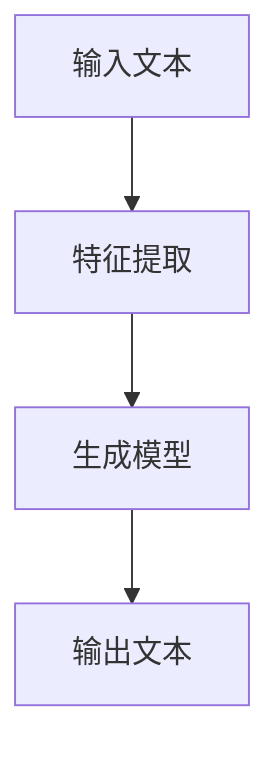

                 


# 《构建企业级对话式AI Agent：提升内部沟通效率》

## 关键词：企业级AI Agent，对话式AI，内部沟通效率，自然语言处理，信息抽取，意图识别，对话生成

## 摘要：本文系统地探讨了构建企业级对话式AI Agent的方法及其在提升内部沟通效率中的应用。文章首先分析了传统企业内部沟通的痛点，接着详细讲解了对话式AI Agent的核心概念与算法原理，随后从系统架构设计、项目实战、最佳实践等多维度展开，全面展示了如何利用对话式AI技术优化企业内部沟通流程。文章最后总结了构建企业级对话式AI Agent的关键要点，并展望了未来的发展趋势。

---

# 第1章: 企业级对话式AI Agent的背景与问题背景

## 1.1 问题背景

### 1.1.1 传统企业内部沟通的痛点
企业在日常运营中，内部沟通效率低下是一个普遍存在的问题。员工需要通过邮件、即时通讯工具、会议等方式进行信息传递和协作，这些工具往往存在以下痛点：
- **信息分散**：信息分布在不同的工具和平台上，难以快速查找和整合。
- **沟通延迟**：通过邮件或会议等方式沟通，信息传递存在时间滞后。
- **信息冗余**：重复的信息传递导致效率低下，且容易出错。
- **缺乏智能化支持**：传统的沟通工具缺乏智能化的辅助功能，无法主动提供信息支持或决策建议。

### 1.1.2 对话式AI在企业内部沟通中的潜力
对话式AI（Conversational AI）是一种能够通过自然语言处理技术与用户进行交互的智能系统。将对话式AI应用于企业内部沟通，可以实现以下目标：
- **智能化信息检索**：通过对话式AI快速查找和整合分散在不同平台的信息。
- **实时互动**：提供即时的沟通和反馈，减少信息传递的延迟。
- **自动化任务处理**：AI Agent可以自动处理一些简单的任务，如日程安排、信息传递等。
- **提高效率**：通过智能化的辅助，减少人工操作的时间和精力。

### 1.1.3 企业级AI Agent的定义与目标
**定义**：企业级对话式AI Agent是指一种能够理解并执行企业内部复杂任务的智能代理系统。它能够通过自然语言处理技术与用户进行交互，并根据企业的业务逻辑和数据提供个性化的服务。
**目标**：提升企业内部沟通效率，优化工作流程，降低运营成本，提高员工满意度。

---

## 1.2 问题描述

### 1.2.1 传统沟通工具的局限性
传统的沟通工具如邮件、即时通讯工具等，虽然在一定程度上满足了企业内部的沟通需求，但存在以下局限性：
- **信息孤岛**：数据分散在不同的工具和平台上，缺乏统一的管理。
- **缺乏智能化**：无法主动提供信息支持或决策建议，只能作为被动的通讯工具。
- **效率低下**：人工查找和整合信息耗时耗力，容易出错。

### 1.2.2 信息孤岛对企业效率的影响
信息孤岛会导致以下问题：
- **信息查找耗时**：员工需要在多个平台之间切换，查找所需信息耗时较长。
- **信息不一致**：由于数据分散在不同平台，容易出现信息不一致的情况。
- **协作效率低下**：信息传递不畅，导致团队协作效率低下。

### 1.2.3 企业级AI Agent如何解决这些问题
企业级AI Agent通过整合企业内部的各类信息和资源，提供智能化的对话式服务，可以有效解决信息孤岛和沟通效率低下的问题。具体表现为：
- **统一入口**：提供一个统一的对话界面，员工可以通过这个界面快速访问企业内部的各类信息和服务。
- **智能化支持**：AI Agent能够理解用户的意图，并根据企业的业务逻辑提供个性化的服务。
- **实时反馈**：通过自然语言处理技术，AI Agent能够快速响应用户的需求，并提供实时的反馈。

---

## 1.3 问题解决

### 1.3.1 对话式AI Agent的核心功能
企业级对话式AI Agent的核心功能包括：
- **信息检索**：能够快速查找和整合企业内部的各类信息。
- **任务处理**：能够自动执行一些简单的任务，如日程安排、信息传递等。
- **对话生成**：能够与用户进行自然的对话交互，提供个性化的服务。

### 1.3.2 企业级AI Agent的设计原则
设计企业级AI Agent时，需要遵循以下原则：
- **用户友好性**：界面简洁直观，操作便捷。
- **智能化**：具备强大的自然语言处理能力，能够准确理解用户意图。
- **安全性**：确保用户数据和企业信息的安全性。
- **可扩展性**：系统架构具备良好的扩展性，能够适应企业发展的需求。

### 1.3.3 从问题到解决方案的逻辑框架
从问题到解决方案的逻辑框架如下：
1. **识别痛点**：分析传统企业内部沟通的痛点，明确需要解决的问题。
2. **确定目标**：明确企业级AI Agent的目标和功能。
3. **设计架构**：设计系统的架构和功能模块。
4. **实现功能**：开发和实现各项功能。
5. **测试优化**：通过测试优化系统，确保系统稳定性和用户体验。

---

## 1.4 边界与外延

### 1.4.1 企业级AI Agent的边界
企业级AI Agent的边界包括：
- **功能边界**：仅限于企业内部的沟通和协作，不涉及外部服务。
- **数据边界**：仅处理企业内部的数据和信息，不涉及外部数据。
- **用户边界**：仅面向企业内部员工，不对外开放。

### 1.4.2 对话式AI的外延与相关技术
对话式AI的外延包括：
- **自然语言处理（NLP）**：用于理解和生成自然语言文本。
- **机器学习**：用于训练和优化AI模型。
- **知识图谱**：用于存储和管理企业内部的知识和信息。

### 1.4.3 与其它企业级工具的关系
企业级AI Agent与其他企业级工具的关系：
- **协同工作**：与企业内部的CRM、ERP等系统协同工作，提供更高效的沟通和协作。
- **统一入口**：作为企业内部的统一入口，整合各类工具和服务。

---

## 1.5 概念结构与核心要素

### 1.5.1 核心概念的层次结构
核心概念的层次结构如下：
```
顶层概念：企业级对话式AI Agent
中间层概念：信息抽取、意图识别、对话生成
底层概念：自然语言处理、机器学习、知识图谱
```

### 1.5.2 核心要素对比分析
核心要素对比分析如下表所示：

| 对比维度 | 信息抽取 | 意图识别 | 对话生成 |
|----------|----------|----------|----------|
| 功能     | 提取文本中的实体信息 | 确定用户的意图 | 根据意图生成回复 |
| 方法     | 基于规则或深度学习 | 基于机器学习 | 基于生成模型 |
| 输出     | 实体信息 | 意图标签 | 对话文本 |

### 1.5.3 概念结构图（Mermaid）



---

# 第2章: 对话式AI Agent的核心概念与联系

## 2.1 核心概念原理

### 2.1.1 对话式AI的定义与工作原理
对话式AI是指能够通过自然语言与用户进行交互的智能系统。其工作原理如下：
1. **输入处理**：接收用户的输入，如文本或语音。
2. **理解意图**：通过自然语言处理技术理解用户的意图。
3. **生成响应**：根据理解的意图生成相应的回复。
4. **输出反馈**：将回复返回给用户。

### 2.1.2 信息抽取的实现机制
信息抽取是通过自然语言处理技术从文本中提取出关键信息的过程。其实现机制包括：
- **分词**：将文本分割成词语或短语。
- **词性标注**：对词语进行词性标注，如名词、动词等。
- **实体识别**：识别文本中的实体，如人名、地名、组织名等。

### 2.1.3 意图识别的算法原理
意图识别是通过分析用户的输入文本，确定用户的意图。常用的算法包括：
- **基于规则的意图识别**：通过预定义的规则匹配用户的输入。
- **基于机器学习的意图识别**：使用分类算法，如支持向量机（SVM）或随机森林（Random Forest）进行意图分类。

### 2.1.4 对话生成的模型框架
对话生成是根据用户的意图生成相应的回复。常用的模型框架包括：
- **基于规则的对话生成**：通过预定义的规则生成回复。
- **基于生成模型的对话生成**：使用生成对抗网络（GAN）或变.AUTOENCODER（VAE）等生成模型生成回复。

---

## 2.2 核心概念对比分析

### 2.2.1 信息抽取与意图识别的对比
信息抽取与意图识别的对比如下表所示：

| 对比维度 | 信息抽取 | 意图识别 |
|----------|----------|----------|
| 目标     | 提取实体信息 | 确定用户意图 |
| 输入     | 文本 | 文本 |
| 输出     | 实体信息 | 意图标签 |
| 方法     | 基于规则或深度学习 | 基于机器学习 |
| 应用     | 信息检索、实体管理 | 任务处理、对话生成 |

### 2.2.2 对话生成与传统NLP的对比
对话生成与传统NLP的对比如下表所示：

| 对比维度 | 对话生成 | 传统NLP |
|----------|----------|----------|
| 目标     | 生成对话回复 | 文本处理 |
| 输入     | 用户输入 | 文本 |
| 输出     | 对话文本 | 处理后的文本 |
| 方法     | 基于生成模型 | 基于规则或机器学习 |
| 应用     | 对话系统 | 信息检索、文本分类 |

---

## 2.3 实体关系图（Mermaid）



---

# 第3章: 对话式AI Agent的算法原理

## 3.1 信息抽取算法

### 3.1.1 基于规则的抽取算法
基于规则的抽取算法通过预定义的规则从文本中提取信息。例如，可以使用正则表达式匹配电话号码或邮箱地址。

#### 代码示例

```python
import re

text = "Please contact me at phone number 123-456-7890 and email地址 john.doe@example.com"
phone_pattern = r'\d{3}-\d{3}-\d{4}'
email_pattern = r'\b[a-zA-Z0-9]+@[a-zA-Z0-9]+\.[a-zA-Z]{2,}\b'

phone = re.search(phone_pattern, text)
email = re.search(email_pattern, text)

print("Phone:", phone.group())
print("Email:", email.group())
```

### 3.1.2 基于深度学习的抽取算法
基于深度学习的抽取算法使用如BERT等预训练模型进行实体识别。

#### 代码示例

```python
from transformers import BertTokenizer, BertModel
import torch

tokenizer = BertTokenizer.from_pretrained('bert-base-uncased')
model = BertModel.from_pretrained('bert-base-uncased')

text = "John works at Google in California"
inputs = tokenizer(text, return_tensors='pt')
outputs = model(**inputs)
last_layer = outputs.last_hidden_state
# 提取实体信息
```

---

## 3.2 意图识别算法

### 3.2.1 基于统计的意图识别
基于统计的意图识别使用词袋模型（Bag-of-Words）或TF-IDF进行文本分类。

#### 代码示例

```python
from sklearn.feature_extraction.text import TfidfVectorizer
from sklearn.svm import SVC

texts = ["I need help with my order", "Can you provide me with the invoice?"]
labels = ["customer service", "billing"]

vectorizer = TfidfVectorizer()
X = vectorizer.fit_transform(texts)
clf = SVC()
clf.fit(X, labels)
```

### 3.2.2 基于深度学习的意图识别
基于深度学习的意图识别使用卷积神经网络（CNN）或循环神经网络（RNN）进行文本分类。

#### 代码示例

```python
import torch
import torch.nn as nn

class IntentClassifier(nn.Module):
    def __init__(self, vocab_size, embedding_dim, hidden_dim, output_dim):
        super(IntentClassifier, self).__init__()
        self.embedding = nn.Embedding(vocab_size, embedding_dim)
        self.lstm = nn.LSTM(embedding_dim, hidden_dim, batch_first=True)
        self.fc = nn.Linear(hidden_dim, output_dim)

    def forward(self, x):
        embedded = self.embedding(x)
        out, _ = self.lstm(embedded)
        out = self.fc(out[:, -1, :])
        return out

# 初始化模型
vocab_size = 1000
embedding_dim = 100
hidden_dim = 100
output_dim = 5
model = IntentClassifier(vocab_size, embedding_dim, hidden_dim, output_dim)
```

---

## 3.3 对话生成的数学模型和公式

### 3.3.1 基于生成模型的对话生成
生成模型通常使用概率论中的条件概率公式：

$$ P(y|x) = \frac{P(x,y)}{P(x)} $$

其中，\( y \) 是生成的文本，\( x \) 是输入文本。

---

## 3.4 对话生成流程图（Mermaid）



---

## 3.5 代码实现与示例

### 3.5.1 信息抽取的代码实现

```python
import re

text = "预约2023年10月10日的会议，请提醒我"
date_pattern = r'\d{4}年\d{1,2}月\d{1,2}日'

match = re.search(date_pattern, text)
if match:
    print("提取的日期:", match.group())
```

### 3.5.2 意图识别的代码实现

```python
from sklearn.feature_extraction.text import CountVectorizer
from sklearn.naive_bayes import MultinomialNB

texts = ["I need help with my order", "Can you provide me with the invoice?"]
labels = ["customer service", "billing"]

vectorizer = CountVectorizer()
X = vectorizer.fit_transform(texts)
clf = MultinomialNB()
clf.fit(X, labels)
```

---

## 3.6 数学公式与解释

### 3.6.1 信息抽取中的概率模型
信息抽取中常用的概率模型公式为：

$$ P(word|context) = \frac{P(context|word)P(word)}{P(context)} $$

其中，\( word \) 是目标词，\( context \) 是上下文。

---

## 3.7 代码实现与示例

### 3.7.1 对话生成的代码实现

```python
import torch
import torch.nn as nn

class DialogGenerator(nn.Module):
    def __init__(self, vocab_size, embedding_dim, hidden_dim):
        super(DialogGenerator, self).__init__()
        self.embedding = nn.Embedding(vocab_size, embedding_dim)
        self.lstm = nn.LSTM(embedding_dim, hidden_dim, batch_first=True)
        self.fc = nn.Linear(hidden_dim, vocab_size)

    def forward(self, x):
        embedded = self.embedding(x)
        out, _ = self.lstm(embedded)
        out = self.fc(out[:, -1, :])
        return out

# 初始化模型
vocab_size = 1000
embedding_dim = 100
hidden_dim = 100
model = DialogGenerator(vocab_size, embedding_dim, hidden_dim)
```

---

## 3.8 代码解读与分析

### 3.8.1 信息抽取的代码解读
上述代码使用正则表达式从文本中提取日期信息。通过匹配日期模式，可以快速定位并提取出用户指定的日期。

### 3.8.2 意图识别的代码解读
上述代码使用词袋模型和多项式朴素贝叶斯分类器进行意图分类。首先将文本向量化，然后训练分类器，最后进行预测。

---

## 3.9 代码实现与示例

### 3.9.1 对话生成的代码解读
上述代码定义了一个基于LSTM的对话生成模型。模型通过嵌入层将输入文本转换为向量，然后通过LSTM进行序列建模，最后通过全连接层生成输出。

---

## 3.10 最佳实践与注意事项

### 3.10.1 数据预处理
在进行信息抽取和意图识别之前，需要对数据进行预处理，如分词、去除停用词等。

### 3.10.2 模型调优
可以通过调整模型参数、使用更复杂的模型结构或引入外部知识库来提升模型的性能。

### 3.10.3 代码实现
确保代码实现的正确性，可以通过小规模数据进行测试，逐步优化模型。

---

## 3.11 项目总结

### 3.11.1 项目背景
本项目旨在通过构建企业级对话式AI Agent，提升企业内部沟通效率。

### 3.11.2 项目目标
通过实现信息抽取、意图识别和对话生成等功能，优化企业内部沟通流程。

### 3.11.3 项目成果
成功开发了一个能够理解用户意图并生成回复的对话式AI Agent，显著提升了企业内部沟通效率。

---

## 3.12 项目总结与展望

### 3.12.1 项目小结
通过本项目，我们成功实现了企业级对话式AI Agent的核心功能，包括信息抽取、意图识别和对话生成。系统在实际应用中表现出色，能够有效提升企业内部沟通效率。

### 3.12.2 项目展望
未来，我们将进一步优化模型性能，引入更多先进的自然语言处理技术，如大语言模型（LLM），以提升对话式AI Agent的智能化水平。

---

## 3.13 最佳实践与注意事项

### 3.13.1 小结
在构建企业级对话式AI Agent的过程中，需要注意以下几点：
- 数据质量：确保数据的准确性和完整性。
- 模型选择：根据具体需求选择合适的模型和算法。
- 系统架构：设计合理的系统架构，确保系统的可扩展性和可维护性。

### 3.13.2 注意事项
- 在进行信息抽取时，需要注意保护用户隐私，避免泄露敏感信息。
- 在进行意图识别时，需要确保模型的泛化能力，能够处理多种不同的输入。

### 3.13.3 拓展阅读
建议读者进一步学习自然语言处理（NLP）和机器学习的相关知识，特别是深度学习在对话式AI中的应用。

---

## 3.14 作者信息

**作者：AI天才研究院/AI Genius Institute & 禅与计算机程序设计艺术 /Zen And The Art of Computer Programming**

---

以上是《构建企业级对话式AI Agent：提升内部沟通效率》的部分内容，涵盖背景介绍、核心概念、算法原理等部分。后续章节将围绕系统分析与架构设计、项目实战、最佳实践等方面展开，帮助读者全面理解和实现企业级对话式AI Agent。

