                 


# 构建企业级对话式AI助手：跨部门业务流程自动化

## 关键词：
- 企业级对话式AI
- 跨部门协作
- 业务流程自动化
- 自然语言处理
- 系统架构设计

## 摘要：
本文深入探讨了如何构建企业级对话式AI助手，并通过跨部门业务流程自动化提升企业效率。文章从技术原理、系统架构到项目实战，详细阐述了对话式AI的核心要素，包括自然语言处理、对话管理、知识库构建等，并通过实际案例展示了如何在企业环境中实现高效的跨部门协作。通过系统化的分析与设计，本文为读者提供了构建高效、智能的企业级对话式AI助手的完整解决方案。

---

# 第一部分: 企业级对话式AI助手概述

## 第1章: 对話式AI助手的背景与概念

### 1.1 问题背景
#### 1.1.1 传统企业业务流程的痛点
企业在处理复杂业务流程时，常常面临以下问题：
- **效率低下**：人工处理流程耗时较长，尤其是在跨部门协作时，信息传递不畅。
- **错误率高**：手动操作容易出错，尤其是在处理大量数据时。
- **信息孤岛**：各部门之间数据不共享，导致信息重复录入和资源浪费。

#### 1.1.2 对話式AI助手的提出
对话式AI助手是一种通过自然语言处理（NLP）技术实现人机交互的工具，能够帮助用户快速完成复杂的业务流程。它通过自动化处理信息，减少了人工干预，提高了效率。

#### 1.1.3 跨部门协作的必要性
在企业中，跨部门协作是业务流程自动化的核心。通过对话式AI助手，不同部门可以共享信息、协同工作，从而打破信息孤岛，提升整体效率。

### 1.2 问题描述
#### 1.2.1 业务流程自动化的挑战
业务流程自动化需要解决以下问题：
- **数据孤岛**：各部门之间的数据无法共享，导致重复录入和信息不一致。
- **流程复杂**：复杂的业务流程需要多个部门协同完成，人工操作容易出错。
- **实时性要求**：用户希望在第一时间得到反馈，对系统的实时性要求较高。

#### 1.2.2 对話式AI助手的目标
对话式AI助手的目标是通过自然语言处理技术，帮助用户快速完成复杂的业务流程，实现跨部门协作，提升效率。

#### 1.2.3 跨部门协作的核心问题
跨部门协作的核心问题是信息共享和流程打通。通过对话式AI助手，不同部门可以通过统一的平台完成信息传递和任务协作。

### 1.3 问题解决
#### 1.3.1 对話式AI助手的解决方案
对话式AI助手通过以下方式解决业务流程自动化的问题：
- **自然语言处理**：通过NLP技术，识别用户的意图并生成相应的回复。
- **跨部门协作**：通过统一的平台，实现各部门之间的信息共享和任务协作。
- **业务流程自动化**：通过自动化处理，减少人工干预，提高效率。

#### 1.3.2 跨部门协作的实现路径
跨部门协作的实现路径包括：
- **建立统一平台**：通过对话式AI助手，建立统一的信息共享平台。
- **流程优化**：优化业务流程，减少不必要的步骤，提高效率。
- **培训与沟通**：通过培训和沟通，确保各部门理解协作的重要性。

#### 1.3.3 业务流程自动化的具体措施
业务流程自动化的具体措施包括：
- **自动化任务分配**：通过AI助手自动分配任务给相关部门。
- **自动化信息传递**：通过AI助手自动传递信息，减少人工操作。
- **自动化反馈**：通过AI助手自动反馈处理结果，提升用户体验。

### 1.4 边界与外延
#### 1.4.1 对話式AI助手的边界
对话式AI助手的边界包括：
- **用户输入**：AI助手只能处理特定的自然语言输入。
- **知识库限制**：AI助手的回答受限于其知识库的内容。
- **处理范围**：AI助手只能处理特定的业务流程，无法处理所有类型的任务。

#### 1.4.2 跨部门协作的范围
跨部门协作的范围包括：
- **数据共享**：各部门之间的数据共享。
- **任务分配**：任务在各部门之间的分配。
- **信息传递**：信息在各部门之间的传递。

#### 1.4.3 业务流程自动化的适用场景
业务流程自动化的适用场景包括：
- **重复性任务**：如数据录入、信息查询等。
- **标准化流程**：如订单处理、客户咨询等。
- **简单任务**：如信息查询、任务分配等。

### 1.5 概念结构与核心要素
#### 1.5.1 对話式AI助手的核心要素
对话式AI助手的核心要素包括：
- **自然语言处理**：识别用户的意图并生成回复。
- **知识库**：存储相关业务知识，用于回答用户问题。
- **对话管理**：管理对话流程，确保任务顺利完成。

#### 1.5.2 跨部门协作的关键要素
跨部门协作的关键要素包括：
- **信息共享**：各部门之间的信息共享。
- **任务分配**：任务在各部门之间的分配。
- **沟通协调**：各部门之间的沟通与协调。

#### 1.5.3 业务流程自动化的主要组成部分
业务流程自动化的组成部分包括：
- **任务分配**：自动分配任务给相关部门。
- **信息传递**：自动传递信息给相关人员。
- **反馈机制**：自动反馈处理结果给用户。

---

## 第2章: 对話式AI助手的核心概念与联系

### 2.1 对話式AI助手的核心原理
#### 2.1.1 自然语言处理（NLP）基础
自然语言处理（NLP）是对话式AI助手的核心技术。NLP技术包括：
- **分词**：将输入的文本分割成词语或短语。
- **词性标注**：对每个词语进行词性标注，如名词、动词等。
- **句法分析**：分析句子的语法结构。
- **语义理解**：理解句子的含义。

#### 2.1.2 对話管理机制
对话管理机制是对话式AI助手的关键部分。它包括：
- **对话状态跟踪**：跟踪对话的当前状态。
- **意图识别**：识别用户的意图。
- **响应生成**：根据对话状态生成合适的回复。

#### 2.1.3 知识库与意图识别
知识库是对话式AI助手的重要组成部分。知识库包括：
- **FAQ库**：常见问题及答案。
- **业务知识库**：业务相关的知识。
- **对话历史**：记录用户的对话历史。

意图识别是通过分析用户的输入，识别用户的意图。例如，用户输入“我需要请假”，系统识别用户的意图是“请假申请”。

### 2.2 对話式AI助手的关键特性
#### 2.2.1 实时性
对话式AI助手需要实时响应用户的输入，确保用户体验流畅。

#### 2.2.2 跨部门协作能力
对话式AI助手需要能够处理跨部门的任务协作，例如将请假申请自动发送到人力资源部门。

#### 2.2.3 可扩展性
对话式AI助手需要能够扩展到更多的业务流程和部门。

### 2.3 核心概念对比表
| 概念 | 描述 | 特性 |
|------|------|------|
| 对話式AI助手 | 通过自然语言处理实现人机交互的工具 | 实时对话、跨部门协作 |
| 跨部门协作 | 不同部门之间的协同工作 | 数据共享、流程打通 |
| 业务流程自动化 | 通过技术手段自动化业务流程 | 提高效率、减少错误 |

### 2.4 实体关系图（ER图）

```mermaid
graph TD
    A[用户] --> B[对话式AI助手]
    B --> C[业务系统]
    C --> D[知识库]
    B --> E[意图识别模块]
    B --> F[对话管理模块]
    E --> D
    F --> D
```



---

## 第3章: 对話式AI助手的算法原理

### 3.1 对話式AI助手的算法原理
#### 3.1.1 模型训练过程
对话式AI助手的训练过程包括：
- **预训练**：使用大量的通用文本数据进行预训练，提升模型的语义理解能力。
- **微调**：在预训练的基础上，使用特定业务领域的数据进行微调，提升模型的业务理解能力。

#### 3.1.2 对話管理算法
对话管理算法包括：
- **状态跟踪**：记录对话的当前状态。
- **意图识别**：识别用户的意图。
- **响应生成**：根据对话状态生成合适的回复。

#### 3.1.3 模型优化
模型优化包括：
- **损失函数优化**：使用交叉熵损失函数优化模型。
- **优化器选择**：选择合适的优化器，如Adam优化器。

### 3.2 对話式AI助手的数学模型

#### 3.2.1 交叉熵损失函数
交叉熵损失函数用于衡量模型预测值与真实值之间的差异：
$$ L = -\frac{1}{N}\sum_{i=1}^{N} y_i \log p(y_i) + (1 - y_i) \log (1 - p(y_i)) $$

#### 3.2.2 Adam优化器
Adam优化器是一种常用的优化算法，其更新规则为：
$$ m_t = \beta_1 m_{t-1} + (1 - \beta_1)g_t $$
$$ n_t = \beta_2 n_{t-1} + (1 - \beta_2)g_t^2 $$
$$ \theta_{t} = \theta_{t-1} - \frac{\eta}{\sqrt{n_t + \epsilon}} m_t $$

### 3.3 对話式AI助手的实现代码

#### 3.3.1 环境安装
```bash
pip install numpy
pip install tensorflow
pip install transformers
```

#### 3.3.2 核心代码实现
```python
import numpy as np
from transformers import AutoTokenizer, AutoModelForSequenceClassification
import tensorflow as tf

# 加载预训练模型
tokenizer = AutoTokenizer.from_pretrained("bert-base-chinese")
model = AutoModelForSequenceClassification.from_pretrained("bert-base-chinese")

# 定义意图分类
def intent_classification(text):
    inputs = tokenizer.encode_plus(text, return_tensors="tf", padding=True, truncation=True)
    outputs = model(tf.convert_to_tensor(inputs['input_ids']))
    logits = outputs.logits
    predicted_class = tf.argmax(logits, axis=1).numpy()[0]
    return predicted_class

# 示例
text = "我需要请假"
print(intent_classification(text))
```

### 3.4 对話式AI助手的流程图


---

## 第4章: 系统分析与架构设计方案

### 4.1 系统功能设计
#### 4.1.1 领域模型设计


#### 4.1.2 系统架构设计


#### 4.1.3 接口设计
- **输入接口**：接收用户的自然语言输入。
- **输出接口**：返回生成的回复。

### 4.2 项目实战

#### 4.2.1 环境安装
```bash
pip install numpy
pip install tensorflow
pip install transformers
```

#### 4.2.2 核心代码实现
```python
import numpy as np
from transformers import AutoTokenizer, AutoModelForSequenceClassification
import tensorflow as tf

# 加载预训练模型
tokenizer = AutoTokenizer.from_pretrained("bert-base-chinese")
model = AutoModelForSequenceClassification.from_pretrained("bert-base-chinese")

# 定义意图分类
def intent_classification(text):
    inputs = tokenizer.encode_plus(text, return_tensors="tf", padding=True, truncation=True)
    outputs = model(tf.convert_to_tensor(inputs['input_ids']))
    logits = outputs.logits
    predicted_class = tf.argmax(logits, axis=1).numpy()[0]
    return predicted_class

# 示例
text = "我需要请假"
print(intent_classification(text))
```

#### 4.2.3 案例分析
假设用户输入“我需要请假”，系统识别用户的意图是“请假申请”，并将其发送到人力资源部门进行处理。

---

## 第5章: 最佳实践与总结

### 5.1 最佳实践
- **持续优化**：定期更新知识库，提升模型的准确性。
- **用户体验**：注重对话的自然性，避免机械化的回复。
- **安全与隐私**：确保用户数据的安全与隐私。

### 5.2 小结
对话式AI助手是企业实现跨部门协作和业务流程自动化的有力工具。通过自然语言处理技术和系统化的架构设计，对话式AI助手能够显著提升企业的效率和用户体验。

### 5.3 注意事项
- **数据质量**：确保知识库的数据准确性和完整性。
- **系统稳定性**：确保系统的稳定运行，避免因故障导致服务中断。
- **用户培训**：对用户进行培训，确保他们能够正确使用对话式AI助手。

### 5.4 拓展阅读
- **自然语言处理**：深入学习自然语言处理技术，提升对话式AI助手的准确性。
- **对话管理**：研究对话管理算法，优化对话流程。
- **系统架构**：学习系统架构设计，提升系统的可扩展性和可维护性。

---

## 作者信息

作者：AI天才研究院/AI Genius Institute & 禅与计算机程序设计艺术 /Zen And The Art of Computer Programming

---

# 附录

## 附录A: 环境配置
```bash
pip install numpy
pip install tensorflow
pip install transformers
```

## 附录B: 核心代码实现
```python
import numpy as np
from transformers import AutoTokenizer, AutoModelForSequenceClassification
import tensorflow as tf

# 加载预训练模型
tokenizer = AutoTokenizer.from_pretrained("bert-base-chinese")
model = AutoModelForSequenceClassification.from_pretrained("bert-base-chinese")

# 定义意图分类
def intent_classification(text):
    inputs = tokenizer.encode_plus(text, return_tensors="tf", padding=True, truncation=True)
    outputs = model(tf.convert_to_tensor(inputs['input_ids']))
    logits = outputs.logits
    predicted_class = tf.argmax(logits, axis=1).numpy()[0]
    return predicted_class

# 示例
text = "我需要请假"
print(intent_classification(text))
```

## 附录C: 系统架构图


---

# 结束语

通过本文的详细讲解，读者可以深入了解如何构建企业级对话式AI助手，并通过跨部门业务流程自动化提升企业的效率。对话式AI助手不仅是技术的创新，更是企业数字化转型的重要工具。未来，随着AI技术的不断发展，对话式AI助手将在企业中发挥更大的作用。

