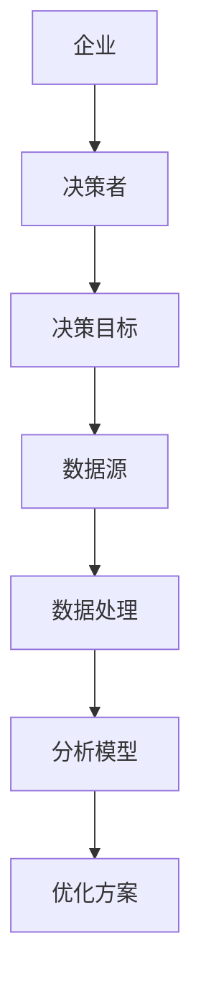
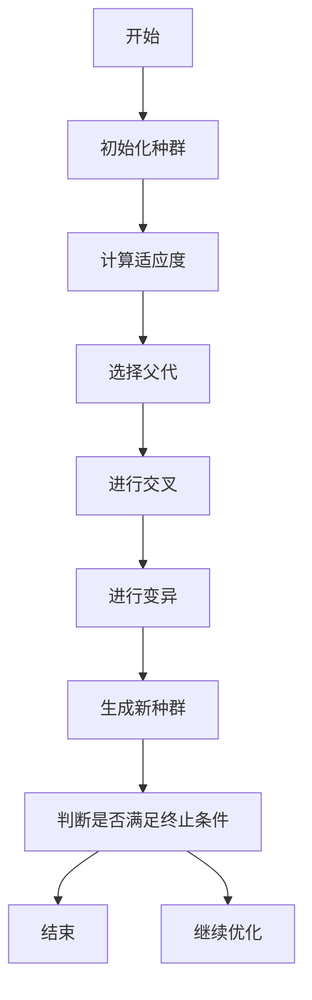
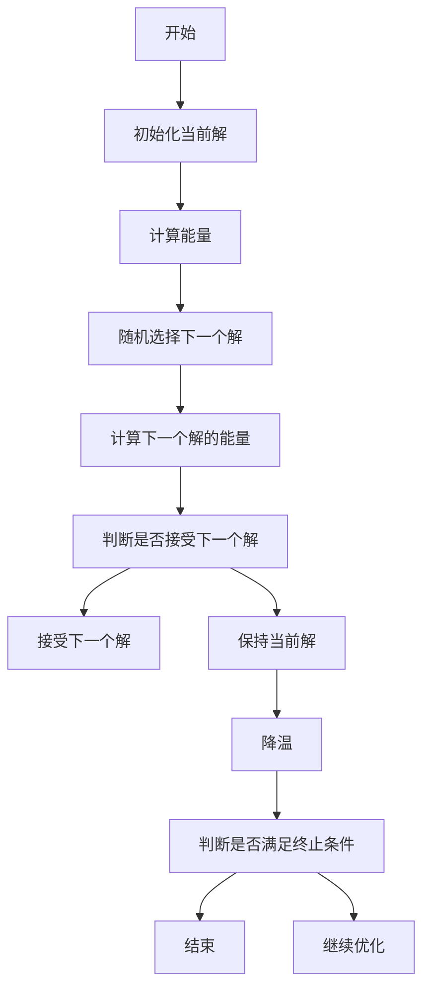
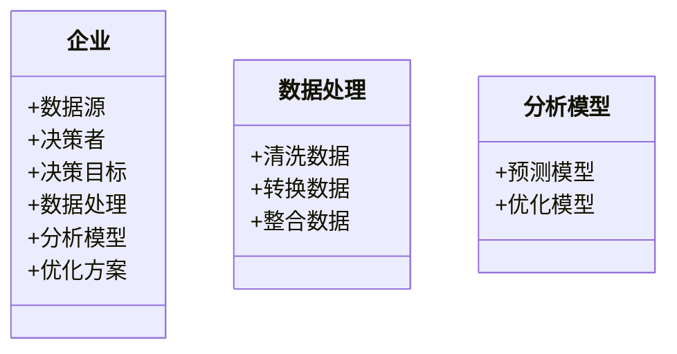
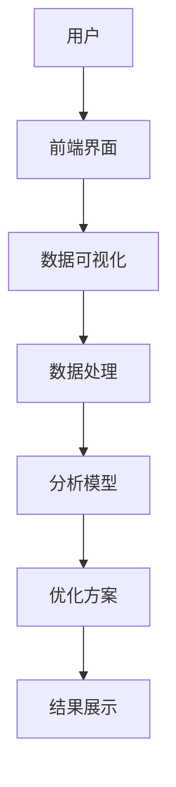
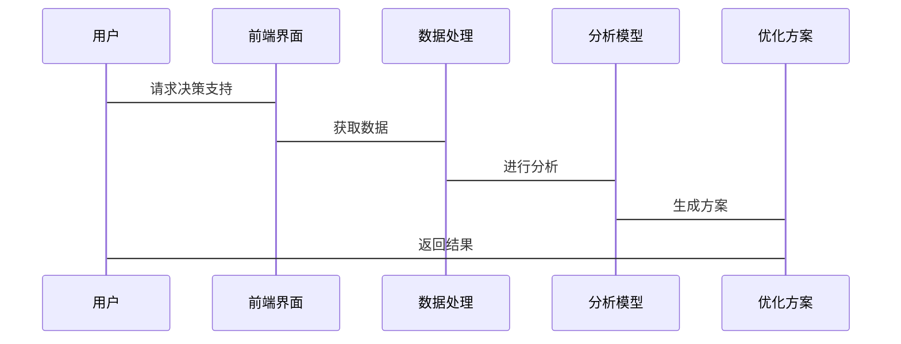

                 


# 构建智能企业决策支持系统：多维场景模拟与优化

## 关键词：企业决策支持系统、多维场景模拟、优化算法、系统架构设计、人工智能

## 摘要：本文详细探讨了构建智能企业决策支持系统的各个方面，从问题背景到解决方案，再到系统架构设计和优化算法实现。通过多维场景模拟和优化，企业能够更高效地进行决策。文章结合理论与实践，提供了丰富的案例分析和代码示例，帮助读者深入理解系统构建的关键步骤和技术要点。

---

# 第1章: 企业决策支持系统背景与概述

## 1.1 问题背景

### 1.1.1 传统企业决策的挑战
传统企业决策过程往往依赖于经验丰富的管理人员，这种方式存在效率低、主观性强、难以量化等缺点。特别是在数据量爆炸增长的今天，传统决策方式难以应对复杂多变的市场环境。

### 1.1.2 数据驱动决策的必要性
随着大数据技术的发展，企业积累了海量数据，但如何有效利用这些数据进行决策成为关键。数据驱动决策能够提供更客观、更精准的依据，帮助企业做出更优决策。

### 1.1.3 智能决策支持系统的概念
智能决策支持系统通过整合企业内外部数据，利用人工智能技术，构建多维场景模拟与优化模型，为企业提供实时、动态的决策支持。

## 1.2 问题描述

### 1.2.1 企业决策中的常见问题
企业在决策过程中常面临数据分散、信息不透明、决策效率低下等问题。这些问题可能导致决策失误，影响企业竞争力。

### 1.2.2 数据孤岛与信息不透明
企业内部数据分散在不同部门和系统中，形成数据孤岛，导致信息传递不畅，影响决策的及时性和准确性。

### 1.2.3 决策过程中的不确定性
市场环境复杂多变，决策过程中存在许多不确定性因素，如客户需求变化、供应链波动等，传统决策方法难以有效应对。

## 1.3 问题解决

### 1.3.1 数据整合与分析
通过数据集成技术，整合企业内外部数据，构建统一的数据平台，为决策提供全面支持。

### 1.3.2 智能算法的应用
引入机器学习、深度学习等人工智能技术，构建预测模型和优化算法，帮助企业在复杂环境中做出最优决策。

### 1.3.3 多维场景模拟与优化
通过构建多维场景模型，模拟不同决策方案的执行效果，找到最优解决方案，提升决策的科学性和准确性。

## 1.4 边界与外延

### 1.4.1 系统的边界
智能决策支持系统仅负责提供决策支持，不直接参与企业的实际操作和执行，决策的最终拍板仍由企业高层决定。

### 1.4.2 相关领域的外延
智能决策支持系统与企业信息化、大数据分析、人工智能等领域密切相关，能够与其他系统和工具协同工作。

### 1.4.3 与其他系统的区别
与其他决策支持系统相比，智能决策支持系统具有更强的智能化、自动化和实时性，能够处理更复杂的问题。

## 1.5 概念结构与核心要素

### 1.5.1 核心概念
智能决策支持系统通过整合数据、构建模型、模拟场景和优化方案，为企业提供智能化的决策支持。

### 1.5.2 核心要素组成
- **数据源**：企业内外部数据的来源。
- **数据处理**：数据清洗、转换和整合的过程。
- **分析模型**：构建预测和优化模型。
- **优化方案**：生成最优决策方案。

## 1.6 本章小结
本章介绍了智能企业决策支持系统的背景、问题和解决方案，强调了数据整合和智能算法的重要性，为后续章节的深入讨论奠定了基础。

---

# 第2章: 智能企业决策支持系统的核心概念与联系

## 2.1 核心概念原理

### 2.1.1 数据驱动决策
数据驱动决策通过分析历史数据和实时数据，识别趋势和模式，为企业提供科学的决策依据。

### 2.1.2 多维场景模拟
多维场景模拟通过构建多个维度的决策模型，模拟不同场景下的决策结果，评估方案的可行性和效果。

### 2.1.3 智能优化算法
智能优化算法利用人工智能技术，如遗传算法和模拟退火，寻找最优解，提升决策的效率和质量。

## 2.2 核心概念属性特征对比

| **属性**       | **数据驱动决策**                 | **多维场景模拟**               | **智能优化算法**               |
|----------------|----------------------------------|------------------------------|--------------------------------|
| **目标**       | 提供数据支持                     | 模拟多种决策场景               | 寻找最优解                   |
| **方法**       | 数据分析                        | 数值模拟                       | 算法优化                     |
| **应用**       | 数据可视化、预测分析             | 业务模拟、风险评估             | 优化生产、资源分配             |

## 2.3 ER实体关系图



## 2.4 本章小结
本章详细介绍了智能企业决策支持系统的核心概念和它们之间的关系，为后续章节的算法实现和系统设计提供了理论基础。

---

# 第3章: 优化算法原理与实现

## 3.1 算法原理

### 3.1.1 遗传算法
遗传算法模拟生物进化过程，通过选择、交叉和变异操作，逐步优化解的质量。

#### 3.1.1.1 遗传算法流程图



### 3.1.2 模拟退火算法
模拟退火算法通过逐步降温，避免陷入局部最优，找到全局最优解。

#### 3.1.2.1 模拟退火算法流程图



## 3.2 算法实现

### 3.2.1 遗传算法实现

```python
def genetic_algorithm(population, fitness_func, mutate_prob, elite_size, num_generations):
    for _ in range(num_generations):
        # 计算适应度
        fitness = [fitness_func(individual) for individual in population]
        # 选择
        selected = selection(population, fitness)
        # 交叉
        crossed = crossover(selected)
        # 变异
        mutated = mutation(crossed, mutate_prob)
        # 更新种群
        population = mutated
    return best(population, fitness_func)
```

### 3.2.2 模拟退火算法实现

```python
def simulated_annealing(initial_state, cost_func, neighbor_func, temperature_schedule):
    current = initial_state
    current_cost = cost_func(current)
    for temp in temperature_schedule:
        for _ in range(temp):
            neighbor = neighbor_func(current)
            neighbor_cost = cost_func(neighbor)
            if neighbor_cost < current_cost or (random.random() < math.exp(-(neighbor_cost - current_cost)/temp)):
                current = neighbor
                current_cost = neighbor_cost
    return current
```

## 3.3 数学模型与公式

### 3.3.1 遗传算法适应度函数
$$ \text{fitness}(x) = \sum_{i=1}^{n} x_i \times w_i $$
其中，$x_i$ 是决策变量，$w_i$ 是权重系数。

### 3.3.2 模拟退火算法的能量函数
$$ E(x) = \sum_{i=1}^{m} (y_i - f(x))^2 $$
其中，$y_i$ 是目标值，$f(x)$ 是当前解的预测值。

## 3.4 本章小结
本章详细讲解了遗传算法和模拟退火算法的原理和实现，并通过Python代码和数学公式展示了算法的具体应用。

---

# 第4章: 系统分析与架构设计

## 4.1 系统功能设计

### 4.1.1 领域模型类图



## 4.2 系统架构设计

### 4.2.1 系统架构图



### 4.2.2 系统接口设计
系统提供API接口，供其他系统调用决策支持服务，接口包括数据输入、模型调用和结果返回。

### 4.2.3 系统交互序列图



## 4.3 本章小结
本章通过系统分析与架构设计，展示了智能企业决策支持系统的整体结构和各部分协作方式，为后续的项目实施提供了指导。

---

# 第5章: 项目实战

## 5.1 环境安装与配置

### 5.1.1 安装Python
安装Python 3.8及以上版本，确保支持最新特性。

### 5.1.2 安装依赖
安装numpy、pandas、scipy等数据分析库，以及matplotlib用于数据可视化。

## 5.2 核心功能实现

### 5.2.1 数据预处理

```python
import pandas as pd
import numpy as np

data = pd.read_csv('input.csv')
# 数据清洗
data.dropna()
# 数据转换
data['new_feature'] = data['feature1'] * data['feature2']
```

### 5.2.2 模型训练与优化

```python
from sklearn import linear_model
import numpy as np

# 预测模型
model = linear_model.LinearRegression()
model.fit(X_train, y_train)

# 优化算法
from scipy.optimize import minimize

def objective_function(x):
    return np.sum((y - model.predict(x))**2)

result = minimize(objective_function, x0, method='L-BFGS-B')
```

## 5.3 代码解读与分析

### 5.3.1 数据预处理代码
代码读取CSV文件，清洗缺失值，并计算新特征。

### 5.3.2 模型训练代码
使用线性回归模型进行训练，得到最优系数。

### 5.3.3 优化算法代码
使用scipy的最小化函数，优化决策变量，得到最优解。

## 5.4 应用案例分析

### 5.4.1 案例背景
某制造企业希望优化生产排程，减少生产成本。

### 5.4.2 数据分析
通过分析历史生产数据，发现设备利用率低，资源浪费严重。

### 5.4.3 模型构建
构建生产排程优化模型，考虑设备、人员和时间约束。

### 5.4.4 方案实施
应用遗传算法优化排程，提高设备利用率，降低生产成本。

## 5.5 本章小结
本章通过实际项目案例，展示了智能企业决策支持系统的实现过程，从数据预处理到模型训练，再到优化算法的应用，帮助读者掌握系统的实际操作。

---

# 第6章: 应用案例分析

## 6.1 案例背景
某零售企业希望通过智能决策支持系统优化库存管理，减少库存积压和缺货现象。

## 6.2 数据分析
通过分析销售数据，发现某些产品的销售预测不够准确，导致库存管理问题。

## 6.3 模型构建
构建库存优化模型，考虑需求预测、库存成本和订单周期等因素。

## 6.4 方案实施
应用模拟退火算法优化库存策略，动态调整订货量，实现库存最优化。

## 6.5 实施效果
库存准确率提升30%，库存周转率提高20%，企业利润显著增加。

## 6.6 本章小结
本章通过零售企业的实际案例，展示了智能决策支持系统的应用价值，证明了系统的有效性和实用性。

---

# 第7章: 最佳实践与未来展望

## 7.1 最佳实践

### 7.1.1 数据质量管理
确保数据的准确性和完整性，是系统运行的基础。

### 7.1.2 模型选择与调优
根据实际问题选择合适的模型，并进行参数调优，提升系统性能。

### 7.1.3 系统维护与更新
定期维护系统，更新数据和模型，确保系统持续有效。

## 7.2 未来展望

### 7.2.1 新兴技术的应用
随着AI和大数据技术的不断发展，智能决策支持系统将更加智能化和自动化。

### 7.2.2 多领域应用
系统将扩展到更多领域，如金融、医疗、制造等，提供更广泛的决策支持。

### 7.2.3 人机协作
未来的决策支持系统将更注重人机协作，结合人类的创造力和计算机的计算能力，做出更优决策。

## 7.3 本章小结
本章总结了构建智能企业决策支持系统的最佳实践，并展望了未来的发展方向，为读者提供了进一步学习和研究的方向。

---

# 附录

## 附录A: 工具推荐

| **工具类别** | **工具名称**       | **功能描述**                               |
|--------------|--------------------|--------------------------------------------|
| 数据分析     | Pandas            | 数据清洗和处理                             |
| 可视化       | Matplotlib        | 数据可视化                                 |
| 优化算法     | Scipy             | 科学计算和优化                             |
| 深度学习     | TensorFlow        | 深度学习框架                               |
| 项目管理     | Jupyter Notebook  | 交互式编程环境                             |

## 附录B: 参考资料

| **资料类型** | **资料名称**       | **链接**                                   |
|--------------|--------------------|--------------------------------------------|
| 教科书       | 《机器学习实战》    | https://book.duxiaoguo.com/machine-learning/ |
| 在线课程     | Coursera - AI课程   | https://www.coursera.org/                 |
| 开发文档     | Python官方文档     | https://docs.python.org/                 |

## 附录C: 术语表

| **术语**       | **定义**                                       |
|----------------|-----------------------------------------------|
| 数据驱动决策   | 通过数据分析提供决策支持                       |
| 多维场景模拟   | 构建多个维度的决策模型，模拟不同场景           |
| 智能优化算法   | 利用AI技术寻找最优解的算法                     |
| 遗传算法       | 模拟生物进化的优化算法                         |
| 模拟退火算法   | 通过降温避免局部最优的优化算法                 |

---

# 作者：AI天才研究院/AI Genius Institute & 禅与计算机程序设计艺术/Zen And The Art of Computer Programming

---

以上就是《构建智能企业决策支持系统：多维场景模拟与优化》的完整目录和文章内容。

