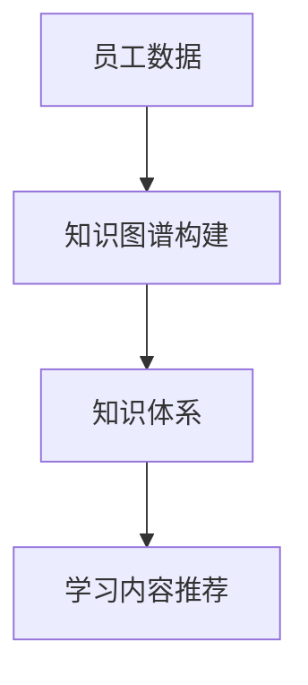
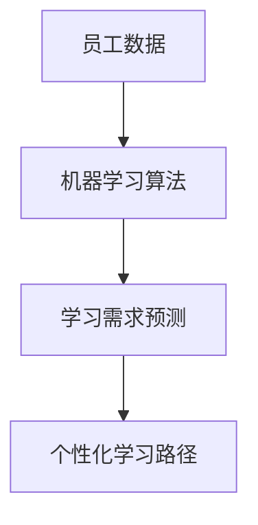
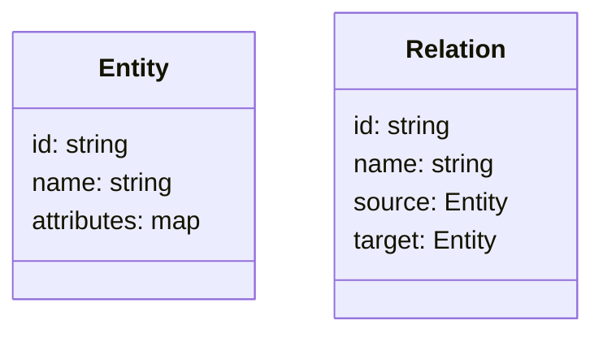
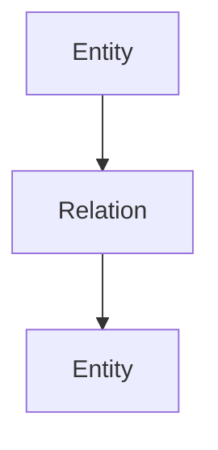
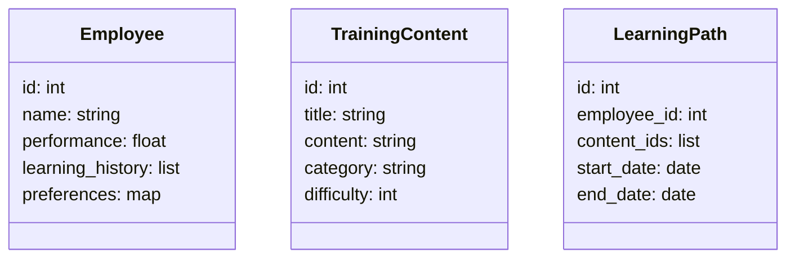
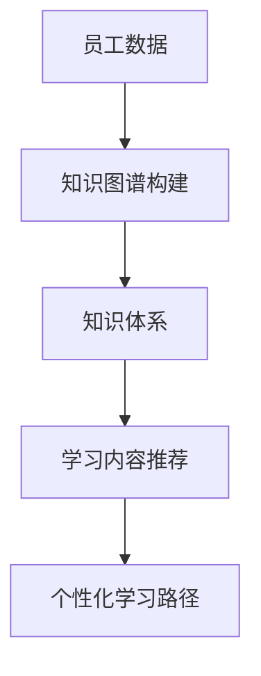

                 


# 构建智能企业培训系统：AI个性化学习路径

**关键词：** AI, 个性化学习路径, 企业培训系统, 机器学习, 知识图谱, 学习效果评估

**摘要：**  
本文探讨如何利用人工智能技术构建智能企业培训系统，特别是通过AI实现个性化学习路径的设计与优化。文章首先分析传统企业培训的痛点，提出基于AI的解决方案，然后详细介绍AI在个性化学习路径中的核心算法与实现原理，包括机器学习、知识图谱等技术。接着，文章从系统架构设计的角度，分析智能企业培训系统的整体框架及其关键模块的交互流程。最后，通过实际案例展示如何将这些技术应用于企业培训系统，并总结系统设计中的最佳实践和未来发展方向。

---

# 第一部分: 背景与概念

# 第1章: 企业培训系统概述

## 1.1 问题背景

### 1.1.1 传统企业培训的痛点
传统的企业培训系统普遍存在以下问题：
- 培训内容千篇一律，无法满足员工的个性化需求。
- 培训效果难以量化，缺乏科学的评估方法。
- 培训资源分散，难以高效整合和利用。
- 员工学习动力不足，参与度低。

### 1.1.2 个性化学习需求的兴起
随着企业对员工能力要求的提高，员工希望获得个性化的学习体验。个性化学习需求的兴起主要体现在以下几个方面：
- 根据员工的职业发展路径推荐学习内容。
- 根据员工的学习风格和能力水平调整学习节奏。
- 提供实时的学习反馈和个性化建议。

### 1.1.3 AI技术在企业培训中的应用潜力
AI技术为企业培训系统带来了革命性的变化。通过自然语言处理、机器学习等技术，企业可以实现：
- 基于员工绩效数据和学习行为分析的个性化学习路径设计。
- 自动化推荐适合员工的知识点和学习资源。
- 实时监控学习效果并提供个性化反馈。

## 1.2 问题描述

### 1.2.1 传统培训系统的问题
传统企业培训系统存在以下主要问题：
- 培训内容缺乏针对性，员工学习效率低。
- 培训效果难以量化，难以证明培训的投资回报。
- 培训资源分散，难以高效管理。

### 1.2.2 学员个性化需求与培训内容的匹配问题
学员的个性化需求与培训内容的匹配问题主要体现在：
- 员工有不同的职业发展目标，需要个性化的学习路径。
- 不同员工的学习能力和兴趣点不同，需要个性化的学习内容。
- 员工的学习进度和风格不同，需要个性化的学习节奏。

### 1.2.3 培训效果评估的挑战
培训效果评估的挑战主要在于：
- 如何量化培训的效果。
- 如何将培训效果与员工绩效提升联系起来。
- 如何通过数据驱动的方式优化培训策略。

## 1.3 问题解决

### 1.3.1 AI技术如何解决个性化学习路径问题
AI技术可以通过以下方式解决个性化学习路径问题：
- 利用机器学习算法分析员工的学习数据，预测员工的学习需求。
- 通过知识图谱构建企业知识体系，推荐适合员工的学习内容。
- 根据员工的学习行为和反馈，动态调整学习路径。

### 1.3.2 数据驱动的培训内容推荐机制
数据驱动的培训内容推荐机制可以通过以下步骤实现：
1. 收集员工的绩效数据、学习记录和行为数据。
2. 利用机器学习算法分析数据，提取员工的能力水平和学习偏好。
3. 根据分析结果推荐适合员工的学习内容和资源。

### 1.3.3 基于AI的培训效果评估与反馈
基于AI的培训效果评估与反馈可以通过以下方式实现：
- 利用自然语言处理技术分析员工的学习反馈。
- 通过机器学习算法预测员工的学习效果。
- 根据预测结果优化培训策略。

## 1.4 智能企业培训系统的边界与外延

### 1.4.1 系统的边界
智能企业培训系统的边界主要体现在：
- 系统只关注员工的学习过程和效果，不涉及企业的其他业务系统。
- 系统的核心功能是提供个性化学习路径和学习资源推荐。

### 1.4.2 系统的外延与扩展性
智能企业培训系统的外延与扩展性主要体现在：
- 系统可以与其他企业系统（如人力资源管理系统）集成。
- 系统可以根据企业的具体需求进行功能扩展。

## 1.5 核心概念与组成

### 1.5.1 核心概念
智能企业培训系统的核心概念包括：
- **个性化学习路径**：根据员工的个性化需求设计的学习计划。
- **知识图谱**：企业知识体系的结构化表示。
- **机器学习算法**：用于分析员工数据和推荐学习内容的技术。

### 1.5.2 概念结构与核心要素
智能企业培训系统的概念结构包括以下核心要素：
- **员工数据**：包括员工的绩效数据、学习记录和行为数据。
- **知识图谱**：企业知识体系的结构化表示，用于推荐学习内容。
- **机器学习算法**：用于分析员工数据和预测学习效果的技术。
- **个性化学习路径**：根据员工数据和知识图谱设计的学习计划。

---

# 第2章: AI与个性化学习的核心概念

## 2.1 AI在企业培训中的应用

### 2.1.1 AI的基本概念
人工智能（AI）是指计算机系统能够执行人类智能任务的能力，如视觉识别、语音识别、决策制定等。

### 2.1.2 AI在企业培训中的具体应用
AI在企业培训中的具体应用包括：
- 利用自然语言处理技术分析培训内容。
- 利用机器学习算法推荐学习内容。
- 利用知识图谱构建企业知识体系。

## 2.2 个性化学习路径的构建

### 2.2.1 个性化学习的定义
个性化学习是指根据学习者的需求、兴趣和能力，提供定制化的学习内容和学习路径。

### 2.2.2 个性化学习路径的构建过程
个性化学习路径的构建过程包括：
1. 收集员工的绩效数据、学习记录和行为数据。
2. 利用机器学习算法分析数据，提取员工的能力水平和学习偏好。
3. 根据分析结果设计个性化学习路径，并推荐适合的学习内容。

### 2.2.3 个性化学习路径的核心要素
个性化学习路径的核心要素包括：
- **员工数据**：员工的绩效数据、学习记录和行为数据。
- **知识图谱**：企业知识体系的结构化表示。
- **机器学习算法**：用于分析员工数据和推荐学习内容的技术。

## 2.3 AI与个性化学习的关系

### 2.3.1 AI如何赋能个性化学习
AI通过以下方式赋能个性化学习：
- 利用机器学习算法分析员工数据，预测员工的学习需求。
- 通过知识图谱推荐适合员工的学习内容。
- 利用自然语言处理技术分析员工的反馈，优化学习路径。

### 2.3.2 个性化学习对AI的需求
个性化学习对AI的需求主要体现在：
- 需要高效的算法来处理大量的员工数据。
- 需要强大的知识图谱来推荐学习内容。
- 需要实时的反馈机制来优化学习路径。

## 2.4 核心概念的对比分析

### 2.4.1 AI技术与传统培训方式的对比
AI技术与传统培训方式的对比如下：

| **方面**       | **AI技术**                     | **传统培训方式**               |
|----------------|-------------------------------|-------------------------------|
| 数据利用       | 高度依赖数据                   | 数据利用有限                   |
| 个性化         | 高度个性化                     | 个性化程度低                   |
| 效率           | 高效                           | 低效                           |
| 反馈           | 实时反馈                       | 延时反馈                       |

### 2.4.2 个性化学习与标准化学习的对比
个性化学习与标准化学习的对比如下：

| **方面**       | **个性化学习**                 | **标准化学习**                 |
|----------------|-------------------------------|-------------------------------|
| 内容定制       | 根据员工需求定制内容           | 内容标准化，不考虑个体差异     |
| 学习节奏       | 根据员工学习进度调整节奏       | 学习节奏固定                   |
| 效果评估       | 根据员工表现动态调整评估标准   | 评估标准统一                   |

## 2.5 核心概念的 mermaid 图

### 2.5.1 知识图谱构建流程图



### 2.5.2 个性化学习路径构建流程图



---

# 第3章: 机器学习算法原理

## 3.1 机器学习基础

### 3.1.1 机器学习的定义与分类
机器学习的定义与分类如下：
- **定义**：机器学习是一种人工智能技术，通过数据训练模型，使其能够从数据中学习并做出预测或决策。
- **分类**：
  - **监督学习**：给定带标签的数据，训练模型进行分类或回归。
  - **无监督学习**：给定无标签的数据，训练模型发现数据中的结构。
  - **强化学习**：通过试错机制，训练模型在环境中做出最优决策。

### 3.1.2 监督学习、无监督学习与强化学习

#### 3.1.2.1 监督学习
监督学习是一种机器学习技术，通过给定带标签的数据，训练模型进行分类或回归。

#### 3.1.2.2 无监督学习
无监督学习是一种机器学习技术，通过给定无标签的数据，训练模型发现数据中的结构。

#### 3.1.2.3 强化学习
强化学习是一种机器学习技术，通过试错机制，训练模型在环境中做出最优决策。

## 3.2 个性化推荐算法

### 3.2.1 基于协同过滤的推荐算法
基于协同过滤的推荐算法通过分析用户的行为数据，找到相似的用户，推荐相似的内容。

#### 3.2.1.1 协同过滤的实现步骤
1. 收集用户的行为数据。
2. 计算用户之间的相似度。
3. 根据相似用户的偏好推荐内容。

### 3.2.2 基于内容的推荐算法
基于内容的推荐算法通过分析内容的特征，推荐与用户兴趣相符的内容。

#### 3.2.2.1 内容推荐的实现步骤
1. 提取内容的特征。
2. 计算内容与用户兴趣的匹配度。
3. 根据匹配度推荐内容。

### 3.2.3 混合推荐算法
混合推荐算法结合协同过滤和内容推荐的优点，通过集成学习的方式提高推荐效果。

#### 3.2.3.1 混合推荐的实现步骤
1. 分别使用协同过滤和内容推荐算法生成推荐列表。
2. 对推荐列表进行加权融合。
3. 输出最终的推荐结果。

## 3.3 算法实现

### 3.3.1 个性化推荐算法的代码实现

```python
import numpy as np

# 示例：基于协同过滤的推荐算法
def collaborative_filtering(user_data, user_id):
    # 计算用户之间的相似度
    user_similarity = np.corrcoef(user_data)
    # 找到与目标用户最相似的其他用户
    similar_users = np.argsort(user_similarity[user_id])[::-1]
    # 根据相似用户的偏好推荐内容
    recommendations = []
    for user in similar_users:
        if user != user_id:
            recommendations.extend(user_data[user])
    return recommendations
```

### 3.3.2 机器学习模型的数学公式

#### 3.3.2.1 线性回归模型
$$
y = \beta_0 + \beta_1x + \epsilon
$$

#### 3.3.2.2 决策树模型
决策树模型通过构建树状结构，对数据进行分类或回归。

#### 3.3.2.3 支持向量机模型
支持向量机模型通过在高维空间中找到一个超平面，将数据分为不同类别。

---

# 第4章: 知识图谱构建与应用

## 4.1 知识图谱的定义与构建

### 4.1.1 知识图谱的定义
知识图谱是一种结构化的知识表示方式，通过节点和边描述实体及其关系。

### 4.1.2 知识图谱的构建步骤
知识图谱的构建步骤包括：
1. 数据采集：收集企业的知识资源。
2. 数据清洗：清理数据中的噪声。
3. 数据建模：构建知识图谱的模型。
4. 数据存储：将知识图谱存储在数据库中。

### 4.1.3 知识图谱的属性特征
知识图谱的属性特征包括：
- **实体**：知识图谱中的基本单元。
- **关系**：实体之间的联系。
- **属性**：实体的特征描述。

## 4.2 知识图谱的 mermaid 图

### 4.2.1 知识图谱的类图



### 4.2.2 知识图谱的架构图



---

# 第5章: 系统分析与架构设计

## 5.1 系统功能设计

### 5.1.1 问题场景介绍
问题场景是构建一个智能企业培训系统，提供个性化的学习路径和学习资源推荐。

### 5.1.2 领域模型类图



## 5.2 系统架构设计

### 5.2.1 系统架构图



### 5.2.2 系统架构的详细说明
系统架构包括以下模块：
1. **员工数据模块**：收集员工的绩效数据、学习记录和行为数据。
2. **知识图谱构建模块**：通过数据挖掘和知识建模技术，构建企业知识图谱。
3. **学习内容推荐模块**：根据员工数据和知识图谱，推荐适合的学习内容。
4. **个性化学习路径模块**：根据推荐的学习内容，设计个性化学习路径。

## 5.3 系统接口与交互设计

### 5.3.1 系统接口设计
系统接口包括：
- **员工数据接口**：提供员工数据的查询和更新功能。
- **知识图谱接口**：提供知识图谱的构建和查询功能。
- **学习内容推荐接口**：提供学习内容的推荐功能。

### 5.3.2 系统交互序列图

```mermaid
sequenceDiagram
actor Employee: 员工
actor System: 系统
Employee -> System: 请求个性化学习路径
System -> Employee: 返回个性化学习路径
```

---

# 第6章: 项目实战

## 6.1 项目环境安装

### 6.1.1 环境要求
- **操作系统**：Linux/MacOS/Windows
- **编程语言**：Python 3.6+
- **依赖库**：numpy, pandas, scikit-learn, networkx

### 6.1.2 安装依赖
```bash
pip install numpy pandas scikit-learn networkx
```

## 6.2 系统核心实现

### 6.2.1 知识图谱构建代码

```python
import networkx as nx

# 示例：知识图谱的构建
def build_knowledge_graph(concepts):
    graph = nx.Graph()
    for concept in concepts:
        graph.add_node(concept)
    for i in range(len(concepts)-1):
        graph.add_edge(concepts[i], concepts[i+1])
    return graph
```

### 6.2.2 个性化推荐代码

```python
from sklearn.metrics.pairwise import cosine_similarity

# 示例：基于协同过滤的推荐算法
def collaborative_filtering(user_matrix):
    similarity_matrix = cosine_similarity(user_matrix)
    return similarity_matrix
```

## 6.3 案例分析与详细解读

### 6.3.1 案例背景
某企业希望构建一个智能培训系统，为员工提供个性化的学习路径。

### 6.3.2 数据准备
收集员工的绩效数据、学习记录和行为数据。

### 6.3.3 知识图谱构建
根据企业知识体系，构建知识图谱。

### 6.3.4 个性化学习路径设计
根据员工数据和知识图谱，设计个性化学习路径。

---

# 第7章: 总结与展望

## 7.1 最佳实践 tips

### 7.1.1 数据质量管理
- 确保数据的准确性和完整性。
- 定期更新数据。

### 7.1.2 系统优化建议
- 提高算法的效率。
- 增强系统的可解释性。

## 7.2 小结
通过本文的探讨，我们可以看到，AI技术在企业培训系统中的应用前景广阔。个性化学习路径的设计不仅能够提高员工的学习效率，还能帮助企业更好地实现人才发展。

## 7.3 注意事项
- 系统设计时要注意数据隐私保护。
- 算法实现时要注意计算效率。

## 7.4 拓展阅读
- 《机器学习实战》
- 《知识图谱：概念、方法与应用》

---

# 作者：AI天才研究院 & 禅与计算机程序设计艺术

