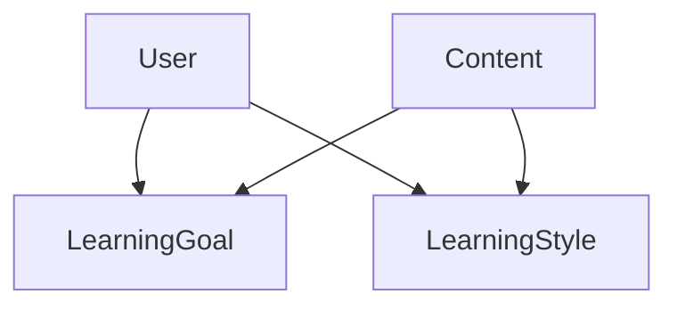
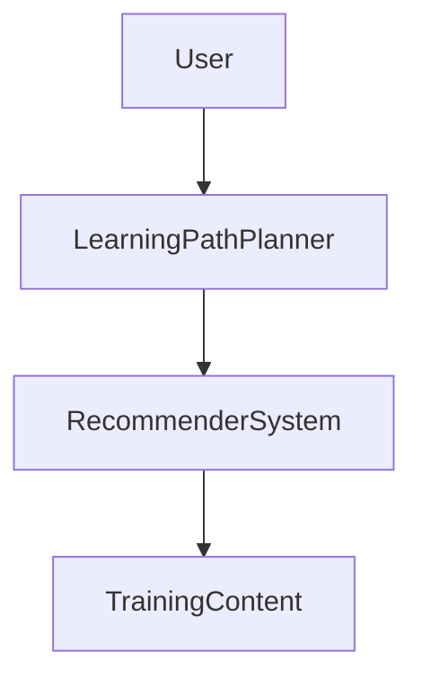

                 


# 构建智能企业培训系统：个性化学习路径与内容推荐

> 关键词：个性化学习路径、内容推荐系统、机器学习、协同过滤、深度学习

> 摘要：随着企业对员工培训需求的日益增长，传统的培训方式已经难以满足个性化学习的需求。本文探讨如何利用人工智能技术构建智能企业培训系统，通过个性化学习路径和内容推荐，提升员工学习效率和企业培训效果。

---

# 第一部分: 智能企业培训系统概述

# 第1章: 个性化学习路径与内容推荐的背景介绍

## 1.1 问题背景

### 1.1.1 传统企业培训的不足

传统的企业培训通常采用统一的培训方案，难以满足员工的个性化需求。员工的知识水平、学习风格和职业发展方向各不相同，统一的培训内容可能导致部分员工学习效率低下，而另一些员工则可能因为内容过浅而感到厌倦。

### 1.1.2 个性化学习需求的兴起

随着企业对员工能力要求的不断提高，员工对个性化学习的需求日益增加。个性化学习路径可以根据员工的实际情况量身定制学习计划，帮助员工更高效地掌握所需技能。

### 1.1.3 智能化培训系统的必要性

人工智能技术的快速发展为个性化学习路径和内容推荐提供了技术支持。通过智能化的培训系统，企业可以更精准地识别员工的学习需求，并推荐合适的学习内容和路径，从而提升培训效果。

## 1.2 问题描述

### 1.2.1 学习者特征分析

员工的学习特征包括知识水平、学习风格、兴趣爱好、工作需求等。这些特征决定了员工适合哪种类型的学习内容和学习方式。

### 1.2.2 培训内容多样性

企业通常提供多种类型的培训内容，包括技术技能、管理能力、软技能等。如何在众多内容中筛选出最适合员工的内容是智能化培训系统的关键。

### 1.2.3 学习效果评估

传统的学习效果评估通常基于考试成绩，无法全面反映员工的实际能力提升。智能化系统可以通过数据分析，评估员工的学习效果，并提供针对性的反馈。

## 1.3 个性化学习路径与内容推荐的目标

### 1.3.1 提高学习效率

通过个性化推荐，员工可以快速找到适合自己的学习内容，避免无效学习，提高学习效率。

### 1.3.2 满足个性化需求

根据员工的实际情况推荐学习内容和路径，满足不同员工的个性化需求。

### 1.3.3 优化企业培训资源

智能化推荐可以帮助企业更合理地分配培训资源，避免资源浪费，提高培训投入的回报率。

## 1.4 本章小结

本章介绍了传统企业培训的不足，提出了个性化学习路径和内容推荐的必要性，并明确了系统的建设目标。

---

# 第2章: 核心概念与联系

## 2.1 个性化学习路径的核心要素

### 2.1.1 学习者特征模型

学习者特征模型包括员工的知识水平、学习风格、职业发展方向等。通过这些特征，系统可以为员工定制个性化学习路径。

### 2.1.2 学习目标分解

学习目标需要分解为具体的子目标，每个子目标对应特定的知识点或技能。通过分解目标，系统可以更清晰地规划学习路径。

### 2.1.3 学习路径规划算法

学习路径规划算法需要根据员工的学习目标和特征，推荐最优的学习顺序和内容组合。

## 2.2 内容推荐系统的原理

### 2.2.1 基于协同过滤的推荐

协同过滤通过分析用户的相似性，推荐相似用户喜欢的内容。例如，如果员工A和员工B在某些方面相似，员工A喜欢的课程也可能是员工B感兴趣的。

### 2.2.2 基于内容的推荐

基于内容的推荐通过分析培训内容的特征，推荐与员工需求匹配的内容。例如，如果员工需要提升编程能力，系统会推荐相关的编程课程。

### 2.2.3 混合推荐模型

混合推荐模型结合了协同过滤和基于内容的推荐，利用两种方法的优势，提高推荐的准确性和多样性。

## 2.3 核心概念对比分析

| 比较维度       | 协同过滤         | 基于内容的推荐       |
|----------------|------------------|----------------------|
| 推荐依据       | 用户相似性       | 内容特征相似性       |
| 优点           | 高准确性         | 内容解释性强         |
| 缺点           | 数据稀疏性问题   | 内容表示困难         |

### 2.3.3 系统架构的可扩展性

系统的架构需要具备可扩展性，能够支持大量用户和内容的接入。通过模块化设计，系统可以灵活扩展。

## 2.4 ER实体关系图



## 2.5 本章小结

本章详细介绍了个性化学习路径和内容推荐的核心概念，分析了不同推荐算法的优缺点，并通过实体关系图展示了系统架构的结构。

---

# 第3章: 算法原理讲解

## 3.1 协同过滤算法

### 3.1.1 协同过滤的原理

协同过滤通过分析用户的行为数据，找到相似的用户群体，推荐相似用户喜欢的内容。

### 3.1.2 协同过滤的实现步骤

1. 数据收集：收集用户的评分数据或行为数据。
2. 相似度计算：使用余弦相似度或欧式距离计算用户相似度。
3. 推荐生成：根据相似用户的偏好，推荐当前用户可能感兴趣的内容。

### 3.1.3 协同过滤的数学模型

$$ sim(u, v) = \frac{\sum_{i} (r_{u,i} - \bar{r}_u)(r_{v,i} - \bar{r}_v)}{\sqrt{\sum_{i} (r_{u,i} - \bar{r}_u)^2} \sqrt{\sum_{i} (r_{v,i} - \bar{r}_v)^2}} $$

其中，$sim(u, v)$ 表示用户 $u$ 和用户 $v$ 的相似度，$\bar{r}_u$ 表示用户 $u$ 的平均评分。

### 3.1.4 协同过滤的Python实现

```python
import numpy as np

def cosine_similarity(user1, user2):
    # 计算用户1和用户2的评分向量
    ratings_user1 = user1.ratings
    ratings_user2 = user2.ratings

    # 计算分子部分
    numerator = np.sum(ratings_user1 * ratings_user2)
    
    # 计算分母部分
    denominator = np.sqrt(np.sum(ratings_user1 ** 2)) * np.sqrt(np.sum(ratings_user2 ** 2))
    
    if denominator == 0:
        return 0.0
    else:
        return numerator / denominator

# 示例
user1 = {'ratings': [4, 3, 5]}
user2 = {'ratings': [4, 3, 2]}
similarity = cosine_similarity(user1, user2)
print(similarity)  # 输出相似度
```

## 3.2 基于内容的推荐算法

### 3.2.1 基于内容的推荐原理

基于内容的推荐通过分析内容的特征，推荐与用户需求匹配的内容。

### 3.2.2 基于内容的推荐实现步骤

1. 内容特征提取：提取内容的关键特征，如关键词、主题标签。
2. 用户需求分析：分析用户的偏好和需求。
3. 内容匹配：根据内容特征和用户需求，推荐匹配度高的内容。

### 3.2.3 基于内容的推荐数学模型

$$ score(c, u) = \sum_{i} w_i \cdot f_i(c, u) $$

其中，$score(c, u)$ 表示内容 $c$ 对用户 $u$ 的评分，$w_i$ 是特征 $f_i$ 的权重。

### 3.2.4 基于内容的推荐Python实现

```python
from sklearn.feature_extraction.text import TfidfVectorizer

# 示例内容
texts = ["Python programming", "machine learning", "data analysis"]

# 提取TF-IDF特征
vectorizer = TfidfVectorizer()
tfidf_matrix = vectorizer.fit_transform(texts)

# 查看特征权重
feature_names = vectorizer.get_feature_names_out()
print(feature_names)
```

## 3.3 混合推荐模型

### 3.3.1 混合推荐模型的原理

混合推荐模型结合了协同过滤和基于内容的推荐，利用两种方法的优势，提高推荐的准确性和多样性。

### 3.3.2 混合推荐模型的实现步骤

1. 分别生成协同过滤推荐和基于内容的推荐。
2. 根据某种策略（如加权）整合两种推荐结果。
3. 输出最终的推荐列表。

### 3.3.3 混合推荐模型的Python实现

```python
def hybrid_recommendation(users, contents):
    # 协同过滤推荐
    collaborative_recommendations = collaborative_filtering(users)
    
    # 基于内容的推荐
    content_recommendations = content_based_recommendation(contents)
    
    # 混合推荐（示例：加权平均）
    hybrid_recommendations = {}
    for c in collaborative_recommendations:
        hybrid_recommendations[c] = collaborative_recommendations[c] * 0.5
    for c in content_recommendations:
        hybrid_recommendations[c] += content_recommendations[c] * 0.5
    
    return hybrid_recommendations

# 示例
users = [user1, user2]
contents = [content1, content2]
recommendations = hybrid_recommendation(users, contents)
print(recommendations)
```

## 3.4 本章小结

本章详细讲解了协同过滤、基于内容的推荐和混合推荐模型的原理、实现步骤和数学模型，并给出了相应的Python代码示例。

---

# 第4章: 数学模型与公式推导

## 4.1 协同过滤的数学模型

### 4.1.1 协同过滤的相似度计算

$$ sim(u, v) = \frac{\sum_{i} (r_{u,i} - \bar{r}_u)(r_{v,i} - \bar{r}_v)}{\sqrt{\sum_{i} (r_{u,i} - \bar{r}_u)^2} \sqrt{\sum_{i} (r_{v,i} - \bar{r}_v)^2}} $$

### 4.1.2 协同过滤的评分预测

$$ \hat{r}_{u,i} = \bar{r}_u + \sum_{j} w_{u,j} (r_{j,i} - \bar{r}_j) $$

其中，$\hat{r}_{u,i}$ 表示用户 $u$ 对物品 $i$ 的预测评分，$w_{u,j}$ 是用户 $u$ 和用户 $j$ 之间的相似度。

## 4.2 基于内容的推荐的数学模型

### 4.2.1 基于内容的推荐的特征表示

$$ f(c) = [f_1(c), f_2(c), \ldots, f_n(c)] $$

其中，$f_i(c)$ 表示内容 $c$ 的第 $i$ 个特征。

### 4.2.2 基于内容的推荐的评分计算

$$ score(c, u) = \sum_{i} w_i \cdot f_i(c, u) $$

## 4.3 混合推荐模型的数学模型

### 4.3.1 混合推荐模型的加权评分

$$ \hat{r}_{u,i} = \alpha \cdot sim(u, i) + (1 - \alpha) \cdot score(c, u) $$

其中，$\alpha$ 是协同过滤的权重，$sim(u, i)$ 是用户 $u$ 和物品 $i$ 的相似度，$score(c, u)$ 是基于内容的评分。

## 4.4 本章小结

本章通过数学公式详细推导了协同过滤、基于内容的推荐和混合推荐模型的实现原理，并给出了相应的公式解释和推导过程。

---

# 第5章: 系统分析与架构设计

## 5.1 问题场景介绍

### 5.1.1 系统目标

系统的目标是为员工提供个性化学习路径和内容推荐，提升培训效果。

### 5.1.2 系统范围

系统需要覆盖员工学习的全过程，包括学习需求分析、学习路径规划、内容推荐和学习效果评估。

## 5.2 系统功能设计

### 5.2.1 用户模块

用户模块负责收集用户信息，包括学习需求、学习风格等。

### 5.2.2 内容模块

内容模块负责管理和分类培训内容，包括技术技能、管理能力等。

### 5.2.3 推荐模块

推荐模块根据用户信息和内容特征，推荐个性化的内容和路径。

## 5.3 系统架构设计

### 5.3.1 系统架构图



### 5.3.2 模块交互流程

1. 用户输入学习需求。
2. 学习路径规划模块分析用户特征。
3. 推荐系统根据用户特征和内容特征，生成推荐列表。
4. 用户选择推荐内容，开始学习。
5. 学习效果评估模块收集反馈，优化推荐算法。

## 5.4 系统接口设计

### 5.4.1 接口描述

- 输入：用户特征、内容特征。
- 输出：推荐列表、学习路径。

### 5.4.2 接口实现

```python
class RecommenderSystem:
    def __init__(self, users, contents):
        self.users = users
        self.contents = contents
    
    def recommend(self, user_id):
        # 推荐逻辑
        pass
```

## 5.5 本章小结

本章详细分析了系统的功能模块和架构设计，展示了各模块之间的交互关系，并给出了推荐系统的接口设计。

---

# 第6章: 项目实战

## 6.1 环境安装

### 6.1.1 安装Python和相关库

```bash
pip install numpy
pip install scikit-learn
pip install mermaid
```

## 6.2 系统核心实现

### 6.2.1 数据预处理

```python
import pandas as pd

# 加载数据
data = pd.read_csv('train.csv')

# 数据清洗
data.dropna()
```

### 6.2.2 模型训练

```python
from sklearn.model_selection import train_test_split
from sklearn.neighbors import NearestNeighbors

# 分割数据
X_train, X_test = train_test_split(data, test_size=0.2)

# 训练模型
model = NearestNeighbors(n_neighbors=5)
model.fit(X_train)
```

### 6.2.3 推荐算法实现

```python
def get_recommendations(user_id):
    # 获取相似用户
    similar_users = model.kneighbors(user_id, n_neighbors=5)
    
    # 推荐内容
    recommendations = []
    for u in similar_users:
        recommendations.extend(contents[u])
    return recommendations
```

## 6.3 代码应用解读与分析

### 6.3.1 数据预处理

数据预处理是确保模型训练效果的重要步骤。通过清洗和转换数据，可以提高模型的准确性和稳定性。

### 6.3.2 模型训练

模型训练是系统的核心部分。通过训练得到的模型能够根据用户特征推荐合适的内容。

### 6.3.3 推荐算法实现

推荐算法的实现是系统的关键。通过相似用户的分析，系统可以推荐用户可能感兴趣的内容。

## 6.4 实际案例分析

### 6.4.1 案例背景

假设一个员工需要提升编程能力，系统根据员工的学习风格和知识水平推荐相关的编程课程。

### 6.4.2 案例分析

通过协同过滤和基于内容的推荐，系统为员工推荐了两门编程课程和相关实践项目，帮助员工快速提升编程能力。

## 6.5 本章小结

本章通过实际案例展示了系统的核心实现，包括数据预处理、模型训练和推荐算法的实现，并分析了实际应用的效果。

---

# 第7章: 总结与展望

## 7.1 本章总结

本文详细探讨了智能企业培训系统的构建，包括个性化学习路径和内容推荐的核心概念、算法原理和系统架构设计。通过实际案例展示了系统的实现和应用效果。

## 7.2 未来展望

随着人工智能技术的不断发展，智能企业培训系统将更加智能化和个性化。未来可以结合自然语言处理和深度学习技术，进一步提升推荐系统的准确性和智能化水平。

## 7.3 注意事项

在实际应用中，需要注意数据隐私和用户反馈，确保系统的安全性和用户体验。

## 7.4 拓展阅读

建议读者进一步阅读相关领域的书籍和论文，深入了解个性化推荐和学习路径规划的最新研究进展。

---

# 作者

作者：AI天才研究院/AI Genius Institute & 禅与计算机程序设计艺术/Zen And The Art of Computer Programming

---

通过以上详细的内容，我们可以看到构建智能企业培训系统是一个复杂而系统的过程，需要结合多种技术手段和方法，才能实现高效的个性化学习路径和内容推荐。

