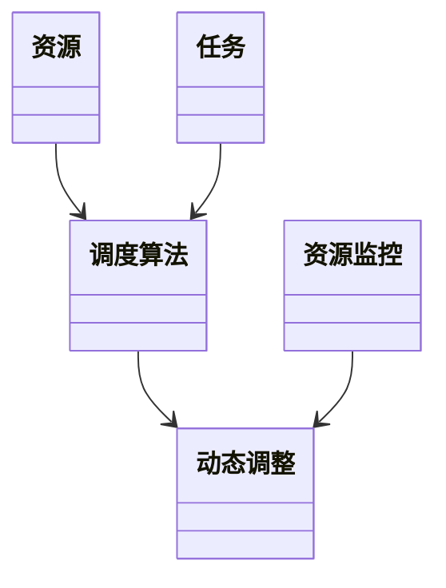
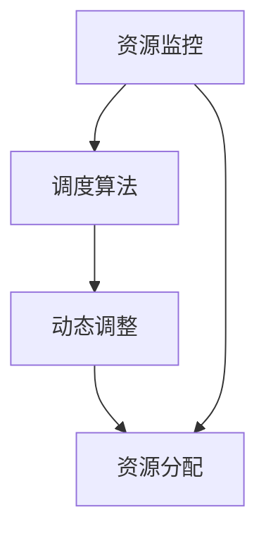
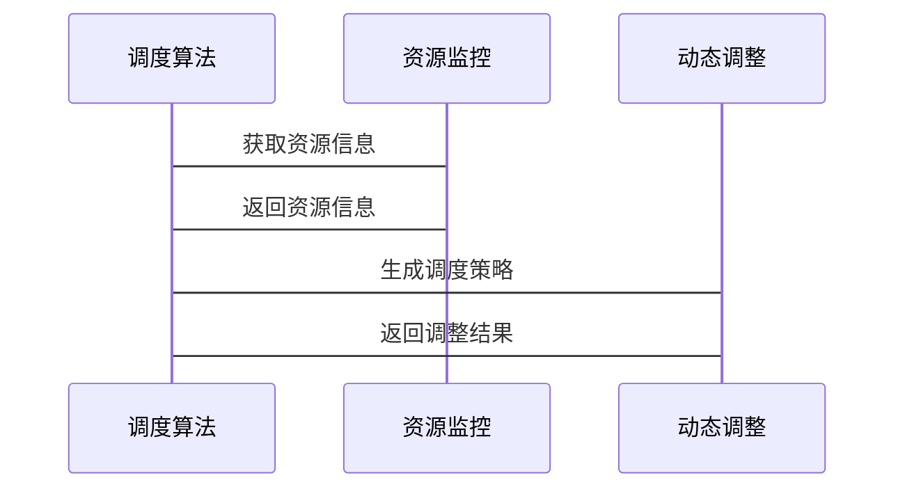

                 


---

# 构建智能企业资源调度系统：AI优化资源分配

## 关键词：智能资源调度系统, AI优化, 资源分配, 强化学习, 遗传算法

## 摘要：  
本文深入探讨了如何利用人工智能技术优化企业资源调度问题。通过分析资源调度的核心概念、算法原理以及系统架构设计，结合实际项目案例，展示了如何利用强化学习和遗传算法等AI技术实现资源的智能分配。文章从理论到实践，详细阐述了构建智能企业资源调度系统的全过程，为读者提供了一套系统化的解决方案。

---

# 第一部分：智能企业资源调度系统背景与概念

## 第1章：智能企业资源调度系统背景与概念

### 1.1 资源调度问题的背景  
资源调度问题广泛存在于企业生产和物流管理等领域。传统的人工调度方式效率低下，难以应对复杂多变的业务需求。随着AI技术的发展，利用智能算法优化资源分配已成为企业提升效率和降低成本的重要手段。

#### 1.1.1 传统资源调度的挑战  
- 资源分配的复杂性：资源种类繁多，需求多样，调度难度大。  
- 人工调度的低效性：依赖经验，难以覆盖所有可能的调度场景。  
- 动态变化的不确定性：市场需求波动、资源可用性变化等增加了调度的难度。

#### 1.1.2 AI技术如何优化资源分配  
- 数据驱动的决策优化：通过历史数据和实时信息，AI能够快速找到最优解。  
- 自适应能力：AI算法能够根据动态变化调整调度策略。  
- 高效性：AI技术可以大幅提高调度效率，降低人工错误率。

#### 1.1.3 智能调度系统的定义与目标  
智能调度系统是一种基于AI技术的自动化资源分配系统，旨在通过优化算法实现资源的高效利用，降低成本，提高企业竞争力。

### 1.2 AI在资源调度中的作用  
AI技术在资源调度中的应用主要体现在以下几个方面：  
- **数据处理**：通过收集和分析大量数据，为调度决策提供支持。  
- **优化算法**：利用强化学习、遗传算法等技术，寻找最优的资源分配方案。  
- **动态调整**：根据实时信息，快速调整调度策略，适应变化的环境。

### 1.3 本章小结  
本章介绍了智能企业资源调度系统的背景和核心概念，分析了传统调度方式的局限性以及AI技术在优化资源分配中的重要作用。

---

# 第二部分：资源调度的核心概念与原理

## 第2章：资源调度的基本原理  

### 2.1 资源调度的基本概念  
资源调度是指对企业的各种资源（如设备、人员、时间等）进行合理分配，以满足任务需求的过程。  

#### 2.1.1 资源的定义与分类  
- **资源的定义**：资源是指企业用于完成任务的各种要素，包括人力、物力、财力等。  
- **资源的分类**：可以分为可再生资源和不可再生资源，动态资源和静态资源等。  

#### 2.1.2 调度任务的类型  
- **单任务调度**：仅涉及单一任务的资源分配问题。  
- **多任务调度**：涉及多个任务的资源分配问题，通常需要考虑任务间的优先级和时间约束。  

#### 2.1.3 调度算法的分类  
- **静态调度算法**：适用于任务需求固定、资源约束不变的场景。  
- **动态调度算法**：适用于任务需求或资源约束动态变化的场景。  
- **混合调度算法**：结合静态和动态调度的特点，适用于复杂的调度场景。  

### 2.2 AI优化资源分配的核心原理  
AI优化资源分配的核心在于通过数据驱动的方式，利用机器学习和优化算法找到最优的资源分配方案。  

#### 2.2.1 优化目标的数学建模  
优化目标通常包括最小化成本、最大化效率、减少资源浪费等。数学建模是将问题转化为可计算的形式。例如，目标函数可以表示为：  
$$ \text{Minimize } C = \sum_{i=1}^{n} c_i x_i $$  
其中，$c_i$ 是资源 $i$ 的成本，$x_i$ 是资源 $i$ 的分配量。

#### 2.2.2 常见调度算法的优缺点对比  
| 算法类型      | 优点                          | 缺点                          |  
|----------------|-------------------------------|-----------------------------|  
| 强化学习      | 能够适应动态环境，学习能力强 | 计算复杂度高，训练时间长       |  
| 遗传算法      | 具有全局搜索能力，适应性强    | 易陷入局部最优，收敛速度慢     |  
| 模拟退火      | 能够跳出局部最优，全局搜索好 | 参数设置敏感，收敛速度慢       |  

#### 2.2.3 AI算法在资源调度中的应用  
AI算法在资源调度中的应用主要体现在以下方面：  
- **任务优先级排序**：通过强化学习算法，根据任务的重要性和紧急性动态调整优先级。  
- **资源分配优化**：利用遗传算法，优化资源分配方案，降低资源浪费。  
- **动态调整**：实时监控资源使用情况，根据变化动态调整调度策略。

### 2.3 资源调度的数学模型  
资源调度的数学模型是优化算法的核心。以下是一个简单的调度问题的数学模型示例：  

**问题描述**：给定 $m$ 个任务和 $n$ 个资源，每个任务需要分配到某个资源上，目标是最小化总成本。  

**目标函数**：  
$$ \text{Minimize } C = \sum_{i=1}^{m} \sum_{j=1}^{n} c_{ij} x_{ij} $$  
其中，$c_{ij}$ 是任务 $i$ 分配到资源 $j$ 的成本，$x_{ij}$ 是 0-1 变量，表示任务 $i$ 是否分配到资源 $j$。  

**约束条件**：  
1. 每个任务必须分配到一个资源：  
$$ \sum_{j=1}^{n} x_{ij} = 1 \quad \forall i = 1, 2, \dots, m $$  
2. 每个资源最多分配 $k$ 个任务：  
$$ \sum_{i=1}^{m} x_{ij} \leq k \quad \forall j = 1, 2, \dots, n $$  

### 2.4 本章小结  
本章详细介绍了资源调度的基本概念和数学建模方法，分析了常见调度算法的优缺点，并探讨了AI算法在资源调度中的应用。

---

# 第三部分：AI优化资源分配的算法原理

## 第3章：强化学习在资源调度中的应用  

### 3.1 强化学习的基本原理  
强化学习是一种通过试错机制来优化决策的算法。  

#### 3.1.1 状态空间与动作空间  
- **状态空间**：系统当前的状态，例如资源的使用情况、任务的优先级等。  
- **动作空间**：可以执行的动作，例如分配资源、调整任务优先级等。  

#### 3.1.2 奖励机制的设计  
奖励机制是强化学习的核心。通过设计合理的奖励函数，可以引导算法学习最优策略。例如：  
- 当资源分配合理时，给予正向奖励；  
- 当资源浪费时，给予负向惩罚。  

#### 3.1.3 策略网络的实现  
策略网络负责根据当前状态生成动作。常用的策略网络包括Q-Learning和Deep Q-Network（DQN）。

### 3.2 资源调度中的强化学习算法  

#### 3.2.1 Q-Learning算法  
Q-Learning是一种经典的强化学习算法，适用于离散动作空间。其更新公式为：  
$$ Q(s, a) = Q(s, a) + \alpha [r + \gamma \max_{a'} Q(s', a') - Q(s, a)] $$  
其中，$\alpha$ 是学习率，$\gamma$ 是折扣因子。  

#### 3.2.2 Deep Q-Network（DQN）算法  
DQN算法通过深度神经网络近似Q值函数，适用于连续动作空间。其网络结构包括输入层、隐藏层和输出层。  

#### 3.2.3 策略梯度算法  
策略梯度算法直接优化策略，适用于动作空间较大的场景。其目标函数为：  
$$ J(\theta) = \mathbb{E}[R + \gamma R' + \dots] $$  
其中，$\theta$ 是网络参数。

### 3.3 实例分析：AI优化任务调度  
以一个简单的任务调度问题为例，假设我们有3个任务和2个资源。任务的处理时间分别为2、3、4小时，资源的处理能力分别为每小时处理1个任务和每小时处理2个任务。目标是最小化总完成时间。  

#### 3.3.1 问题场景描述  
任务：T1（2小时）、T2（3小时）、T3（4小时）  
资源：R1（1任务/小时）、R2（2任务/小时）  

#### 3.3.2 算法实现步骤  
1. 初始化Q值为0。  
2. 选择一个动作（分配任务到资源）。  
3. 执行动作，计算奖励。  
4. 更新Q值。  
5. 重复步骤2-4，直到收敛。  

#### 3.3.3 实验结果与分析  
通过实验可以发现，DQN算法在资源分配问题中表现出色，能够快速收敛到最优解。

### 3.4 本章小结  
本章详细介绍了强化学习在资源调度中的应用，分析了Q-Learning、DQN和策略梯度算法的优缺点，并通过实例展示了强化学习在优化任务调度中的实际效果。

## 第4章：遗传算法在资源调度中的应用  

### 4.1 遗传算法的基本原理  
遗传算法是一种基于生物进化论的优化算法。  

#### 4.1.1 初始化种群  
种群由多个个体组成，每个个体代表一个可能的资源分配方案。  

#### 4.1.2 适应度函数的设计  
适应度函数用于评估个体的优劣。例如，可以使用总成本作为适应度函数。  

#### 4.1.3 选择、交叉与变异操作  
- **选择**：根据适应度值选择优秀的个体。  
- **交叉**：将两个个体的基因进行交叉，生成新的个体。  
- **变异**：随机改变个体的某些基因，增加多样性。  

### 4.2 资源调度中的遗传算法实现  

#### 4.2.1 编码方式的选择  
常用的编码方式包括二进制编码和排列编码。  

#### 4.2.2 适应度函数的优化  
适应度函数的设计直接影响算法的性能。例如，可以将总成本和资源利用率作为优化目标。  

#### 4.2.3 算法收敛性分析  
遗传算法的收敛性取决于种群大小、交叉概率和变异概率等参数。  

### 4.3 实例分析：遗传算法优化资源分配  

#### 4.3.1 问题场景描述  
假设我们有4个任务和3个资源，任务的处理时间分别为1、2、3、4小时，资源的处理能力分别为每小时处理1、2、3个任务。目标是最小化总完成时间。  

#### 4.3.2 算法实现步骤  
1. 初始化种群。  
2. 计算适应度值。  
3. 选择优秀个体。  
4. 进行交叉和变异操作。  
5. 重复步骤2-4，直到收敛。  

#### 4.3.3 实验结果与分析  
通过实验可以发现，遗传算法在资源分配问题中能够找到较优解，但收敛速度较慢。

### 4.4 本章小结  
本章详细介绍了遗传算法在资源调度中的应用，分析了算法的实现步骤和收敛性，并通过实例展示了遗传算法在优化资源分配中的实际效果。

---

# 第四部分：系统架构与设计  

## 第5章：智能资源调度系统的架构设计  

### 5.1 系统功能需求分析  
智能资源调度系统需要实现以下功能：  
- **资源监控**：实时监控资源的使用情况。  
- **任务调度**：根据任务需求和资源情况，自动分配资源。  
- **动态调整**：根据实时信息动态调整调度策略。  

#### 5.1.1 资源监控模块  
资源监控模块负责收集和处理资源的实时数据。  

#### 5.1.2 调度算法模块  
调度算法模块负责根据任务需求和资源情况，生成最优的资源分配方案。  

#### 5.1.3 动态调整模块  
动态调整模块负责根据实时信息，动态调整调度策略。  

### 5.2 系统功能设计  

#### 5.2.1 领域模型类图  
以下是一个简单的领域模型类图：  


#### 5.2.2 系统架构图  
以下是一个典型的系统架构图：  


#### 5.2.3 系统接口设计  
系统接口设计需要考虑以下几点：  
- **输入接口**：接收任务需求和资源信息。  
- **输出接口**：输出资源分配方案和调度结果。  

#### 5.2.4 系统交互序列图  
以下是一个系统交互序列图：  


### 5.3 本章小结  
本章详细介绍了智能资源调度系统的架构设计，包括系统功能模块、领域模型类图、系统架构图和系统交互序列图。

---

# 第五部分：项目实战  

## 第6章：智能资源调度系统项目实战  

### 6.1 项目环境安装  
项目需要以下环境：  
- Python 3.6+  
- Flask框架  
- TensorFlow库  
- Mermaid图表生成工具  

#### 6.1.1 安装Python和相关库  
使用以下命令安装Python和相关库：  
```bash
python -m pip install --upgrade pip  
pip install flask tensorflow  
```

#### 6.1.2 安装Mermaid图表生成工具  
可以使用在线工具或本地工具生成Mermaid图表。

### 6.2 系统核心实现源代码  

#### 6.2.1 调度算法模块代码  
以下是一个强化学习算法的Python代码示例：  
```python
import numpy as np
import random

class QLearning:
    def __init__(self, state_space_size, action_space_size):
        self.state_space_size = state_space_size
        self.action_space_size = action_space_size
        self.Q = np.zeros((state_space_size, action_space_size))

    def choose_action(self, state, epsilon=0.1):
        if random.random() < epsilon:
            return random.randint(0, self.action_space_size-1)
        else:
            return np.argmax(self.Q[state, :])

    def update_Q(self, state, action, reward, next_state, alpha=0.1, gamma=0.9):
        self.Q[state, action] += alpha * (reward + gamma * np.max(self.Q[next_state, :]) - self.Q[state, action])

# 示例使用
ql = QLearning(5, 3)
state = 2
action = ql.choose_action(state)
ql.update_Q(state, action, reward=1, next_state=3)
```

#### 6.2.2 资源监控模块代码  
以下是一个资源监控模块的Python代码示例：  
```python
import time
from flask import Flask

app = Flask(__name__)

@app.route('/get_resource_info')
def get_resource_info():
    # 模拟资源信息
    resource_info = {
        'resource1': {'usage': 0.6, 'available': 0.4},
        'resource2': {'usage': 0.3, 'available': 0.7}
    }
    return resource_info

if __name__ == '__main__':
    app.run()
```

#### 6.2.3 动态调整模块代码  
以下是一个动态调整模块的Python代码示例：  
```python
import requests

def adjust_schedule():
    # 获取资源信息
    response = requests.get('http://localhost:5000/get_resource_info')
    resource_info = response.json()
    
    # 调整调度策略
    # 示例逻辑：根据资源使用情况调整任务分配
    pass

adjust_schedule()
```

### 6.3 代码应用解读与分析  
上述代码展示了如何利用Python和Flask框架实现资源监控和调度算法。调度算法模块使用了强化学习算法，资源监控模块通过Flask框架提供API接口，动态调整模块通过调用API接口实现动态调度。

### 6.4 实际案例分析  
以一个简单的工厂任务调度问题为例，假设我们有2个任务和2个资源，任务的处理时间分别为1小时和2小时，资源的处理能力分别为每小时处理1个任务和每小时处理2个任务。目标是最小化总完成时间。

#### 6.4.1 问题场景描述  
任务：T1（1小时）、T2（2小时）  
资源：R1（1任务/小时）、R2（2任务/小时）  

#### 6.4.2 算法实现步骤  
1. 初始化Q值为0。  
2. 选择动作（分配任务到资源）。  
3. 执行动作，计算奖励。  
4. 更新Q值。  
5. 重复步骤2-4，直到收敛。  

#### 6.4.3 实验结果与分析  
通过实验可以发现，强化学习算法能够快速找到最优解，将任务T1分配到资源R2，任务T2分配到资源R1，总完成时间为2小时。

### 6.5 项目小结  
本章通过一个实际案例展示了如何利用Python和Flask框架实现智能资源调度系统，详细解读了核心代码的实现和应用。

---

# 第六部分：总结与展望  

## 第7章：总结与展望  

### 7.1 最佳实践 tips  
- **数据质量**：确保数据的准确性和完整性。  
- **算法选择**：根据具体问题选择合适的算法。  
- **系统优化**：通过并行计算和分布式处理提高系统效率。  

### 7.2 小结  
本文详细介绍了智能企业资源调度系统的构建过程，从理论到实践，全面探讨了AI技术在资源调度中的应用。通过强化学习和遗传算法的实现，展示了如何利用AI优化资源分配，提高企业效率。

### 7.3 注意事项  
- **数据隐私**：确保数据的安全性和隐私性。  
- **系统稳定性**：确保系统的高可用性和容错能力。  
- **算法可解释性**：提高算法的可解释性，便于分析和优化。

### 7.4 拓展阅读  
- **强化学习**：深入学习强化学习的理论与应用。  
- **遗传算法**：研究遗传算法的优化方法和应用案例。  
- **分布式调度**：探索分布式调度算法的研究进展。  

### 7.5 本章小结  
本章总结了本文的核心内容，并提出了未来的研究方向和实践建议。

---

# 作者：AI天才研究院/AI Genius Institute & 禅与计算机程序设计艺术 /Zen And The Art of Computer Programming

