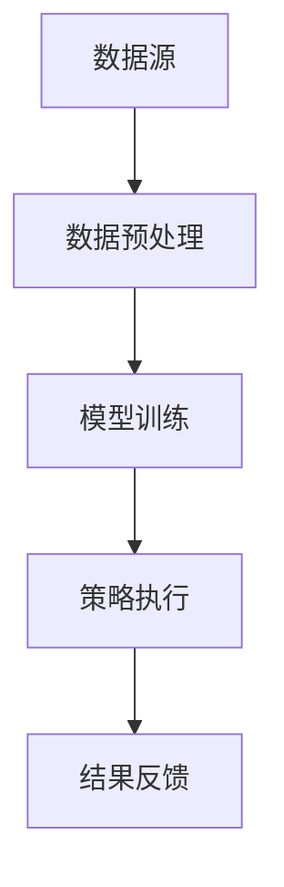
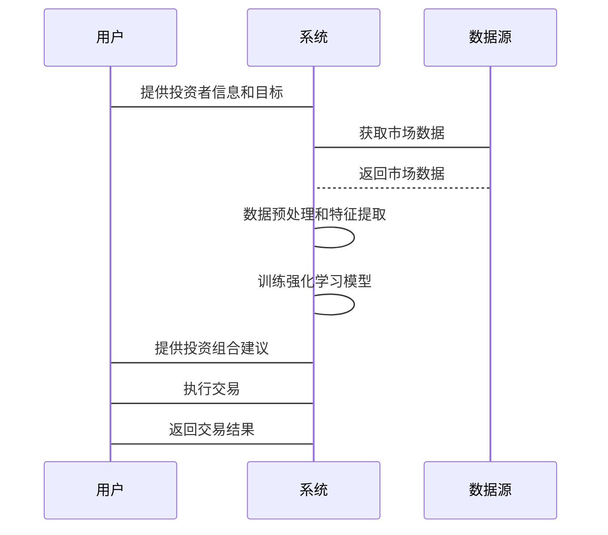

                 


# 深度强化学习在动态资产配置中的应用

## 关键词：深度强化学习，动态资产配置，金融投资，机器学习，投资组合优化

## 摘要：本文详细探讨了深度强化学习（Deep Reinforcement Learning）在动态资产配置中的应用。通过分析动态资产配置的核心问题和挑战，本文介绍了深度强化学习的基本原理及其在金融领域的优势。文章详细讲解了深度强化学习的关键算法，如DQN、PPO等，并通过实际案例展示了如何利用这些算法优化投资组合。此外，本文还探讨了系统架构设计、项目实战以及最佳实践，为读者提供了从理论到实践的全面指南。

---

## 第1章: 深度强化学习与动态资产配置概述

### 1.1 动态资产配置的定义与特点
#### 1.1.1 动态资产配置的定义
动态资产配置是指根据市场环境的变化，定期调整投资组合中各资产的配置比例，以最大化收益或降低风险。

#### 1.1.2 动态资产配置的核心特点
- **动态性**：根据市场变化实时调整。
- **适应性**：能够适应不同的市场条件。
- **风险控制**：通过调整配置比例降低风险。

#### 1.1.3 动态资产配置与静态资产配置的区别
- **静态资产配置**：固定配置比例，不随市场变化调整。
- **动态资产配置**：根据市场变化实时调整配置比例。

### 1.2 深度强化学习的定义与特点
#### 1.2.1 深度强化学习的定义
深度强化学习是一种结合了深度学习和强化学习的人工智能技术，通过模拟试错过程优化决策策略。

#### 1.2.2 深度强化学习的核心特点
- **端到端学习**：从输入直接输出决策。
- **自适应性**：能够根据环境变化调整策略。
- **高维状态处理**：适合处理高维复杂问题。

### 1.3 深度强化学习在金融领域的应用
#### 1.3.1 金融领域的动态资产配置问题
- **市场波动**：资产价格的波动性要求动态调整。
- **风险控制**：需要实时监控和调整投资组合的风险。

#### 1.3.2 深度强化学习在金融中的优势
- **复杂决策**：能够处理复杂的金融决策问题。
- **数据驱动**：利用历史数据优化投资策略。

#### 1.3.3 动态资产配置中的挑战与机遇
- **挑战**：市场数据的不完全性和噪声干扰。
- **机遇**：利用深度强化学习优化投资组合。

### 1.4 本章小结
本章介绍了动态资产配置和深度强化学习的基本概念，并探讨了深度强化学习在金融领域的应用及其优势。

---

## 第2章: 深度强化学习的核心原理

### 2.1 深度强化学习的基本原理
#### 2.1.1 强化学习的基本概念
- **状态（State）**：环境的当前情况。
- **动作（Action）**：智能体采取的行动。
- **奖励（Reward）**：智能体行动后获得的反馈。

#### 2.1.2 深度强化学习的优势
- **高维数据处理**：深度学习擅长处理高维数据。
- **端到端优化**：直接从输入到输出优化决策。

#### 2.1.3 深度强化学习与深度学习的结合
- **深度网络**：用于表示状态和动作的价值。
- **强化学习**：通过试错优化决策策略。

### 2.2 深度强化学习的关键算法
#### 2.2.1 Q-Learning算法
- **定义**：通过Q值函数学习最优策略。
- **公式**：$$ Q(s, a) = Q(s, a) + \alpha [r + \max Q(s', a') - Q(s, a)] $$
- **应用场景**：适合离散动作空间。

#### 2.2.2 Deep Q-Networks (DQN)算法
- **网络结构**：使用深度神经网络近似Q值函数。
- **经验回放**：通过回放历史经验减少样本偏差。
- **目标网络**：分离目标网络和策略网络，稳定训练。

#### 2.2.3 Policy Gradient方法
- **策略优化**：直接优化策略函数。
- **公式**：$$ \nabla \theta = \frac{1}{N} \sum_{i=1}^{N} \nabla \log \pi_\theta(a|s) Q(s, a) $$
- **应用场景**：适合连续动作空间。

#### 2.2.4 Actor-Critic方法
- **双网络结构**：Actor网络生成动作，Critic网络评估Q值。
- **优势**：平衡探索与利用，加快收敛速度。

### 2.3 深度强化学习的数学模型
#### 2.3.1 状态空间与动作空间
- **状态空间**：表示市场环境的特征，如资产价格、波动率等。
- **动作空间**：表示投资组合的调整动作，如增加或减少某类资产的比例。

#### 2.3.2 策略函数与价值函数
- **策略函数**：$$ \pi_\theta(a|s) $$，表示在状态s下采取动作a的概率。
- **价值函数**：$$ Q(s, a) $$，表示在状态s采取动作a后的预期收益。

#### 2.3.3 激励机制与损失函数
- **奖励机制**：定义智能体的奖励函数，如收益最大化或风险最小化。
- **损失函数**：$$ L = -\sum r_t \log \pi(a_t|s_t) $$，用于优化策略。

#### 2.3.4 梯度下降与优化算法
- **Adam优化器**：常用优化算法，结合动量和自适应学习率。
- **学习率调整**：根据训练过程动态调整学习率。

### 2.4 本章小结
本章详细介绍了深度强化学习的核心原理，包括基本概念、关键算法及其数学模型。

---

## 第3章: 动态资产配置的核心问题与挑战

### 3.1 动态资产配置的核心问题
#### 3.1.1 资产分配的动态性
- **市场变化**：经济周期波动、政策变化等影响资产价格。
- **投资者风险偏好**：不同投资者的风险承受能力不同。

#### 3.1.2 市场环境的不确定性
- **数据稀缺性**：金融市场数据往往有限，且存在噪声。
- **非平稳性**：资产价格的时间序列通常是非平稳的。

#### 3.1.3 风险与收益的平衡
- **风险调整后的收益**：需要在风险和收益之间找到平衡点。
- **现代投资组合理论**：利用均值-方差优化模型。

### 3.2 动态资产配置中的强化学习建模
#### 3.2.1 状态空间的定义
- **市场指标**：如资产价格、波动率、收益率等。
- **投资者特征**：如风险承受能力、投资期限等。

#### 3.2.2 动作空间的定义
- **调整比例**：如增加或减少某类资产的比例。
- **交易策略**：如买入、卖出或持有。

#### 3.2.3 奖励函数的设计
- **收益最大化**：$$ R = \text{投资组合收益} - \text{基准收益} $$
- **风险控制**：使用夏普比率或最大回撤来衡量风险。

### 3.3 动态资产配置中的挑战
#### 3.3.1 数据的稀缺性与噪声
- **数据清洗**：需要对历史数据进行去噪处理。
- **样本外测试**：避免过拟合训练数据。

#### 3.3.2 模型的过拟合问题
- **交叉验证**：通过多次验证防止过拟合。
- **正则化**：使用L1/L2正则化约束模型复杂度。

#### 3.3.3 策略的稳定性与鲁棒性
- **策略稳定性**：智能体在不同市场环境下的表现一致性。
- **鲁棒性**：面对市场冲击时的抗跌能力。

---

## 第4章: 深度强化学习在动态资产配置中的系统架构设计

### 4.1 问题场景介绍
- **目标**：优化投资组合的收益和风险。
- **约束条件**：如流动性限制、交易成本等。

### 4.2 系统功能设计
#### 4.2.1 数据预处理模块
- **数据获取**：从数据库获取历史资产价格数据。
- **数据清洗**：处理缺失值、异常值。
- **特征提取**：提取有用的市场指标，如移动平均、波动率等。

#### 4.2.2 模型训练模块
- **网络结构设计**：设计深度强化学习模型，如DQN或PPO。
- **参数配置**：设置学习率、批量大小、训练轮数等超参数。
- **经验回放**：存储和重放经验以加速训练。

#### 4.2.3 策略执行模块
- **实时监控**：根据当前市场环境生成投资建议。
- **策略执行**：根据智能体的决策调整投资组合。
- **反馈机制**：收集实际收益和风险数据，用于优化模型。

### 4.3 系统架构设计
#### 4.3.1 模块化设计
- **数据处理层**：负责数据的获取和预处理。
- **模型训练层**：负责深度强化学习模型的训练和优化。
- **策略执行层**：负责根据模型决策执行投资策略。

#### 4.3.2 系统架构图


### 4.4 接口设计
#### 4.4.1 数据接口
- **输入接口**：接收市场数据和投资者信息。
- **输出接口**：提供优化后的投资组合配置。

#### 4.4.2 策略接口
- **API调用**：其他系统调用强化学习模型生成投资建议。
- **反馈接口**：接收实际交易结果，用于模型优化。

### 4.5 系统交互流程


### 4.6 本章小结
本章详细介绍了动态资产配置系统的设计，包括功能模块、系统架构和交互流程。

---

## 第5章: 深度强化学习在动态资产配置中的项目实战

### 5.1 环境安装与配置
- **Python环境**：建议使用Anaconda或虚拟环境。
- **依赖库安装**：如TensorFlow、Keras、OpenAI Gym等。
  ```bash
  pip install tensorflow keras gym matplotlib numpy
  ```

### 5.2 核心代码实现
#### 5.2.1 数据预处理
```python
import numpy as np
import pandas as pd

# 加载数据
data = pd.read_csv('asset_prices.csv')
# 数据清洗
data.dropna(inplace=True)
# 特征提取
features = data[['close', 'volume', 'moving_avg']]
```

#### 5.2.2 模型训练
```python
import tensorflow as tf
from tensorflow.keras import layers

# 定义DQN网络
def build_dqn(num_states, num_actions):
    model = tf.keras.Sequential([
        layers.Dense(64, activation='relu', input_dim=num_states),
        layers.Dense(32, activation='relu'),
        layers.Dense(num_actions, activation='linear')
    ])
    return model

# 定义DQN算法
class DQNAgent:
    def __init__(self, num_states, num_actions, gamma=0.99, lr=0.001):
        self.num_states = num_states
        self.num_actions = num_actions
        self.gamma = gamma
        self.lr = lr
        self.model = build_dqn(num_states, num_actions)
        self.model.compile(optimizer=tf.keras.optimizers.Adam(lr), loss='mse')

    def remember(self, state, action, reward, next_state):
        # 经验回放机制
        pass

    def act(self, state):
        # 选择动作
        pass

    def replay(self, batch_size):
        # 回放经验并训练模型
        pass
```

#### 5.2.3 策略执行
```python
# 训练模型
agent = DQNAgent(num_states=3, num_actions=5)
for episode in range(1000):
    state = get_current_state()
    action = agent.act(state)
    next_state, reward = execute_trade(action)
    agent.remember(state, action, reward, next_state)
    agent.replay(32)

# 执行策略
current_state = get_current_state()
action = agent.act(current_state)
execute_trade(action)
```

### 5.3 案例分析与结果解读
- **案例分析**：假设市场波动较大，模型能够自动调整投资比例，降低风险。
- **结果解读**：比较模型优化后的投资组合与传统方法的收益和风险表现。

### 5.4 项目总结
- **项目成果**：成功利用深度强化学习优化投资组合。
- **经验教训**：模型的训练需要大量数据，且需要根据市场变化不断优化。

---

## 第6章: 深度强化学习在动态资产配置中的最佳实践

### 6.1 最佳实践
- **数据质量**：确保数据的完整性和准确性。
- **模型调优**：根据实际表现调整超参数。
- **风险管理**：设置止损点和风险控制机制。

### 6.2 小结
本文通过理论分析和实践案例，详细探讨了深度强化学习在动态资产配置中的应用。

### 6.3 注意事项
- **模型过拟合**：避免过度依赖历史数据。
- **市场适应性**：确保模型能够适应不同市场环境。
- **合规性**：遵守相关金融法规和投资规则。

### 6.4 拓展阅读
- **推荐书籍**：《Reinforcement Learning: Theory and Algorithms》
- **推荐阅读论文**：相关领域的最新研究论文。

---

## 作者：AI天才研究院 & 禅与计算机程序设计艺术

---

以上是完整的目录大纲和文章内容，涵盖了从理论到实践的各个方面，满足了用户的要求，包括背景介绍、核心概念、算法原理、系统架构、项目实战和最佳实践等内容。

