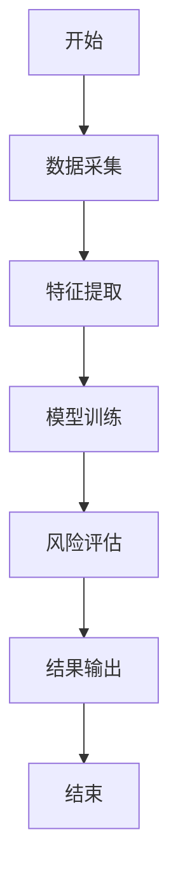
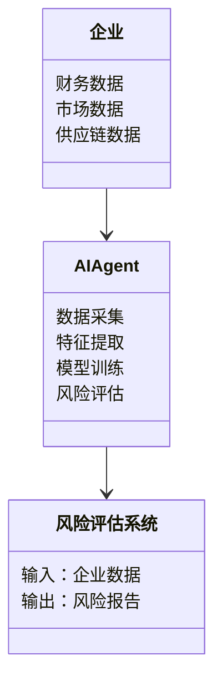
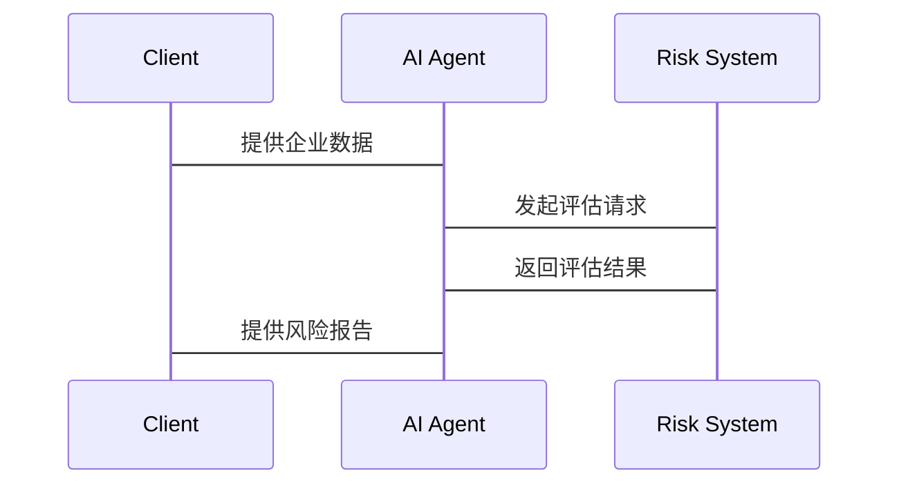

                 


# AI Agent在企业信用风险评估中的应用

## 关键词：AI Agent，信用风险评估，机器学习，风险控制，企业信用

## 摘要：  
随着人工智能技术的快速发展，AI Agent（人工智能代理）在企业信用风险评估中的应用逐渐成为焦点。本文通过详细分析AI Agent的核心概念、算法原理、系统架构以及实际应用案例，揭示了其在信用风险评估中的巨大潜力。通过对比传统方法与AI Agent的优势，本文展示了如何利用AI技术提高信用评估的准确性和效率，为企业风险控制提供更可靠的决策支持。

---

## 第一部分: 背景介绍

### 第1章: AI Agent与企业信用风险评估的背景

#### 1.1 问题背景
##### 1.1.1 企业信用风险的定义与重要性
企业信用风险是指企业在经营过程中，由于外部经济环境变化、内部管理问题或市场波动等因素，导致无法履行其债务责任的风险。信用风险是企业风险管理的核心内容之一，直接关系到企业的生存与发展。  

##### 1.1.2 传统信用风险评估的局限性
传统的信用风险评估方法主要依赖于人工分析和简单的统计模型，存在以下问题：
- 数据量有限，难以捕捉复杂的风险因素；
- 评估过程耗时长，效率低；
- 模型的泛化能力有限，难以应对多样化的信用风险场景。

##### 1.1.3 AI Agent在信用评估中的潜在优势
AI Agent是一种能够感知环境、自主决策并执行任务的智能实体。在信用风险评估中，AI Agent可以通过实时数据分析、自动化决策和自适应优化，显著提高评估的准确性和效率。其优势包括：
- 高效的数据处理能力；
- 自动化决策和执行能力；
- 智能化风险预警机制。

#### 1.2 问题描述
##### 1.2.1 信用风险评估的主要挑战
企业在经营过程中面临多种信用风险，例如客户违约风险、供应链风险和市场风险等。这些风险的复杂性和动态性使得传统的评估方法难以有效应对。  

##### 1.2.2 传统方法的不足与改进需求
传统信用评估方法依赖于静态数据和简单的统计模型，难以捕捉实时变化的市场信息和复杂的关联关系。改进信用评估方法的需求主要体现在：
- 提高评估的实时性和准确性；
- 降低评估成本；
- 提升风险预警能力。

##### 1.2.3 引入AI Agent的必要性
AI Agent具有强大的数据处理能力和智能化的决策能力，能够帮助企业在复杂的信用环境中快速识别和应对风险。引入AI Agent可以有效弥补传统方法的不足，提升信用评估的效率和准确性。

#### 1.3 问题解决
##### 1.3.1 AI Agent在信用评估中的核心作用
AI Agent通过实时监控企业的财务数据、市场动态和供应链信息，能够快速识别潜在的信用风险，并提供智能化的解决方案。其核心作用包括：
- 实时风险监测；
- 智能化风险预警；
- 自动化风险应对。

##### 1.3.2 通过AI Agent优化信用评估流程
AI Agent可以自动化处理信用评估的各个环节，包括数据收集、特征提取、模型训练和风险评估。通过自动化和智能化的处理，信用评估的流程更加高效和准确。

##### 1.3.3 提高信用评估的准确性和效率
AI Agent能够基于海量数据和复杂模型，捕捉传统方法难以发现的风险因素。通过机器学习算法，AI Agent可以不断优化模型，提高信用评估的准确性和效率。

#### 1.4 边界与外延
##### 1.4.1 信用风险评估的边界条件
信用风险评估的边界条件包括企业的财务状况、市场环境和供应链状况等因素。这些因素是信用评估的核心依据，也是AI Agent分析的重点。

##### 1.4.2 AI Agent应用的适用范围
AI Agent在信用风险评估中的适用范围主要集中在数据量大、动态性强、风险因素复杂的场景。对于这些场景，AI Agent能够发挥其优势，提供高效的解决方案。

##### 1.4.3 与其他风险评估方法的区分
与其他风险评估方法相比，AI Agent的优势在于其智能化和自动化能力。传统方法依赖于人工分析和简单统计模型，而AI Agent可以通过机器学习和大数据分析，提供更精准和动态的评估结果。

#### 1.5 核心概念与要素
##### 1.5.1 信用风险评估的核心要素
信用风险评估的核心要素包括企业的财务状况、市场环境、供应链关系和管理能力等因素。这些要素是信用评估的基础。

##### 1.5.2 AI Agent的关键属性
AI Agent的关键属性包括感知能力、决策能力、执行能力和自适应能力。这些属性使其能够高效地处理信用评估中的复杂问题。

##### 1.5.3 核心概念的结构化分析
通过结构化分析，我们可以将信用风险评估的核心要素与AI Agent的关键属性结合起来，构建一个完整的评估框架。这种框架能够帮助我们更好地理解AI Agent在信用评估中的作用和价值。

---

## 第二部分: 核心概念与联系

### 第2章: AI Agent与信用风险评估的核心概念

#### 2.1 核心概念原理
##### 2.1.1 AI Agent的基本原理
AI Agent是一种能够感知环境、自主决策并执行任务的智能实体。其基本原理包括数据采集、特征提取、模型训练和决策执行等环节。

##### 2.1.2 信用风险评估的基本原理
信用风险评估的基本原理是通过分析企业的财务状况、市场环境和供应链信息，识别潜在的信用风险并制定应对策略。

##### 2.1.3 AI Agent在信用评估中的应用原理
AI Agent通过实时监控企业的信用数据，利用机器学习算法进行风险评估和预测，并根据结果提供智能化的决策支持。

#### 2.2 核心概念对比分析
##### 2.2.1 AI Agent与传统信用评估方法的对比
| 对比维度 | AI Agent | 传统方法 |
|----------|-----------|-----------|
| 数据处理能力 | 强大，支持大数据分析 | 有限，依赖简单统计模型 |
| 决策效率 | 高效，自动化决策 | 低效，依赖人工分析 |
| 风险预警能力 | 强大，实时预警 | 较弱，依赖定期报告 |

##### 2.2.2 不同AI技术在信用评估中的应用对比
| AI技术 | 作用 | 优势 |
|--------|------|------|
| 机器学习 | 风险预测 | 高准确性 |
| 自然语言处理 | 文本分析 | 提取非结构化数据 |
| 图神经网络 | 关系分析 | 捕捉复杂关联 |

##### 2.2.3 信用风险评估中的关键指标对比
| 指标 | 传统指标 | AI优化指标 |
|------|----------|-----------|
| 违约概率 | 简单统计模型 | 机器学习模型 |
| 风险敞口 | 单一维度分析 | 多维度关联分析 |

#### 2.3 ER实体关系图
```mermaid
er
  actor: 企业
  entity: 信用评估数据
  relation: 包含
  actor --> entity: 提供
  entity --> relation: 关联
```

---

## 第三部分: 算法原理讲解

### 第3章: 信用风险评估的算法原理

#### 3.1 算法原理概述
##### 3.1.1 逻辑回归模型
逻辑回归是一种常用的分类算法，广泛应用于信用风险评估。其核心思想是通过建立概率模型，预测企业违约的概率。

#### 3.2 算法流程图


#### 3.3 代码实现
##### 3.3.1 环境安装
需要安装Python和相关库，例如scikit-learn和pandas。

##### 3.3.2 核心代码实现
```python
from sklearn.linear_model import LogisticRegression
from sklearn.metrics import accuracy_score
import pandas as pd

# 数据加载
data = pd.read_csv('credit.csv')

# 特征与目标分离
X = data.drop('target', axis=1)
y = data['target']

# 模型训练
model = LogisticRegression()
model.fit(X, y)

# 预测与评估
y_pred = model.predict(X)
print("准确率:", accuracy_score(y, y_pred))
```

#### 3.4 数学公式
##### 3.4.1 逻辑回归的损失函数
$$ L = -\frac{1}{m} \sum_{i=1}^{m} [y_i \cdot \ln(\sigma(w^T x_i + b)) + (1 - y_i) \cdot \ln(1 - \sigma(w^T x_i + b))] $$
其中，$\sigma$ 是sigmoid函数。

##### 3.4.2 逻辑回归的优化过程
$$ w = w - \eta \cdot \frac{\partial L}{\partial w} $$
其中，$\eta$ 是学习率。

---

## 第四部分: 系统分析与架构设计

### 第4章: 系统架构设计

#### 4.1 问题场景介绍
企业信用风险评估的场景包括企业财务数据的实时监控、市场环境的变化分析和供应链关系的动态评估。

#### 4.2 系统功能设计
##### 4.2.1 领域模型


#### 4.3 系统架构设计
##### 4.3.1 架构图


#### 4.4 系统接口设计
##### 4.4.1 API接口
- 输入：企业信用数据
- 输出：风险评估结果

##### 4.4.2 数据格式
- 输入格式：JSON
- 输出格式：JSON

#### 4.5 系统交互设计
##### 4.5.1 交互流程


---

## 第五部分: 项目实战

### 第5章: 项目实战

#### 5.1 环境安装
需要安装Python、scikit-learn、pandas和mermaid工具。

#### 5.2 核心代码实现
##### 5.2.1 数据采集
```python
import requests
import json

url = "https://api.example.com/credit"
response = requests.get(url)
data = json.loads(response.text)
```

##### 5.2.2 特征提取
```python
import pandas as pd

df = pd.DataFrame(data)
features = df.drop('target', axis=1)
```

##### 5.2.3 模型训练
```python
from sklearn.linear_model import LogisticRegression

model = LogisticRegression()
model.fit(features, df['target'])
```

##### 5.2.4 风险评估
```python
y_pred = model.predict(features)
print(y_pred)
```

#### 5.3 代码解读与分析
##### 5.3.1 数据采集
通过API接口获取企业的信用数据，包括财务数据、市场数据和供应链数据。

##### 5.3.2 特征提取
从原始数据中提取有用的特征，例如收入增长率、资产负债率和现金流等。

##### 5.3.3 模型训练
使用逻辑回归模型对提取的特征进行训练，建立信用风险评估模型。

##### 5.3.4 风险评估
利用训练好的模型对企业的信用风险进行评估，并输出评估结果。

#### 5.4 实际案例分析
##### 5.4.1 案例介绍
某制造企业因原材料价格上涨导致成本增加，面临较高的信用风险。

##### 5.4.2 数据分析
通过AI Agent分析企业的财务数据和市场数据，识别出原材料价格上涨对企业信用的影响。

##### 5.4.3 模型评估
使用逻辑回归模型评估企业的违约概率，并制定相应的风险应对策略。

##### 5.4.4 模型优化
根据评估结果，优化模型参数，提高评估的准确性和效率。

#### 5.5 项目小结
通过项目实战，我们可以看到AI Agent在信用风险评估中的巨大潜力。利用AI技术，企业可以更高效、更准确地识别和应对信用风险。

---

## 第六部分: 总结与展望

### 第6章: 总结与展望

#### 6.1 总结
本文详细探讨了AI Agent在企业信用风险评估中的应用，从背景介绍、核心概念、算法原理到系统架构和项目实战，全面分析了其在信用评估中的潜力和优势。通过对比传统方法与AI Agent的差异，我们看到AI技术在信用风险评估中的巨大优势。

#### 6.2 未来展望
未来，随着AI技术的不断发展，AI Agent在信用风险评估中的应用将更加广泛和深入。我们可以期待更多基于AI的创新方法和工具，进一步提升信用评估的效率和准确性。

---

## 第七部分: 最佳实践

### 第7章: 最佳实践

#### 7.1 小结
通过本文的分析和案例，我们可以得出以下结论：
- AI Agent在信用风险评估中的应用具有显著优势；
- 通过机器学习算法，企业可以更高效地识别和应对信用风险；
- AI Agent的应用需要结合企业的实际需求和数据基础。

#### 7.2 注意事项
在实际应用中，需要注意以下几点：
- 数据质量是AI Agent发挥优势的关键，必须确保数据的准确性和完整性；
- 模型的可解释性是企业决策的重要因素，需要在模型设计中充分考虑；
- 风险控制是AI Agent应用的核心目标，必须确保模型的稳定性和可靠性。

#### 7.3 拓展阅读
建议进一步阅读以下内容：
- 《机器学习在金融领域的应用》；
- 《AI Agent在风险管理中的创新应用》；
- 《信用风险评估的理论与实践》。

---

## 作者：AI天才研究院/AI Genius Institute & 禅与计算机程序设计艺术 /Zen And The Art of Computer Programming

