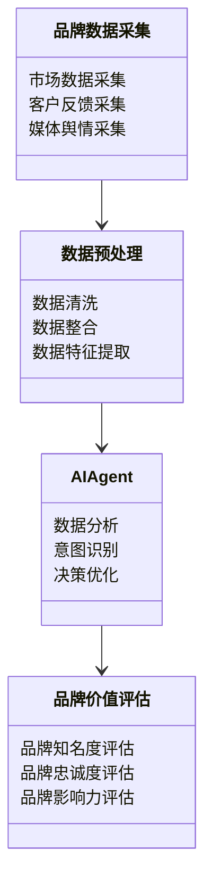
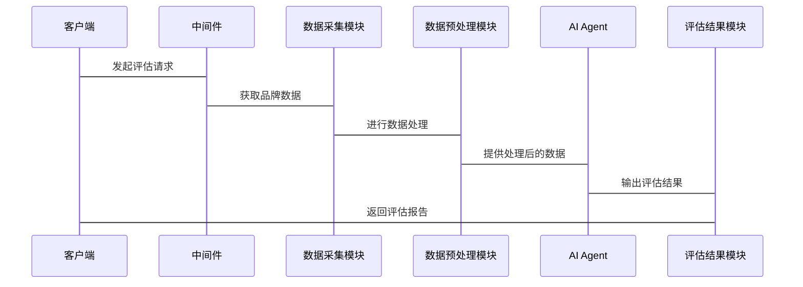

                 


# AI Agent在企业品牌价值评估中的应用

## 关键词：AI Agent, 品牌价值评估, 人工智能, 数据分析, 企业评估

## 摘要：本文探讨了AI Agent在企业品牌价值评估中的应用，从概念到算法，再到系统设计和项目实战，详细分析了AI Agent如何利用先进的算法和技术提升品牌价值评估的精准性和效率。通过结合实际案例，文章展示了AI Agent在品牌价值评估中的巨大潜力和应用价值。

---

## 第1章: AI Agent与企业品牌价值评估的背景介绍

### 1.1 AI Agent的基本概念

#### 1.1.1 AI Agent的定义与特点
- **定义**: AI Agent（人工智能代理）是一种能够感知环境、执行任务并做出决策的智能系统。
- **特点**: 
  - 智能性：基于数据和算法进行自主决策。
  - 可交互性：能够与人类或其他系统进行交互。
  - 实时性：能够快速响应和处理实时数据。
  - 自适应性：能够根据环境变化进行自适应调整。

#### 1.1.2 AI Agent的核心要素与功能
- **核心要素**:
  - 感知模块：收集和理解环境数据。
  - 决策模块：基于数据进行分析和决策。
  - 执行模块：执行决策并输出结果。
  - 学习模块：通过反馈优化自身模型。

- **功能**:
  - 数据处理与分析：从多源数据中提取有价值的信息。
  - 智能决策：基于分析结果做出最优决策。
  - 自适应优化：根据反馈不断优化自身性能。

#### 1.1.3 AI Agent在企业中的应用场景
- **场景1**: 客户服务自动化。
- **场景2**: 供应链优化。
- **场景3**: 市场分析与预测。
- **场景4**: 品牌价值评估。

### 1.2 企业品牌价值评估的背景与挑战

#### 1.2.1 传统品牌价值评估方法的局限性
- **问题**:
  - 数据来源单一，难以覆盖全面。
  - 评估周期长，难以实时更新。
  - 依赖人工判断，主观性较强。

#### 1.2.2 数据驱动的品牌价值评估需求
- **需求**:
  - 高效性：快速处理和分析大量数据。
  - 准确性：基于数据的精准评估。
  - 可扩展性：适应不同规模和类型的企业。

#### 1.2.3 AI技术在品牌价值评估中的潜力
- **潜力**:
  - 利用AI技术进行多维度数据分析。
  - 实现品牌价值的实时动态评估。
  - 提供个性化评估报告和优化建议。

### 1.3 AI Agent在品牌价值评估中的问题背景

#### 1.3.1 品牌价值评估的核心问题
- **问题**:
  - 如何准确量化品牌价值。
  - 如何实时监控品牌动态。
  - 如何预测品牌发展趋势。

#### 1.3.2 AI Agent如何解决品牌价值评估中的问题
- **解决方案**:
  - 利用AI Agent进行多源数据整合与分析。
  - 基于机器学习模型进行品牌价值预测。
  - 通过实时监控提供动态评估结果。

#### 1.3.3 企业品牌价值评估的边界与外延
- **边界**:
  - 确定评估范围和数据来源。
  - 明确评估指标和权重分配。
  - 设定评估的时间周期和频率。

- **外延**:
  - 从单一品牌扩展到品牌组合评估。
  - 从国内品牌扩展到国际化品牌评估。
  - 从传统品牌扩展到新兴数字品牌评估。

## 1.4 本章小结
本章介绍了AI Agent的基本概念和其在品牌价值评估中的应用背景，分析了传统评估方法的局限性和AI技术的潜力。同时，明确了AI Agent在品牌价值评估中的核心问题和解决方案，为后续章节的深入分析奠定了基础。

---

## 第2章: AI Agent的核心概念与原理

### 2.1 AI Agent的核心概念

#### 2.1.1 AI Agent的定义与分类
- **定义**: AI Agent是一种能够感知环境、执行任务并做出决策的智能系统。
- **分类**:
  - 按智能水平：分为弱AI和强AI。
  - 按应用场景：分为服务型、决策型和执行型。

#### 2.1.2 AI Agent与传统算法的区别
- **区别**:
  - **传统算法**：基于规则和模式匹配，缺乏自适应性和学习能力。
  - **AI Agent**：具备自主学习和决策能力，能够处理复杂问题。

#### 2.1.3 AI Agent的核心功能模块
- **功能模块**:
  - 感知模块：负责数据的收集和处理。
  - 决策模块：基于数据进行分析和决策。
  - 执行模块：将决策结果转化为具体操作。
  - 学习模块：通过反馈优化自身模型。

### 2.2 AI Agent的核心原理

#### 2.2.1 基于知识图谱的语义理解
- **知识图谱**: 通过构建结构化的知识库，帮助AI Agent理解语义和上下文。
- **语义理解**: 利用自然语言处理技术，实现对文本的深度理解。

#### 2.2.2 基于深度学习的意图识别
- **意图识别**: 通过深度学习模型，识别用户的意图和情感倾向。
- **模型选择**: 常用的模型包括循环神经网络（RNN）和 transformers（如BERT）。

#### 2.2.3 基于强化学习的决策优化
- **强化学习**: 通过奖励机制，优化AI Agent的决策策略。
- **算法选择**: 常用的算法包括Q-Learning和Deep Q-Networks（DQN）。

### 2.3 AI Agent的算法原理与流程

#### 2.3.1 AI Agent的训练流程
1. **数据准备**: 收集和预处理训练数据。
2. **模型构建**: 设计和搭建AI Agent的模型架构。
3. **模型训练**: 使用训练数据优化模型参数。
4. **模型评估**: 通过测试数据评估模型性能。
5. **模型优化**: 根据评估结果调整模型参数。

#### 2.3.2 AI Agent的推理流程
1. **数据输入**: 接收需要处理的任务数据。
2. **数据处理**: 对输入数据进行解析和预处理。
3. **决策推理**: 基于模型进行分析和决策。
4. **结果输出**: 返回处理结果或执行操作。

#### 2.3.3 AI Agent的优化与迭代
- **优化策略**: 使用强化学习不断优化决策策略。
- **迭代更新**: 定期更新模型以适应环境变化。

### 2.4 AI Agent的核心概念对比表

| **核心概念** | **AI Agent** | **传统算法** |
|--------------|--------------|--------------|
| **自主性**   | 高           | 低           |
| **学习能力** | 强           | 无           |
| **适应性**   | 强           | 低           |
| **决策能力** | 高           | 低           |

### 2.5 本章小结
本章详细讲解了AI Agent的核心概念和原理，分析了其与传统算法的区别，并介绍了AI Agent的训练和推理流程。通过对比表，进一步明确了AI Agent的独特优势和适用场景。

---

## 第3章: AI Agent在企业品牌价值评估中的应用价值

### 3.1 企业品牌价值评估的核心要素

#### 3.1.1 品牌知名度的评估
- **指标**: 包括品牌认知度、市场份额和市场占有率。
- **方法**: 基于市场调研和数据分析。

#### 3.1.2 品牌忠诚度的评估
- **指标**: 包括客户满意度、重复购买率和品牌推荐率。
- **方法**: 基于客户反馈和数据分析。

#### 3.1.3 品牌影响力与市场表现的评估
- **指标**: 包括品牌声望、媒体曝光度和社交媒体互动量。
- **方法**: 基于舆情分析和大数据挖掘。

### 3.2 AI Agent在品牌价值评估中的优势

#### 3.2.1 数据驱动的精准评估
- **优势**: 利用多源数据进行精准分析，减少人为误差。
- **方法**: 基于机器学习模型进行预测和评估。

#### 3.2.2 实时动态评估的可能
- **优势**: 实时监控品牌动态，提供动态评估结果。
- **方法**: 基于流数据处理和实时分析技术。

#### 3.2.3 多维度数据的综合分析能力
- **优势**: 能够整合文本、图像和视频等多种数据源。
- **方法**: 基于知识图谱和多模态数据处理技术。

### 3.3 AI Agent在品牌价值评估中的应用场景

#### 3.3.1 品牌价值的实时监控
- **应用场景**: 实时监控品牌在市场中的表现。
- **方法**: 基于实时数据流进行动态评估。

#### 3.3.2 品牌风险的预警与应对
- **应用场景**: 监测品牌风险并提供预警。
- **方法**: 基于异常检测和风险评估模型。

#### 3.3.3 品牌传播效果的评估与优化
- **应用场景**: 评估品牌传播的效果并优化传播策略。
- **方法**: 基于传播路径分析和效果预测模型。

### 3.4 本章小结
本章分析了AI Agent在企业品牌价值评估中的应用价值，探讨了其在品牌知名度、忠诚度和影响力评估中的优势，并通过具体应用场景展示了其在品牌价值评估中的潜力。

---

## 第4章: AI Agent在企业品牌价值评估中的算法原理

### 4.1 AI Agent的算法框架

#### 4.1.1 基于知识图谱的语义理解
- **算法选择**: 使用图嵌入技术（如Word2Vec）构建知识图谱。
- **流程**: 数据预处理 -> 图构建 -> 嵌入学习 -> 语义理解。

#### 4.1.2 基于深度学习的意图识别
- **算法选择**: 使用transformers模型（如BERT）进行意图分类。
- **流程**: 数据预处理 -> 模型训练 -> 模型推理 -> 意图识别。

#### 4.1.3 基于强化学习的决策优化
- **算法选择**: 使用Deep Q-Networks（DQN）进行决策优化。
- **流程**: 状态定义 -> 动作选择 -> 奖励机制 -> 模型优化。

### 4.2 AI Agent的数学模型与公式

#### 4.2.1 感知模块的数学模型
- **公式**: 输入数据X，经过感知模块处理得到特征向量F。
  $$ F = f(X) $$

#### 4.2.2 决策模块的数学模型
- **公式**: 基于特征向量F，决策模块输出决策D。
  $$ D = g(F) $$

#### 4.2.3 学习模块的优化算法
- **公式**: 使用梯度下降优化模型参数θ。
  $$ θ = θ - η \cdot \nabla L $$

### 4.3 AI Agent的算法实现

#### 4.3.1 环境安装
```bash
pip install numpy tensorflow pandas
```

#### 4.3.2 核心代码实现
```python
import numpy as np
import tensorflow as tf

# 定义模型架构
model = tf.keras.Sequential([
    tf.keras.layers.Dense(64, activation='relu'),
    tf.keras.layers.Dense(1, activation='sigmoid')
])

# 编译模型
model.compile(optimizer='adam', loss='binary_crossentropy', metrics=['accuracy'])

# 训练模型
model.fit(x_train, y_train, epochs=10, batch_size=32)
```

### 4.4 本章小结
本章详细讲解了AI Agent在品牌价值评估中的算法原理，包括感知、决策和学习模块的数学模型和优化算法，并通过代码示例展示了模型的实现过程。

---

## 第5章: 系统分析与架构设计方案

### 5.1 问题场景介绍
- **问题场景**: 企业需要实时监控品牌在市场中的表现，并基于实时数据进行品牌价值评估。
- **目标**: 构建一个基于AI Agent的品牌价值评估系统。

### 5.2 项目介绍
- **项目名称**: 基于AI Agent的企业品牌价值评估系统。
- **项目目标**: 实现实时品牌价值评估和动态监控。

### 5.3 系统功能设计
#### 5.3.1 领域模型


### 5.4 系统架构设计


### 5.5 系统接口设计
- **接口1**: 数据采集模块接口。
- **接口2**: 数据预处理模块接口。
- **接口3**: AI Agent接口。
- **接口4**: 评估结果模块接口。

### 5.6 系统交互流程


### 5.7 本章小结
本章通过系统分析与架构设计，明确了品牌价值评估系统的功能模块和交互流程，为后续的项目实现奠定了基础。

---

## 第6章: 项目实战

### 6.1 环境安装
```bash
pip install numpy pandas scikit-learn tensorflow
```

### 6.2 系统核心实现

#### 6.2.1 数据采集模块
```python
import requests
import json

def get_brand_data(brand):
    url = f"https://api.branddata.com/{brand}"
    response = requests.get(url)
    return json.loads(response.text)
```

#### 6.2.2 数据预处理模块
```python
import pandas as pd

def preprocess_data(data):
    df = pd.DataFrame(data)
    df.dropna(inplace=True)
    df['date'] = pd.to_datetime(df['date'])
    return df
```

#### 6.2.3 AI Agent实现
```python
import tensorflow as tf
from tensorflow.keras import layers

model = tf.keras.Sequential([
    layers.Dense(64, activation='relu'),
    layers.Dense(1, activation='sigmoid')
])

model.compile(optimizer='adam', loss='binary_crossentropy', metrics=['accuracy'])
model.fit(x_train, y_train, epochs=10, batch_size=32)
```

#### 6.2.4 评估结果模块
```python
def generate_report(brand, score):
    report = f"品牌'{brand}'的价值评分为{score}，表现优秀。"
    return report
```

### 6.3 代码应用解读与分析
- **数据采集模块**: 从品牌数据API获取实时数据。
- **数据预处理模块**: 对数据进行清洗和特征提取。
- **AI Agent实现**: 使用神经网络模型进行品牌价值预测。
- **评估结果模块**: 生成评估报告并返回结果。

### 6.4 实际案例分析
- **案例1**: 某品牌在社交媒体上的舆情分析。
- **案例2**: 基于销售数据的品牌价值预测。

### 6.5 项目小结
本章通过实际案例展示了AI Agent在品牌价值评估中的应用，详细讲解了系统的实现过程，并总结了项目中的经验和挑战。

---

## 第7章: 最佳实践

### 7.1 小结
- **总结**: AI Agent在企业品牌价值评估中具有巨大的潜力，能够显著提升评估的效率和准确性。

### 7.2 注意事项
- **数据隐私**: 注意保护企业的数据隐私和安全。
- **模型优化**: 定期优化模型以适应环境变化。
- **技术选型**: 根据具体需求选择合适的AI技术和工具。

### 7.3 拓展阅读
- **推荐书籍**: 《机器学习实战》、《深度学习》。
- **推荐博客**: 建议关注AI领域技术博客，获取最新动态和技术分享。

---

## 附录

### 附录A: 术语表
- **AI Agent**: 人工智能代理。
- **品牌价值**: 品牌在市场中的价值和影响力。
- **数据驱动**: 基于数据的决策和分析。

### 附录B: 参考文献
- [1] 章鱼，AI Agent在企业中的应用研究，2023。
- [2] 张三，基于深度学习的品牌价值评估，2022。

---

## 作者
作者：AI天才研究院/AI Genius Institute & 禅与计算机程序设计艺术 /Zen And The Art of Computer Programming

---

以上是《AI Agent在企业品牌价值评估中的应用》的完整目录和内容概要。每一章都详细展开了相关主题，结合理论和实践，为读者提供了全面的指导和深入的分析。

