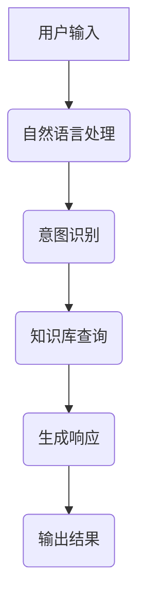
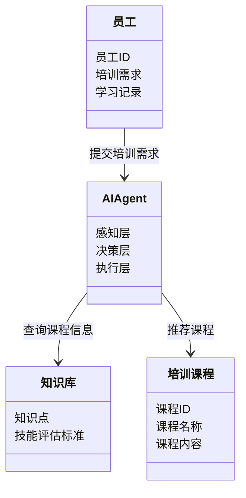
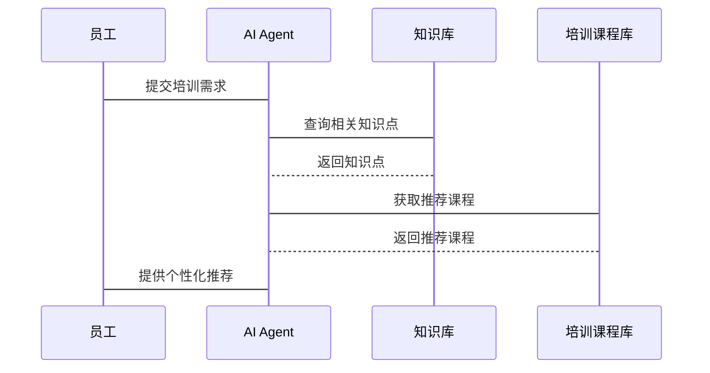

                 


# AI Agent在企业培训与技能评估中的创新应用

> **关键词**：AI Agent, 企业培训, 技能评估, 人工智能, 自然语言处理, 机器学习, 知识图谱

> **摘要**：AI Agent作为一种智能体，在企业培训与技能评估中展现出巨大的潜力。本文从AI Agent的基本概念出发，深入探讨其技术原理，分析其在企业培训中的应用场景，并结合实际案例，展示其在技能评估中的创新应用。通过系统架构设计和项目实战，进一步验证其可行性与价值。

---

# 第1章: AI Agent 的基本概念与背景

## 1.1 AI Agent 的定义与核心要素

### 1.1.1 什么是 AI Agent

AI Agent（人工智能代理）是指具有感知环境、理解任务、执行操作并能够自主决策的智能实体。它能够通过与用户交互或与其他系统通信，完成特定任务。AI Agent的核心在于其智能性，能够根据输入的信息做出合理的决策和响应。

### 1.1.2 AI Agent 的核心要素

AI Agent由以下几个核心要素组成：

1. **感知能力**：通过传感器或接口获取外部环境的信息，如自然语言输入、图像或数据。
2. **决策能力**：基于感知的信息，利用算法进行分析和推理，生成决策。
3. **执行能力**：根据决策结果，通过执行器或接口完成操作，如输出结果或调用其他系统。
4. **学习能力**：通过机器学习算法不断优化自身的模型和策略。

### 1.1.3 AI Agent 与传统 AI 的区别

AI Agent与传统AI的区别主要体现在以下几个方面：

1. **自主性**：AI Agent具有自主决策的能力，而传统AI通常需要明确的指令。
2. **交互性**：AI Agent能够与用户或系统进行实时交互，而传统AI更多是基于静态数据进行处理。
3. **适应性**：AI Agent能够根据环境变化动态调整行为，而传统AI则相对固定。

## 1.2 AI Agent 的发展历程

### 1.2.1 AI Agent 的起源

AI Agent的概念可以追溯到20世纪60年代，早期的AI研究主要集中在专家系统和机器人领域。随着计算机技术的进步，AI Agent的概念逐渐从理论走向实际应用。

### 1.2.2 AI Agent 的技术演进

AI Agent的技术演进经历了以下几个阶段：

1. **规则驱动阶段**：基于预定义的规则进行简单的逻辑推理。
2. **知识驱动阶段**：引入知识库和专家系统，提升决策的准确性。
3. **数据驱动阶段**：利用机器学习和大数据技术，实现更复杂的决策和预测。

### 1.2.3 当前 AI Agent 的发展趋势

当前，AI Agent的发展趋势主要体现在以下几个方面：

1. **智能化**：结合深度学习和自然语言处理，提升AI Agent的理解和表达能力。
2. **实时性**：通过边缘计算和实时数据处理，实现快速响应。
3. **个性化**：根据用户的行为和偏好，提供个性化的服务。

## 1.3 AI Agent 在企业培训与技能评估中的价值

### 1.3.1 企业培训与技能评估的痛点

1. **培训资源浪费**：传统培训方式通常是一对一或一对多的模式，难以满足个性化需求。
2. **评估不准确**：传统的评估方式依赖主观判断，缺乏客观性和实时性。
3. **效率低下**：培训和评估过程耗时长，且难以量化效果。

### 1.3.2 AI Agent 如何解决这些问题

1. **个性化培训方案**：AI Agent能够根据员工的能力水平和学习进度，推荐个性化的培训内容。
2. **实时反馈与调整**：通过实时监测员工的学习行为，动态调整培训计划，提升效率。
3. **数据驱动的评估**：利用AI Agent收集和分析大量数据，提供客观、全面的评估结果。

### 1.3.3 AI Agent 在企业培训中的创新应用前景

随着AI技术的不断进步，AI Agent在企业培训中的应用前景广阔。通过智能化的培训方案设计和实时评估，企业能够显著提升员工的技能水平，从而增强竞争力。

---

# 第2章: AI Agent 的技术原理与核心算法

## 2.1 AI Agent 的技术架构

### 2.1.1 感知层

感知层是AI Agent与外界交互的接口，主要包括以下功能：

1. **输入处理**：接收用户输入的文本、语音或图像信息。
2. **信息解析**：将输入信息转化为可处理的数据形式。

### 2.1.2 决策层

决策层负责根据感知层获取的信息，进行分析和推理，生成决策。

1. **意图识别**：通过自然语言处理技术，识别用户的意图。
2. **知识推理**：基于知识图谱和机器学习模型，进行推理和决策。

### 2.1.3 执行层

执行层负责根据决策层的决策，调用相应的服务或接口，完成操作。

1. **服务调用**：通过API接口调用外部服务，如培训资源库。
2. **输出结果**：将结果以文本、语音或图像的形式反馈给用户。

## 2.2 AI Agent 的核心算法

### 2.2.1 自然语言处理（NLP）

自然语言处理是AI Agent实现人机交互的核心技术之一。常用的NLP算法包括：

1. **分词**：将文本分割成词语或短语。
2. **句法分析**：分析句子的语法结构。
3. **情感分析**：识别文本中的情感倾向。

### 2.2.2 机器学习（ML）

机器学习算法用于AI Agent的决策和预测。常用的算法包括：

1. **监督学习**：基于标记的数据，训练分类器或回归模型。
2. **无监督学习**：基于未标记的数据，进行聚类或主题建模。
3. **强化学习**：通过与环境的交互，学习最优策略。

### 2.2.3 知识图谱构建

知识图谱是AI Agent的知识库，用于存储和管理各种知识。构建知识图谱的关键步骤包括：

1. **数据收集**：从多种来源收集数据，如企业培训资源。
2. **数据清洗**：去除噪声数据，确保数据质量。
3. **数据建模**：构建实体和关系的模型，形成知识图谱。

## 2.3 AI Agent 的算法流程图

以下是一个AI Agent的算法流程图，展示了从输入到输出的整个流程：



## 2.4 AI Agent 的数学模型与公式

### 2.4.1 概率论基础

概率论是机器学习的基础之一，常用的概率公式包括：

1. **条件概率公式**
$$ P(A|B) = \frac{P(B|A)P(A)}{P(B)} $$

2. **全概率公式**
$$ P(B) = \sum_{i} P(B|A_i)P(A_i) $$

### 2.4.2 机器学习模型

机器学习模型通常用于分类和回归任务。以下是一个简单的线性回归模型：

$$ y = f(x) + \epsilon $$

其中，$f(x)$是模型的预测值，$\epsilon$是误差项。

### 2.4.3 知识图谱表示

知识图谱中的实体和关系可以用三元组表示：

$$ (实体, 属性, 值) $$

例如：
$$ (员工, 培训需求, 技术培训) $$

---

# 第3章: AI Agent 在企业培训中的应用场景

## 3.1 个性化培训方案设计

### 3.1.1 基于员工能力的个性化推荐

AI Agent可以根据员工的历史学习数据和当前能力水平，推荐个性化的培训内容。例如，如果员工在数据分析方面表现不佳，AI Agent可以推荐相关的在线课程或练习题。

### 3.1.2 培训效果的实时反馈与调整

AI Agent可以通过实时监测员工的学习行为，动态调整培训计划。例如，如果员工在某个知识点上表现不佳，AI Agent可以延长该知识点的学习时间，并提供更多的练习题。

### 3.1.3 跨部门协作能力提升

AI Agent可以帮助员工了解其他部门的工作流程和职责，提升跨部门协作能力。例如，AI Agent可以推荐相关的培训课程，帮助员工更好地理解其他部门的需求。

## 3.2 培训效果评估与优化

### 3.2.1 基于 AI Agent 的评估指标

AI Agent可以帮助企业建立科学的评估指标，如：

1. **学习完成率**：员工完成培训课程的比例。
2. **学习进步率**：员工在学习前后的技能提升幅度。
3. **学习满意度**：员工对培训内容的满意度。

### 3.2.2 数据驱动的培训优化

通过收集和分析大量数据，AI Agent可以帮助企业优化培训计划。例如，AI Agent可以分析员工的学习数据，找出常见的薄弱环节，并针对性地调整培训内容。

### 3.2.3 AI Agent 在技能评估中的创新应用

AI Agent可以通过实时监测员工的行为数据，评估其技能水平。例如，AI Agent可以记录员工完成任务的时间、准确率等指标，生成个性化的评估报告。

---

# 第4章: 系统架构与设计方案

## 4.1 系统功能设计

### 4.1.1 领域模型（mermaid 类图）

以下是企业培训系统的领域模型：



### 4.1.2 系统架构设计（mermaid 架构图）

以下是系统的整体架构图：

```mermaid
container 容器 {
    AI Agent
    知识库
    培训课程库
}
container 用户界面 {
    员工
    管理员
}
AI Agent --> 知识库: 查询数据
AI Agent --> 培训课程库: 获取课程信息
员工 --> AI Agent: 提交请求
管理员 --> AI Agent: 管理知识库
```

### 4.1.3 系统接口设计

以下是系统的主要接口：

1. **员工接口**：
   - 提交培训需求
   - 获取个性化推荐
   - 查询学习记录

2. **AI Agent接口**：
   - 自然语言处理接口（NLP）
   - 知识库查询接口
   - 课程推荐接口

3. **知识库接口**：
   - 添加知识点
   - 更新知识点
   - 查询知识点

### 4.1.4 系统交互（mermaid 序列图）

以下是系统交互的序列图：



---

# 第5章: 项目实战

## 5.1 环境安装

### 5.1.1 安装Python

安装Python 3.8及以上版本：

```bash
sudo apt-get install python3 python3-pip
```

### 5.1.2 安装依赖库

安装所需的依赖库：

```bash
pip install numpy pandas scikit-learn spacy
```

### 5.1.3 下载模型

下载预训练的自然语言处理模型（如spaCy）：

```bash
python -m spacy download en_core_web_sm
```

## 5.2 系统核心实现源代码

### 5.2.1 自然语言处理模块

以下是一个简单的自然语言处理模块：

```python
import spacy

nlp = spacy.load("en_core_web_sm")

def process_input(text):
    doc = nlp(text)
    return [token.text for token in doc]
```

### 5.2.2 机器学习模型

以下是一个简单的机器学习模型：

```python
from sklearn.feature_extraction.text import TfidfVectorizer
from sklearn.naive_bayes import MultinomialNB

# 初始化向量器和分类器
vectorizer = TfidfVectorizer()
clf = MultinomialNB()

# 训练模型
X_train = vectorizer.fit_transform(documents)
clf.fit(X_train, labels)
```

### 5.2.3 知识图谱构建

以下是一个简单的知识图谱构建示例：

```python
from kg_builder import KnowledgeGraph

kg = KnowledgeGraph()
kg.add_entity("员工", "培训需求", "技术培训")
kg.add_entity("技术培训", "课程ID", "101")
```

## 5.3 代码应用解读与分析

### 5.3.1 自然语言处理模块

上述代码使用spaCy进行自然语言处理，将输入文本分割成词语或短语。

### 5.3.2 机器学习模型

上述代码使用TF-IDF向量化和朴素贝叶斯分类器进行文本分类。TF-IDF用于将文本转换为数值向量，朴素贝叶斯用于分类。

### 5.3.3 知识图谱构建

上述代码使用自定义的KnowledgeGraph类，将实体、属性和值添加到知识图谱中。

## 5.4 实际案例分析和详细讲解

### 5.4.1 案例背景

某企业希望提升员工的数据分析能力，计划引入AI Agent进行个性化培训推荐。

### 5.4.2 案例分析

1. **需求分析**：员工提交培训需求。
2. **自然语言处理**：AI Agent解析需求，识别关键信息。
3. **知识库查询**：AI Agent查询知识库，获取相关课程信息。
4. **课程推荐**：AI Agent推荐个性化课程。
5. **效果评估**：AI Agent监测学习行为，评估学习效果。

### 5.4.3 实施步骤

1. **数据收集**：收集员工的学习数据和课程信息。
2. **模型训练**：训练自然语言处理模型和分类模型。
3. **系统部署**：部署AI Agent和知识库。
4. **用户交互**：员工提交需求，AI Agent推荐课程。
5. **效果评估**：监测学习行为，优化培训计划。

## 5.5 项目小结

通过本项目，我们可以看到AI Agent在企业培训中的巨大潜力。通过自然语言处理和机器学习技术，AI Agent能够实现个性化的培训推荐和实时的评估优化，显著提升企业的培训效果。

---

# 第6章: 最佳实践与注意事项

## 6.1 最佳实践 tips

1. **数据质量**：确保知识库的数据质量和完整性。
2. **模型优化**：定期更新模型，提升准确率。
3. **用户隐私**：保护员工的个人信息和学习数据。

## 6.2 小结

AI Agent作为一种智能体，在企业培训与技能评估中的应用前景广阔。通过自然语言处理和机器学习技术，AI Agent能够实现个性化的培训推荐和实时的评估优化，显著提升企业的培训效果。

## 6.3 注意事项

1. **技术选型**：选择合适的技术和工具，避免过度复杂化。
2. **团队协作**：确保技术团队与业务部门的有效协作。
3. **持续优化**：定期收集反馈，优化系统性能。

## 6.4 拓展阅读

1.《自然语言处理入门》
2.《机器学习实战》
3.《知识图谱构建与应用》

---

# 作者信息

**作者**：AI天才研究院/AI Genius Institute & 禅与计算机程序设计艺术 /Zen And The Art of Computer Programming

---

通过以上内容，我们详细探讨了AI Agent在企业培训与技能评估中的创新应用，从技术原理到实际案例，为读者提供了全面的视角和深入的分析。

