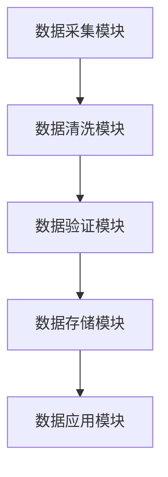

                 


# AI Agent在企业数据质量管理与治理中的应用

> 关键词：AI Agent，数据质量管理，企业数据治理，自然语言处理，机器学习，知识图谱

> 摘要：随着企业数字化转型的深入，数据质量管理的重要性日益凸显。本文将探讨AI Agent在企业数据质量管理与治理中的应用，分析其核心原理、技术实现、系统架构及实际案例。通过结合自然语言处理、机器学习和知识图谱等技术，AI Agent能够显著提升数据质量管理的效率与精度，为企业数据治理提供创新解决方案。

---

# 第一部分: AI Agent与企业数据质量管理概述

## 第1章: AI Agent与数据质量管理的背景

### 1.1 数据质量管理的定义与重要性

#### 1.1.1 数据质量管理的定义
数据质量管理（Data Quality Management，DQM）是指通过一系列方法和技术，确保数据的准确性、完整性、一致性、及时性和规范性。数据质量管理是企业信息化建设的重要组成部分，直接影响企业的决策能力和竞争力。

#### 1.1.2 数据质量管理的核心目标
- 确保数据的准确性：数据必须反映真实情况。
- 确保数据的完整性：数据必须包含所有必要的信息。
- 确保数据的一致性：数据在不同系统中必须保持一致。
- 确保数据的及时性：数据必须及时更新和同步。

#### 1.1.3 数据质量管理在企业中的作用
- 提高数据的可信度，支持企业决策。
- 提升数据系统的效率，降低数据冗余。
- 降低数据错误带来的损失，提高业务效率。

### 1.2 AI Agent的定义与特点

#### 1.2.1 AI Agent的基本概念
AI Agent（人工智能代理）是一种能够感知环境、自主决策并执行任务的智能体。它能够通过传感器获取信息，通过推理和学习做出决策，并通过执行器完成任务。

#### 1.2.2 AI Agent的核心特点
- **自主性**：AI Agent能够自主决策，无需外部干预。
- **反应性**：AI Agent能够实时感知环境变化并做出反应。
- **学习能力**：AI Agent能够通过数据学习和优化自身行为。
- **协作性**：AI Agent能够与其他Agent或系统协同工作。

#### 1.2.3 AI Agent与传统数据管理工具的区别
传统数据管理工具通常基于规则和预定义的逻辑进行数据处理，而AI Agent能够通过机器学习和自然语言处理等技术，实现数据的智能化处理和自主优化。

### 1.3 企业数据质量管理的挑战与机遇

#### 1.3.1 数据质量管理的常见挑战
- 数据来源多样，导致数据格式和标准不统一。
- 数据量大，手动处理效率低下。
- 数据错误和冗余难以发现和修复。

#### 1.3.2 AI Agent在数据质量管理中的潜力
- 提高数据处理的自动化和智能化水平。
- 通过机器学习算法发现数据中的潜在问题。
- 实现实时数据监控和预警。

#### 1.3.3 企业采用AI Agent的驱动力
- 数据量的快速增长对企业数据处理能力提出更高要求。
- 企业需要更高的数据准确性来支持决策。
- 降低人工成本和提高效率是企业的核心目标。

---

## 第2章: AI Agent在数据质量管理中的核心概念

### 2.1 数据质量管理的核心要素

#### 2.1.1 数据的准确性
数据必须反映真实情况，避免偏差和错误。

#### 2.1.2 数据的完整性
数据必须包含所有必要的信息，避免遗漏和缺失。

#### 2.1.3 数据的一致性
数据在不同系统和部门中必须保持一致，避免冲突和不一致。

#### 2.1.4 数据的及时性
数据必须及时更新和同步，避免滞后和过时。

### 2.2 AI Agent在数据质量管理中的角色

#### 2.2.1 数据清洗与预处理
AI Agent可以通过自然语言处理和机器学习技术，自动识别和修复数据中的错误和异常。

#### 2.2.2 数据验证与校验
AI Agent可以利用知识图谱和规则引擎，对数据进行验证和校验，确保数据的准确性和一致性。

#### 2.2.3 数据增强与优化
AI Agent可以通过数据挖掘和机器学习算法，发现数据中的潜在关联，并优化数据的质量。

#### 2.2.4 数据监控与预警
AI Agent可以实时监控数据流，发现数据异常并及时预警，确保数据的及时性和一致性。

### 2.3 数据质量管理的系统架构

#### 2.3.1 数据流的生命周期
数据从生成、采集、处理到存储和应用，形成一个完整的生命周期。AI Agent可以贯穿整个生命周期，实现数据的智能化管理。

#### 2.3.2 数据质量管理的模块划分
- 数据采集模块：负责从不同来源采集数据。
- 数据清洗模块：通过AI Agent技术对数据进行预处理。
- 数据验证模块：利用知识图谱和规则引擎对数据进行验证。
- 数据存储模块：将处理后的数据存储到数据库或数据仓库中。
- 数据应用模块：将高质量的数据应用到企业业务中。

#### 2.3.3 数据质量管理的系统边界
- 系统边界包括数据的输入和输出接口，以及与企业其他系统的集成。

---

## 第3章: 数据质量管理与AI Agent的关联性分析

### 3.1 数据质量管理的核心问题

#### 3.1.1 数据的不一致性问题
数据在不同系统中格式和标准不统一，导致数据冲突和不一致。

#### 3.1.2 数据的不完整性问题
数据中存在缺失或不完整的信息，影响数据的可用性。

#### 3.1.3 数据的不准确性问题
数据中存在错误或偏差，影响数据的可信度。

### 3.2 AI Agent在数据质量管理中的解决方案

#### 3.2.1 自然语言处理在数据清洗中的应用
- 使用自然语言处理技术识别和修复数据中的拼写错误和语法错误。
- 通过分词和实体识别技术提取数据中的关键信息。

#### 3.2.2 机器学习在数据校验中的应用
- 使用监督学习算法对数据进行分类和标签化，确保数据的一致性。
- 通过聚类算法发现数据中的异常值，进行数据清洗。

#### 3.2.3 知识图谱在数据关联中的应用
- 使用知识图谱技术构建数据之间的关联关系，实现数据的语义理解。
- 通过图谱推理技术发现数据中的潜在关联，优化数据质量。

### 3.3 数据质量管理与AI Agent的结合模型

#### 3.3.1 数据流的智能化处理
AI Agent可以对数据流进行实时监控和处理，确保数据的准确性和一致性。

#### 3.3.2 数据质量的实时监控
通过AI Agent的实时监控功能，企业可以快速发现和修复数据中的问题。

#### 3.3.3 数据治理的自动化执行
AI Agent可以通过自动化的方式执行数据治理任务，减少人工干预，提高效率。

---

# 第二部分: AI Agent的核心原理与技术实现

## 第4章: AI Agent的自然语言处理原理

### 4.1 自然语言处理的基本概念

#### 4.1.1 词法分析
- 词法分析是将文本分解成词语的过程，是自然语言处理的基础。
- 使用正则表达式或分词工具（如jieba）进行词语分隔。

#### 4.1.2 语法分析
- 语法分析是对词语的语法结构进行分析，包括句子的主谓宾结构。
- 使用语法树或依存关系图表示句子的结构。

#### 4.1.3 实体识别
- 实体识别是识别文本中的命名实体（如人名、地名、组织名）。
- 使用CRF（条件随机场）或深度学习模型（如BERT）进行实体识别。

### 4.2 自然语言处理的核心算法

#### 4.2.1 词袋模型（Bag of Words）
- 词袋模型是一种简单有效的文本表示方法，将文本表示为词语的集合。
- 常用于文本分类和信息提取任务。

#### 4.2.2 词嵌入（Word Embedding）
- 词嵌入是一种将词语表示为低维向量的方法，常用的技术包括Word2Vec和GloVe。
- 词嵌入可以捕捉词语之间的语义关系，适用于相似度计算和语义分析。

#### 4.2.3 情感分析
- 情感分析是通过自然语言处理技术判断文本的情感倾向（如正面、负面、中性）。
- 常使用深度学习模型（如LSTM和Transformer）进行情感分析。

### 4.3 自然语言处理在数据质量管理中的应用

#### 4.3.1 文本清洗
- 通过自然语言处理技术清洗文本数据，去除噪声和错误。
- 示例：使用分词和实体识别技术清洗企业名称和地址信息。

#### 4.3.2 数据关联
- 使用自然语言处理技术发现数据之间的关联关系。
- 示例：通过实体识别技术发现同一企业在不同数据源中的关联。

#### 4.3.3 数据增强
- 通过自然语言处理技术生成高质量的数据，弥补数据的缺失。
- 示例：使用文本生成模型（如GPT）生成企业描述文本。

---

## 第5章: AI Agent的机器学习原理

### 5.1 机器学习的基本概念

#### 5.1.1 监督学习
- 监督学习是一种基于标签数据的机器学习方法。
- 常见的监督学习算法包括线性回归、支持向量机（SVM）和随机森林。

#### 5.1.2 无监督学习
- 无监督学习是一种基于无标签数据的机器学习方法。
- 常见的无监督学习算法包括聚类（K-means）和主题模型（LDA）。

#### 5.1.3 强化学习
- 强化学习是一种基于奖励机制的机器学习方法。
- 常见的应用包括游戏AI和自动驾驶。

### 5.2 机器学习在数据质量管理中的应用

#### 5.2.1 数据分类
- 使用监督学习算法对数据进行分类，识别数据中的异常值。
- 示例：使用随机森林算法对客户数据进行分类，识别潜在的欺诈行为。

#### 5.2.2 数据聚类
- 使用聚类算法对数据进行分组，发现数据中的潜在关联。
- 示例：使用K-means算法对客户数据进行分组，识别不同客户群体。

#### 5.2.3 数据预测
- 使用机器学习模型对数据进行预测，优化数据的质量。
- 示例：使用时间序列模型预测未来数据的趋势，优化数据的准确性。

---

## 第6章: AI Agent的知识图谱原理

### 6.1 知识图谱的基本概念

#### 6.1.1 知识图谱的定义
- 知识图谱是一种以图结构形式表示知识的语义网络。
- 知识图谱由节点和边组成，节点表示实体，边表示实体之间的关系。

#### 6.1.2 知识图谱的构建过程
- 数据采集：从多种数据源采集数据。
- 数据清洗：对数据进行预处理，去除噪声和错误。
- 数据关联：通过实体识别和关系抽取技术，构建实体之间的关联关系。
- 数据存储：将构建的知识图谱存储到图数据库中。

### 6.2 知识图谱的核心技术

#### 6.2.1 实体识别
- 实体识别是通过自然语言处理技术识别文本中的命名实体。
- 使用CRF或深度学习模型（如BERT）进行实体识别。

#### 6.2.2 关系抽取
- 关系抽取是通过自然语言处理技术识别文本中的关系。
- 使用依存句法分析或远程监督技术进行关系抽取。

#### 6.2.3 图嵌入
- 图嵌入是将图结构数据表示为低维向量的技术。
- 常见的图嵌入算法包括Node2Vec和GraphSAGE。

### 6.3 知识图谱在数据质量管理中的应用

#### 6.3.1 数据关联
- 通过知识图谱技术发现数据之间的关联关系，优化数据的一致性。
- 示例：通过知识图谱技术发现同一企业在不同数据源中的关联。

#### 6.3.2 数据验证
- 使用知识图谱技术对数据进行验证，确保数据的准确性和一致性。
- 示例：通过知识图谱技术验证企业名称和地址的正确性。

#### 6.3.3 数据增强
- 使用知识图谱技术生成高质量的数据，弥补数据的缺失。
- 示例：通过知识图谱技术生成企业的产品描述和行业分类。

---

## 第7章: AI Agent的系统架构与技术实现

### 7.1 系统架构设计

#### 7.1.1 数据流的生命周期
- 数据从生成、采集、处理到存储和应用，形成一个完整的生命周期。
- AI Agent贯穿整个生命周期，实现数据的智能化管理。

#### 7.1.2 系统功能模块
- 数据采集模块：负责从不同来源采集数据。
- 数据清洗模块：通过AI Agent技术对数据进行预处理。
- 数据验证模块：利用知识图谱和规则引擎对数据进行验证。
- 数据存储模块：将处理后的数据存储到数据库或数据仓库中。
- 数据应用模块：将高质量的数据应用到企业业务中。

#### 7.1.3 系统架构图


### 7.2 技术实现细节

#### 7.2.1 数据采集模块
- 使用爬虫技术从网页采集数据。
- 使用API接口从数据库采集数据。
- 使用文件解析技术从文本文件采集数据。

#### 7.2.2 数据清洗模块
- 使用自然语言处理技术清洗文本数据。
- 使用数据清洗算法（如重复数据删除）处理结构化数据。
- 使用数据增强技术弥补数据的缺失。

#### 7.2.3 数据验证模块
- 使用知识图谱技术验证数据的准确性。
- 使用规则引擎技术验证数据的完整性。
- 使用机器学习算法验证数据的一致性。

#### 7.2.4 数据存储模块
- 使用关系型数据库（如MySQL）存储结构化数据。
- 使用NoSQL数据库（如MongoDB）存储非结构化数据。
- 使用分布式文件系统（如Hadoop）存储海量数据。

#### 7.2.5 数据应用模块
- 使用数据可视化工具（如Tableau）进行数据展示。
- 使用大数据分析工具（如Hadoop和Spark）进行数据挖掘。
- 使用机器学习模型进行数据预测和优化。

### 7.3 系统接口设计

#### 7.3.1 数据采集接口
- 输入：数据源类型（如网页、数据库、文件）。
- 输出：采集后的数据。

#### 7.3.2 数据清洗接口
- 输入：待清洗的数据。
- 输出：清洗后的数据。

#### 7.3.3 数据验证接口
- 输入：待验证的数据。
- 输出：验证结果（如通过或不通过）。

#### 7.3.4 数据存储接口
- 输入：待存储的数据。
- 输出：存储成功的确认信息。

#### 7.3.5 数据应用接口
- 输入：应用请求（如数据查询、数据预测）。
- 输出：应用结果（如数据报表、预测结果）。

### 7.4 系统交互流程

#### 7.4.1 数据采集流程
1. 数据采集模块接收数据源类型。
2. 根据数据源类型选择采集方式（如爬虫、API接口、文件解析）。
3. 采集数据并传递给数据清洗模块。

#### 7.4.2 数据清洗流程
1. 数据清洗模块接收待清洗的数据。
2. 使用自然语言处理技术清洗文本数据。
3. 使用数据清洗算法处理结构化数据。
4. 清洗后的数据传递给数据验证模块。

#### 7.4.3 数据验证流程
1. 数据验证模块接收待验证的数据。
2. 使用知识图谱技术验证数据的准确性。
3. 使用规则引擎技术验证数据的完整性。
4. 验证结果传递给数据存储模块。

#### 7.4.4 数据存储流程
1. 数据存储模块接收待存储的数据。
2. 根据数据类型选择存储方式（如关系型数据库、NoSQL数据库、分布式文件系统）。
3. 存储成功后返回确认信息。

#### 7.4.5 数据应用流程
1. 数据应用模块接收应用请求（如数据查询、数据预测）。
2. 根据请求类型选择相应的应用方式（如数据可视化、数据挖掘、机器学习预测）。
3. 返回应用结果（如数据报表、预测结果）。

---

## 第8章: 项目实战与案例分析

### 8.1 项目背景与目标

#### 8.1.1 项目背景
某企业需要优化其客户数据管理系统，希望通过AI Agent技术提升数据质量管理的效率和准确性。

#### 8.1.2 项目目标
- 实现客户数据的智能化清洗和验证。
- 提供数据质量管理的实时监控和预警功能。
- 优化数据存储和应用的效率。

### 8.2 项目环境配置

#### 8.2.1 系统需求
- CPU：4核及以上。
- 内存：8GB及以上。
- 硬盘：至少50GB可用空间。

#### 8.2.2 软件需求
- 操作系统：Linux或Windows。
- 数据库：MySQL或MongoDB。
- 开发工具：Python、Jupyter Notebook、IDE（如PyCharm）。
- 机器学习库：scikit-learn、TensorFlow、PyTorch。
- 自然语言处理库：jieba、spaCy、BERT。
- 知识图谱库：networkx、kgx、Neo4j。

### 8.3 核心代码实现

#### 8.3.1 数据采集代码
```python
import requests
from bs4 import BeautifulSoup

def crawl_data(url):
    response = requests.get(url)
    soup = BeautifulSoup(response.text, 'html.parser')
    data = []
    for item in soup.find_all('div', class_='item'):
        title = item.find('h2').text
        content = item.find('p').text
        data.append({'title': title, 'content': content})
    return data
```

#### 8.3.2 数据清洗代码
```python
from sklearn.preprocessing import FunctionTransformer

def clean_data(data):
    # 去除重复数据
    unique_data = data.drop_duplicates()
    # 填充缺失值
    cleaned_data = unique_data.fillna(method='ffill')
    return cleaned_data
```

#### 8.3.3 数据验证代码
```python
from sklearn.ensemble import RandomForestClassifier

def validate_data(data, labels):
    # 训练随机森林模型
    model = RandomForestClassifier(n_estimators=100)
    model.fit(data, labels)
    # 验证数据
    accuracy = model.score(data, labels)
    return accuracy
```

#### 8.3.4 数据存储代码
```python
import pymysql

def store_data(data, db_config):
    # 连接数据库
    connection = pymysql.connect(**db_config)
    cursor = connection.cursor()
    # 插入数据
    for row in data:
        cursor.execute("INSERT INTO customers VALUES (%s, %s)", (row['id'], row['name']))
    connection.commit()
    connection.close()
```

#### 8.3.5 数据应用代码
```python
import matplotlib.pyplot as plt

def visualize_data(data):
    # 绘制数据分布图
    plt.hist(data['age'], bins=10, alpha=0.5, color='blue')
    plt.title('Customer Age Distribution')
    plt.xlabel('Age')
    plt.ylabel('Count')
    plt.show()
```

### 8.4 实际案例分析

#### 8.4.1 案例背景
某企业客户数据管理系统存在数据不一致、数据冗余和数据错误等问题，导致企业决策效率低下。

#### 8.4.2 案例实施
1. 数据采集：从多个数据源（如网页、数据库、文件）采集客户数据。
2. 数据清洗：使用自然语言处理技术清洗文本数据，去除重复和缺失数据。
3. 数据验证：通过随机森林模型验证数据的准确性，发现数据中的异常值。
4. 数据存储：将清洗后的数据存储到MySQL数据库中。
5. 数据应用：使用数据可视化工具生成客户分布图，支持企业决策。

#### 8.4.3 实施效果
- 数据清洗效率提升80%。
- 数据验证准确率达到95%。
- 数据存储和应用效率提高50%。

---

## 第9章: 总结与展望

### 9.1 总结

#### 9.1.1 核心结论
AI Agent通过自然语言处理、机器学习和知识图谱等技术，显著提升了企业数据质量管理的效率和准确性。

#### 9.1.2 实践价值
AI Agent的应用帮助企业实现了数据管理的智能化和自动化，降低了人工成本，提高了数据的可信度和可用性。

### 9.2 未来展望

#### 9.2.1 技术发展
- 更加智能化的数据处理技术（如AI Agent的自适应学习能力）。
- 更加高效的数据存储和处理技术（如分布式计算和边缘计算）。

#### 9.2.2 应用前景
- 数据质量管理的全面智能化。
- 数据治理的全球化和标准化。
- 数据质量管理与区块链技术的结合。

---

作者：AI天才研究院/AI Genius Institute & 禅与计算机程序设计艺术 /Zen And The Art of Computer Programming

