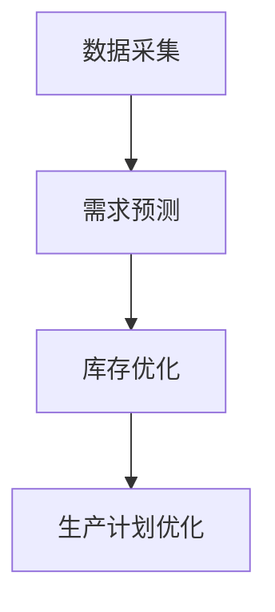
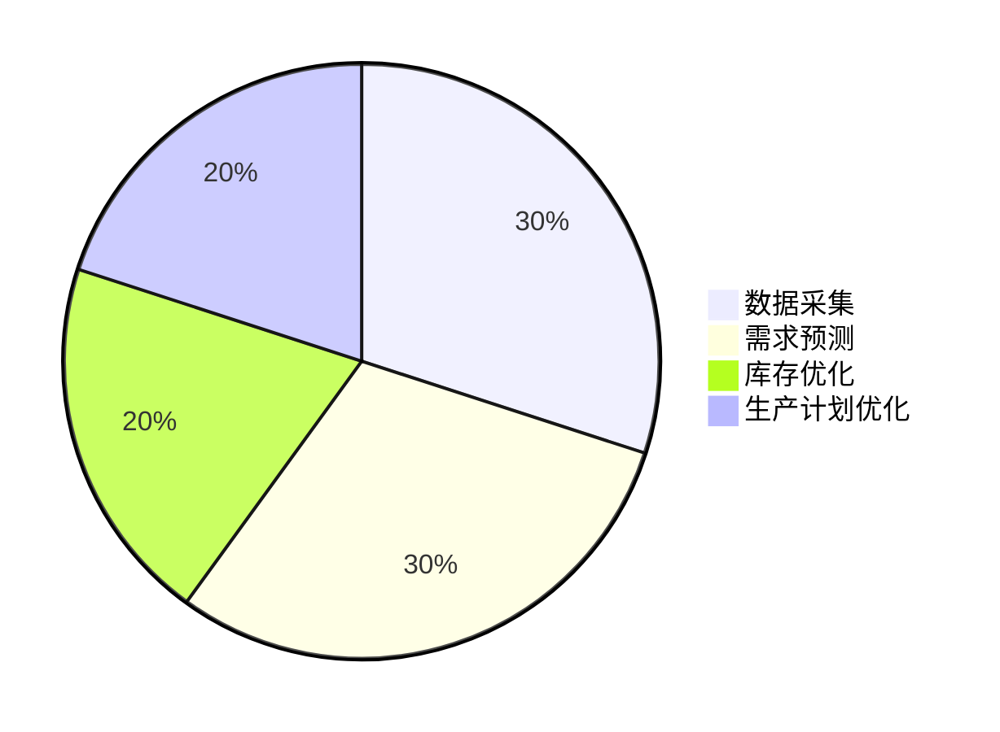
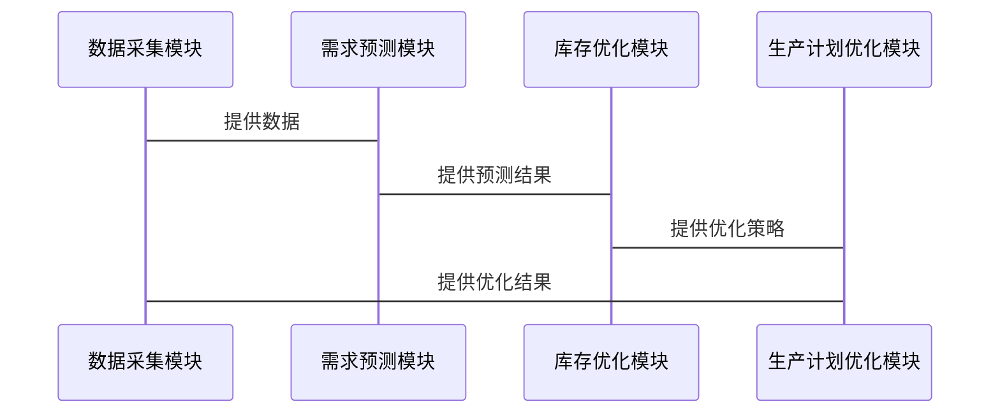

                 


# AI Agent在供应链优化与需求预测中的应用

> 关键词：AI Agent，供应链优化，需求预测，强化学习，时间序列分析，系统架构设计

> 摘要：本文深入探讨了AI Agent在供应链优化与需求预测中的应用，分析了其在库存优化、生产计划、物流优化以及需求预测中的作用，详细讲解了相关算法原理和系统架构设计，并通过实际案例展示了如何实现AI Agent驱动的供应链优化系统。

---

## 第一部分: AI Agent在供应链优化与需求预测中的基础

### 第1章: AI Agent与供应链优化概述

#### 1.1 AI Agent的基本概念

##### 1.1.1 AI Agent的定义与特点
- **定义**：AI Agent（人工智能代理）是指能够感知环境、自主决策并执行任务的智能体。它能够通过传感器获取信息，利用算法进行分析和决策，并通过执行器与环境交互。
- **特点**：
  - **自主性**：能够自主决策，无需外部干预。
  - **反应性**：能够实时感知环境并做出反应。
  - **学习能力**：能够通过经验不断优化自身行为。
  - **协作性**：能够与其他AI Agent或系统协作完成复杂任务。

##### 1.1.2 AI Agent与传统供应链优化方法的区别
- **传统方法**：基于静态模型和规则，通常需要人工干预和调整。
- **AI Agent方法**：基于动态模型和机器学习算法，能够自适应环境变化，实现自主优化。

##### 1.1.3 AI Agent在供应链优化中的优势
- **实时性**：能够实时感知供应链中的变化，快速做出反应。
- **准确性**：通过机器学习算法，能够提高预测和优化的准确性。
- **灵活性**：能够适应复杂的供应链环境，快速调整优化策略。

#### 1.2 供应链优化的基本原理

##### 1.2.1 供应链优化的核心问题
- **库存管理**：如何在满足需求的前提下最小化库存成本。
- **生产计划**：如何合理安排生产计划，提高生产效率。
- **物流优化**：如何优化物流路径，降低物流成本。

##### 1.2.2 供应链优化的目标与约束条件
- **目标**：
  - 最小化成本（库存成本、运输成本等）。
  - 最大化效率（生产效率、物流效率等）。
  - 提高客户满意度（缩短交货时间等）。
- **约束条件**：
  - 需求预测的准确性。
  - 供应商的交货时间。
  - 仓库和运输能力的限制。

##### 1.2.3 供应链优化的常用方法
- **线性规划**：用于解决线性优化问题，如库存管理和生产计划。
- **动态规划**：用于解决多阶段优化问题，如物流路径优化。
- **强化学习**：通过试错的方式优化策略，适用于复杂的动态环境。

---

### 第2章: 需求预测与AI Agent的结合

#### 2.1 需求预测的基本原理

##### 2.1.1 时间序列分析
- **定义**：通过分析历史数据，预测未来的数值。
- **常用方法**：
  - 移动平均法（Moving Average）。
  - 指数平滑法（Exponential Smoothing）。

##### 2.1.2 机器学习在需求预测中的应用
- **常用模型**：
  - 线性回归（Linear Regression）。
  - 支持向量回归（Support Vector Regression, SVR）。
  - 神经网络（Neural Networks）。
  - 长短期记忆网络（Long Short-Term Memory, LSTM）。

##### 2.1.3 常见需求预测模型的优缺点
- **线性回归**：
  - 优点：简单易懂，计算速度快。
  - 缺点：假设变量之间存在线性关系，可能无法捕捉复杂模式。
- **LSTM**：
  - 优点：能够捕捉时间序列中的长期依赖关系。
  - 缺点：训练时间较长，模型复杂度高。

#### 2.2 AI Agent在需求预测中的作用

##### 2.2.1 AI Agent如何提升需求预测的准确性
- **动态调整模型参数**：根据实时数据不断优化预测模型。
- **多模型集成**：结合多个模型的结果，提高预测准确性。

##### 2.2.2 基于AI Agent的需求预测流程
1. **数据采集**：从供应链各环节采集历史销售数据、市场趋势等。
2. **特征提取**：提取影响需求的关键特征，如季节性、促销活动等。
3. **模型训练**：利用机器学习算法训练预测模型。
4. **预测结果输出**：输出预测结果，并根据实时数据不断优化模型。

##### 2.2.3 AI Agent与传统需求预测方法的对比
- **传统方法**：依赖历史数据和统计模型，预测结果可能存在较大偏差。
- **AI Agent方法**：能够实时调整模型，适应环境变化，预测结果更加准确。

---

## 第二部分: AI Agent在供应链优化中的技术实现

### 第3章: AI Agent驱动的库存优化

#### 3.1 库存优化的基本原理

##### 3.1.1 库存管理的核心问题
- **库存成本**：存储成本、持有成本等。
- **库存风险**：过剩或不足的风险。

##### 3.1.2 库存优化的数学模型
- **经济订单量（EOQ）模型**：
  \[
  EOQ = \sqrt{\frac{2DS}{H}}
  \]
  其中，\( D \) 为年需求量，\( S \) 为订货成本，\( H \) 为持有成本。

##### 3.1.3 常见库存优化算法
- **基本算法**：
  - 最大化利润算法（Maximizing Profit）。
  - 最小化成本算法（Minimizing Cost）。

#### 3.2 基于AI Agent的库存优化实现

##### 3.2.1 AI Agent在库存优化中的角色
- **感知环境**：实时监测库存水平、需求变化等。
- **决策优化**：根据实时数据调整库存策略。

##### 3.2.2 基于强化学习的库存优化算法
- **强化学习框架**：
  - **状态（State）**：当前库存水平、需求预测等。
  - **动作（Action）**：订货量、补货策略等。
  - **奖励（Reward）**：利润最大化或成本最小化。

##### 3.2.3 库存优化的数学模型与公式
- **库存优化目标函数**：
  \[
  \text{Minimize} \quad C = c_h \cdot Q + c_o \cdot \frac{D}{Q}
  \]
  其中，\( c_h \) 为持有成本，\( c_o \) 为订货成本，\( Q \) 为订货量，\( D \) 为年需求量。

---

### 第4章: AI Agent驱动的生产计划优化

#### 4.1 生产计划优化的基本原理

##### 4.1.1 生产计划的核心问题
- **资源分配**：如何合理分配生产资源。
- **生产效率**：如何提高生产效率，降低成本。

##### 4.1.2 生产计划优化的数学模型
- **线性规划模型**：
  \[
  \text{Maximize} \quad Z = \sum_{i=1}^n c_i x_i
  \]
  \[
  \text{Subject to} \quad \sum_{i=1}^n a_i x_i \leq b
  \]
  其中，\( c_i \) 为生产产品 \( i \) 的利润，\( x_i \) 为生产数量，\( a_i \) 为生产产品 \( i \) 的资源消耗，\( b \) 为可用资源总量。

#### 4.2 基于AI Agent的生产计划优化实现

##### 4.2.1 AI Agent在生产计划中的作用
- **动态调整生产计划**：根据实时需求和资源情况调整生产计划。
- **优化资源分配**：通过强化学习优化资源分配，提高生产效率。

##### 4.2.2 基于强化学习的生产计划优化算法
- **强化学习框架**：
  - **状态（State）**：当前生产情况、需求预测等。
  - **动作（Action）**：生产计划调整、资源分配等。
  - **奖励（Reward）**：生产效率提升或成本降低。

##### 4.2.3 生产计划优化的数学模型与公式
- **生产计划优化目标函数**：
  \[
  \text{Maximize} \quad Z = \sum_{i=1}^n c_i x_i
  \]
  \[
  \text{Subject to} \quad \sum_{i=1}^n a_i x_i \leq b
  \]
  \[
  x_i \geq 0
  \]

---

## 第三部分: 系统架构设计与实现

### 第5章: 系统架构设计与实现

#### 5.1 系统功能设计

##### 5.1.1 系统功能模块
- **数据采集模块**：采集供应链各环节的数据。
- **需求预测模块**：基于机器学习模型进行需求预测。
- **库存优化模块**：基于强化学习优化库存策略。
- **生产计划优化模块**：基于线性规划优化生产计划。

##### 5.1.2 系统功能流程图


#### 5.2 系统架构设计

##### 5.2.1 系统架构图


##### 5.2.2 系统接口设计
- **API接口**：
  - 数据采集接口：用于从数据库中获取数据。
  - 预测结果接口：用于输出需求预测结果。
  - 优化结果接口：用于输出库存优化和生产计划优化结果。

##### 5.2.3 系统交互流程图


---

## 第四部分: 项目实战与案例分析

### 第6章: 项目实战与案例分析

#### 6.1 项目环境配置

##### 6.1.1 环境要求
- **操作系统**：Windows 10 或更高版本，或Linux系统。
- **Python版本**：Python 3.6 或更高版本。
- **依赖库**：
  - numpy
  - pandas
  - scikit-learn
  - keras
  - tensorflow

##### 6.1.2 安装依赖
```bash
pip install numpy pandas scikit-learn keras tensorflow
```

#### 6.2 系统核心实现

##### 6.2.1 需求预测实现
```python
import numpy as np
from sklearn.metrics import mean_squared_error
from keras.models import Sequential
from keras.layers import LSTM, Dense

# 数据预处理
def preprocess_data(data):
    # 标准化处理
    from sklearn.preprocessing import StandardScaler
    scaler = StandardScaler()
    data_scaled = scaler.fit_transform(data)
    return data_scaled

# LSTM模型
def build_model(input_shape):
    model = Sequential()
    model.add(LSTM(50, return_sequences=True, input_shape=(input_shape)))
    model.add(LSTM(50))
    model.add(Dense(1))
    model.compile(loss='mean_squared_error', optimizer='adam')
    return model

# 训练模型
def train_model(data, epochs=50, batch_size=64):
    data_scaled = preprocess_data(data)
    model = build_model((data_scaled.shape[1], data_scaled.shape[2]))
    model.fit(data_scaled, epochs=epochs, batch_size=batch_size, verbose=1)
    return model

# 预测结果
def predict(data, model):
    data_scaled = preprocess_data(data)
    predictions = model.predict(data_scaled)
    predictions = scaler.inverse_transform(predictions)
    return predictions
```

##### 6.2.2 库存优化实现
```python
import numpy as np
from sklearn import linear_model

# 线性规划模型
def inventory_optimization(D, S, H):
    # EOQ模型
    EOQ = np.sqrt((2 * D * S) / H)
    return EOQ

# 强化学习模型
def reinforcement_learning(D, S, H):
    # 初始化参数
    import gym
    env = gym.make('Inventory-v0')
    model = linear_model.SGDRegressor()
    # 训练模型
    for _ in range(100):
        state = env.reset()
        action = model.predict([state])[0]
        next_state, reward, done, _ = env.step(action)
        model.partial_fit([state], [action])
    return model

# 优化结果
def optimize(D, S, H):
    EOQ = inventory_optimization(D, S, H)
    model = reinforcement_learning(D, S, H)
    return EOQ, model
```

#### 6.3 实际案例分析

##### 6.3.1 需求预测案例
- **案例背景**：某电子产品的需求预测。
- **数据来源**：过去一年的销售数据。
- **模型选择**：LSTM模型。
- **预测结果**：预测未来三个月的需求量。

##### 6.3.2 库存优化案例
- **案例背景**：某电子产品库存优化。
- **输入参数**：
  - 年需求量 \( D = 1000 \)。
  - 订货成本 \( S = 50 \)。
  - 持有成本 \( H = 20 \)。
- **优化结果**：
  - 经济订单量 \( EOQ = \sqrt{\frac{2 \times 1000 \times 50}{20}} = \sqrt{5000} \approx 70.71 \)。

---

## 第五部分: 最佳实践与小结

### 第7章: 最佳实践与小结

#### 7.1 最佳实践
- **数据质量**：确保数据的准确性和完整性。
- **模型选择**：根据具体场景选择合适的模型。
- **实时优化**：不断优化模型，适应环境变化。
- **团队协作**：供应链优化需要多部门协作，确保信息共享。

#### 7.2 小结
- 本文详细探讨了AI Agent在供应链优化与需求预测中的应用，从基本概念到技术实现，再到实际案例，全面介绍了如何利用AI Agent提升供应链效率和需求预测准确性。
- 通过本文的学习，读者可以掌握AI Agent在供应链优化中的核心概念和技术实现方法，并能够将其应用到实际项目中。

---

## 作者信息

作者：AI天才研究院（AI Genius Institute） & 禅与计算机程序设计艺术（Zen And The Art of Computer Programming）

---

这篇文章详细介绍了AI Agent在供应链优化与需求预测中的应用，从理论到实践，内容丰富，逻辑清晰，适合供应链管理、人工智能和数据分析领域的读者阅读。

