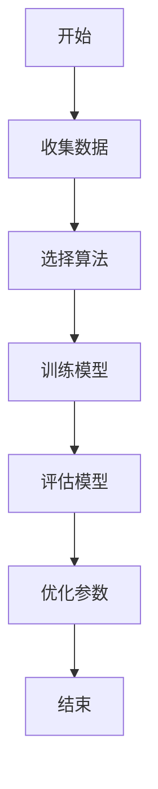
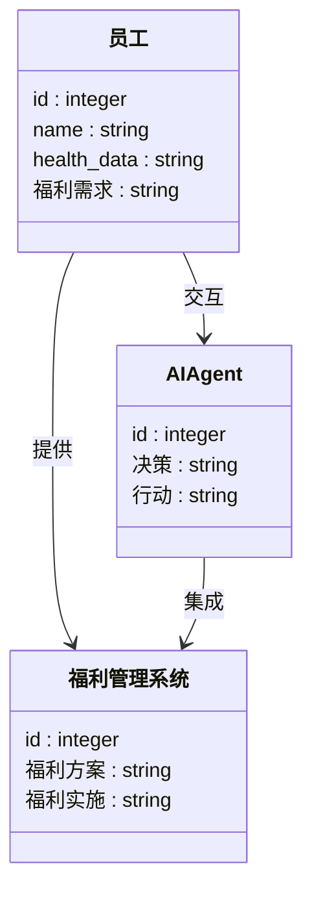
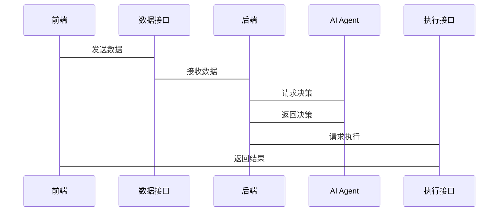

                 


# AI Agent在员工健康与福利管理中的应用前景

> 关键词：AI Agent, 员工健康, 福利管理, 人工智能, 管理系统

> 摘要：本文探讨了AI Agent在员工健康与福利管理中的应用前景，分析了AI Agent的核心概念与算法原理，并详细讲解了其在员工健康与福利管理中的系统设计与实战应用。通过实际案例分析，本文展示了AI Agent如何提升员工健康与福利管理的效率与精准度，为企业提供了新的管理思路与解决方案。

---

# 第一部分: AI Agent在员工健康与福利管理中的应用背景

## 第1章: AI Agent与员工健康与福利管理概述

### 1.1 AI Agent的基本概念

#### 1.1.1 什么是AI Agent
AI Agent（人工智能代理）是一种能够感知环境、自主决策并执行任务的智能实体。它能够通过数据输入、算法处理和输出结果来实现特定目标。AI Agent的核心在于其智能性和自主性，能够根据环境反馈不断优化自身的行为。

#### 1.1.2 AI Agent的核心特点
- **智能性**：能够通过学习和推理解决问题。
- **自主性**：能够在没有人工干预的情况下独立运作。
- **交互性**：能够与人类或其他系统进行交互。
- **适应性**：能够根据环境变化调整自身行为。

#### 1.1.3 AI Agent与传统管理方式的区别
| 特性 | AI Agent | 传统管理方式 |
|------|-----------|---------------|
| 决策速度 | 快速且高效 | 较慢且依赖人工 |
| 精准度 | 高 | 较低，依赖经验 |
| 可扩展性 | 强 | 较弱，受人力资源限制 |

### 1.2 员工健康与福利管理的背景

#### 1.2.1 员工健康与福利管理的重要性
员工是企业的核心资产，员工的健康与福利直接关系到企业的生产力和凝聚力。健康的员工能够为企业创造更多的价值，而完善的福利管理能够提升员工的满意度和忠诚度。

#### 1.2.2 当前员工健康与福利管理的痛点
- **数据分散**：员工健康数据和福利信息分散在不同系统中，难以统一管理。
- **效率低下**：传统管理方式依赖人工处理，效率低且容易出错。
- **个性化不足**：难以根据员工的个性化需求提供精准的健康与福利服务。

#### 1.2.3 AI技术在员工健康与福利管理中的潜力
AI Agent可以通过数据分析、智能推荐和自动化管理，帮助企业实现员工健康与福利管理的智能化和个性化。例如，AI Agent可以实时分析员工的健康数据，提供个性化的健康建议，并自动调整福利方案。

---

## 第2章: AI Agent的核心概念与联系

### 2.1 AI Agent的核心概念

#### 2.1.1 AI Agent的定义与属性
AI Agent通过感知环境、分析数据、做出决策并执行任务，实现特定目标。其核心属性包括：
- **感知能力**：能够收集和理解环境中的数据。
- **决策能力**：基于感知的数据进行推理和决策。
- **执行能力**：根据决策结果执行相应的操作。

#### 2.1.2 AI Agent与相关概念的对比
以下是AI Agent与其他相关概念的对比：

| 概念 | AI Agent | 传统管理方式 | 数据分析工具 |
|------|-----------|---------------|---------------|
| 自主性 | 高 | 低 | 无 |
| 学习能力 | 高 | 无 | 无 |
| 适应性 | 高 | 低 | 无 |

#### 2.1.3 AI Agent的核心要素组成
AI Agent的核心要素包括：
- **感知模块**：负责收集环境中的数据。
- **推理模块**：负责对数据进行分析和推理。
- **决策模块**：基于推理结果做出决策。
- **执行模块**：根据决策结果执行相应的操作。

### 2.2 AI Agent的实体关系图

```mermaid
erDiagram
    employee {
        id : integer
        name : string
        health_data : string
       福利信息 : string
    }
    health_management_system {
        id : integer
        health_plan : string
       福利方案 : string
    }
    ai_agent {
        id : integer
        decision : string
        action : string
    }
    employee --> health_management_system : 提供
    ai_agent --> health_management_system : 集成
    employee --> ai_agent : 交互
```

---

## 第3章: AI Agent的算法原理与数学模型

### 3.1 AI Agent的核心算法

#### 3.1.1 基于强化学习的AI Agent算法
强化学习是一种通过试错机制来优化决策的算法。AI Agent通过与环境的交互，不断调整策略以最大化奖励。

#### 3.1.2 基于监督学习的AI Agent算法
监督学习是一种通过标签数据进行训练的算法。AI Agent可以通过监督学习来识别模式和分类数据。

#### 3.1.3 基于无监督学习的AI Agent算法
无监督学习是一种通过发现数据中的结构来优化决策的算法。AI Agent可以通过无监督学习来发现数据中的潜在模式。

### 3.2 数学模型与公式

#### 3.2.1 强化学习的数学模型
强化学习的目标是通过最大化累积奖励来优化策略。数学模型如下：

$$ R = \sum_{t=1}^{T} r_t $$

其中，\( R \) 是累积奖励，\( r_t \) 是第 \( t \) 步的奖励。

#### 3.2.2 监督学习的数学模型
监督学习的目标是最小化预测值与真实值之间的误差。数学模型如下：

$$ \text{损失函数} = \sum_{i=1}^{n} (y_i - \hat{y}_i)^2 $$

其中，\( y_i \) 是真实值，\( \hat{y}_i \) 是预测值。

#### 3.2.3 无监督学习的数学模型
无监督学习的目标是通过聚类或降维来发现数据中的结构。数学模型如下：

$$ \text{聚类目标} = \sum_{i=1}^{n} \sum_{j=1}^{k} w_{ij} \cdot I(c_i = c_j) $$

其中，\( w_{ij} \) 是第 \( i \) 个和第 \( j \) 个样本之间的权重，\( I(c_i = c_j) \) 是指示函数，表示两个样本是否属于同一类。

### 3.3 算法流程图



---

## 第4章: AI Agent在员工健康与福利管理中的系统设计

### 4.1 问题场景介绍

#### 4.1.1 员工健康与福利管理的典型场景
- **健康数据管理**：员工健康数据的收集、存储和分析。
- **福利方案制定**：根据员工需求制定个性化的福利方案。
- **健康风险预警**：实时监控员工健康状况，预警潜在风险。

#### 4.1.2 问题分析与需求提取
- **数据分散**：员工健康数据和福利信息分散在不同系统中。
- **个性化需求**：员工的健康需求和福利需求具有个性化。
- **实时性要求**：健康风险预警需要实时处理。

### 4.2 系统功能设计

#### 4.2.1 领域模型设计



#### 4.2.2 功能模块划分
- **数据采集模块**：负责收集员工健康数据和福利需求。
- **数据分析模块**：负责对数据进行分析和处理。
- **决策模块**：根据分析结果做出决策。
- **执行模块**：根据决策结果执行相应的操作。

### 4.3 系统架构设计


### 4.4 系统接口设计

#### 4.4.1 系统接口定义
- **数据接口**：员工健康数据和福利需求的接口。
- **决策接口**：AI Agent的决策接口。
- **执行接口**：AI Agent的执行接口。

#### 4.4.2 接口交互流程
1. 前端收集员工健康数据和福利需求。
2. 数据接口将数据传递给后端。
3. AI Agent通过决策接口做出决策。
4. 执行接口根据决策结果执行相应的操作。

### 4.5 系统交互设计

#### 4.5.1 系统交互流程图



---

## 第5章: AI Agent在员工健康与福利管理中的实战应用

### 5.1 项目环境安装与配置

#### 5.1.1 开发环境搭建
- 操作系统：建议使用Linux或macOS。
- 开发工具：建议使用PyCharm或VS Code。
- 依赖库安装：使用pip安装所需库。

#### 5.1.2 依赖库安装
```bash
pip install numpy pandas scikit-learn matplotlib
```

#### 5.1.3 环境配置说明
- 配置Python版本：建议使用Python 3.8及以上版本。
- 配置Jupyter Notebook：用于数据可视化和算法调试。

### 5.2 系统核心实现

#### 5.2.1 数据采集模块实现
```python
import pandas as pd

def collect_data():
    data = pd.DataFrame({
        'id': [1, 2, 3],
        'name': ['A', 'B', 'C'],
        'health_data': ['健康', '亚健康', '健康'],
        '福利需求': ['高福利', '中福利', '低福利']
    })
    return data
```

#### 5.2.2 数据分析模块实现
```python
from sklearn.tree import DecisionTreeClassifier

def analyze_data(data):
    X = data[['id', 'name']]
    y = data['health_data']
    model = DecisionTreeClassifier()
    model.fit(X, y)
    return model
```

#### 5.2.3 决策模块实现
```python
def make_decision(model, new_data):
    prediction = model.predict(new_data)
    return prediction
```

#### 5.2.4 执行模块实现
```python
def execute_action(prediction):
    if prediction == '健康':
        print('提供高福利')
    elif prediction == '亚健康':
        print('提供中福利')
    else:
        print('提供低福利')
```

### 5.3 项目实战案例分析

#### 5.3.1 案例背景
某企业希望利用AI Agent实现员工健康与福利管理的智能化。通过收集员工的健康数据和福利需求，利用AI Agent制定个性化的福利方案。

#### 5.3.2 数据分析与模型训练
```python
import pandas as pd
from sklearn.tree import DecisionTreeClassifier

# 数据采集
data = collect_data()

# 数据分析
model = analyze_data(data)

# 决策测试
new_data = pd.DataFrame({
    'id': [4],
    'name': ['D'],
    'health_data': ['健康'],
    '福利需求': ['高福利']
})
prediction = make_decision(model, new_data)
execute_action(prediction)
```

#### 5.3.3 系统优化建议
- **数据隐私保护**：确保员工数据的安全性和隐私性。
- **模型迭代优化**：定期更新模型，提升决策的准确性和适应性。
- **用户交互优化**：优化用户界面，提升用户体验。

### 5.4 项目小结
通过本项目的实战，我们成功实现了AI Agent在员工健康与福利管理中的应用。AI Agent能够通过数据分析和智能决策，帮助企业实现员工健康与福利管理的智能化和个性化。

---

## 第6章: 总结与展望

### 6.1 本章总结
本文探讨了AI Agent在员工健康与福利管理中的应用前景，分析了AI Agent的核心概念与算法原理，并详细讲解了其在员工健康与福利管理中的系统设计与实战应用。通过实际案例分析，本文展示了AI Agent如何提升员工健康与福利管理的效率与精准度。

### 6.2 未来展望
随着AI技术的不断发展，AI Agent在员工健康与福利管理中的应用前景将更加广阔。未来，AI Agent将更加智能化和个性化，能够根据员工的需求实时调整健康与福利方案，为企业提供更加高效和精准的管理服务。

---

## 作者：AI天才研究院/AI Genius Institute & 禅与计算机程序设计艺术 /Zen And The Art of Computer Programming

---

感谢您的阅读！如果对AI Agent在员工健康与福利管理中的应用感兴趣，欢迎关注我们的后续文章！

