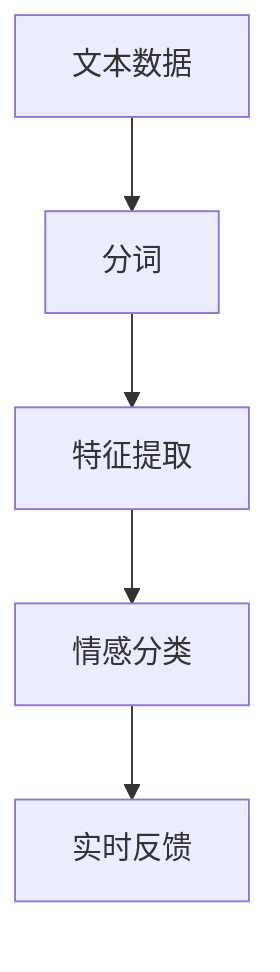
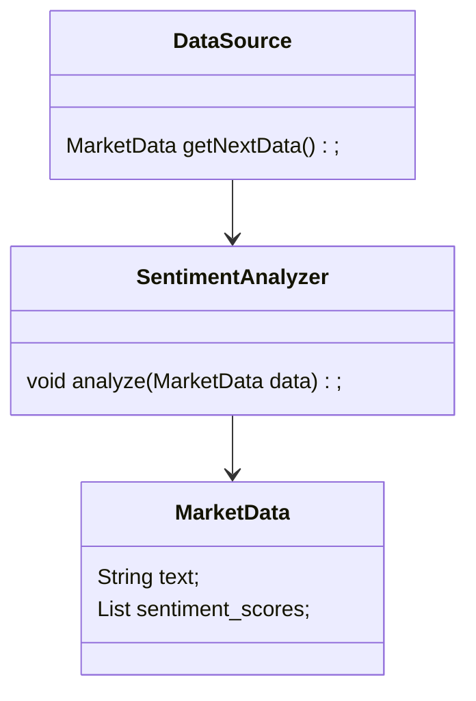
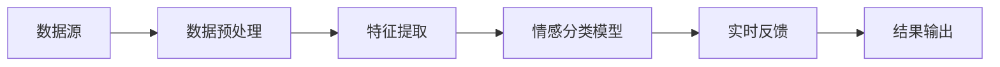

                 


# 人工智能在实时市场情绪分析中的应用

> **关键词**：人工智能、市场情绪分析、实时分析、自然语言处理、深度学习、数据流处理

> **摘要**：  
> 本文深入探讨了人工智能在实时市场情绪分析中的应用，结合技术背景、核心概念、算法原理、系统架构与项目实战，系统性地分析了如何利用NLP技术、深度学习模型和实时数据处理技术来实现对市场情绪的实时捕捉与分析。通过详细讲解理论基础、算法实现与实际案例，本文为读者提供了从理论到实践的完整指导，帮助理解如何利用AI技术提升市场情绪分析的效率与准确性。

---

## 第1章: 问题背景与定义

### 1.1 问题背景

#### 1.1.1 市场情绪分析的重要性
市场情绪分析是金融领域的重要研究方向，旨在通过分析新闻、社交媒体、论坛等文本数据，捕捉市场参与者的情绪变化，进而预测市场趋势。实时市场情绪分析能够帮助投资者快速响应市场动态，做出更明智的投资决策。

#### 1.1.2 传统情绪分析的局限性
传统的市场情绪分析方法通常依赖于规则或统计模型，存在以下局限性：
- 数据处理速度慢，难以满足实时需求。
- 情感分类的准确性较低，难以捕捉复杂的情绪变化。
- 对非结构化数据的处理能力有限，难以应对海量数据。

#### 1.1.3 实时分析的必要性
在瞬息万变的金融市场中，实时分析能够帮助投资者快速响应市场情绪变化，捕捉短期趋势，从而在竞争中占据优势。

---

### 1.2 实时市场情绪分析的定义

#### 1.2.1 核心概念
- **市场情绪**：市场参与者对某种资产、市场或经济状况的情感倾向，通常分为正面、负面和中性三种。
- **实时分析**：基于最新的文本数据，快速生成市场情绪的动态评估。

#### 1.2.2 分析目标
- 准确捕捉市场情绪变化。
- 提供实时情绪指标，辅助投资决策。
- 预测市场趋势。

#### 1.2.3 应用场景
- 股票市场：分析新闻、社交媒体情绪，预测股票价格波动。
- 加密货币市场：实时监控市场情绪，指导交易决策。
- 商品市场：分析供应链相关新闻，预测价格走势。

---

## 第2章: 技术基础与现状

### 2.1 人工智能与自然语言处理

#### 2.1.1 NLP技术在情绪分析中的应用
- **文本预处理**：分词、去停用词、词干提取。
- **特征提取**：词袋模型、TF-IDF、词嵌入。
- **情感分类**：基于深度学习的模型（如LSTM、Transformer）。

#### 2.1.2 深度学习模型的发展
- 从传统的RNN到现代的Transformer架构，深度学习模型在情绪分析中的表现不断提升。
- 模型的可解释性与实时性是当前研究的热点。

#### 2.1.3 实时处理的技术挑战
- 数据流的高效处理。
- 模型的在线更新与优化。
- 系统的可扩展性与稳定性。

### 2.2 当前市场情绪分析的主流方法

#### 2.2.1 基于规则的方法
- 通过预定义的关键词和规则匹配情绪。
- 优点：简单易实现。
- 缺点：难以捕捉复杂的情绪变化。

#### 2.2.2 统计学习方法
- 基于机器学习的特征工程。
- 优点：性能稳定。
- 缺点：对特征工程的依赖较高。

#### 2.2.3 深度学习模型
- 基于LSTM的序列模型。
- 基于Transformer的注意力机制模型。
- 优点：能够捕捉上下文信息，情感分类准确率高。
- 缺点：计算资源消耗较大。

### 2.3 实时分析的实现技术

#### 2.3.1 流数据处理技术
- 使用Kafka、Apache Pulsar等流数据处理框架。
- 实时数据的高效消费与处理。

#### 2.3.2 分布式计算框架
- 使用Spark Streaming、Flink等分布式流处理框架。
- 高并发场景下的数据处理能力。

#### 2.3.3 实时反馈机制
- 基于反馈的模型优化。
- 实时调整模型参数，提升分类准确率。

---

## 第3章: 核心概念与联系

### 3.1 情绪分析的核心概念

#### 3.1.1 文本特征提取
- **词袋模型**：将文本表示为词的集合，不考虑顺序。
- **TF-IDF**：衡量词的重要性。
- **词嵌入**：将词表示为低维向量（如Word2Vec、GloVe）。

#### 3.1.2 情感分类
- 分类任务：二分类（正面/负面）或多分类（正面/中性/负面）。
- 深度学习模型：LSTM、Transformer、BERT。

#### 3.1.3 实时反馈
- 基于用户行为的实时反馈。
- 模型的动态更新与优化。

### 3.2 核心概念的属性对比

#### 3.2.1 情感分类与文本分类的对比
| 属性       | 情感分类             | 文本分类           |
|------------|----------------------|-------------------|
| 任务目标   | 判断情感倾向         | 分类文本主题或类别 |
| 数据特征   | 情感词汇、情感强度     | 主题关键词         |
| 模型选择   | LSTM、Transformer     | Naive Bayes、SVM  |

#### 3.2.2 实时分析与批量分析的对比
| 属性       | 实时分析             | 批量分析           |
|------------|----------------------|-------------------|
| 数据处理   | 流式数据处理         | 批处理             |
| 响应时间   | 秒级或毫秒级          | 小时级或天级       |
| 模型更新   | 在线更新             | 离线更新           |

#### 3.2.3 不同模型的性能对比
| 模型       | 准确率 | 召回率 | F1分数 | 计算资源消耗 |
|------------|-------|--------|-------|-------------|
| Naive Bayes | 60%   | 65%    | 62%   | 低           |
| LSTM       | 75%   | 78%    | 76%   | 高           |
| Transformer | 85%   | 87%    | 86%   | 极高         |

### 3.3 实体关系图


---

## 第4章: 算法原理与数学模型

### 4.1 文本预处理与特征提取

#### 4.1.1 文本预处理
- **分词**：将文本分割为词语或短语。
- **去停用词**：移除常见但无意义的词汇（如“的”、“是”）。
- **词干提取**：将词转换为其基本形式（如“running”→“run”）。

#### 4.1.2 特征提取方法
- **词袋模型**：将文本表示为词的集合。
- **TF-IDF**：计算每个词在文档中的重要性。
- **词嵌入**：将词映射为低维向量。

---

### 4.2 情感分类算法

#### 4.2.1 LSTM模型
LSTM（长短期记忆网络）是一种特殊的RNN，能够有效捕捉文本的时序信息。

**数学公式**：
$$
f_t = \sigma(W_{ft} \cdot [h_{t-1}, x_t] + b_f)
$$

其中：
- $f_t$：遗忘门输出。
- $h_{t-1}$：前一时刻的隐藏状态。
- $x_t$：当前时刻的输入。

---

#### 4.2.2 Transformer模型
Transformer基于注意力机制，能够捕捉文本中的全局关系。

**数学公式**：
$$
\text{Attention}(Q, K, V) = \text{softmax}\left(\frac{QK^T}{\sqrt{d_k}}\right)V
$$

其中：
- $Q$：查询向量。
- $K$：键向量。
- $V$：值向量。

---

### 4.3 实时数据流处理

#### 4.3.1 数据流处理流程
1. 数据采集：实时获取市场相关文本数据。
2. 数据预处理：分词、去停用词。
3. 特征提取：生成词袋或词嵌入表示。
4. 情感分类：基于模型生成情绪标签。
5. 实时反馈：更新模型或输出结果。

#### 4.3.2 算法流程图



---

## 第5章: 系统分析与架构设计

### 5.1 问题场景介绍

#### 5.1.1 系统目标
- 实时捕捉市场情绪变化。
- 提供实时情绪指标。
- 支持多种数据源的接入。

#### 5.1.2 项目介绍
本项目旨在构建一个实时市场情绪分析系统，支持对股票、加密货币等市场的实时情绪监控。

---

### 5.2 系统功能设计

#### 5.2.1 领域模型


---

#### 5.2.2 系统架构设计


---

#### 5.2.3 系统接口设计
- 数据源接口：提供实时数据流。
- 分析接口：接收数据并返回情绪分析结果。
- 反馈接口：根据结果优化模型。

---

#### 5.2.4 系统交互流程
1. 数据源发送文本数据。
2. 数据预处理模块进行分词和去停用词。
3. 特征提取模块生成词嵌入。
4. 情感分类模型生成情绪标签。
5. 实时反馈模块优化模型或输出结果。

---

## 第6章: 项目实战

### 6.1 环境安装

#### 6.1.1 Python环境
- 安装Python 3.8及以上版本。
- 安装必要的库：`numpy`、`pandas`、`tensorflow`、`transformers`。

#### 6.1.2 依赖管理
- 使用`pip`安装依赖：
  ```bash
  pip install numpy pandas tensorflow transformers
  ```

---

### 6.2 系统核心实现

#### 6.2.1 数据预处理模块
```python
def preprocess(text):
    # 分词
    words = word_tokenize(text.lower())
    # 去停用词
    filtered_words = [word for word in words if word not in STOP_WORDS]
    return filtered_words
```

---

#### 6.2.2 情感分类模型实现
```python
from tensorflow.keras.models import Sequential
from tensorflow.keras.layers import LSTM, Dense, Dropout, Embedding

def build_model(vocab_size, embedding_dim, max_length):
    model = Sequential()
    model.add(Embedding(vocab_size, embedding_dim, input_length=max_length))
    model.add(LSTM(128, dropout=0.2, recurrent_dropout=0.2))
    model.add(Dense(3, activation='softmax'))
    model.compile(loss='sparse_categorical_crossentropy', optimizer='adam', metrics=['accuracy'])
    return model
```

---

### 6.3 代码应用解读与分析

#### 6.3.1 数据流处理
```python
import kafka
from transformers import pipeline

# Kafka消费者
consumer = kafka.KafkaConsumer('market_topic')
for message in consumer:
    text = message.value.decode()
    sentiment = sentiment_pipeline(text)
    print(f"Sentiment: {sentiment}")
```

---

#### 6.3.2 案例分析
假设我们有一个社交媒体数据流，实时分析股票市场的新闻和评论，生成实时情绪指标，帮助投资者做出决策。

---

## 第7章: 总结与展望

### 7.1 总结
本文详细探讨了人工智能在实时市场情绪分析中的应用，从技术背景、核心概念到算法实现和系统设计，为读者提供了全面的指导。

### 7.2 展望
未来的研究方向包括：
- 提升模型的实时性和准确性。
- 开发更高效的实时数据处理技术。
- 结合更多数据源（如语音、视频）进行多模态分析。

---

## 作者：AI天才研究院 & 禅与计算机程序设计艺术

---

以上是文章的详细目录和内容框架，您可以根据实际需求进一步扩展和深化每个部分的内容。

