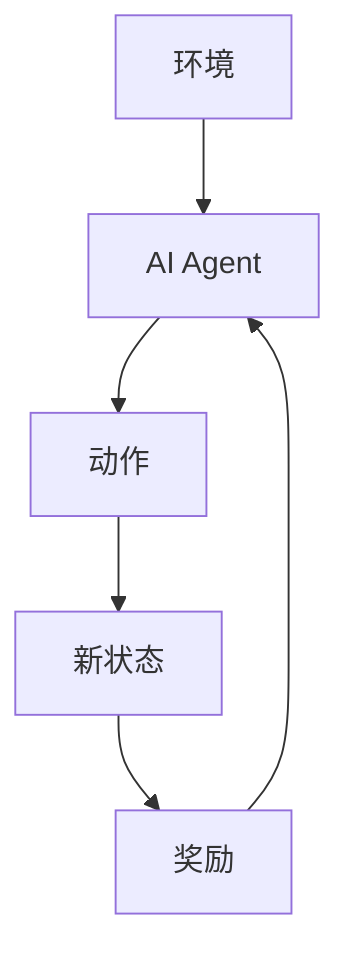
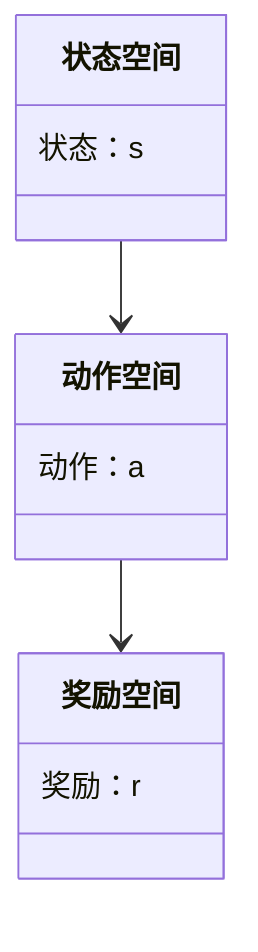
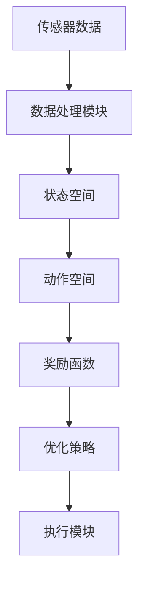
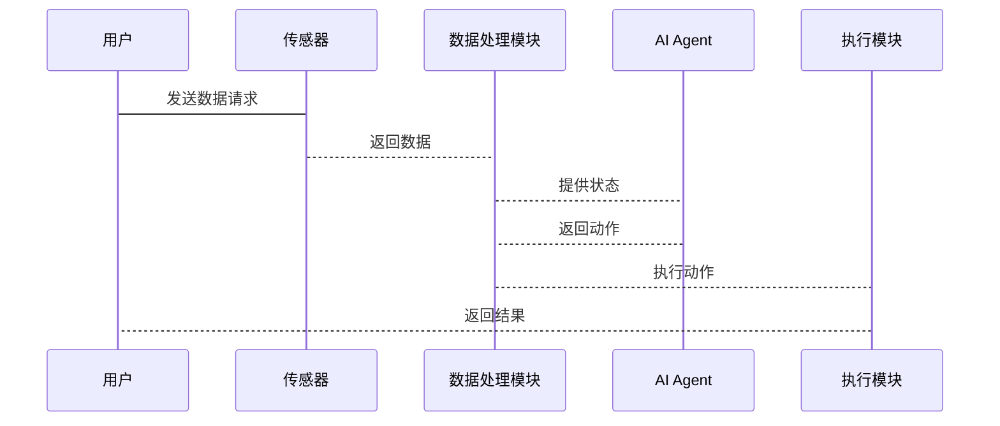

                 


# 企业AI Agent的强化学习在智能建筑能源管理中的应用

> 关键词：AI Agent，强化学习，智能建筑，能源管理，动态优化，深度强化学习，系统架构

> 摘要：本文探讨了AI Agent结合强化学习在智能建筑能源管理中的应用，分析了其在优化能源使用效率和降低运营成本方面的潜力。通过详细阐述AI Agent和强化学习的基本原理，构建了智能建筑能源管理的系统架构，并通过案例分析展示了强化学习算法在实际场景中的应用效果。文章还讨论了系统设计的关键要素，包括算法实现、系统架构设计、接口设计和交互流程，为读者提供了全面的理论基础和实践指导。

---

# 第1章: 背景介绍

## 1.1 问题背景与描述

### 1.1.1 智能建筑能源管理的现状与挑战
智能建筑通过集成物联网（IoT）设备、传感器和自动化系统，实现对能源使用的实时监控和优化。然而，随着建筑规模的扩大和设备数量的增加，传统的基于规则的能源管理方法逐渐暴露出效率低下、响应速度慢的问题。能源消耗的动态变化和多目标优化（如降低能耗、减少成本、提高舒适度）使得传统的静态策略难以适应复杂的场景。

### 1.1.2 AI Agent在能源管理中的潜力
AI Agent（智能体）是一种能够感知环境、自主决策并执行任务的智能系统。AI Agent在智能建筑能源管理中的应用，可以通过实时数据处理和动态决策优化能源使用效率。AI Agent能够根据环境变化（如天气、用户行为、设备状态）快速调整能源分配策略，从而实现高效节能。

### 1.1.3 强化学习在动态优化中的优势
强化学习（Reinforcement Learning, RL）是一种通过试错方式优化决策策略的机器学习方法。在智能建筑能源管理中，强化学习可以用于动态优化能源分配策略，解决多目标优化问题。强化学习的优势在于其能够处理动态环境中的不确定性，并通过长期经验积累优化决策质量。

## 1.2 问题解决与边界

### 1.2.1 AI Agent如何优化能源管理
AI Agent通过实时收集建筑内的能源使用数据（如电力消耗、温度、湿度等），结合历史数据和外部环境信息（如天气预报、用户行为模式），优化能源分配策略。例如，AI Agent可以根据实时温度和用户需求，动态调整空调系统的运行参数。

### 1.2.2 强化学习在动态决策中的应用
强化学习通过构建状态空间、动作空间和奖励函数，模拟能源管理的动态优化过程。AI Agent通过与环境的交互，学习最优的能源分配策略。例如，AI Agent可以学习在高峰电价时段减少电力消耗，以降低能源成本。

### 1.2.3 系统的边界与外延
智能建筑能源管理系统的边界包括建筑内的能源设备（如空调、照明、电梯）、物联网传感器、数据处理模块和AI Agent决策模块。系统的外延包括与外部能源网络的交互（如电网）、用户行为分析和能源市场预测。

## 1.3 核心概念与结构

### 1.3.1 AI Agent的基本组成
AI Agent由感知模块、决策模块和执行模块组成。感知模块负责收集环境数据，决策模块基于数据生成决策策略，执行模块将决策转化为具体操作。

### 1.3.2 强化学习的核心要素
强化学习的核心要素包括状态（State）、动作（Action）、奖励（Reward）和策略（Policy）。状态表示环境的当前情况，动作是AI Agent在状态下的决策，奖励是对决策的反馈，策略是AI Agent选择动作的概率分布。

### 1.3.3 智能建筑能源管理的系统架构
智能建筑能源管理系统的架构包括数据采集层、数据处理层、决策层和执行层。数据采集层通过传感器收集环境数据，数据处理层对数据进行清洗和特征提取，决策层通过强化学习算法生成优化策略，执行层将策略转化为具体操作。

---

# 第2章: 核心概念与联系

## 2.1 AI Agent与强化学习的原理

### 2.1.1 AI Agent的定义与分类
AI Agent可以根据智能水平分为反应式AI Agent和认知式AI Agent。反应式AI Agent基于当前环境状态做出决策，认知式AI Agent具有推理和规划能力，能够处理复杂任务。

### 2.1.2 强化学习的基本原理
强化学习通过试错方式优化决策策略。AI Agent在环境中执行动作，获得奖励或惩罚，逐步学习最优策略。强化学习的核心是通过最大化累积奖励来优化策略。

### 2.1.3 两者的关联与区别
AI Agent与强化学习的关联在于AI Agent可以采用强化学习算法优化决策策略。区别在于AI Agent是一种通用的智能系统，强化学习是一种特定的学习方法。

## 2.2 核心概念对比

### 2.2.1 AI Agent与传统算法的对比
| 对比维度 | AI Agent | 传统算法 |
|----------|-----------|-----------|
| 决策方式 | 自主决策，基于实时数据 | 基于固定规则或历史数据 |
| 灵活性 | 高，能够适应环境变化 | 低，难以适应复杂场景 |
| 学习能力 | 具备学习能力，能够优化策略 | 无法优化，仅基于固定逻辑 |

### 2.2.2 强化学习与其他机器学习方法的对比
| 对比维度 | 强化学习 | 监督学习 | 无监督学习 |
|----------|----------|----------|------------|
| 数据来源 | 环境反馈（奖励） | 标签数据 | 无标签数据 |
| 学习目标 | 最大化累积奖励 | 预测准确率 | 数据聚类或分类 |
| 交互方式 | 与环境交互 | 无交互 | 无交互 |

### 2.2.3 智能建筑中的实体关系图

```mermaid
erDiagram
    actor 用户 {
        string 用户ID
        string 用户名
        integer 年龄
    }
    building 楼栋 {
        string 楼栋ID
        string 楼栋名称
        integer 层数
    }
    room 房间 {
        string 房间ID
        string 房间类型
        integer 容纳人数
    }
    energy 能源数据 {
        string 时间戳
        float 电力消耗
        float 热能消耗
    }
    user 用户 --> building 楼栋
    building 楼栋 --> room 房间
    room 房间 --> energy 能源数据
```

---

# 第3章: 强化学习算法原理

## 3.1 算法原理

### 3.1.1 强化学习的基本流程


### 3.1.2 Q-learning算法的实现
```python
class QLearning:
    def __init__(self, state_space_size, action_space_size, learning_rate=0.1, gamma=0.9):
        self.q_table = np.zeros((state_space_size, action_space_size))
        self.alpha = learning_rate
        self.gamma = gamma

    def get_action(self, state):
        return np.argmax(self.q_table[state])

    def update_q_table(self, state, action, reward, next_state):
        self.q_table[state][action] = self.q_table[state][action] + self.alpha * (reward + self.gamma * np.max(self.q_table[next_state]) - self.q_table[state][action])
```

### 3.1.3 深度强化学习的原理
深度强化学习结合了深度学习和强化学习的优势，通过神经网络近似Q值函数。其核心是使用深度神经网络作为策略或价值函数的近似器，通过端到端的方式优化决策策略。

## 3.2 算法实现

### 3.2.1 Q-learning算法的伪代码
```python
初始化Q表为零
while True:
    状态s = 获取当前状态
    动作a = 选择动作（基于ε-greedy策略）
    执行动作a，获得新状态s'和奖励r
    Q(s, a) = Q(s, a) + α * (r + γ * max(Q(s', a')) - Q(s, a))
```

### 3.2.2 DQN算法的实现
```python
class DQN:
    def __init__(self, state_space, action_space, hidden_size=64, gamma=0.99, lr=0.001):
        self.state_space = state_space
        self.action_space = action_space
        self.gamma = gamma
        self.lr = lr
        self.main_network = self.build_network(hidden_size)
        self.target_network = self.build_network(hidden_size)
        self.optimizer = torch.optim.Adam(self.main_network.parameters(), lr=lr)

    def build_network(self, hidden_size):
        return torch.nn.Sequential(
            torch.nn.Linear(self.state_space, hidden_size),
            torch.nn.ReLU(),
            torch.nn.Linear(hidden_size, self.action_space)
        )

    def get_action(self, state):
        with torch.no_grad():
            q_values = self.main_network(torch.FloatTensor(state))
            return torch.argmax(q_values).item()

    def update_network(self, batch):
        states = torch.FloatTensor(batch['states'])
        actions = torch.LongTensor(batch['actions'])
        rewards = torch.FloatTensor(batch['rewards'])
        next_states = torch.FloatTensor(batch['next_states'])
        
        q_values = self.main_network(states).gather(1, actions.unsqueeze(1))
        next_q_values = self.target_network(next_states).max(1)[0].detach()
        target = rewards + self.gamma * next_q_values
        
        loss = torch.nn.MSELoss()(q_values.squeeze(), target)
        self.optimizer.zero_grad()
        loss.backward()
        self.optimizer.step()
```

### 3.2.3 算法的数学模型和公式
强化学习的核心公式是Q-learning的更新规则：
$$ Q(s, a) = Q(s, a) + \alpha (r + \gamma \max Q(s', a') - Q(s, a)) $$
其中，α是学习率，γ是折扣因子。

深度强化学习的数学模型可以表示为：
$$ Q(s, a) = \sigma(w^T \sigma(v^T s + b)) $$
其中，σ是激活函数，w和v是权重矩阵，b是偏置项。

---

## 3.3 数学模型与公式

### 3.3.1 Q-learning的数学公式
$$ Q(s, a) = Q(s, a) + \alpha (r + \gamma \max Q(s', a') - Q(s, a)) $$

### 3.3.2 DQN的网络结构
$$ Q(s) = \sigma(w^T \sigma(v^T s + b)) $$

---

# 第4章: 系统分析与架构设计

## 4.1 问题场景介绍
智能建筑能源管理系统的应用场景包括办公建筑、商业建筑和居民建筑。系统需要处理多设备协同、多目标优化和动态环境变化等问题。

## 4.2 系统功能设计

### 4.2.1 领域模型图


### 4.2.2 系统架构图


### 4.2.3 接口设计
系统接口包括数据采集接口（与传感器连接）、决策接口（与AI Agent交互）和执行接口（与能源设备连接）。

### 4.2.4 交互流程图


---

# 第5章: 项目实战

## 5.1 环境安装
```bash
pip install numpy torch matplotlib
pip install gym gym[atari] pygame
```

## 5.2 核心代码实现

### 5.2.1 Q-learning实现
```python
import numpy as np

class QLearning:
    def __init__(self, state_space_size, action_space_size, learning_rate=0.1, gamma=0.9):
        self.q_table = np.zeros((state_space_size, action_space_size))
        self.alpha = learning_rate
        self.gamma = gamma

    def get_action(self, state):
        return np.argmax(self.q_table[state])

    def update_q_table(self, state, action, reward, next_state):
        self.q_table[state][action] = self.q_table[state][action] + self.alpha * (reward + self.gamma * np.max(self.q_table[next_state]) - self.q_table[state][action])
```

### 5.2.2 DQN实现
```python
import torch
import torch.nn as nn
import torch.optim as optim

class DQN(nn.Module):
    def __init__(self, input_size, output_size, hidden_size=64):
        super(DQN, self).__init__()
        self.fc1 = nn.Linear(input_size, hidden_size)
        self.fc2 = nn.Linear(hidden_size, output_size)
    
    def forward(self, x):
        x = torch.relu(self.fc1(x))
        x = self.fc2(x)
        return x

def optimize(model, optimizer, criterion, inputs, targets):
    outputs = model(inputs)
    loss = criterion(outputs, targets)
    optimizer.zero_grad()
    loss.backward()
    optimizer.step()
    return loss.item()
```

### 5.2.3 实际案例分析
假设我们有一个简单的智能建筑能源管理案例，包含两个房间和一个空调系统。AI Agent需要根据实时温度和用户需求，动态调整空调运行参数。

## 5.3 项目总结
通过项目实战，我们可以看到强化学习在智能建筑能源管理中的巨大潜力。Q-learning和DQN算法都可以有效优化能源使用效率，但DQN在处理复杂场景时表现更优。

---

# 第6章: 最佳实践

## 6.1 小结
本文详细探讨了AI Agent结合强化学习在智能建筑能源管理中的应用，分析了其在优化能源使用效率和降低运营成本方面的潜力。

## 6.2 注意事项
1. 强化学习模型需要大量数据支持，需确保数据质量和实时性。
2. 系统设计时需考虑多目标优化问题，避免片面优化。
3. 在实际应用中，需结合具体场景调整算法参数。

## 6.3 拓展阅读
1. DeepMind的强化学习研究
2. OpenAI的AI Agent框架
3. 《强化学习导论》
4. 《智能建筑与物联网》

---

# 作者：AI天才研究院/AI Genius Institute & 禅与计算机程序设计艺术 /Zen And The Art of Computer Programming

---

**本文为AI天才研究院原创，未经授权不得转载。**

