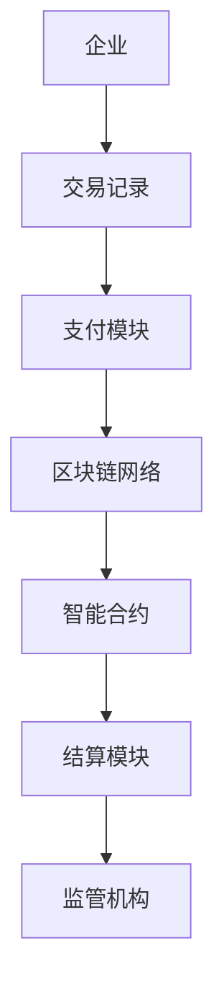
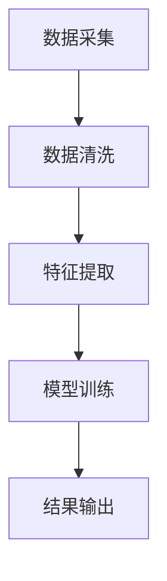
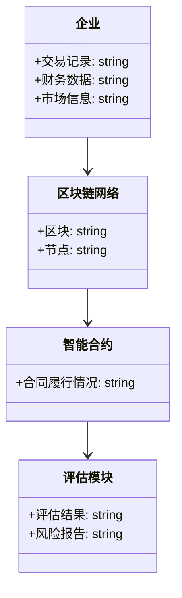
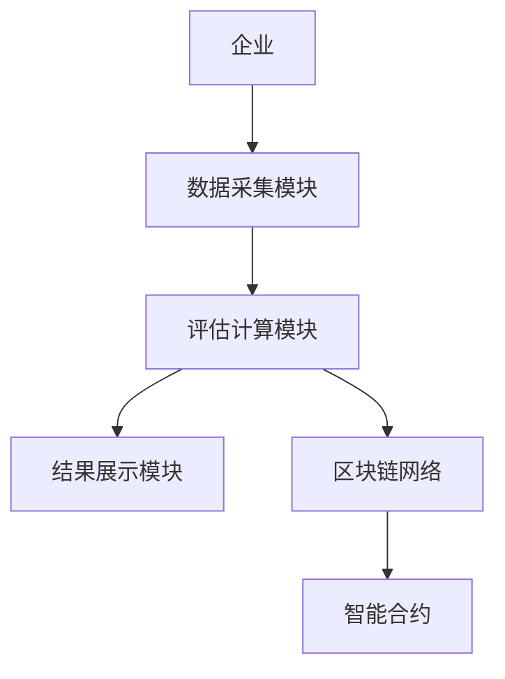

                 


# 企业估值中的区块链跨境贸易金融平台评估

**关键词：** 区块链、企业估值、跨境贸易、金融平台、智能合约、评估模型

**摘要：**  
随着全球贸易的不断增长，跨境贸易金融平台在企业估值中的重要性日益凸显。传统的估值方法存在数据不透明、效率低下等问题，而区块链技术的引入为解决这些问题提供了新的可能性。本文将详细探讨区块链技术在跨境贸易金融平台评估中的应用，分析其核心概念、算法原理、系统架构，并通过实际案例展示其在企业估值中的优势。

---

## 目录

1. **背景介绍**
   1.1 问题背景与描述
   1.2 区块链技术的核心优势
   1.3 跨境貿易金融平台评估的重要性
   1.4 本章小结

2. **核心概念与联系**
   2.1 区块链技术原理
   2.2 跨境貿易金融平台的结构
   2.3 区块链与跨境貿易金融平台的结合
   2.4 核心概念对比分析

3. **算法原理讲解**
   3.1 评估算法概述
   3.2 算法的数学模型与公式

4. **系统分析与架构设计**
   4.1 问题场景介绍
   4.2 系统功能设计
   4.3 系统架构设计

5. **项目实战**
   5.1 环境安装
   5.2 核心代码实现
   5.3 代码应用解读与分析
   5.4 实际案例分析
   5.5 项目小结

6. **最佳实践与小结**
   6.1 最佳实践
   6.2 本章小结

7. **作者简介与致谢**

---

## 正文

### 第1章 背景介绍

#### 1.1 问题背景与描述
随着全球经济一体化的深入，跨境贸易成为企业的重要业务之一。然而，跨境贸易中的金融平台评估存在诸多痛点：数据不透明、交易效率低、信用风险高等。这些问题严重影响了企业的估值准确性。

**1.1.1 跨境貿易金融平台的现状与挑战**
- **数据不透明**：传统金融平台可能存在数据篡改和不透明的问题，导致估值结果不可靠。
- **效率低下**：跨境支付和结算通常需要多个中间机构参与，导致交易时间长、成本高。
- **信用风险**：企业之间的信任缺失增加了金融风险。

**1.1.2 区块链技术在金融领域的应用前景**
- **去中心化特性**：区块链通过去中心化减少了中间机构的依赖，提高了效率。
- **透明性和不可篡改性**：区块链的公开账本确保了数据的透明性和不可篡改性，增强了信任。
- **跨境支付效率**：区块链技术可以实现快速、低成本的跨境支付，减少交易时间。

**1.1.3 企业估值中的痛点与需求**
- **传统估值方法的不足**：传统方法依赖于复杂的财务模型，数据获取困难且容易受到人为干扰。
- **对实时数据的需求**：企业估值需要实时的交易数据和市场信息，区块链提供了实时数据的支持。
- **降低估值风险**：区块链技术通过提高数据的准确性和透明性，降低了估值中的风险。

#### 1.2 区块链技术的核心优势
区块链技术在金融领域的优势主要体现在以下几个方面：

**1.2.1 区块链的去中心化特性**
- 区块链通过去中心化的网络结构，避免了单一机构的控制，减少了数据篡改的可能性。
- 通过分布式账本，每个节点都能访问完整的交易记录，确保数据的一致性。

**1.2.2 区块链的透明性和不可篡改性**
- 区块链的公开账本确保了交易的透明性，参与者可以实时查看交易记录。
- 由于每个区块都经过加密验证，区块链的数据几乎不可能被篡改，确保了数据的安全性。

**1.2.3 区块链在跨境支付中的效率提升**
- 区块链技术可以实现点对点的交易，减少了中间机构的数量，降低了交易成本。
- 通过智能合约自动执行交易，提高了交易的效率和准确性。

#### 1.3 跨境貿易金融平台评估的重要性
在企业估值中，跨境贸易金融平台的评估至关重要：

**1.3.1 企业估值中的关键因素**
- 企业的财务状况、市场表现、供应链能力等都是影响估值的关键因素。
- 跨境贸易金融平台的数据能够提供企业的实际交易情况，为估值提供可靠依据。

**1.3.2 区块链在平台评估中的作用**
- 区块链技术能够实时记录企业的交易数据，提供准确的估值依据。
- 通过智能合约自动执行和记录合同履行情况，确保数据的完整性和可靠性。

**1.3.3 评估体系的构建目标与意义**
- 构建一个基于区块链的评估体系，旨在提高估值的准确性和效率。
- 通过区块链技术，实现数据的透明化和去中心化管理，降低估值中的风险。

#### 1.4 本章小结
本章从背景介绍入手，分析了跨境贸易金融平台评估的现状与挑战，探讨了区块链技术的核心优势及其在金融领域的应用前景，最后强调了构建区块链评估体系的重要性和目标。

---

### 第2章 核心概念与联系

#### 2.1 区块链技术原理
区块链技术是分布式账本技术的核心，其原理如下：

**2.1.1 区块链的基本概念与组成**
- **区块**：区块链的基本单位，包含交易数据和时间戳。
- **链**：区块按时间顺序连接形成的链式结构，确保数据的不可篡改性。
- **节点**：区块链网络中的参与者，负责存储和验证数据。

**2.1.2 区块链的共识机制**
- **工作量证明（POW）**：通过计算找到特定哈希值来验证区块的有效性。
- **权益证明（POS）**：根据节点持有的代币数量来决定验证权力。
- ** delegated proof of stake（DPOS）**：节点通过投票选举的方式参与验证。

**2.1.3 区块链的智能合约**
- 智能合约是区块链上的自动执行程序，能够在满足特定条件时自动触发交易。
- 智能合约的应用可以简化合同履行过程，提高交易效率。

#### 2.2 跨境貿易金融平台的结构
跨境貿易金融平台的结构复杂，包含多个功能模块：

**2.2.1 平台的功能模块**
- **支付模块**：实现区块链上的跨境支付功能。
- **结算模块**：处理交易的清算和结算。
- **融资模块**：为企业提供基于区块链的融资服务。
- **风险管理模块**：评估交易风险，提供风险管理建议。

**2.2.2 平台的参与者与角色**
- **企业**：平台的主要用户，参与跨境贸易。
- **金融机构**：提供支付、结算等金融服务。
- **监管机构**：监督平台的运行，确保合规性。
- **区块链网络节点**：维护区块链网络的运行。

**2.2.3 平台的数据流分析**
- 数据流从企业发起，通过支付模块进入区块链网络，经过验证和结算后，最终到达目标企业。
- 数据在平台内部流动，涉及交易记录、合同履行等信息。

#### 2.3 区块链与跨境貿易金融平台的结合
区块链技术与跨境貿易金融平台的结合，主要体现在以下几个方面：

**2.3.1 区块链在平台中的应用场景**
- **支付与结算**：通过区块链实现快速、低成本的跨境支付和结算。
- **合同管理**：利用智能合约自动执行合同，确保合同履行。
- **数据共享**：区块链的公开账本为平台提供数据共享的可能。

**2.3.2 平台评估的核心要素**
- **交易数据**：平台记录的所有交易信息。
- **信用记录**：企业的信用历史。
- **市场信息**：市场波动对估值的影响。

**2.3.3 评估体系的构建框架**
- 数据采集：通过区块链获取实时交易数据。
- 数据处理：对数据进行清洗和预处理。
- 模型训练：基于区块链技术构建评估模型。
- 结果输出：生成评估结果并提供决策支持。

#### 2.4 核心概念对比分析
**2.4.1 传统评估方法与区块链评估方法的对比**

| 特性               | 传统评估方法 | 区块链评估方法 |
|--------------------|--------------|----------------|
| 数据来源           | 依赖企业报表 | 实时交易数据     |
| 数据准确性         | 易受人为干扰 | 高透明性         |
| 评估效率           | 低效          | 高效             |
| 成本               | 较高          | 较低             |

**2.4.2 实体关系图（ER图）展示**


---

### 第3章 算法原理讲解

#### 3.1 评估算法概述
基于区块链的评估算法具有以下特点：

**3.1.1 基于区块链的评估模型**
- 该模型通过区块链提供的实时交易数据，结合机器学习算法进行评估。
- 模型包括数据采集、特征提取、模型训练和结果输出四个步骤。

**3.1.2 算法的输入与输出**
- **输入**：企业的交易数据、市场信息、财务数据。
- **输出**：企业的估值结果、风险评估报告。

**3.1.3 算法的步骤与流程**


#### 3.2 算法的数学模型与公式
**3.2.1 线性回归模型**
线性回归是一种常用的回归分析方法，其数学公式如下：
$$ y = \beta_0 + \beta_1x + \epsilon $$
其中，$y$ 是目标变量，$x$ 是自变量，$\beta_0$ 和 $\beta_1$ 是回归系数，$\epsilon$ 是误差项。

**3.2.2 机器学习模型**
机器学习模型可以使用随机森林或支持向量机（SVM）进行评估。例如，随机森林的数学模型可以表示为：
$$ y = \sum_{i=1}^{n} \theta_i x_i $$
其中，$\theta_i$ 是树的权重，$x_i$ 是特征变量。

---

### 第4章 系统分析与架构设计

#### 4.1 问题场景介绍
**问题场景**：跨境贸易中的企业估值问题，涉及数据获取困难、估值效率低、结果不准确等问题。
**项目介绍**：本项目旨在构建一个基于区块链的跨境贸易金融平台评估系统，利用区块链技术解决上述问题。

#### 4.2 系统功能设计
**4.2.1 领域模型类图**


**4.2.2 功能模块**
- **数据采集模块**：负责采集企业的交易数据。
- **评估计算模块**：利用区块链数据进行评估计算。
- **结果展示模块**：展示评估结果和风险报告。

#### 4.3 系统架构设计
**4.3.1 架构图**


**4.3.2 接口与交互流程**
- **接口**：企业通过API接口向数据采集模块提交交易数据。
- **交互流程**：数据采集模块接收数据，传递给评估计算模块，评估结果通过智能合约执行，最终展示在结果展示模块。

---

### 第5章 项目实战

#### 5.1 环境安装
- **区块链框架**：推荐使用Ethereum或Hyperledger Fabric。
- **编程语言**：Python
- **数据库**：MySQL
- **安装步骤**：
  1. 安装Python和相关库（如Pandas、Scikit-learn）。
  2. 安装区块链框架的本地节点。
  3. 配置数据库连接。

#### 5.2 核心代码实现
**5.2.1 智能合约开发（Solidity）**
```solidity
// SPDX-License-Identifier: MIT
pragma solidity ^0.8.0;

contract TradeContract {
    event TradeCompleted(address indexed seller, address indexed buyer, uint amount);

    function executeTrade(address seller, address buyer, uint amount) public {
        emit TradeCompleted(seller, buyer, amount);
    }
}
```

**5.2.2 评估算法实现（Python）**
```python
import pandas as pd
from sklearn.linear_model import LinearRegression

# 数据加载
data = pd.read_csv('trade_data.csv')

# 特征与目标变量
X = data[['revenue', 'profit']]
y = data['valuation']

# 模型训练
model = LinearRegression()
model.fit(X, y)

# 预测
new_data = [[1000000, 100000]]
prediction = model.predict(new_data)
print("预测估值：", prediction[0])
```

#### 5.3 代码应用解读与分析
**5.3.1 代码解读**
- **智能合约**：定义了一个简单的贸易完成事件，用于记录交易。
- **评估算法**：使用线性回归模型，基于企业的收入和利润预测其估值。

**5.3.2 应用分析**
- 智能合约确保了交易的透明性和自动执行，减少了人为干预。
- 线性回归模型简单易用，适用于数据量较大的场景，但可能需要结合其他模型提高准确性。

#### 5.4 实际案例分析
**案例背景**：假设一家企业进行跨境贸易，需要评估其估值。
**数据采集与处理**：采集企业的交易数据，包括收入、利润等。
**模型训练与应用**：使用线性回归模型进行训练，预测企业的估值。
**结果分析**：模型预测该企业的估值为X，与实际估值进行对比，分析模型的准确性。

#### 5.5 项目小结
本项目通过区块链技术和机器学习算法，构建了一个高效的跨境贸易金融平台评估系统。通过实际案例展示了系统的应用价值和优势，为企业的估值提供了新的思路。

---

### 第6章 最佳实践与小结

#### 6.1 最佳实践
- **小结**：本章总结了文章的主要内容，强调了区块链技术在企业估值中的重要性。
- **注意事项**：在实际应用中，需注意数据隐私、系统安全等问题。
- **拓展阅读**：推荐学习区块链的高级技术、机器学习在金融领域的应用等。

#### 6.2 本章小结
本文详细探讨了区块链技术在跨境贸易金融平台评估中的应用，分析了其核心概念、算法原理和系统架构，并通过实际案例展示了其在企业估值中的优势。未来，随着技术的不断发展，区块链将在更多领域发挥重要作用。

---

### 第7章 作者简介与致谢

**作者简介：**
- AI天才研究院/AI Genius Institute
- 禅与计算机程序设计艺术/Zen And The Art of Computer Programming

**致谢：**
感谢所有参与本项目研究和写作的团队成员，以及提供宝贵反馈和建议的同行专家。

---

**摘要：**  
本文探讨了区块链技术在跨境贸易金融平台评估中的应用，分析了其核心概念、算法原理和系统架构，并通过实际案例展示了其在企业估值中的优势。通过区块链技术，企业可以实现更高效、更准确的估值，降低风险，提升竞争力。

