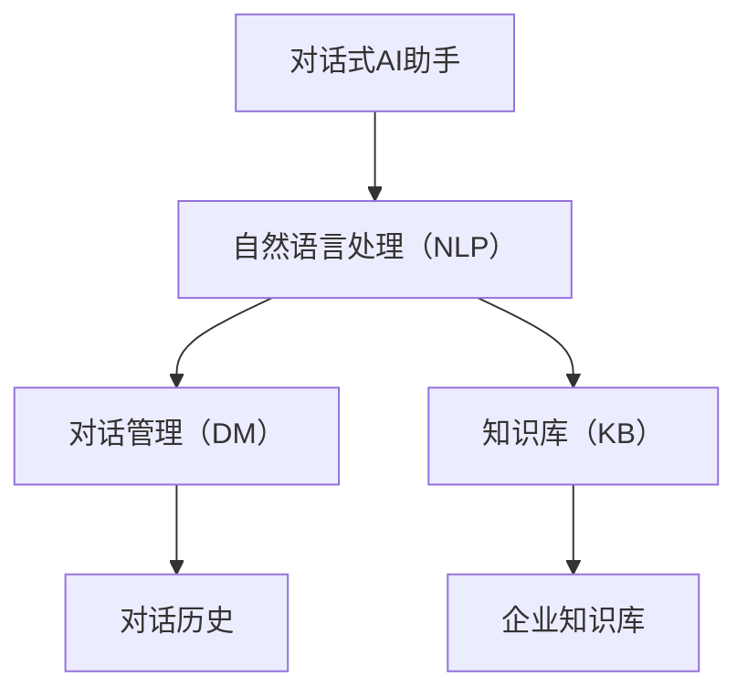
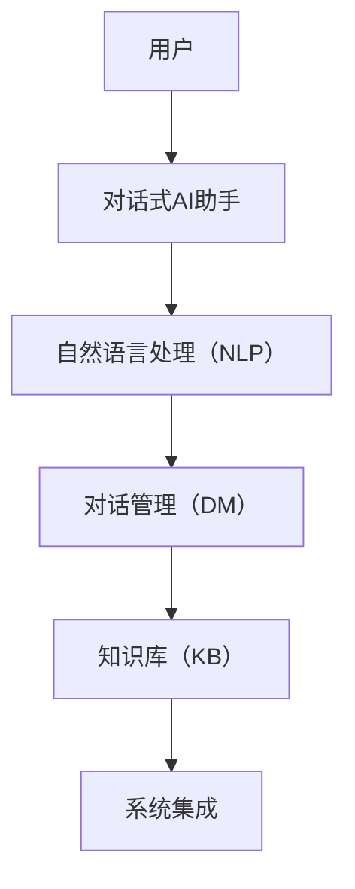
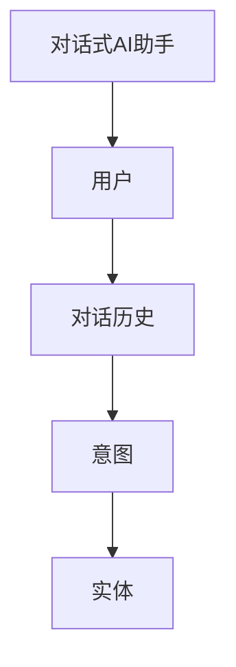
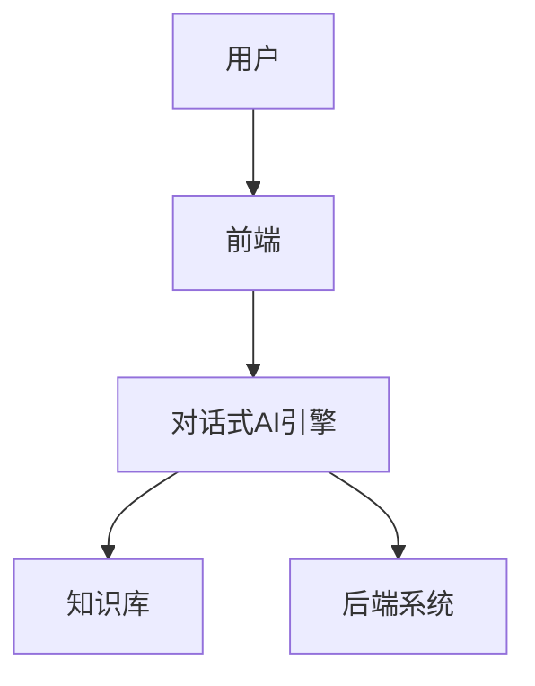
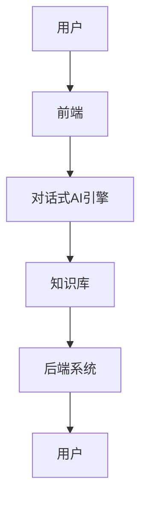

                 


# 构建企业级对话式AI助手：提升员工生产力

**关键词**：企业级对话式AI助手、自然语言处理（NLP）、员工生产力、系统架构设计、对话式AI技术

**摘要**：  
在当今数字化转型的浪潮中，企业级对话式AI助手正成为提升员工生产力的关键工具。本文深入探讨了构建企业级对话式AI助手的核心技术、系统架构设计、NLP技术原理以及实际项目实现。通过分析对话式AI的核心概念、技术架构和应用场景，本文为读者提供了从理论到实践的全面指导，帮助企业在数字化转型中实现高效沟通和生产力提升。

---

## 第1章：对话式AI助手的背景与现状

### 1.1 对话式AI的背景介绍

#### 1.1.1 从传统客服到智能对话的演进
传统的客服系统依赖人工操作，效率低下且成本高昂。随着自然语言处理（NLP）和机器学习技术的进步，对话式AI助手逐渐取代了传统客服，为企业提供了更高效、智能的沟通方式。

#### 1.1.2 当前企业级对话式AI的发展趋势
企业级对话式AI助手正在快速发展，主要体现在以下几个方面：
- **智能化**：基于深度学习的NLP技术使得对话更加自然流畅。
- **个性化**：根据员工的需求和行为，提供个性化的服务。
- **集成化**：与企业现有的CRM、ERP等系统无缝集成，提升整体效率。

#### 1.1.3 对话式AI在企业中的应用价值
对话式AI助手能够显著提升员工生产力，主要体现在以下几个方面：
- **快速响应**：员工可以通过对话式AI快速获取所需信息，减少等待时间。
- **智能分拣**：将员工的需求智能分拣到相关部门或系统，提升效率。
- **24/7可用性**：对话式AI助手可以全天候工作，为员工提供即时支持。

### 1.2 对话式AI的核心问题背景

#### 1.2.1 传统企业沟通效率的痛点
- **信息孤岛**：企业内部信息分散在不同的系统中，员工需要在多个系统间切换操作。
- **响应延迟**：传统客服系统通常需要排队等待，影响工作效率。
- **员工体验差**：员工对繁琐的沟通流程感到不满，影响工作效率和满意度。

#### 1.2.2 员工生产力提升的迫切需求
- **时间成本**：员工花费大量时间在低效的沟通上，影响核心工作效率。
- **信息获取效率**：员工需要快速获取所需信息，但传统方式效率低下。
- **员工满意度**：提升员工满意度是企业长期发展的关键因素。

#### 1.2.3 对话式AI如何解决这些问题
- **智能分拣与路由**：对话式AI能够快速识别员工需求，并将其路由到相应的系统或部门。
- **实时响应**：通过NLP技术实现快速理解和响应，提升沟通效率。
- **个性化服务**：根据员工的行为和偏好，提供个性化的服务体验。

### 1.3 企业级对话式AI的定义与特点

#### 1.3.1 定义与核心要素
企业级对话式AI助手是一种基于NLP和机器学习技术的智能系统，能够与企业员工进行自然语言对话，提供高效的信息检索、任务处理和决策支持。

#### 1.3.2 与消费级AI助手的主要区别
| **特点**       | **企业级AI助手**                 | **消费级AI助手**                 |
|----------------|---------------------------------|----------------------------------|
| **用户群体**    | 企业员工                       | 消费者                           |
| **数据安全**    | 高要求，需符合企业安全规范     | 数据隐私要求较低                 |
| **功能深度**    | 集成企业系统，功能复杂           | 功能相对简单，注重用户体验       |
| **定制化**      | 强调定制化，满足企业需求         | 标准化产品，无需深度定制         |

#### 1.3.3 企业级应用的边界与外延
企业级对话式AI助手的应用边界包括内部员工服务（如信息查询、任务处理）和外部客户支持。其外延则扩展到企业知识库的构建、跨系统集成和数据分析。

### 1.4 本章小结
- 对话式AI的背景与价值：从传统客服到智能对话的演进，企业级对话式AI的发展趋势和应用价值。
- 核心问题背景：传统企业沟通效率的痛点，员工生产力提升的迫切需求。
- 与消费级AI助手的区别：定义、核心要素、功能特点和适用场景的对比。

---

## 第2章：对话式AI的核心概念与技术架构

### 2.1 对话式AI的核心概念

#### 2.1.1 对话式AI的定义与核心要素
对话式AI助手的核心要素包括：
- **自然语言处理（NLP）**：实现对自然语言的理解和生成。
- **对话管理**：根据对话上下文，生成合理的回应。
- **知识库**：存储企业相关的信息和知识，用于回答员工的问题。

#### 2.1.2 对话式AI的三要素模型
对话式AI的三要素模型包括：
1. **语言理解（NLU）**：将自然语言转化为结构化的信息。
2. **对话管理（DM）**：根据对话历史生成回复。
3. **知识库（KB）**：提供对话所需的知识支持。

#### 2.1.3 对话式AI的实体关系图



### 2.2 对话式AI的技术架构

#### 2.2.1 对话式AI的技术架构图



#### 2.2.2 对话式AI的三要素模型与技术实现
- **自然语言处理（NLP）**：实现语言理解，包括分词、实体识别和意图识别。
- **对话管理（DM）**：根据对话历史生成回复，支持多轮对话。
- **知识库（KB）**：提供结构化知识，支持信息检索。

#### 2.2.3 对话式AI的实体关系图



### 2.3 对话式AI与传统客服系统的区别

#### 2.3.1 传统客服系统的局限性
- **效率低下**：人工客服响应慢，效率低。
- **覆盖范围有限**：无法处理复杂的问题。
- **成本高昂**：需要大量人力资源投入。

#### 2.3.2 对话式AI的优势与创新
- **7x24小时可用**：对话式AI助手可以全天候工作。
- **智能分拣**：能够智能识别需求并路由到相关部门。
- **高效处理**：通过NLP技术实现快速理解和响应。

#### 2.3.3 对话式AI的未来发展方向
- **深度学习**：进一步提升NLP技术，实现更自然的对话。
- **多模态交互**：结合视觉、语音等多种交互方式。
- **智能化决策**：基于对话历史和上下文，提供智能决策支持。

### 2.4 本章小结
- 对话式AI的核心概念：定义、核心要素和三要素模型。
- 技术架构：整体架构图和三要素模型的技术实现。
- 与传统客服系统的区别：传统客服的局限性、对话式AI的优势和未来发展方向。

---

## 第3章：自然语言处理（NLP）技术原理

### 3.1 NLP技术在对话式AI中的应用

#### 3.1.1 NLP技术的定义与核心算法
自然语言处理（NLP）是对话式AI的核心技术，主要算法包括：
- **分词**：将文本分割成词语或短语。
- **实体识别**：识别文本中的实体（如人名、地名）。
- **意图识别**：理解对话的意图和目标。

#### 3.1.2 NLP技术在对话式AI中的作用
NLP技术通过理解用户输入的自然语言，生成合理的回复。其作用体现在以下几个方面：
- **语言理解**：将用户的自然语言转化为结构化的信息。
- **意图识别**：识别用户的意图，例如“查询订单状态”。
- **实体识别**：提取对话中的关键实体，例如订单编号。

#### 3.1.3 NLP技术的未来发展趋势
- **深度学习**：基于深度学习的NLP技术正在快速发展。
- **预训练模型**：如BERT等预训练模型的应用越来越广泛。
- **多语言支持**：支持多种语言的NLP技术将更加普及。

### 3.2 NLP技术的核心算法原理

#### 3.2.1 分词算法原理与实现
分词是NLP技术的基础，常用算法包括：
- **基于规则的分词**：利用词典和规则进行分词。
- **基于统计的分词**：利用语言模型进行分词。

#### 3.2.2 实体识别算法原理与实现
实体识别通过模式匹配和上下文信息，识别文本中的实体。常用算法包括：
- **基于规则的实体识别**：利用正则表达式匹配特定模式。
- **基于统计的实体识别**：利用机器学习模型进行实体识别。

#### 3.2.3 意图理解算法原理与实现
意图理解是NLP技术的核心，常用算法包括：
- **基于规则的意图理解**：通过预定义的规则进行意图分类。
- **基于机器学习的意图理解**：利用分类模型进行意图分类。

### 3.3 NLP技术的数学模型与公式

#### 3.3.1 余弦相似度公式
余弦相似度用于衡量两个向量之间的相似性：

$$ \text{余弦相似度} = \frac{\vec{A} \cdot \vec{B}}{|\vec{A}| \cdot |\vec{B}|} $$

#### 3.3.2 TF-IDF公式
TF-IDF用于衡量一个词在文本中的重要性：

$$ \text{TF-IDF} = \text{TF} \times \text{IDF} $$

#### 3.3.3 Word2Vec模型公式
Word2Vec通过词向量表示词语：

$$ \text{Word2Vec} = \arg \min \left( -\log P(w_{i+k}|w_i) \right) $$

### 3.4 本章小结
- NLP技术在对话式AI中的作用：分词、实体识别和意图识别。
- 核心算法原理：分词、实体识别和意图理解的算法原理。
- 数学模型与公式：余弦相似度、TF-IDF和Word2Vec模型。

---

## 第4章：对话式AI的系统架构设计

### 4.1 系统分析与设计

#### 4.1.1 项目介绍
本项目旨在构建一个企业级对话式AI助手，用于提升员工生产力。

#### 4.1.2 系统功能设计
系统功能设计包括：
- **信息查询**：员工可以通过对话式AI查询企业知识库中的信息。
- **任务处理**：AI助手可以协助员工完成特定任务。
- **智能分拣**：根据员工的需求，智能分拣到相关部门或系统。

#### 4.1.3 系统架构设计
系统架构设计包括：
- **前端**：用户界面，支持多种交互方式。
- **后端**：对话式AI引擎，负责处理用户的输入。
- **知识库**：存储企业相关知识，支持信息检索。

### 4.2 系统架构图



### 4.3 系统接口设计
系统接口设计包括：
- **API接口**：用于与企业系统的集成。
- **消息队列**：用于处理异步请求。

### 4.4 系统交互流程图



### 4.5 本章小结
- 系统分析与设计：项目介绍、系统功能设计和架构设计。
- 系统架构图：前端、后端和知识库的交互关系。
- 系统接口设计：API接口和消息队列的设计。

---

## 第5章：对话式AI的项目实战

### 5.1 环境安装与配置
对话式AI助手的开发需要以下环境：
- **Python**：编程语言。
- **NLP库**：如spaCy、NLTK。
- **机器学习框架**：如TensorFlow、PyTorch。

### 5.2 核心代码实现

#### 5.2.1 分词实现
```python
import spacy

nlp = spacy.load("en_core_web_sm")
text = "Hello, how are you?"
doc = nlp(text)
for token in doc:
    print(token.text)
```

#### 5.2.2 实体识别实现
```python
from spacy import displacy

doc = nlp("John works at Google.")
displacy.render(doc, style="ent")
```

#### 5.2.3 对话管理实现
```python
class DialogManager:
    def __init__(self):
        self.dialog_history = []
    
    def process_input(self, input_text):
        self.dialog_history.append(input_text)
        # 根据对话历史生成回复
        return "I understand your request."
```

### 5.3 项目实战小结
- 代码实现：分词、实体识别和对话管理的实现。
- 项目部署：环境配置和代码部署。

---

## 第6章：对话式AI的优化与扩展

### 6.1 对话式AI的优化策略
- **模型优化**：通过模型调参和优化算法提升对话质量。
- **数据增强**：通过数据增强技术提升模型的泛化能力。

### 6.2 对话式AI的扩展方向
- **多语言支持**：支持多种语言的对话。
- **多模态交互**：结合视觉和语音等多种交互方式。
- **智能决策**：基于对话历史和上下文，提供智能决策支持。

### 6.3 本章小结
- 优化策略：模型优化和数据增强。
- 扩展方向：多语言支持、多模态交互和智能决策。

---

## 第7章：对话式AI的未来展望与总结

### 7.1 对话式AI的未来展望
- **深度学习**：基于深度学习的NLP技术将进一步发展。
- **多模态交互**：结合视觉、语音等多种交互方式。
- **智能化决策**：对话式AI将具备更强大的智能决策能力。

### 7.2 本章小结
- 未来展望：深度学习、多模态交互和智能化决策的发展趋势。
- 总结：对话式AI在企业中的应用价值和未来发展方向。

---

## 附录：对话式AI开发工具与资源推荐

### 1. 开发工具
- **Python**：编程语言。
- **TensorFlow**：深度学习框架。
- **spaCy**：NLP库。

### 2. 资源推荐
- **书籍**：《Python自然语言处理实战》。
- **在线课程**：Coursera上的《自然语言处理专项课程》。
- **社区**：GitHub上的开源项目。

---

## 作者：AI天才研究院/AI Genius Institute & 禅与计算机程序设计艺术 /Zen And The Art of Computer Programming

---

本文详细介绍了构建企业级对话式AI助手的核心技术、系统架构设计、NLP技术原理以及实际项目实现。通过理论与实践的结合，帮助读者全面理解对话式AI的实现与应用。

