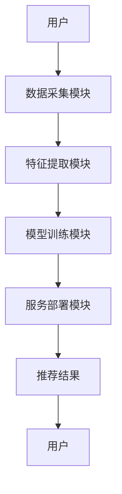
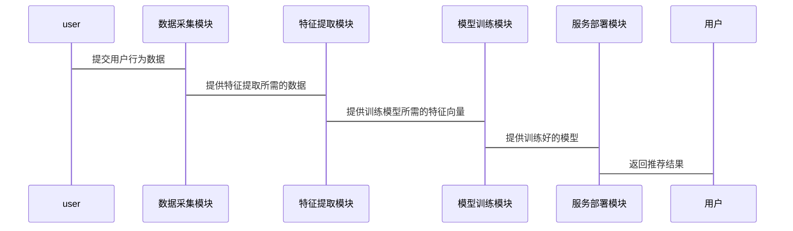

                 


# 构建企业级推荐引擎：跨平台个性化用户体验

**关键词**：推荐引擎、个性化推荐、协同过滤、内容推荐、混合推荐、系统架构、企业级应用

**摘要**：推荐引擎作为现代互联网应用的核心技术，通过个性化推荐算法和系统架构设计，实现跨平台的精准推荐，提升用户体验。本文详细探讨推荐引擎的背景、算法原理、系统架构、项目实战及最佳实践，帮助读者全面掌握企业级推荐引擎的构建方法。

---

# 第一部分: 推荐引擎概述

## 第1章: 推荐引擎概述

### 1.1 推荐引擎的定义与核心概念

推荐引擎是一种利用算法和数据来预测用户兴趣，并提供个性化推荐的技术。其核心在于分析用户行为、偏好和历史数据，生成符合用户需求的内容或产品推荐。个性化推荐不仅提升用户体验，还能提高用户留存率和转化率。

**推荐引擎的核心要素**：
- **用户特征**：包括用户的兴趣、行为、偏好等。
- **物品特征**：物品的属性、类别、内容等。
- **推荐算法**：基于协同过滤、内容推荐或混合推荐的算法。
- **实时性**：推荐结果需要快速响应。
- **跨平台性**：支持Web、移动端、小程序等多平台。

### 1.2 推荐引擎的技术发展与应用

推荐技术经历了从简单到复杂的演变。早期基于协同过滤的方法，逐步发展为结合内容理解和深度学习的混合推荐。当前，推荐引擎广泛应用于电商、社交媒体、视频平台、新闻媒体等领域，帮助企业实现精准营销和用户体验优化。

**主要应用场景**：
- 电商：推荐商品、个性化购物体验。
- 视频平台：推荐影片、电视剧，提升用户观看时长。
- 社交媒体：推荐用户关注的人、兴趣内容。
- 新闻媒体：推荐用户感兴趣的文章、话题。

### 1.3 企业级推荐系统的挑战与机遇

**主要挑战**：
- **数据稀疏性**：用户行为数据不足导致推荐准确性下降。
- **实时性要求高**：需要快速响应用户的实时需求。
- **多平台兼容性**：推荐系统需要适配不同终端和平台。
- **模型过拟合**：推荐结果可能过于集中，缺乏多样性。

**主要机遇**：
- **大数据技术**：利用大数据分析用户行为，提升推荐精度。
- **深度学习**：通过神经网络捕捉复杂的用户偏好。
- **多模态数据**：结合文本、图像、视频等多种数据源，丰富推荐内容。

---

## 第2章: 协同过滤算法

### 2.1 协同过滤的基本原理

协同过滤是一种基于用户相似性或物品相似性进行推荐的算法。主要分为基于用户的协同过滤和基于物品的协同过滤。

#### 2.1.1 基于用户的协同过滤
- **原理**：通过寻找与目标用户相似的用户群体，推荐这些用户喜欢的物品。
- **步骤**：
  1. 计算用户之间的相似度。
  2. 根据相似用户的评分，加权平均生成推荐结果。

#### 2.1.2 基于物品的协同过滤
- **原理**：通过分析物品之间的相似性，向用户推荐与他们已评分物品相似的其他物品。
- **步骤**：
  1. 计算物品之间的相似度。
  2. 根据用户对已评分物品的评分，推荐相似物品。

#### 2.1.3 混合协同过滤
- **原理**：结合基于用户和基于物品的协同过滤，通过加权的方式生成推荐结果。
- **优势**：结合两种方法的优点，提升推荐的准确性和多样性。

### 2.2 协同过滤的数学模型

协同过滤的核心是相似度计算和矩阵分解。

#### 2.2.1 相似度计算公式
- **余弦相似度**：
  $$\text{sim}(u, v) = \frac{\sum_{i=1}^{n} u_i v_i}{\sqrt{\sum_{i=1}^{n} u_i^2} \cdot \sqrt{\sum_{i=1}^{n} v_i^2}}$$

- **皮尔逊相关系数**：
  $$\text{sim}(u, v) = \frac{\sum_{i=1}^{n} (u_i - \bar{u})(v_i - \bar{v})}{\sqrt{\sum_{i=1}^{n} (u_i - \bar{u})^2} \cdot \sqrt{\sum_{i=1}^{n} (v_i - \bar{v})^2}}$$

#### 2.2.2 基于矩阵分解的协同过滤
- **矩阵分解**：将用户-物品评分矩阵分解为用户特征矩阵和物品特征矩阵。
  $$X = U \cdot V^T$$
  其中，$U$是用户特征矩阵，$V$是物品特征矩阵。

#### 2.2.3 模型优化与评估指标
- **优化方法**：使用梯度下降、交替最小二乘法等优化矩阵分解。
- **评估指标**：使用均方误差（MSE）、平均绝对误差（MAE）、精确率、召回率等指标评估推荐效果。

### 2.3 协同过滤的实现与优化

#### 2.3.1 稀疏性问题与解决方法
- **稀疏性问题**：用户-物品评分矩阵通常非常稀疏，导致相似度计算困难。
- **解决方法**：引入正则化项、使用隐式反馈数据、结合内容推荐。

#### 2.3.2 高维数据降维技术
- **主成分分析（PCA）**：通过降维减少特征空间的维度。
- **奇异值分解（SVD）**：用于矩阵分解，提取主要的特征向量。

#### 2.3.3 并行计算与分布式实现
- **分布式计算框架**：使用MapReduce、Spark等框架处理大规模数据。
- **并行算法优化**：优化矩阵分解过程，提升计算效率。

---

## 第3章: 基于内容的推荐算法

### 3.1 基于内容推荐的基本原理

内容推荐算法通过分析物品的内容特征，生成与用户兴趣匹配的推荐结果。与协同过滤不同，内容推荐不依赖于用户行为数据，更适合数据稀疏的场景。

#### 3.1.1 内容特征提取
- **文本表示**：使用词袋模型、TF-IDF、Word2Vec等方法提取文本特征。
- **图像特征提取**：使用CNN、PCA等方法提取图像特征。
- **视频特征提取**：通过深度学习模型（如CNN、LSTM）提取视频特征。

#### 3.1.2 相似度计算与推荐生成
- **余弦相似度**：用于衡量两个物品内容的相似性。
- **曼哈顿距离**：衡量物品特征向量的距离。

#### 3.1.3 基于深度学习的内容推荐
- **神经网络模型**：如DNN、GCN等，用于提取非线性特征。
- **嵌入技术**：将高维特征映射到低维空间，提升计算效率。

### 3.2 基于内容推荐的数学模型

#### 3.2.1 文本表示与向量化
- **词袋模型**：
  - **优缺点**：简单但无法捕捉语义信息。
- **TF-IDF**：
  - **优缺点**：能够衡量词的重要性，但无法捕捉语义。
- **Word2Vec**：
  - **优缺点**：能够生成语义向量，计算效率高。

#### 3.2.2 相似度计算与推荐公式
- **余弦相似度公式**：
  $$\text{sim}(x, y) = \frac{\sum_{i=1}^{n} x_i y_i}{\sqrt{\sum_{i=1}^{n} x_i^2} \cdot \sqrt{\sum_{i=1}^{n} y_i^2}}$$
- **曼哈顿距离公式**：
  $$\text{sim}(x, y) = \sum_{i=1}^{n} |x_i - y_i|$$

#### 3.2.3 基于深度学习的推荐模型
- **神经网络结构**：如多层感知机（MLP）、卷积神经网络（CNN）、循环神经网络（RNN）。
- **损失函数**：使用交叉熵损失函数优化模型。

### 3.3 内容推荐的实现与优化

#### 3.3.1 特征选择与提取方法
- **文本特征提取**：使用Word2Vec生成词向量。
- **图像特征提取**：使用预训练的CNN模型提取特征。
- **视频特征提取**：使用3D CNN提取视频特征。

#### 3.3.2 模型训练与调优
- **超参数调优**：通过网格搜索或随机搜索优化模型参数。
- **正则化技术**：使用L1、L2正则化防止过拟合。
- **数据增强**：通过数据增强技术提升模型的泛化能力。

#### 3.3.3 内容推荐的实时性优化
- **缓存机制**：缓存热门物品的特征向量，减少计算开销。
- **异步计算**：通过异步处理提升推荐系统的响应速度。

---

## 第4章: 混合推荐算法

### 4.1 混合推荐的基本原理

混合推荐算法结合了协同过滤和内容推荐的优势，通过融合两种方法的结果，提升推荐的准确性和多样性。

#### 4.1.1 协同过滤与内容推荐的结合
- **加权融合**：根据用户行为和内容特征对协同过滤和内容推荐的结果进行加权融合。
- **投票融合**：通过投票机制选择协同过滤和内容推荐的共同推荐结果。

#### 4.1.2 深度学习与传统算法的融合
- **深度协同过滤**：将深度学习模型与协同过滤结合，捕捉复杂的用户偏好。
- **多任务学习**：同时优化多个推荐任务，提升推荐效果。

#### 4.1.3 混合推荐的优势
- **准确率高**：结合了两种推荐方法的优势。
- **多样性好**：推荐结果更具多样性，减少过拟合风险。
- **适应性强**：适用于数据稀疏和数据丰富的场景。

### 4.2 混合推荐的数学模型

#### 4.2.1 深度协同过滤模型
- **神经网络结构**：使用DNN、GCN等模型提取用户和物品的深度特征。
- **损失函数**：使用交叉熵损失函数优化模型。

#### 4.2.2 多任务学习模型
- **多任务优化**：同时优化推荐、评分预测等多个任务。
- **共享层设计**：通过共享层提取共享特征，降低模型复杂度。

### 4.3 混合推荐的实现与优化

#### 4.3.1 融合策略选择
- **线性融合**：通过线性组合的方式融合协同过滤和内容推荐的结果。
- **非线性融合**：通过神经网络进行非线性融合，提升推荐效果。

#### 4.3.2 深度学习模型调优
- **模型选择**：选择适合任务的深度学习模型，如DNN、GCN等。
- **超参数优化**：通过网格搜索优化模型参数。
- **计算优化**：使用分布式计算框架优化模型训练过程。

#### 4.3.3 混合推荐的实时性优化
- **并行计算**：通过并行计算加速模型训练和推理过程。
- **缓存机制**：缓存热门用户的特征向量，减少计算开销。

---

## 第5章: 推荐引擎的系统架构与设计

### 5.1 系统架构设计

推荐引擎的系统架构包括数据采集、特征提取、模型训练、服务部署等多个模块。通过模块化设计，提升系统的可扩展性和可维护性。

#### 5.1.1 数据采集模块
- **数据来源**：用户行为数据、物品特征数据、用户属性数据。
- **数据存储**：使用分布式数据库存储大规模数据。

#### 5.1.2 特征提取模块
- **文本特征提取**：使用NLP技术提取文本特征。
- **图像特征提取**：使用计算机视觉技术提取图像特征。
- **用户特征提取**：通过协同过滤提取用户特征向量。

#### 5.1.3 模型训练模块
- **训练数据准备**：将特征向量输入模型进行训练。
- **模型优化**：通过优化算法提升模型性能。
- **模型评估**：使用评估指标衡量模型效果。

#### 5.1.4 服务部署模块
- **API接口设计**：设计RESTful API接口，供前端调用。
- **服务部署**：使用容器化技术部署服务，确保服务的高可用性。

### 5.2 系统架构图



### 5.3 系统接口设计

推荐引擎提供以下API接口：

- `GET /recommendations?userId=123`：根据用户ID获取推荐结果。
- `POST /features`：提交特征数据，进行特征提取。
- `PUT /models`：上传模型参数，更新推荐模型。

### 5.4 系统交互流程



---

## 第6章: 项目实战——构建企业级推荐引擎

### 6.1 环境搭建

#### 6.1.1 安装必要的依赖
- **Python环境**：安装Python 3.8及以上版本。
- **库依赖**：安装numpy、pandas、scikit-learn、tensorflow、keras等库。

#### 6.1.2 数据准备
- **数据来源**：收集用户行为数据、物品特征数据。
- **数据清洗**：处理缺失值、异常值，确保数据质量。

### 6.2 核心实现

#### 6.2.1 协同过滤实现

```python
from sklearn.metrics.pairwise import cosine_similarity

# 计算用户相似度矩阵
user_features = ...  # 用户特征向量
similarity_matrix = cosine_similarity(user_features)

# 推荐结果生成
def recommend(user_id, similarity_matrix, items):
    similar_users = similarity_matrix[user_id]
    recommendations = {}
    for i in range(len(similar_users)):
        weight = similar_users[i]
        if weight < 0.1:
            continue
        recommendations[user_id] = items[i]
    return recommendations
```

#### 6.2.2 基于内容的推荐实现

```python
from sklearn.feature_extraction.text import TfidfVectorizer

# 文本特征提取
vectorizer = TfidfVectorizer()
text_features = vectorizer.fit_transform(corpus)

# 推荐结果生成
def content_recommend(user_profile, text_features, items):
    user_vector = vectorizer.transform([user_profile])
    similarity = cosine_similarity(user_vector, text_features)
    recommendations = []
    for i in range(len(similarity[0])):
        if similarity[0][i] > 0.2:
            recommendations.append(items[i])
    return recommendations
```

#### 6.2.3 混合推荐实现

```python
import numpy as np

# 协同过滤推荐结果
collaborative_recommendations = ...  # 协同过滤推荐结果

# 内容推荐结果
content_recommendations = ...  # 内容推荐推荐结果

# 混合推荐结果
combined_recommendations = {}
for item in collaborative_recommendations:
    combined_recommendations[item] = collaborative_recommendations[item] * 0.6 + content_recommendations.get(item, 0) * 0.4

# 排序并返回
sorted_recommendations = sorted(combined_recommendations.items(), key=lambda x: x[1], reverse=True)
return sorted_recommendations[:10]
```

### 6.3 项目小结

通过以上步骤，我们成功构建了一个企业级推荐引擎，涵盖了数据采集、特征提取、模型训练和结果生成的完整流程。在实际应用中，可以根据具体需求对模型进行调优，提升推荐的准确性和实时性。

---

## 第7章: 最佳实践与注意事项

### 7.1 最佳实践

#### 7.1.1 数据处理
- **数据清洗**：确保数据质量和完整性。
- **数据增强**：通过数据增强技术提升模型的泛化能力。

#### 7.1.2 模型优化
- **超参数调优**：使用网格搜索或随机搜索优化模型参数。
- **正则化技术**：防止过拟合，提升模型的泛化能力。

#### 7.1.3 系统优化
- **缓存机制**：缓存热门用户的特征向量，减少计算开销。
- **异步计算**：通过异步处理提升系统的响应速度。

### 7.2 注意事项

#### 7.2.1 数据隐私与安全
- **数据加密**：对敏感数据进行加密处理。
- **访问控制**：确保只有授权用户可以访问推荐系统。

#### 7.2.2 模型更新
- **定期更新**：根据用户行为变化定期更新模型。
- **增量训练**：采用增量训练技术，提升模型的实时性。

#### 7.2.3 性能监控
- **性能指标**：监控系统的响应时间、推荐准确率等性能指标。
- **错误处理**：建立完善的错误处理机制，确保系统的稳定运行。

### 7.3 本章小结

通过遵循最佳实践和注意事项，可以有效提升推荐引擎的性能和用户体验，确保系统的安全性和稳定性。

---

## 第8章: 拓展阅读与进一步学习

### 8.1 拓展阅读

- **推荐系统论文**：阅读经典的推荐系统论文，深入理解推荐算法的原理。
- **技术博客与文章**：关注技术博客和行业文章，了解推荐系统的最新动态。
- **技术书籍**：阅读推荐系统相关的技术书籍，系统学习推荐算法和系统设计。

### 8.2 进一步学习

- **深度学习推荐模型**：研究基于深度学习的推荐模型，如DNN、GCN等。
- **实时推荐系统**：学习如何构建实时推荐系统，提升推荐的实时性。
- **多模态推荐**：探索如何结合文本、图像、视频等多种数据源，实现多模态推荐。

---

## 第9章: 作者简介

作者：AI天才研究院/AI Genius Institute & 禅与计算机程序设计艺术 /Zen And The Art of Computer Programming

---

以上是构建企业级推荐引擎的技术博客文章的详细大纲和内容。通过以上步骤，可以系统地构建一个高效、准确的推荐引擎，满足企业级应用的需求，为用户提供个性化的推荐体验。

