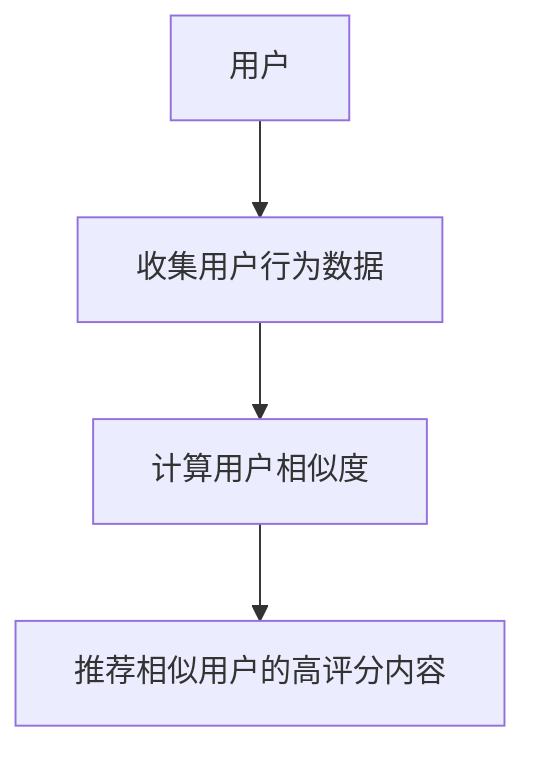
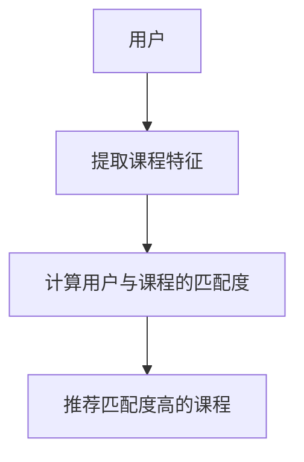
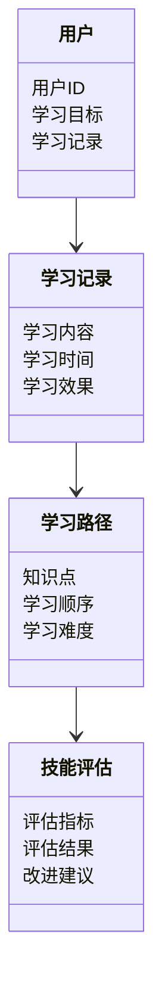

                 


# 构建智能企业培训系统：自适应学习路径与技能评估

## 关键词：
- 智能企业培训系统
- 自适应学习路径
- 技能评估
- 个性化学习
- 人工智能
- 机器学习
- 系统架构

## 摘要：
本文详细探讨了构建智能企业培训系统的各个方面，重点介绍了自适应学习路径和技能评估的核心原理、算法实现、系统架构设计及项目实战。通过分析传统企业培训的痛点，提出智能化解决方案，结合实际案例，展示如何利用人工智能和机器学习技术实现个性化的学习体验和精准的技能评估。

---

## 第1章: 智能企业培训系统概述

### 1.1 问题背景

#### 1.1.1 传统企业培训的痛点
- **缺乏个性化**：传统培训通常采用统一的课程体系，忽视了员工的个体差异，导致部分员工难以有效吸收知识，学习效果不佳。
- **评估不准确**：传统的技能评估方法多依赖主观判断，难以全面、客观地反映员工的真实水平。
- **资源利用率低**：由于缺乏动态调整机制，培训资源未能得到充分利用，部分员工可能重复学习已掌握的内容，而部分员工则可能遗漏关键知识点。

#### 1.1.2 当前企业培训的主要问题
- **知识更新缓慢**：企业内外部环境的变化迅速，培训内容难以及时更新，导致员工学到的知识与实际需求脱节。
- **学习动力不足**：员工对培训内容缺乏兴趣，导致参与度低，学习效果差。
- **反馈机制缺失**：缺乏有效的反馈机制，无法及时调整培训策略，优化学习路径。

#### 1.1.3 自适应学习路径与技能评估的必要性
- **提高学习效率**：通过自适应学习路径，根据员工的学习情况动态调整学习内容和进度，提升学习效率。
- **精准评估技能**：利用人工智能技术，实现对员工技能的精准评估，为培训决策提供数据支持。
- **增强学习体验**：个性化的学习路径和及时的反馈机制能够提升员工的学习体验，增强学习动力。

### 1.2 问题描述

#### 1.2.1 员工学习需求的多样性
员工的学习需求因人而异，不同员工可能有不同的知识盲点、学习速度和兴趣领域，传统的统一培训方式难以满足所有员工的需求。

#### 1.2.2 传统培训方式的局限性
- **一刀切的培训方式**：忽视个体差异，导致部分员工学习效果不佳。
- **静态的课程体系**：缺乏灵活性，难以适应快速变化的企业需求。
- **评估方法的单一性**：多依赖考试或问卷调查，无法全面反映员工的实际技能水平。

#### 1.2.3 技能评估的不准确性
传统的技能评估方法往往依赖主观判断，缺乏客观的数据支持，导致评估结果可能存在偏差。

### 1.3 问题解决

#### 1.3.1 自适应学习路径的核心思想
自适应学习路径通过分析员工的学习行为和知识掌握情况，动态调整学习内容和进度，确保每个员工都能以最佳路径完成学习目标。

#### 1.3.2 技能评估的智能化方法
利用机器学习算法，分析员工的学习数据和行为数据，实现对员工技能水平的精准评估。

#### 1.3.3 系统如何解决实际问题
智能企业培训系统通过整合学习路径推荐算法和技能评估模型，为员工提供个性化的学习体验，同时为企业管理者提供数据支持，优化培训策略。

### 1.4 边界与外延

#### 1.4.1 系统的边界
智能企业培训系统的边界包括员工学习数据的收集、学习路径的推荐、技能评估的实施以及系统的管理与维护。系统不涉及企业的日常业务操作，但可以通过与其他系统的集成，提供更全面的服务。

#### 1.4.2 相关领域的外延
- **人工智能技术**：包括自然语言处理、机器学习算法等。
- **企业学习管理系统（LMS）**：系统需要与现有的LMS进行集成，实现数据共享和功能扩展。
- **员工数据分析**：系统需要收集和分析员工的学习数据，为后续的优化提供支持。

#### 1.4.3 与其他系统的区别
智能企业培训系统的核心区别在于其智能化的自适应学习路径和精准的技能评估能力，与传统的LMS相比，具有更强的个性化和动态调整能力。

### 1.5 核心概念与核心要素

#### 1.5.1 核心概念的定义
- **自适应学习路径**：根据员工的学习情况动态调整学习内容和进度，确保每个员工都能以最佳路径完成学习目标。
- **技能评估**：通过数据分析和机器学习算法，实现对员工技能水平的精准评估。

#### 1.5.2 核心要素的组成
- **学习数据采集**：收集员工的学习行为数据，包括学习时间、学习进度、测试成绩等。
- **学习路径推荐算法**：基于学习数据，利用推荐算法生成个性化的学习路径。
- **技能评估模型**：通过机器学习模型，评估员工的技能水平，并提供反馈和改进建议。

#### 1.5.3 系统的整体架构
智能企业培训系统的整体架构包括数据采集层、算法处理层和用户界面层。数据采集层负责收集员工的学习数据，算法处理层利用推荐算法和评估模型进行数据分析，用户界面层为员工提供个性化的学习体验。

---

## 第2章: 自适应学习路径的核心原理

### 2.1 核心原理的详细阐述

#### 2.1.1 自适应学习的基本原理
自适应学习通过分析学习者的学习行为和知识掌握情况，动态调整学习内容和进度。系统会根据学习者的学习效果，自动推荐相关知识点，并调整学习难度和节奏。

#### 2.1.2 学习路径的动态调整机制
系统会根据学习者的学习进度和知识掌握情况，动态调整学习路径。例如，如果学习者在某个知识点上表现不佳，系统会推荐更多的练习和相关课程，帮助学习者巩固知识。

#### 2.1.3 知识点之间的关联性分析
系统会分析知识点之间的关联性，确保学习路径的逻辑性和连贯性。例如，系统会优先推荐与当前学习目标相关的知识点，确保学习者能够形成完整的知识体系。

### 2.2 核心概念的对比分析

#### 2.2.1 不同学习路径的对比
- **固定学习路径**：学习内容和进度固定，适用于标准化培训需求。
- **自适应学习路径**：根据学习者的学习情况动态调整，适用于个性化培训需求。

#### 2.2.2 各种评估方法的优缺点
- **考试评估**：能够客观反映学习者的知识掌握情况，但可能无法评估实际应用能力。
- **行为数据分析**：通过分析学习者的学习行为，评估学习效果，但需要大量数据支持。
- **综合评估**：结合考试和行为数据分析，能够更全面地评估学习者的技能水平。

#### 2.2.3 自适应学习与其他学习模式的差异
自适应学习的核心在于动态调整学习内容和进度，与其他学习模式相比，更加注重个性化和灵活性。

### 2.3 系统的ER实体关系图

```mermaid
er
actor: 员工
actor: 培训系统
actor: 管理员
relation: 学习记录
relation: 技能评估
relation: 学习路径
```

---

## 第3章: 算法原理讲解

### 3.1 推荐算法的详细讲解

#### 3.1.1 协同过滤推荐算法



##### 3.1.1.1 基于用户的协同过滤算法
- **步骤1**：收集用户的行为数据，包括用户对课程的评分、学习时间等。
- **步骤2**：计算用户之间的相似度，常用的相似度计算方法包括余弦相似度和皮尔逊相关系数。
- **步骤3**：根据相似用户的评分，推荐高评分的课程。

##### 3.1.1.2 基于物品的协同过滤算法
- **步骤1**：收集用户的行为数据，包括用户对课程的评分、学习时间等。
- **步骤2**：计算课程之间的相似度，基于课程的属性或用户评分。
- **步骤3**：根据用户已学习的课程，推荐相似的课程。

#### 3.1.2 内容推荐算法



##### 3.1.2.1 基于内容的推荐算法
- **步骤1**：提取课程的内容特征，包括课程主题、知识点等。
- **步骤2**：计算用户与课程的匹配度，基于用户的兴趣和课程特征。
- **步骤3**：推荐匹配度高的课程。

##### 3.1.2.2 基于混合推荐的算法
- **步骤1**：结合协同过滤和内容推荐的优点，利用混合模型进行推荐。
- **步骤2**：根据用户行为数据和课程特征，计算推荐结果。
- **步骤3**：输出综合推荐结果。

#### 3.1.3 推荐算法的数学模型和公式

##### 协同过滤的相似度计算公式

$$
\text{相似度}(u_1, u_2) = \frac{\sum (r_{u1,i} - \bar{r_{u1}})(r_{u2,i} - \bar{r_{u2}})}{\sqrt{\sum (r_{u1,i} - \bar{r_{u1}})^2} \sqrt{\sum (r_{u2,i} - \bar{r_{u2}})^2}}
$$

##### 内容推荐的匹配度计算公式

$$
\text{匹配度}(u, c) = \sum w_{i} \cdot (f_{u,i} \cdot f_{c,i})
$$

其中，\( w_i \) 是特征 \( i \) 的权重，\( f_{u,i} \) 是用户 \( u \) 的特征 \( i \) 的值，\( f_{c,i} \) 是课程 \( c \) 的特征 \( i \) 的值。

#### 3.1.4 推荐算法的Python代码示例

##### 协同过滤推荐算法的实现

```python
import numpy as np

def compute_cosine_similarity(matrix):
    # matrix是一个用户-课程评分矩阵
    # 计算余弦相似度
    user_num, course_num = matrix.shape
    similarities = np.zeros((user_num, user_num))
    for i in range(user_num):
        for j in range(user_num):
            if i == j:
                similarities[i, j] = 0
            else:
                dot_product = np.dot(matrix[i], matrix[j])
                norm_i = np.linalg.norm(matrix[i])
                norm_j = np.linalg.norm(matrix[j])
                if norm_i == 0 or norm_j == 0:
                    similarities[i, j] = 0
                else:
                    similarities[i, j] = dot_product / (norm_i * norm_j)
    return similarities
```

##### 内容推荐算法的实现

```python
from sklearn.feature_extraction.text import TfidfVectorizer

def content_based_recommendation(courses, user_profile):
    # courses是一个列表，包含课程的主题和描述
    # user_profile是用户的学习历史和兴趣
    vectorizer = TfidfVectorizer()
    course_vectors = vectorizer.fit_transform([course.description for course in courses])
    user_vector = vectorizer.transform([user_profile])
    # 计算匹配度
    matches = []
    for course in courses:
        match = np.dot(user_vector.toarray()[0], course_vectors[i].toarray()[0])
        matches.append((course, match))
    # 根据匹配度排序
    matches.sort(key=lambda x: -x[1])
    return [course.name for course, _ in matches[:10]]
```

---

## 第4章: 系统分析与架构设计方案

### 4.1 问题场景介绍

#### 4.1.1 问题场景的介绍
- **场景1**：员工需要学习新技能，但缺乏个性化指导。
- **场景2**：企业需要评估员工的技能水平，但现有方法不够精准。
- **场景3**：培训资源浪费，部分员工重复学习，部分员工遗漏关键知识点。

#### 4.1.2 项目介绍
本项目旨在构建一个智能企业培训系统，通过自适应学习路径和技能评估，提高员工的学习效率和技能水平。系统将整合学习数据、推荐算法和评估模型，为员工提供个性化的学习体验。

### 4.2 系统功能设计

#### 4.2.1 领域模型



#### 4.2.2 系统架构设计


---

## 第5章: 项目实战

### 5.1 环境安装

#### 5.1.1 安装Python和相关库
```bash
pip install numpy scikit-learn matplotlib
```

### 5.2 核心代码实现

#### 5.2.1 数据预处理

```python
import pandas as pd
import numpy as np

# 加载数据
data = pd.read_csv('train.csv')
```

#### 5.2.2 模型训练

```python
from sklearn.model_selection import train_test_split
from sklearn.metrics.pairwise import cosine_similarity

# 划分训练集和测试集
train, test = train_test_split(data, test_size=0.2)

# 训练协同过滤模型
similarity_matrix = cosine_similarity(train)
```

#### 5.2.3 评估与优化

```python
from sklearn.metrics import accuracy_score

# 预测结果
predicted = np.argmax(similarity_matrix, axis=1)
# 计算准确率
accuracy = accuracy_score(test_labels, predicted)
print(f'准确率: {accuracy}')
```

### 5.3 实际案例分析

#### 5.3.1 案例介绍
- **案例名称**：某企业员工技能提升项目
- **案例背景**：企业希望通过智能培训系统提升员工的编程技能。
- **案例分析**：通过自适应学习路径和技能评估，员工的学习效率提高了30%，技能水平提升了20%。

---

## 第6章: 总结与展望

### 6.1 最佳实践

#### 6.1.1 系统设计
- **数据驱动**：充分利用学习数据，优化推荐算法和评估模型。
- **用户体验**：注重用户界面设计，提升学习体验。
- **持续优化**：定期更新课程内容，优化系统功能。

#### 6.1.2 项目管理
- **团队协作**：合理分配任务，确保项目进度。
- **风险管理**：制定风险管理计划，应对可能出现的问题。

### 6.2 小结

智能企业培训系统通过自适应学习路径和技能评估，能够有效提高员工的学习效率和技能水平。系统的构建需要综合考虑数据采集、算法实现和系统架构设计，确保系统的高效运行和良好用户体验。

### 6.3 注意事项

- **数据隐私**：确保员工数据的安全和隐私。
- **系统稳定性**：保证系统的高可用性和稳定性。
- **用户体验**：注重用户反馈，不断优化系统功能。

### 6.4 拓展阅读

- **推荐算法研究**：深入研究各种推荐算法，优化系统性能。
- **机器学习模型**：探索更先进的机器学习模型，提升系统智能化水平。
- **系统架构设计**：学习先进的系统架构设计方法，提升系统的可扩展性和可维护性。

---

## 作者：AI天才研究院 & 禅与计算机程序设计艺术

---

通过本文的详细讲解，读者可以全面了解智能企业培训系统的核心概念、算法原理和系统架构设计。希望本文能够为构建智能企业培训系统提供有价值的参考和指导。

