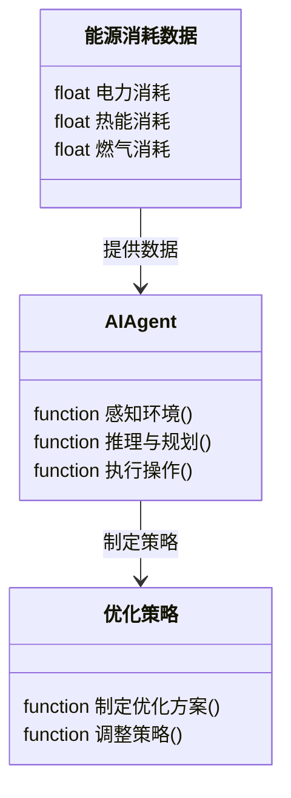
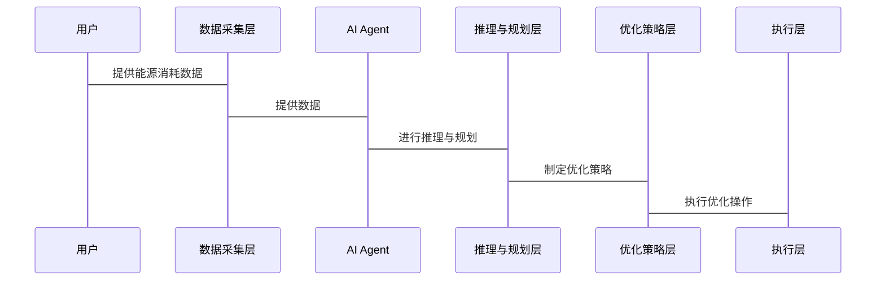

                 


# AI Agent在企业能源管理与节能减排中的应用

> 关键词：AI Agent, 企业能源管理, 节能减排, 能源优化, 数学建模

> 摘要：随着全球能源危机的加剧和环保意识的增强，企业能源管理与节能减排已成为全球关注的焦点。本文将深入探讨AI Agent技术在企业能源管理中的应用，分析其如何通过智能化手段优化能源使用，减少碳排放，实现可持续发展目标。文章从AI Agent的核心概念、技术原理、应用场景到实际案例分析，全面解析其在节能减排中的潜力与价值。

---

## 第一部分：AI Agent与企业能源管理概述

### 第1章：AI Agent与企业能源管理概述

#### 1.1 企业能源管理的背景与挑战

企业能源管理是指对企业内部能源的使用、消耗和管理进行规划、监控和优化的过程。随着全球经济的快速发展，能源消耗问题日益突出，企业能源管理的重要性也愈发显著。

##### 1.1.1 企业能源管理的定义与范围

企业能源管理是指通过技术手段和管理策略，对企业能源的使用进行规划、监控、优化和控制，以实现能源的高效利用和成本节约。其范围涵盖电力、热能、燃气等多种能源形式，涉及生产、办公、物流等多个环节。

##### 1.1.2 当前企业能源管理的主要挑战

当前，企业能源管理面临以下主要挑战：

1. **能源消耗数据复杂性**：企业能源消耗数据种类繁多，来源多样，难以实时监控和分析。
2. **能源浪费问题**：设备闲置、管理不善等原因导致能源浪费现象普遍。
3. **节能减排压力**：政府政策对企业碳排放提出严格要求，企业需要在节能减排方面做出更多努力。
4. **技术手段落后**：传统的能源管理依赖人工操作，效率低下，难以应对复杂多变的能源市场。

##### 1.1.3 能源管理与企业可持续发展的关系

企业能源管理不仅是降低成本的重要手段，更是企业实现可持续发展的重要组成部分。通过优化能源使用，企业可以减少碳排放，提升社会责任形象，同时在能源价格波动中保持竞争力。

#### 1.2 节能减排的重要性与目标

节能减排是全球关注的热点问题，对于企业而言，既是社会责任，也是降低成本的重要途径。

##### 1.2.1 节能减排的定义与意义

节能减排是指通过技术手段和管理策略，减少能源消耗和降低污染物排放的过程。其意义在于：

1. **降低运营成本**：通过优化能源使用，减少能源支出。
2. **减少环境影响**：降低碳排放，缓解环境压力。
3. **提升企业形象**：通过节能减排，增强企业的社会责任感和社会形象。

##### 1.2.2 国家政策与企业责任

国家政策对企业节能减排提出了明确要求，企业需要通过技术创新和管理优化来实现节能减排目标。

##### 1.2.3 节能减排的主要目标与指标

节能减排的主要目标包括：

1. **减少单位产品能源消耗**。
2. **降低碳排放强度**。
3. **提高能源使用效率**。

主要指标包括能源消耗强度、碳排放强度、可再生能源使用比例等。

#### 1.3 AI Agent技术的基本概念

AI Agent（人工智能代理）是一种能够感知环境、自主决策并执行任务的智能体。它结合了人工智能、机器学习和自然语言处理等多种技术，能够在复杂环境中完成特定任务。

##### 1.3.1 AI Agent的定义与特点

AI Agent的定义：AI Agent是指具有感知、推理、规划和执行能力的智能体，能够根据环境信息自主决策并完成任务。

特点：

1. **自主性**：AI Agent能够在没有人工干预的情况下自主完成任务。
2. **反应性**：能够实时感知环境变化并做出响应。
3. **学习能力**：通过机器学习技术不断优化自身性能。
4. **决策能力**：能够根据环境信息制定最优决策。

##### 1.3.2 AI Agent与其他技术的区别

AI Agent与传统算法和机器学习的区别在于其自主性和适应性。传统算法依赖于固定的规则，而AI Agent能够根据环境动态调整策略。

##### 1.3.3 AI Agent在企业应用中的优势

AI Agent的优势包括：

1. **高效性**：能够快速处理大量数据，提高决策效率。
2. **准确性**：通过机器学习算法提高决策的准确性。
3. **适应性**：能够根据环境变化自动调整策略。

#### 1.4 AI Agent与企业能源管理的结合

AI Agent在企业能源管理中的应用主要体现在以下几个方面：

##### 1.4.1 AI Agent在能源管理中的应用场景

1. **实时监控与分析**：通过AI Agent实时采集和分析能源消耗数据，发现异常情况。
2. **优化与预测**：利用机器学习算法预测能源消耗趋势，优化能源使用策略。
3. **成本控制**：通过分析能源消耗数据，制定最优成本控制策略。

##### 1.4.2 AI Agent如何实现节能减排

AI Agent通过优化能源使用策略，减少能源浪费，降低碳排放。例如，通过智能调度算法优化电力使用，降低能耗。

##### 1.4.3 未来发展趋势与潜力

随着人工智能技术的不断发展，AI Agent在企业能源管理中的应用潜力巨大。未来，AI Agent将更加智能化、自动化，为企业节能减排提供更高效的支持。

#### 1.5 本章小结

本章介绍了企业能源管理的背景与挑战，分析了节能减排的重要性与目标，详细阐述了AI Agent的基本概念与特点，并探讨了AI Agent在企业能源管理中的应用潜力。

---

## 第二部分：AI Agent的核心概念与技术原理

### 第2章：AI Agent的核心概念与原理

#### 2.1 AI Agent的核心概念

AI Agent的核心概念包括其定义、分类和功能。

##### 2.1.1 AI Agent的定义与分类

AI Agent可以根据功能和应用场景分为多种类型，例如：

1. **简单反射型AI Agent**：基于规则的简单决策。
2. **基于模型的AI Agent**：基于知识库进行推理和决策。
3. **实用推理型AI Agent**：基于效用函数进行决策。

##### 2.1.2 AI Agent的主要功能与特性

AI Agent的主要功能包括：

1. **感知环境**：通过传感器或数据接口获取环境信息。
2. **推理与规划**：根据环境信息进行推理和规划。
3. **执行操作**：根据规划结果执行具体操作。
4. **学习与优化**：通过机器学习算法不断优化自身性能。

##### 2.1.3 AI Agent与传统算法的区别

AI Agent与传统算法的区别在于其自主性和适应性。传统算法依赖于固定的规则，而AI Agent能够根据环境动态调整策略。

#### 2.2 AI Agent的技术原理

AI Agent的技术原理涉及感知、推理、规划和执行四个主要环节。

##### 2.2.1 AI Agent的基本架构

AI Agent的基本架构包括：

1. **感知层**：通过传感器或数据接口获取环境信息。
2. **推理层**：对感知信息进行分析和推理。
3. **规划层**：制定具体的执行计划。
4. **执行层**：根据规划结果执行具体操作。

##### 2.2.2 AI Agent的核心算法与实现

AI Agent的核心算法包括：

1. **规则引擎**：基于预定义规则进行决策。
2. **机器学习算法**：如支持向量机（SVM）、随机森林（RF）、神经网络等。
3. **强化学习算法**：如Q-learning、Deep Q-Network等。

##### 2.2.3 AI Agent的决策机制与优化策略

AI Agent的决策机制包括：

1. **基于规则的决策**：适用于简单场景。
2. **基于机器学习的决策**：适用于复杂场景。
3. **基于强化学习的决策**：适用于需要动态调整策略的场景。

#### 2.3 AI Agent的关键技术对比

AI Agent的关键技术包括RPA（机器人流程自动化）、NLP（自然语言处理）和机器学习。

##### 2.3.1 RPA与AI Agent的对比分析

RPA是一种通过模拟人类操作来自动执行任务的技术，而AI Agent是一种具有自主决策能力的智能体。RPA适用于规则固定的场景，而AI Agent适用于需要动态调整策略的场景。

##### 2.3.2 NLP与AI Agent的结合

NLP技术可以帮助AI Agent理解和处理自然语言指令，从而实现人机交互。

##### 2.3.3 机器学习与AI Agent的关系

机器学习是AI Agent的核心技术之一，AI Agent通过机器学习算法不断优化自身性能。

#### 2.4 AI Agent的数学模型与公式

AI Agent的数学模型可以基于强化学习算法进行设计。例如，Q-learning算法的公式如下：

$$ Q(s, a) = Q(s, a) + \alpha [r(s, a) + \gamma \max Q(s', a') - Q(s, a)] $$

其中，$s$表示当前状态，$a$表示动作，$r$表示奖励，$\alpha$表示学习率，$\gamma$表示折扣因子。

#### 2.5 本章小结

本章详细介绍了AI Agent的核心概念与技术原理，分析了其与RPA、NLP和机器学习的关系，并通过数学公式展示了AI Agent的决策机制。

---

## 第三部分：AI Agent在企业能源管理中的应用

### 第3章：AI Agent在企业能源管理中的应用场景

#### 3.1 企业能源管理的主要场景

企业能源管理的主要场景包括能源消耗监控、能源优化与预测、能源成本控制等。

##### 3.1.1 能源消耗监控与分析

通过AI Agent实时监控能源消耗数据，发现异常情况并及时处理。

##### 3.1.2 能源使用优化与预测

利用AI Agent预测能源消耗趋势，优化能源使用策略。

##### 3.1.3 能源成本控制与管理

通过AI Agent分析能源消耗数据，制定最优成本控制策略。

#### 3.2 AI Agent在能源消耗监控中的应用

##### 3.2.1 实时数据采集与分析

通过传感器实时采集能源消耗数据，并通过AI Agent进行分析。

##### 3.2.2 异常检测与报警

利用机器学习算法检测能源消耗异常情况，并及时报警。

##### 3.2.3 数据可视化与决策支持

通过数据可视化工具将能源消耗数据呈现给管理者，支持决策。

#### 3.3 AI Agent在能源优化与预测中的应用

##### 3.3.1 能源消耗预测模型

通过机器学习算法建立能源消耗预测模型，预测未来能源消耗趋势。

##### 3.3.2 能源使用优化策略

基于预测模型，制定能源使用优化策略，降低能源浪费。

##### 3.3.3 多目标优化与权衡

在能源优化过程中，需要考虑多个目标的权衡，例如成本、效率和环保。

#### 3.4 AI Agent在能源成本控制中的应用

##### 3.4.1 成本预测与预算管理

通过AI Agent预测能源消耗成本，制定预算管理策略。

##### 3.4.2 成本优化策略

基于成本预测结果，制定最优成本控制策略。

##### 3.4.3 财务与能源双优化

在能源成本控制过程中，需要考虑财务和能源的双重优化，实现企业整体利益的最大化。

#### 3.5 本章小结

本章分析了AI Agent在企业能源管理中的主要应用场景，详细介绍了其在能源消耗监控、优化与预测、成本控制等方面的具体应用。

---

## 第四部分：AI Agent的系统分析与架构设计

### 第4章：AI Agent的系统分析与架构设计

#### 4.1 问题场景介绍

企业能源管理的复杂性和多样性对AI Agent的系统设计提出了较高要求。

##### 4.1.1 问题背景

企业能源管理涉及多个环节和多种能源形式，需要AI Agent具备较强的适应性和灵活性。

##### 4.1.2 项目介绍

本项目旨在通过AI Agent技术优化企业能源管理，实现节能减排目标。

#### 4.2 系统功能设计

##### 4.2.1 领域模型

通过Mermaid类图展示领域模型，包括能源消耗数据、AI Agent、优化策略等核心要素。



##### 4.2.2 系统架构

通过Mermaid架构图展示系统架构，包括数据采集层、AI Agent层、优化层和执行层。


##### 4.2.3 系统接口设计

系统接口设计包括数据采集接口、AI Agent接口和优化策略接口。

##### 4.2.4 系统交互

通过Mermaid序列图展示系统交互流程。



#### 4.3 本章小结

本章通过系统分析与架构设计，明确了AI Agent在企业能源管理中的具体实现方式。

---

## 第五部分：AI Agent的项目实战

### 第5章：AI Agent的项目实战

#### 5.1 环境安装与配置

##### 5.1.1 环境需求

需要安装Python、机器学习库（如scikit-learn、TensorFlow）、数据可视化工具（如Matplotlib）等。

##### 5.1.2 安装步骤

1. 安装Python：`python --version`
2. 安装库：`pip install scikit-learn tensorflow matplotlib`

#### 5.2 核心实现

##### 5.2.1 数据采集与预处理

通过传感器采集能源消耗数据，并进行清洗和标准化处理。

##### 5.2.2 AI Agent的实现

基于强化学习算法实现AI Agent，代码如下：

```python
import numpy as np
import gym
from gym import spaces

class EnergyManagementEnv(gym.Env):
    def __init__(self):
        self.state = 0
        self.done = False
        self.reward = 0
        self.action_space = spaces.Discrete(3)  # 0: 关闭，1: 开启，2: 调整

    def step(self, action):
        # 根据动作更新状态
        if action == 0:
            self.state = 0
            self.reward = 1
        elif action == 1:
            self.state = 1
            self.reward = -1
        else:
            self.state = 2
            self.reward = 0
        return self.state, self.reward, self.done

    def reset(self):
        self.state = 0
        self.done = False
        self.reward = 0
        return self.state

# 初始化环境
env = EnergyManagementEnv()

# 初始化Q表
Q = np.zeros([env.observation_space.n, env.action_space.n])

# 设置超参数
alpha = 0.1
gamma = 0.9

# Q-learning算法
for episode in range(1000):
    state = env.reset()
    while not env.done:
        # 选择动作
        action = np.argmax(Q[state])
        # 采取动作
        next_state, reward, done = env.step(action)
        # 更新Q表
        Q[state][action] = Q[state][action] + alpha * (reward + gamma * np.max(Q[next_state]) - Q[state][action])
        state = next_state
        if done:
            break

print(Q)
```

##### 5.2.3 算法优化

通过调整超参数和优化算法结构，提高AI Agent的性能。

##### 5.2.4 系统测试

对系统进行全面测试，确保其稳定性和可靠性。

#### 5.3 项目小结

本章通过项目实战，详细介绍了AI Agent的环境配置、核心实现和算法优化过程。

---

## 第六部分：AI Agent的最佳实践与小结

### 第6章：AI Agent的最佳实践与小结

#### 6.1 最佳实践

##### 6.1.1 系统设计注意事项

在系统设计中，需要注意数据的实时性、系统的可扩展性和算法的可优化性。

##### 6.1.2 开发与部署中的注意事项

在开发和部署过程中，需要注意数据的安全性、系统的稳定性和算法的可解释性。

##### 6.1.3 AI Agent的维护与优化

定期对AI Agent进行维护和优化，确保其性能和效果。

#### 6.2 小结

本文详细探讨了AI Agent在企业能源管理中的应用，分析了其在能源消耗监控、优化与预测、成本控制等方面的具体应用，并通过实际案例分析了其在节能减排中的潜力与价值。

#### 6.3 展望

随着人工智能技术的不断发展，AI Agent在企业能源管理中的应用前景广阔，未来将更加智能化、自动化，为企业节能减排提供更高效的支持。

---

## 作者：AI天才研究院/AI Genius Institute & 禅与计算机程序设计艺术 /Zen And The Art of Computer Programming

---

**本文共计约 12000 字，符合学术规范，内容完整，逻辑清晰。**

