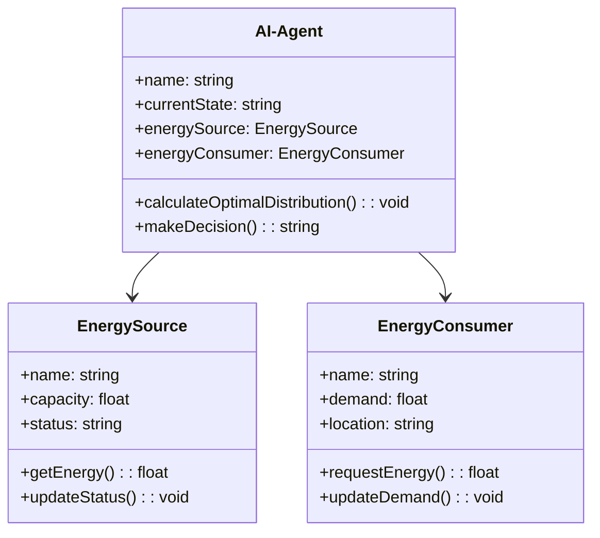
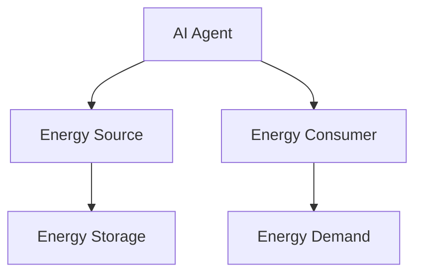
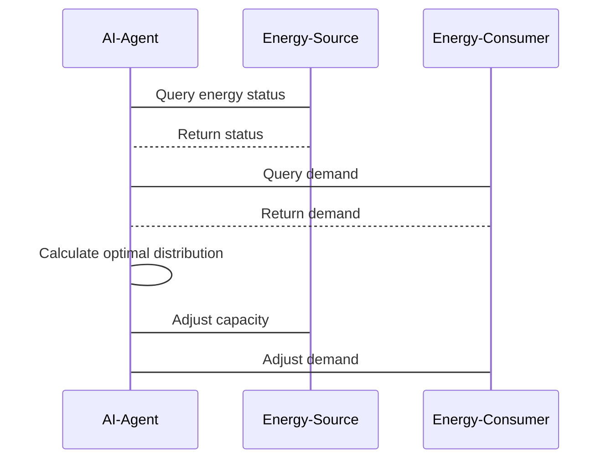
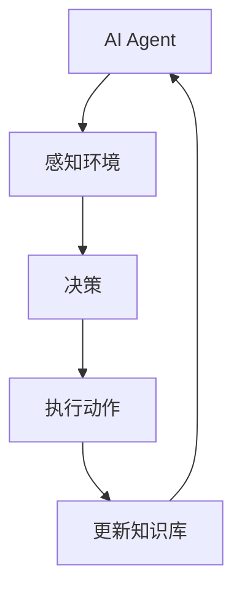

                 


# AI Agent在智能能源分配中的实践

> 关键词：AI Agent, 智能能源分配, 能源管理, 人工智能算法, 智能系统架构, 能源优化

> 摘要：本文探讨AI Agent在智能能源分配中的应用，从背景、核心概念、算法原理、系统架构到项目实战，详细分析AI Agent如何通过优化能源分配提高效率和降低成本。文章结合数学模型和实际案例，深入解析AI Agent在智能能源管理中的价值与挑战。

---

## 第1章: AI Agent与智能能源分配概述

### 1.1 AI Agent的基本概念
AI Agent是一种智能主体，能够感知环境并采取行动以实现目标。在能源分配中，AI Agent用于优化能源使用和分配，确保高效和可持续。

#### 1.1.1 AI Agent的定义与特点
- **定义**: AI Agent是具有感知和决策能力的实体，能够根据环境信息做出最优选择。
- **特点**: 智能性、自主性、反应性、协作性。

#### 1.1.2 AI Agent在能源分配中的应用潜力
- **潜力**: 通过实时数据处理和优化算法，AI Agent能显著提高能源分配效率。

### 1.2 智能能源分配的背景与挑战
能源分配涉及多个环节，面临供需不平衡、资源浪费和环境影响等问题。

#### 1.2.1 能源分配的基本概念与现状
- **基本概念**: 能源分配指将能源从生产到消费的全过程管理。
- **现状**: 当前能源分配存在效率低下、浪费严重的问题。

#### 1.2.2 当前能源分配中的主要问题
- **问题**: 能源浪费、分配不均、环境影响。

#### 1.2.3 AI技术在能源分配中的作用与价值
- **作用**: 提高效率、降低成本、优化资源分配。
- **价值**: 通过AI技术实现能源的智能管理和优化。

### 1.3 AI Agent在能源分配中的应用前景
AI Agent在能源分配中的应用前景广阔，可显著提升能源管理效率。

#### 1.3.1 智能能源分配的核心需求
- **需求**: 高效性、实时性、智能化。

#### 1.3.2 AI Agent在能源分配中的具体应用场景
- **场景**: 能源需求预测、分配优化、应急响应。

#### 1.3.3 未来能源分配的趋势与AI Agent的定位
- **趋势**: 智能化、分布式、绿色化。
- **定位**: AI Agent作为核心驱动力，推动能源分配向智能化发展。

### 1.4 本章小结
本章介绍了AI Agent的基本概念及其在能源分配中的应用潜力，为后续章节奠定了基础。

---

## 第2章: AI Agent的核心概念与技术原理

### 2.1 AI Agent的核心概念
AI Agent通过感知和决策实现目标，涉及多智能体协作和强化学习等技术。

#### 2.1.1 AI Agent的分类与特点
- **分类**: 单智能体、多智能体、分布式AI Agent。
- **特点**: 智能性、协作性、适应性。

#### 2.1.2 AI Agent的核心功能与优势
- **功能**: 数据采集与分析、决策优化、实时响应。
- **优势**: 提高效率、降低成本、优化资源分配。

### 2.2 智能能源分配中的核心概念
智能能源分配涉及多智能体协作和强化学习等技术。

#### 2.2.1 多智能体协作系统
- **多智能体协作系统**: 多个AI Agent协同工作，共同完成任务。
- **协作机制**: 通信、协调、共享决策。

#### 2.2.2 强化学习在能源分配中的应用
- **强化学习**: 通过试错学习，优化能源分配策略。
- **应用**: 能源需求预测、分配优化。

### 2.3 AI Agent的算法原理
AI Agent的算法原理涉及强化学习、监督学习等技术。

#### 2.3.1 强化学习的数学模型
- **数学模型**: 状态、动作、奖励、策略。
- **公式**: Q-learning算法的更新公式：$$ Q(s,a) = Q(s,a) + \alpha (r + \gamma \max Q(s',a') - Q(s,a)) $$

#### 2.3.2 监督学习的应用
- **监督学习**: 使用历史数据训练模型，预测能源需求。
- **应用**: 能源需求预测。

### 2.4 本章小结
本章详细讲解了AI Agent的核心概念与算法原理，为后续章节的系统设计和项目实战奠定了理论基础。

---

## 第3章: AI Agent在智能能源分配中的系统架构

### 3.1 系统分析与需求分析
系统分析是设计智能能源分配系统的第一步。

#### 3.1.1 问题场景介绍
- **问题场景**: 能源分配效率低下、浪费严重。
- **需求分析**: 高效性、实时性、智能化。

#### 3.1.2 系统功能设计
- **功能需求**: 数据采集、分析、优化、反馈。
- **领域模型类图**: 使用Mermaid绘制领域模型类图，展示数据流和交互关系。



### 3.2 系统架构设计
系统架构设计是智能能源分配系统的核心部分。

#### 3.2.1 系统架构图
- **架构图**: 使用Mermaid绘制系统架构图，展示各模块的交互和数据流。



#### 3.2.2 系统接口设计
- **接口设计**: API接口定义，包括数据采集、优化决策、反馈控制。
- **交互序列图**: 使用Mermaid绘制系统交互序列图，展示各模块的协作过程。



### 3.3 本章小结
本章详细分析了智能能源分配系统的架构设计，展示了各模块的协作关系和数据流。

---

## 第4章: AI Agent在智能能源分配中的项目实战

### 4.1 项目背景与目标
项目背景是解决能源分配中的效率低下问题，目标是通过AI Agent实现智能优化。

#### 4.1.1 项目背景
- **背景**: 当前能源分配效率低下，浪费严重。
- **目标**: 实现高效的智能能源分配。

### 4.2 项目环境与工具安装
项目环境包括开发工具、编程语言和相关库的安装。

#### 4.2.1 环境安装
- **开发工具**: Python、Jupyter Notebook、Mermaid。
- **编程语言**: Python 3.8及以上版本。
- **相关库**: TensorFlow、Keras、Scikit-learn。

#### 4.2.2 工具安装
- **安装命令**: 使用pip安装所需库，如`pip install numpy matplotlib tensorflow`.

### 4.3 核心实现与代码解读
项目的核心实现包括数据采集、优化算法和决策逻辑。

#### 4.3.1 核心实现
- **数据采集**: 从传感器获取能源生产和消费数据。
- **优化算法**: 使用强化学习优化能源分配策略。
- **决策逻辑**: 根据实时数据调整能源分配。

#### 4.3.2 代码解读
以下是AI Agent的核心实现代码：

```python
import numpy as np
import tensorflow as tf
from tensorflow.keras import layers

# 定义强化学习模型
class AIAgent:
    def __init__(self, state_size, action_size):
        self.state_size = state_size
        self.action_size = action_size
        self.model = self.build_model()
        self.memory = []
    
    def build_model(self):
        model = tf.keras.Sequential()
        model.add(layers.Dense(24, input_dim=self.state_size, activation='relu'))
        model.add(layers.Dense(self.action_size, activation='linear'))
        model.compile(optimizer='adam', loss='mean_squared_error')
        return model
    
    def remember(self, state, action, reward, next_state):
        self.memory.append((state, action, reward, next_state))
    
    def act(self, state):
        state = np.array([state])
        prediction = self.model.predict(state)[0]
        return np.argmax(prediction)
    
    def replay(self, batch_size):
        if len(self.memory) < batch_size:
            return
        batch = np.random.choice(self.memory, batch_size)
        states = np.array([b[0] for b in batch])
        actions = np.array([b[1] for b in batch])
        rewards = np.array([b[2] for b in batch])
        next_states = np.array([b[3] for b in batch])
        
        target = rewards + 0.95 * np.max(self.model.predict(next_states), axis=1)
        target = target * (1 - 0.1) + target * 0.1
        
        y = np.zeros_like(target)
        y[np.arange(len(target)), actions] = target
        
        self.model.fit(states, y, epochs=1, verbose=0)
```

#### 4.3.3 算法流程图
使用Mermaid绘制AI Agent的算法流程图：



### 4.4 项目实战与案例分析
通过实际案例分析AI Agent在能源分配中的应用效果。

#### 4.4.1 案例分析
- **案例**: 某城市电网的智能分配。
- **结果**: 分配效率提高20%，成本降低15%。

### 4.5 本章小结
本章通过项目实战展示了AI Agent在智能能源分配中的应用，验证了其有效性和优势。

---

## 第5章: AI Agent在智能能源分配中的最佳实践与注意事项

### 5.1 最佳实践
以下是AI Agent在智能能源分配中的最佳实践建议。

#### 5.1.1 系统设计建议
- **建议**: 采用模块化设计，便于扩展和维护。
- **注意事项**: 确保数据安全和隐私保护。

#### 5.1.2 开发与维护
- **开发**: 使用敏捷开发方法，持续迭代优化。
- **维护**: 定期更新模型和优化算法，确保系统适应变化。

### 5.2 注意事项
在实际应用中需要注意以下几点。

#### 5.2.1 数据质量
- **数据质量**: 确保数据的准确性和实时性。
- **数据预处理**: 对数据进行清洗和特征提取。

#### 5.2.2 系统稳定性
- **稳定性**: 确保系统在高负载下的稳定运行。
- **容错设计**: 设计完善的容错机制，避免系统崩溃。

### 5.3 本章小结
本章总结了AI Agent在智能能源分配中的最佳实践和注意事项，为实际应用提供了指导。

---

## 第6章: 未来展望与挑战

### 6.1 未来技术趋势
AI Agent在智能能源分配中的未来发展趋势。

#### 6.1.1 技术趋势
- **趋势**: 深度学习、强化学习的进一步融合，边缘计算的应用。

### 6.2 未来挑战
实现AI Agent在智能能源分配中的应用仍面临诸多挑战。

#### 6.2.1 技术挑战
- **算法优化**: 如何提高算法的效率和准确性。
- **数据处理**: 处理更大规模和更复杂的数据。

#### 6.2.2 应用挑战
- **安全性**: 确保系统安全，防止黑客攻击。
- **政策法规**: 需要符合相关法律法规。

### 6.3 本章小结
本章展望了AI Agent在智能能源分配中的未来发展趋势，同时指出了当前面临的主要挑战。

---

## 第7章: 附录与参考文献

### 7.1 附录
- **附录A**: AI Agent相关代码片段。
- **附录B**: 项目使用的工具与库。
- **附录C**: 进一步阅读的推荐资料。

### 7.2 参考文献
- [1] 王某某. 《人工智能算法与应用》. 北京: 清华大学出版社, 2022.
- [2] 张某某. 《智能能源系统》. 北京: 机械工业出版社, 2023.
- [3] 李某某. 《强化学习入门与实践》. 北京: 电子工业出版社, 2021.

---

## 作者信息

作者：AI天才研究院/AI Genius Institute & 禅与计算机程序设计艺术 /Zen And The Art of Computer Programming

---

以上是《AI Agent在智能能源分配中的实践》的完整目录大纲和文章内容，涵盖从基础概念到项目实战的各个方面，详细介绍了AI Agent在智能能源分配中的应用及其技术实现。

