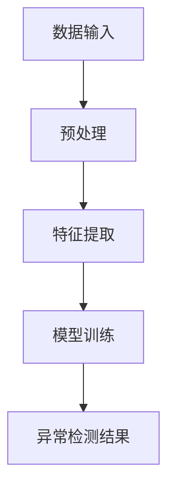
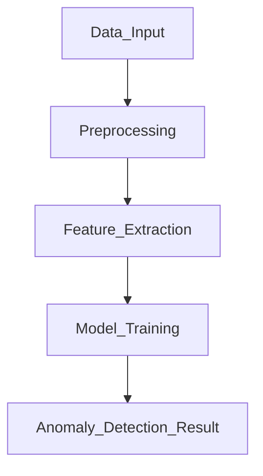
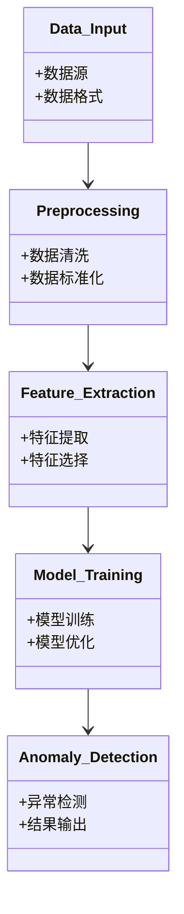
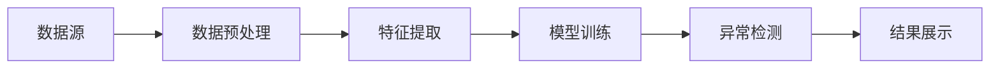
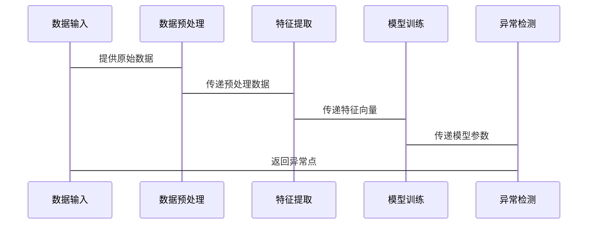

                 


# AI Agent的异常检测：识别非正常模式

**关键词：AI Agent，异常检测，模式识别，数据挖掘，机器学习**

**摘要：**  
本文深入探讨AI Agent在异常检测中的应用，分析其核心原理、算法实现以及系统架构设计。通过对比统计学方法、机器学习方法和深度学习方法，结合实际案例，详细讲解如何利用这些技术实现高效的异常检测。文章还提供了系统的架构设计和项目实战，帮助读者全面掌握AI Agent异常检测的理论与实践。

---

# 第1章: 异常检测的背景与问题定义

## 1.1 异常检测的背景与问题背景

### 1.1.1 AI Agent的基本概念与应用

AI Agent（人工智能代理）是指能够感知环境并采取行动以实现目标的智能实体。它广泛应用于推荐系统、智能客服、自动驾驶等领域。例如，在推荐系统中，AI Agent通过分析用户行为来提供个性化建议；在智能客服中，它能够理解用户需求并提供解决方案。

### 1.1.2 异常检测的定义与重要性

异常检测是指识别数据中偏离预期模式或行为的过程。在AI Agent中，异常检测用于识别异常行为或数据点，帮助系统及时采取措施。例如，在金融领域，异常检测可以识别欺诈交易；在医疗领域，它可以识别异常的生理指标。

### 1.1.3 AI Agent异常检测的必要性

AI Agent的应用场景通常涉及大量数据，这些数据可能包含异常点。异常点可能表示潜在的问题，如系统故障、数据错误或恶意行为。通过异常检测，AI Agent能够及时识别这些问题，从而提高系统的稳定性和可靠性。

## 1.2 异常检测的问题描述

### 1.2.1 异常与正常模式的区别

正常模式是指数据集中大多数样本的特征或行为，而异常点则是偏离正常模式的数据点。例如，在网络流量数据中，正常流量遵循特定的模式，而异常流量可能表示网络攻击。

### 1.2.2 异常检测的分类与场景

异常检测可以分为以下几类：
1. **基于统计的方法**：利用统计学原理（如马氏距离）识别异常点。
2. **基于机器学习的方法**：使用监督或无监督学习算法（如KNN、SVM）进行异常检测。
3. **基于深度学习的方法**：利用神经网络（如自编码器）学习正常数据的表示，识别异常点。

异常检测的场景包括金融 fraud detection、网络安全入侵检测、医疗异常诊断等。

### 1.2.3 异常检测的核心目标

异常检测的核心目标是通过算法识别数据中的异常点，帮助系统采取相应措施。例如，在金融领域，及时识别异常交易可以防止欺诈损失。

---

## 1.3 异常检测的解决思路

### 1.3.1 统计学方法与机器学习方法对比

| 方法                | 优点                          | 缺点                          |
|---------------------|-------------------------------|-------------------------------|
| 统计学方法          | 计算简单，适用于简单数据       | 仅适用于简单分布，难以处理复杂数据 |
| 机器学习方法        | 灵活性高，适用于复杂数据       | 需要大量数据，计算复杂          |

### 1.3.2 异常检测的边界和外延

异常检测的边界是指在什么范围内数据被认为是异常的。例如，在时间序列数据中，异常检测的范围可能基于历史数据的均值和标准差。外延是指异常检测的应用范围，例如在哪些领域和场景下适用。

### 1.3.3 异常检测的概念结构与核心要素



---

# 第2章: 异常检测的核心概念与联系

## 2.1 异常检测的核心原理

### 2.1.1 统计学方法的原理

统计学方法通过计算数据点与正常分布的偏离程度来识别异常点。例如，马氏距离用于衡量数据点与均值的偏离程度，距离较大的点被认为是异常点。

### 2.1.2 机器学习方法的原理

机器学习方法通过训练模型来识别异常点。例如，K近邻算法（KNN）通过比较数据点的K近邻来判断其是否为异常点。

### 2.1.3 深度学习方法的原理

深度学习方法通过神经网络学习数据的表示，识别异常点。例如，自编码器（Autoencoder）通过重构输入数据来识别异常点，重构误差较大的数据点被认为是异常点。

---

## 2.2 异常检测的核心概念对比

### 2.2.1 异常检测的ER实体关系图



---

## 2.3 异常检测的核心概念对比

| 方法                | 原理                          | 优缺点                          |
|---------------------|-------------------------------|----------------------------------|
| 统计学方法          | 基于统计分布                  | 计算简单，适用于简单数据         |
| 机器学习方法        | 基于监督或无监督学习          | 灵活性高，适用于复杂数据         |
| 深度学习方法        | 基于神经网络                  | 强大的表示能力，适用于复杂数据   |

---

# 第3章: 异常检测的算法原理与实现

## 3.1 统计学方法的实现

### 3.1.1 马氏距离的计算

马氏距离（Mahalanobis distance）用于衡量数据点与均值的偏离程度。计算公式如下：

$$
D(x) = \sqrt{(x - \mu)^T \Sigma^{-1} (x - \mu)}
$$

其中，$\mu$ 是数据集的均值，$\Sigma$ 是协方差矩阵。

### 3.1.2 Python代码示例

```python
import numpy as np
from sklearn.covariance import EmpiricalCovariance

# 示例数据
data = np.array([[1, 2], [3, 4], [5, 6], [100, 200]])

# 计算马氏距离
cov = EmpiricalCovariance().fit(data)
mahalanobis_distances = np.sqrt(np.diag(cov.mahalanobis(data)))

print("马氏距离:", mahalanobis_distances)
```

---

## 3.2 机器学习方法的实现

### 3.2.1 K近邻算法（KNN）

K近邻算法通过比较数据点的K近邻来判断其是否为异常点。Python代码示例：

```python
from sklearn.neighbors import NearestNeighbors

# 示例数据
data = np.array([[1, 2], [3, 4], [5, 6], [100, 200]])

# 训练KNN模型
nbrs = NearestNeighbors(n_neighbors=2).fit(data)

# 查找异常点
distances, indices = nbrs.kneighbors(data)
anomalies = []
for i in range(len(distances)):
    if min(distances[i]) > 0.5:  # 根据具体场景调整阈值
        anomalies.append(data[i])

print("异常点:", anomalies)
```

---

## 3.3 深度学习方法的实现

### 3.3.1 自编码器（Autoencoder）

自编码器通过重构输入数据来识别异常点。Python代码示例：

```python
import tensorflow as tf
from tensorflow.keras import layers

# 示例数据
data = np.array([[1, 2], [3, 4], [5, 6], [100, 200]])

# 构建自编码器模型
input_dim = data.shape[1]
encoding_dim = 2

input_layer = tf.keras.Input(shape=(input_dim,))
encoder = layers.Dense(encoding_dim, activation='relu')(input_layer)
decoder = layers.Dense(input_dim, activation='sigmoid')(encoder)

autoencoder = tf.keras.Model(inputs=input_layer, outputs=decoder)
autoencoder.compile(optimizer='adam', loss='binary_crossentropy')

# 训练模型
autoencoder.fit(data, data, epochs=100, batch_size=32)

# 预测异常点
reconstructed = autoencoder.predict(data)
reconstruction_error = np.mean(np.square(data - reconstructed), axis=1)

# 根据重构误差判断异常点
threshold = np.percentile(reconstruction_error, 95)
anomalies = data[reconstruction_error > threshold]

print("异常点:", anomalies)
```

---

# 第4章: 系统分析与架构设计方案

## 4.1 问题场景介绍

以网络流量异常检测为例，系统需要实时监控网络流量数据，识别潜在的攻击行为。

## 4.2 系统功能设计

### 4.2.1 领域模型类图



---

## 4.3 系统架构设计

### 4.3.1 系统架构图



---

## 4.4 系统接口设计

- **数据接口**：接收外部数据，格式为JSON或CSV。
- **模型接口**：提供API用于调用异常检测模型。
- **结果接口**：返回异常检测结果，包括异常点和重构误差。

---

## 4.5 系统交互流程

### 4.5.1 交互流程图



---

# 第5章: 项目实战

## 5.1 环境安装

安装所需的Python库：

```bash
pip install numpy pandas scikit-learn tensorflow matplotlib
```

---

## 5.2 系统核心实现

### 5.2.1 数据预处理

```python
import pandas as pd
import numpy as np

# 加载数据
data = pd.read_csv('network_traffic.csv')

# 数据清洗
data.dropna(inplace=True)
data = data.drop_duplicates()

# 标准化处理
from sklearn.preprocessing import StandardScaler
scaler = StandardScaler()
data_scaled = scaler.fit_transform(data)
```

---

### 5.2.2 特征提取与模型训练

```python
from sklearn.manifold import TSNE

# 特征提取
tsne = TSNE(n_components=2, random_state=42)
features = tsne.fit_transform(data_scaled)

# 模型训练（基于KNN的异常检测）
from sklearn.neighbors import NearestNeighbors

nbrs = NearestNeighbors(n_neighbors=2).fit(features)

# 查找异常点
distances, indices = nbrs.kneighbors(features)
anomalies = []
for i in range(len(distances)):
    if min(distances[i]) > 0.5:
        anomalies.append(data.iloc[i])

print("异常点:", anomalies)
```

---

## 5.3 代码应用解读与分析

- **数据预处理**：清洗数据中的缺失值和重复值，标准化处理数据。
- **特征提取**：使用t-SNE算法将高维数据降维到二维，便于后续分析。
- **模型训练**：训练KNN模型，计算每个数据点的K近邻距离，判断其是否为异常点。

---

## 5.4 实际案例分析

以网络流量数据为例，训练KNN模型后，识别出异常点，标记为潜在的网络攻击行为。

---

## 5.5 项目小结

通过项目实战，我们学会了如何利用统计学方法和机器学习方法进行异常检测。在实际应用中，需要根据具体场景选择合适的算法，并进行模型调优和性能评估。

---

# 第6章: 总结

## 6.1 最佳实践 tips

- 根据数据分布选择合适的算法。
- 定期重新训练模型以适应数据变化。
- 使用可视化工具帮助分析异常点。

## 6.2 小结

本文深入探讨了AI Agent异常检测的核心原理、算法实现和系统架构设计，通过对比不同方法的优缺点，结合实际案例，帮助读者全面掌握异常检测的技术。

## 6.3 注意事项

- 异常检测模型需要定期更新，以应对数据分布的变化。
- 在实际应用中，需要考虑计算资源和实时性要求。

## 6.4 拓展阅读

- 《异常检测的理论与方法》
- 《深度学习中的异常检测技术》

---

**作者：AI天才研究院/AI Genius Institute & 禅与计算机程序设计艺术 /Zen And The Art of Computer Programming**

