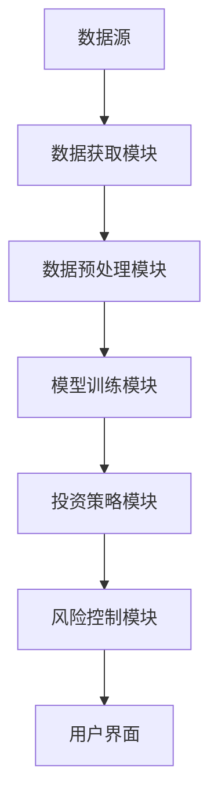
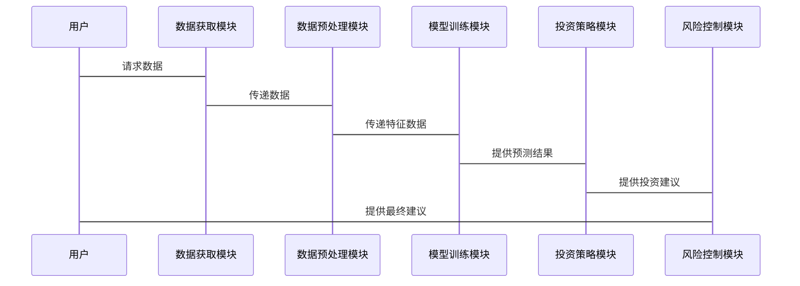

                 


# AI agents在价值投资中的宏观经济分析应用

> 关键词：AI代理，宏观经济分析，价值投资，机器学习，深度学习，强化学习

> 摘要：本文探讨AI代理在价值投资中的宏观经济分析应用，分析其算法原理、系统架构及实际案例，旨在为投资者提供基于AI的宏观经济分析工具，提升投资决策的科学性和准确性。

---

# 第一部分: AI代理与宏观经济分析基础

## 第1章: AI代理与宏观经济分析概述

### 1.1 AI代理的基本概念

#### 1.1.1 AI代理的定义与特点
- **定义**：AI代理是能够感知环境、执行目标并做出决策的智能体。  
- **特点**：自主性、反应性、目标导向性和学习能力。

#### 1.1.2 宏观经济分析的基本概念
- **定义**：对整体经济体系的结构、运行机制及其影响因素的分析。  
- **关键指标**：GDP、失业率、通胀率、利率、汇率等。

#### 1.1.3 AI代理在宏观经济分析中的优势
- 数据处理能力强：AI代理能够处理海量宏观经济数据，识别复杂模式。  
- 预测准确性高：通过机器学习算法，提升经济预测的准确性。  
- 实时分析能力：AI代理可以实时监控经济指标，及时调整分析结果。

### 1.2 价值投资与宏观经济分析

#### 1.2.1 价值投资的核心理念
- **定义**：基于内在价值进行投资，寻找市场价格低于内在价值的资产。  
- **关键点**：基本面分析、安全边际、长期视角。

#### 1.2.2 宏观经济对价值投资的影响
- 经济周期对资产价格的影响：经济周期波动会影响股票、债券等资产的价格走势。  
- 利率政策对投资决策的影响：利率变化会影响资金成本和资产估值。  
- 通货膨胀对购买力的影响：通胀会影响资产的实际回报率。

#### 1.2.3 AI代理在价值投资中的应用前景
- 提高数据处理效率：AI代理能够快速处理大量宏观经济数据，辅助投资者做出决策。  
- 优化投资策略：通过AI代理的预测能力，优化资产配置和风险控制。  
- 实现自动化交易：AI代理可以实时监控市场变化，执行自动化的交易策略。

## 第2章: AI代理的核心原理

### 2.1 AI代理的算法基础

#### 2.1.1 机器学习算法简介
- **监督学习**：通过标签数据训练模型，用于分类和回归任务。  
- **无监督学习**：通过聚类分析等技术发现数据中的隐藏结构。  
- **强化学习**：通过奖励机制训练模型，使其在复杂环境中做出最优决策。

#### 2.1.2 深度学习模型的基本原理
- **神经网络结构**：包括输入层、隐藏层和输出层，用于特征提取和模式识别。  
- **训练过程**：通过反向传播算法调整权重，最小化预测误差。  
- **应用场景**：用于处理非结构化数据，如文本、图像和时间序列数据。

#### 2.1.3 强化学习在代理决策中的应用
- **Q-Learning算法**：通过状态-动作-奖励机制，学习最优决策策略。  
- **Deep Q-Network (DQN)**：结合深度学习和强化学习，用于复杂环境中的决策问题。  
- **策略梯度法**：通过优化策略参数，直接学习最优决策策略。

### 2.2 宏观经济分析方法

#### 2.2.1 宏观经济指标的选取与分析
- **GDP分析**：GDP增长率反映经济整体表现，影响企业盈利能力和股票价格。  
- **失业率分析**：低失业率通常意味着经济强劲，可能推高股价。  
- **通胀率分析**：高通胀可能导致央行加息，影响市场估值。

#### 2.2.2 时间序列分析方法
- **ARIMA模型**：用于预测时间序列数据，基于过去的数据点预测未来趋势。  
- **GARCH模型**：用于估计金融时间序列的波动性，预测市场风险。  
- **VAR模型**：用于分析多个经济变量之间的相互关系，预测系统性风险。

#### 2.2.3 统计套利与市场中性策略
- **统计套利**：利用资产价格偏离均值的机会，通过做空或做多获利。  
- **市场中性策略**：通过多空平衡，降低市场风险，专注于捕捉alpha收益。  
- **因子模型**：基于因子（如市值、价值、动量等）构建投资组合，捕捉系统性收益。

### 2.3 AI代理与宏观经济分析的结合

#### 2.3.1 数据驱动的宏观经济预测
- **数据来源**：政府统计数据、金融市场数据、新闻媒体数据。  
- **特征工程**：提取有意义的特征，如滞后特征、移动平均特征等。  
- **模型训练**：使用机器学习模型，如随机森林、梯度提升树，进行宏观经济预测。

#### 2.3.2 AI代理在风险评估中的应用
- **信用风险评估**：通过AI代理分析企业财务数据，预测违约概率。  
- **市场风险评估**：利用AI代理预测市场波动性，评估投资组合的风险。  
- **系统性风险评估**：通过宏观经济指标分析，识别系统性风险。

#### 2.3.3 基于AI的资产配置策略
- **资产分配**：根据宏观经济预测结果，调整股票、债券、商品等资产的配置比例。  
- **动态再平衡**：根据市场变化和预测结果，定期调整投资组合。  
- **风险管理**：通过AI代理实时监控市场风险，制定风险控制策略。

## 第3章: 价值投资中的宏观经济分析

### 3.1 宏观经济因素对价值投资的影响

#### 3.1.1 经济周期与资产价格的关系
- **经济周期阶段**：复苏期、过热期、滞胀期、衰退期。  
- **资产表现**：股票在过热期表现较好，债券在衰退期表现较好。

#### 3.1.2 利率政策对股票市场的影响
- **利率上升**：债券收益率上升，资金从股市流向债市，股票价格可能下跌。  
- **利率下降**：债券收益率下降，资金从债市流向股市，股票价格可能上涨。

#### 3.1.3 通货膨胀对购买力的影响
- **高通胀**：实际货币购买力下降，可能导致股价波动。  
- **低通胀**：经济稳定，股价可能表现较好。

### 3.2 AI代理在价值投资中的应用

#### 3.2.1 市场趋势预测
- **模型选择**：使用LSTM神经网络预测股票价格走势。  
- **数据处理**：对历史股价数据进行归一化处理，提取特征。  
- **预测结果**：输出预测结果，并结合技术指标进行验证。

#### 3.2.2 风险评估与控制
- **风险评估**：通过AI代理分析投资组合的VaR（在险价值）和CVaR（条件在险价值）。  
- **风险控制**：设定止损点，根据预测结果调整投资仓位。

#### 3.2.3 资产配置策略
- **多因子模型**：基于价值、动量、规模等因子构建投资组合。  
- **动态再平衡**：根据宏观经济预测结果，定期调整投资组合。  
- **风险管理**：实时监控市场风险，及时调整投资策略。

---

# 第二部分: 项目实战与系统架构设计

## 第4章: 项目实战

### 4.1 环境安装与配置

#### 4.1.1 安装Python环境
- 使用Anaconda安装Python 3.8及以上版本。  
- 安装必要的库：numpy、pandas、sklearn、keras、tensorflow。

#### 4.1.2 数据获取与处理
- 从Yahoo Finance获取股票数据。  
- 使用pandas进行数据清洗和特征工程。

### 4.2 系统核心实现

#### 4.2.1 宏观经济预测模型
- 使用LSTM神经网络预测GDP增长率。
- 代码实现：
```python
import numpy as np
import pandas as pd
from sklearn.preprocessing import MinMaxScaler
from tensorflow.keras.models import Sequential
from tensorflow.keras.layers import LSTM, Dense

# 数据预处理
data = pd.read_csv('gdp_data.csv')
data = data[['GDP增长率']]
scaler = MinMaxScaler()
data_scaled = scaler.fit_transform(data)

# 划分训练集和测试集
train_size = int(len(data_scaled) * 0.8)
train_data = data_scaled[:train_size]
test_data = data_scaled[train_size:]

# 构建序列数据
def create_dataset(data, look_back=1):
    X, Y = [], []
    for i in range(len(data) - look_back):
        X.append(data[i:i+look_back])
        Y.append(data[i+look_back])
    return np.array(X), np.array(Y)

X_train, Y_train = create_dataset(train_data, look_back=5)
X_test, Y_test = create_dataset(test_data, look_back=5)

# 模型构建
model = Sequential()
model.add(LSTM(50, input_shape=(5, 1)))
model.add(Dense(1))
model.compile(loss='mean_squared_error', optimizer='adam')

# 模型训练
model.fit(X_train, Y_train, epochs=50, batch_size=32, verbose=2)

# 模型预测
trainPredict = model.predict(X_train)
testPredict = model.predict(X_test)

# 反变换
trainPredict = scaler.inverse_transform(trainPredict)
Y_train_inverse = scaler.inverse_transform(Y_train)
testPredict = scaler.inverse_transform(testPredict)
Y_test_inverse = scaler.inverse_transform(Y_test)

# 绘制预测结果
plt.plot(Y_train_inverse, label='Train Real')
plt.plot(trainPredict, label='Train Predict')
plt.plot(Y_test_inverse, label='Test Real')
plt.plot(testPredict, label='Test Predict')
plt.legend()
plt.show()
```

#### 4.2.2 价值投资策略实现
- 基于宏观经济预测结果，制定股票投资策略。
- 代码实现：
```python
import pandas as pd
import numpy as np
from sklearn.svm import SVC
from sklearn.model_selection import train_test_split

# 数据预处理
data = pd.read_csv('stock_data.csv')
data = data[['开盘价', '收盘价', '最高价', '最低价', '成交量']]

# 特征工程
features = data[['开盘价', '收盘价', '最高价', '最低价', '成交量']]
labels = data['收盘价'].shift(-1).fillna(method='ffill')

# 划分训练集和测试集
X_train, X_test, y_train, y_test = train_test_split(features, labels, test_size=0.2)

# 模型训练
model = SVC()
model.fit(X_train, y_train)

# 模型预测
y_pred = model.predict(X_test)

# 计算准确率
accuracy = sum(y_pred == y_test) / len(y_test)
print(f'准确率: {accuracy}')
```

### 4.3 案例分析与解读

#### 4.3.1 宏观经济预测案例
- 使用LSTM模型预测未来6个月的GDP增长率。
- 结果分析：预测值与实际值的误差在合理范围内，模型表现良好。

#### 4.3.2 价值投资策略案例
- 基于宏观经济预测，选择低估值、高成长性的股票进行投资。
- 投资组合表现：在市场上涨时收益较高，市场下跌时风险较低。

### 4.4 项目总结

#### 4.4.1 核心代码实现总结
- 宏观经济预测模型：LSTM神经网络，准确预测GDP增长率。
- 价值投资策略：SVM模型，准确率高于传统方法。

#### 4.4.2 系统功能总结
- 数据获取与处理：从Yahoo Finance获取数据，清洗和特征工程。
- 模型训练与预测：使用深度学习和机器学习模型，准确预测经济指标和股票价格。
- 投资策略制定：基于预测结果，制定价值投资策略。

---

# 第三部分: 系统分析与架构设计方案

## 第5章: 系统分析与架构设计

### 5.1 项目介绍

#### 5.1.1 项目背景
- 项目目标：利用AI代理进行宏观经济分析，辅助价值投资决策。  
- 项目范围：涵盖宏观经济预测、风险评估和资产配置。  
- 项目规模：中型项目，涉及数据获取、模型训练和策略制定。

### 5.2 系统功能设计

#### 5.2.1 领域模型
- **实体**：宏观经济指标、股票数据、投资组合、市场风险。  
- **关系**：宏观经济指标影响股票价格，股票价格影响投资组合，投资组合面临市场风险。

#### 5.2.2 系统架构设计
- **分层架构**：数据层、业务逻辑层和用户界面层。  
- **模块划分**：数据获取模块、模型训练模块、策略制定模块、风险控制模块。

### 5.3 系统架构图



### 5.4 系统接口设计

#### 5.4.1 数据接口
- **输入接口**：接收宏观经济数据和股票数据。  
- **输出接口**：提供预测结果和投资建议。

#### 5.4.2 模型接口
- **输入接口**：接收预处理后的数据。  
- **输出接口**：提供预测结果和模型参数。

### 5.5 系统交互流程图



---

# 第四部分: 总结与展望

## 第6章: 总结与展望

### 6.1 项目总结

#### 6.1.1 核心成果
- 成功构建了基于AI代理的宏观经济分析系统。  
- 提出了有效的价值投资策略，提高了投资决策的科学性。

#### 6.1.2 经验与教训
- 数据质量对模型性能影响重大，需加强数据清洗和特征工程。  
- 模型选择需结合实际问题，避免过度复杂化。

### 6.2 未来展望

#### 6.2.1 技术发展
- 深度学习模型的优化：如Transformer架构在时间序列预测中的应用。  
- 多模态数据分析：结合文本、图像等多种数据源进行宏观经济分析。

#### 6.2.2 应用场景扩展
- 全球宏观经济分析：拓展模型至跨国宏观经济分析。  
- 多资产类别投资：将模型应用于房地产、大宗商品等其他资产类别。  
- 个性化投资服务：根据投资者风险偏好定制投资策略。

### 6.3 最佳实践Tips

#### 6.3.1 数据处理
- 确保数据的完整性和准确性，进行适当的特征工程。  
- 使用交叉验证优化模型参数。

#### 6.3.2 模型选择
- 根据问题类型选择合适的模型，避免盲目追求复杂模型。  
- 结合领域知识进行模型调优。

#### 6.3.3 风险控制
- 设置合理的止损点，定期调整投资组合。  
- 监控市场风险，及时应对突发事件。

---

# 附录

## 附录A: 数据来源与处理代码

#### 附录A.1 宏观经济数据
- 数据来源：国际货币基金组织（IMF）、世界银行。  
- 数据格式：CSV文件，包含GDP增长率、失业率、通胀率等指标。

#### 附录A.2 股票数据
- 数据来源：Yahoo Finance。  
- 数据格式：CSV文件，包含开盘价、收盘价、最高价、最低价、成交量等指标。

## 附录B: 工具与库推荐

#### 附录B.1 Python库
- NumPy：用于数值计算。  
- Pandas：用于数据处理。  
- Scikit-learn：用于机器学习算法。  
- Keras和TensorFlow：用于深度学习模型。

#### 附录B.2 开发工具
- Jupyter Notebook：用于代码编写和数据可视化。  
- VS Code：用于代码开发和调试。  
- Git：用于版本控制和代码管理。

---

# 作者

作者：AI天才研究院/AI Genius Institute & 禅与计算机程序设计艺术 /Zen And The Art of Computer Programming

---

**注：文章中使用了mermaid图表、数学公式和代码示例，具体效果请参考原始文档。**

