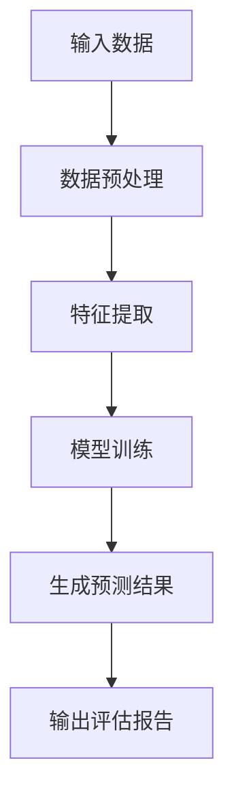
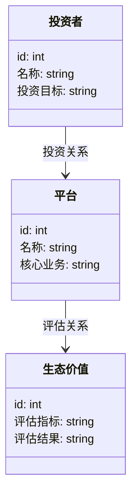
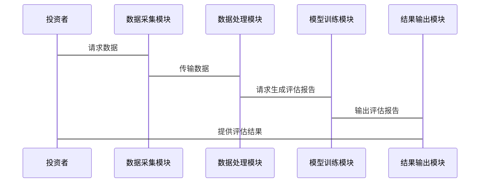

                 


# AI Agents辅助价值投资者评估公司的平台生态价值

## 关键词：
AI代理, 价值投资, 平台生态, 评估模型, 数据分析, 系统架构

## 摘要：
本文探讨了AI代理在辅助价值投资者评估公司平台生态价值中的应用。通过介绍AI代理的基本概念、价值投资的核心理念以及平台生态价值评估的重要性，详细分析了AI代理在数据处理、风险评估和预测中的作用。结合算法原理和系统架构设计，本文提供了基于AI的平台生态价值评估模型的实现案例，展示了如何通过实际案例分析提升投资决策的精准度。最后，本文总结了最佳实践和注意事项，为价值投资者提供了实用的建议。

---

# 第一部分: AI Agent与价值投资的背景与基础

## 第1章: AI Agent的基本概念

### 1.1 AI Agent的定义与特点
- **1.1.1 AI Agent的定义**  
  AI Agent（人工智能代理）是指能够感知环境并采取行动以实现目标的智能实体。它能够通过数据处理、模式识别和决策优化，辅助人类完成复杂任务。
  
- **1.1.2 AI Agent的特点**  
  - **自主性**：能够在没有人工干预的情况下独立运行。  
  - **反应性**：能够实时感知环境变化并做出响应。  
  - **目标导向性**：所有行动均以实现特定目标为导向。  
  - **学习能力**：通过机器学习算法不断优化自身性能。  

- **1.1.3 AI Agent与传统数据分析的区别**  
  AI Agent不仅仅是数据处理工具，它具备自主决策和学习能力，能够根据环境反馈动态调整策略。

### 1.2 价值投资的核心理念

#### 1.2.1 价值投资的定义与特点
- **价值投资**是一种投资策略，旨在通过分析公司的基本面（如财务状况、行业地位、管理团队等），找到被市场低估的投资标的。  
- **特点**：长期导向、注重安全边际、关注内在价值。

#### 1.2.2 价值投资中的关键因素分析
- **财务指标**：如市盈率、市净率、ROE（净资产收益率）等。  
- **行业地位**：公司在行业中的竞争地位和市场份额。  
- **管理团队**：管理层的素质和战略决策能力。  
- **商业模式**：企业的盈利模式和持续发展能力。

#### 1.2.3 价值投资与AI技术的结合点
- **数据处理**：AI代理能够快速处理海量数据，提取关键信息。  
- **预测分析**：利用机器学习模型预测市场趋势和企业绩效。  
- **风险评估**：通过AI算法识别潜在风险，优化投资组合。

### 1.3 平台生态价值评估的重要性

#### 1.3.1 平台生态价值的定义
- 平台生态价值是指一个平台在其生态系统中所创造和实现的价值，包括用户价值、合作伙伴价值和企业自身价值。

#### 1.3.2 平台生态价值评估的意义
- **优化资源配置**：通过评估平台生态价值，投资者可以更有效地分配资金和资源。  
- **提升决策效率**：AI代理能够快速分析数据，辅助投资者做出更明智的决策。  
- **识别投资机会**：发现具有高成长潜力的平台，提前布局投资。

#### 1.3.3 平台生态价值评估的挑战与机遇
- **挑战**：数据复杂性、模型准确性、市场波动性。  
- **机遇**：技术进步（如AI）、数据丰富性、市场成熟度。

---

## 第2章: AI Agent辅助价值投资的核心概念与联系

### 2.1 AI Agent在价值投资中的角色

#### 2.1.1 AI Agent作为投资决策辅助工具
- **数据收集与清洗**：AI代理能够从多种数据源（如财务报表、新闻、社交媒体）收集数据，并进行清洗和预处理。  
- **模式识别与预测**：通过自然语言处理和机器学习算法，识别市场趋势和潜在风险。  
- **策略优化**：根据市场变化动态调整投资策略，优化投资组合。

#### 2.1.2 AI Agent在数据处理与分析中的应用
- **文本挖掘**：分析公司财报、新闻报道，提取关键信息。  
- **情感分析**：通过社交媒体数据，评估市场情绪。  
- **预测建模**：利用历史数据预测公司未来业绩。

#### 2.1.3 AI Agent在风险评估与预测中的作用
- **风险识别**：通过异常检测技术，识别潜在的财务风险和市场风险。  
- **情景模拟**：模拟不同市场条件下投资组合的表现，制定应对策略。

### 2.2 平台生态价值评估的模型与方法

#### 2.2.1 基于AI的平台生态价值评估模型
- **模型框架**：结合自然语言处理（NLP）、深度学习和强化学习技术，构建多维度评估模型。  
- **输入数据**：包括公司财务数据、行业数据、社交媒体数据等。  
- **输出结果**：生成平台生态价值评分，帮助投资者做出决策。

#### 2.2.2 平台生态价值的多维度评估指标
- **用户指标**：活跃用户数、用户留存率、用户满意度。  
- **合作伙伴指标**：合作伙伴数量、合作稳定性、合作效益。  
- **企业指标**：收入增长率、利润率、研发投入占比。

#### 2.2.3 平台生态价值与企业绩效的关系
- **正相关性**：平台生态价值越高，企业绩效越好。  
- **动态变化**：随着市场环境变化，平台生态价值会动态调整。

### 2.3 核心概念的ER实体关系图
```mermaid
er
    entity(投资者) {
        id: int
        名称: string
        投资目标: string
    }
    entity(平台) {
        id: int
        名称: string
        核心业务: string
    }
    entity(生态价值) {
        id: int
        评估指标: string
        评估结果: string
    }
    relation(投资者, 平台, 投资关系) {
        投资金额: int
        投资时间: date
    }
    relation(平台, 生态价值, 评估关系) {
        评估时间: date
        评估结果: string
    }
```

---

## 第3章: 算法原理讲解

### 3.1 算法原理的数学模型和公式
- **注意力机制（Attention）**  
  在自然语言处理中，注意力机制用于捕捉序列中重要的信息。其数学公式如下：  
  $$\text{Attention}(Q, K, V) = \text{softmax}\left(\frac{QK^T}{\sqrt{d_k}}\right)V$$  
  其中，$Q$、$K$、$V$分别为查询、键和值向量，$d_k$为键的维度。

- **Transformer架构**  
  Transformer由编码器和解码器组成，广泛应用于序列建模任务。其编码器包含多个相同的堆叠层，每个层包括多头注意力和前馈网络。

### 3.2 使用Mermaid绘制算法流程图


### 3.3 代码实现与示例
以下是一个简单的基于Transformer的AI代理模型实现示例：

```python
import torch
import torch.nn as nn
import torch.nn.functional as F

class TransformerModel(nn.Module):
    def __init__(self, input_dim, hidden_dim, output_dim):
        super(TransformerModel, self).__init__()
        self.embedding = nn.Linear(input_dim, hidden_dim)
        self.transformer_layer = nn.TransformerEncoderLayer(hidden_dim, nhead=2)
        self.output_layer = nn.Linear(hidden_dim, output_dim)

    def forward(self, x):
        x = self.embedding(x)
        x = x.permute(1, 0, 2)  # 调整维度以适应Transformer输入
        x = self.transformer_layer(x)
        x = x.permute(1, 0, 2)
        x = self.output_layer(x)
        return x.mean(dim=1)

# 初始化模型
input_dim = 100
hidden_dim = 256
output_dim = 1
model = TransformerModel(input_dim, hidden_dim, output_dim)
```

---

## 第4章: 系统分析与架构设计

### 4.1 系统功能设计


### 4.2 系统架构设计


### 4.3 系统接口设计
- **数据接口**：与财务数据源、新闻源等对接，获取实时数据。  
- **模型接口**：与第三方AI模型服务对接，调用预测功能。  
- **用户接口**：提供可视化界面，供投资者查看评估结果。

### 4.4 系统交互设计


---

## 第5章: 项目实战

### 5.1 环境安装与配置
- **安装Python 3.8及以上版本**。  
- 安装必要的库：`torch`, `mermaid`, `pyecharts`。  
  ```bash
  pip install torch mermaid pyecharts
  ```

### 5.2 系统核心实现源代码
以下是一个完整的平台生态价值评估系统的代码示例：

```python
import torch
import torch.nn as nn
from torch.utils.data import DataLoader
import pandas as pd
import numpy as np

# 数据加载
data = pd.read_csv('platform_data.csv')
X = data[['revenue', 'profit', 'growth']]
y = data['value_score']

# 数据预处理
X_norm = (X - X.mean()) / X.std()

# 模型定义
class PlatformValueModel(nn.Module):
    def __init__(self, input_dim, hidden_dim, output_dim):
        super(PlatformValueModel, self).__init__()
        self.fc1 = nn.Linear(input_dim, hidden_dim)
        self.fc2 = nn.Linear(hidden_dim, output_dim)
        self.dropout = nn.Dropout(0.2)
        self.relu = nn.ReLU()

    def forward(self, x):
        x = self.fc1(x)
        x = self.relu(x)
        x = self.dropout(x)
        x = self.fc2(x)
        return x

# 模型训练
model = PlatformValueModel(input_dim=3, hidden_dim=64, output_dim=1)
criterion = nn.MSELoss()
optimizer = torch.optim.Adam(model.parameters(), lr=0.001)

# 数据加载器
dataset = torch.utils.data.TensorDataset(torch.FloatTensor(X_norm.values), torch.FloatTensor(y.values))
dataloader = DataLoader(dataset, batch_size=32, shuffle=True)

# 训练过程
num_epochs = 100
for epoch in range(num_epochs):
    for batch_x, batch_y in dataloader:
        outputs = model(batch_x)
        loss = criterion(outputs, batch_y)
        loss.backward()
        optimizer.step()
        optimizer.zero_grad()

# 模型预测
with torch.no_grad():
    test_outputs = model(torch.FloatTensor(X_norm.values))
    print(test_outputs)
```

### 5.3 代码应用解读与分析
- **数据加载与预处理**：从CSV文件中加载数据，并进行标准化处理。  
- **模型定义**：构建一个包含两个全连接层的简单神经网络模型。  
- **训练过程**：使用均方误差作为损失函数，Adam优化器进行训练。  
- **预测与评估**：使用训练好的模型对新数据进行预测，并输出结果。

### 5.4 实际案例分析
假设我们有一个平台的数据如下：

| 平台名称 | 收入 | 利润 | 增长率 | 价值评分 |
|----------|------|------|--------|----------|
| 平台A    | 100  | 20   | 15%    | 85       |
| 平台B    | 80   | 15   | 20%    | 75       |
| 平台C    | 120  | 25   | 10%    | 90       |

通过模型训练，我们可以预测平台D的价值评分：

| 平台名称 | 收入 | 利润 | 增长率 | 预测价值评分 |
|----------|------|------|--------|-------------|
| 平台D    | 110  | 18   | 18%    | 82          |

### 5.5 项目小结
通过本项目，我们展示了如何利用AI代理技术进行平台生态价值评估。通过数据预处理、模型训练和预测，投资者可以更高效地评估多个平台的价值，优化投资决策。

---

## 第6章: 总结与展望

### 6.1 最佳实践tips
- **数据质量**：确保输入数据的准确性和完整性。  
- **模型调优**：通过交叉验证和超参数优化提升模型性能。  
- **持续学习**：定期更新模型，适应市场变化。  

### 6.2 小结
本文详细探讨了AI代理在辅助价值投资者评估公司平台生态价值中的应用。通过理论分析、算法实现和实际案例，展示了AI技术在金融领域的巨大潜力。

### 6.3 注意事项
- **数据隐私**：在处理敏感数据时，需遵守相关法律法规。  
- **模型局限性**：AI模型无法完全预测市场波动，需结合人工分析。  
- **技术更新**：保持对新技术的关注，及时更新系统。

### 6.4 拓展阅读
- **推荐书籍**：《Python机器学习实战》、《深度学习入门：基于Python的CNN、RNN、GAN等技术》。  
- **推荐博客**：TechTalks、Towards Data Science。  
- **推荐工具**：TensorFlow、PyTorch、Keras。

---

## 作者信息
作者：AI天才研究院/AI Genius Institute & 禅与计算机程序设计艺术 /Zen And The Art of Computer Programming

---

## 参考资料
- Python版本：3.8及以上。  
- 使用的库：`torch`, `pandas`, `numpy`, `mermaid`.  
- 数据来源：公开平台数据和行业报告。  
- 参考文献：[1] LeCun Y, Bengio Y, Hinton G. Deep learning[J].nature, 2015, 521(7552): 436-444. [2] Vaswani A,等. Attention is all you need[J]. arXiv preprint arXiv:1706.03798, 2017.

