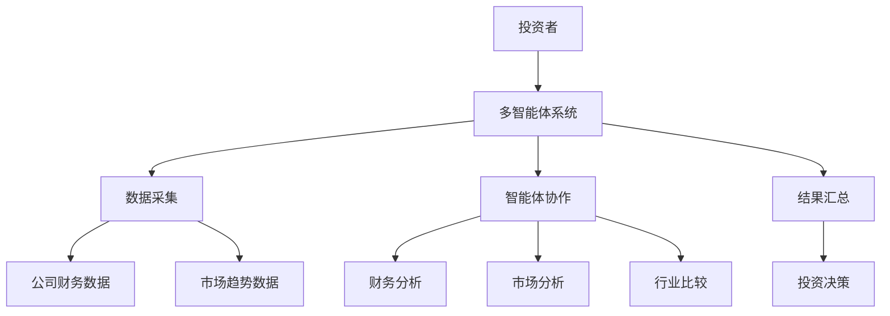
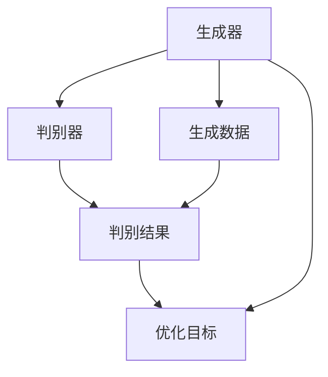
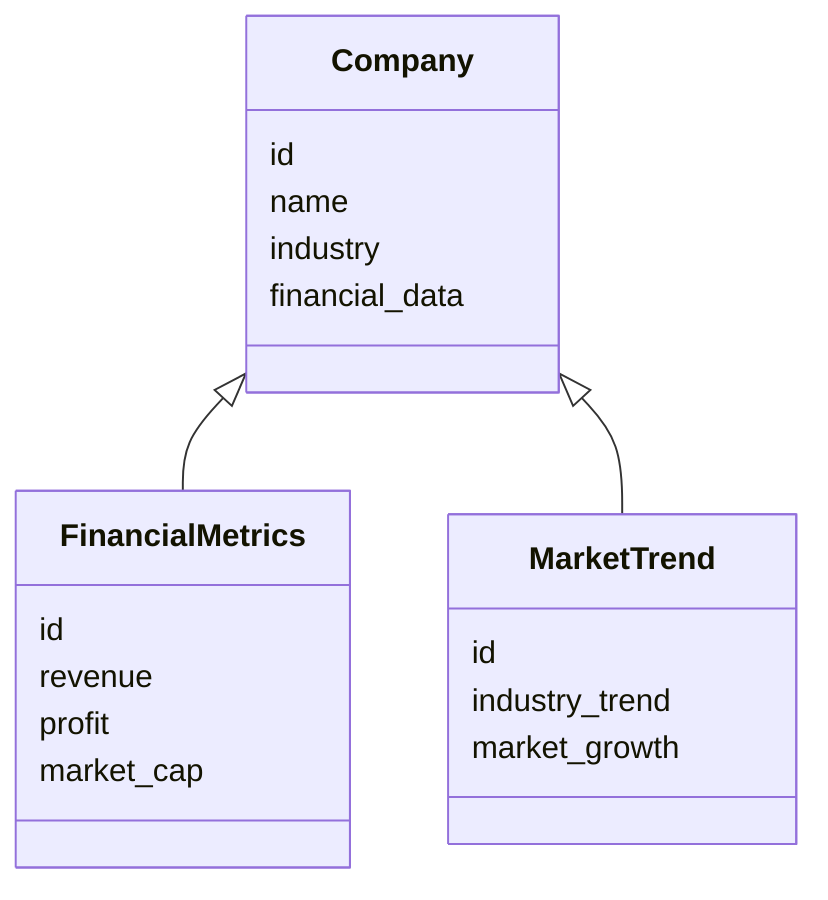
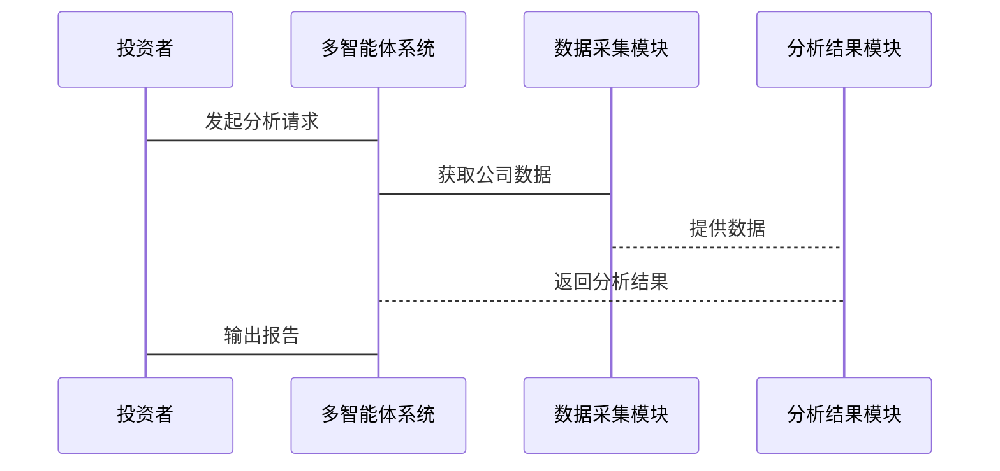

                 


# AI驱动的公司间比较分析：价值投资中的多智能体应用

**关键词**：AI驱动、公司比较分析、价值投资、多智能体、生成式AI、系统架构设计

**摘要**：  
随着人工智能技术的快速发展，价值投资领域的分析方法也在不断进化。本文将探讨如何利用AI驱动的多智能体系统，进行公司间的深度比较分析，为投资者提供更精准的投资决策支持。文章从背景介绍、核心概念、算法原理、系统架构设计到项目实战，全面解析AI在价值投资中的应用，帮助读者理解如何通过技术手段提升投资分析的效率和准确性。

---

## 第1章: AI驱动的公司间比较分析概述

### 1.1 价值投资与公司比较分析

#### 1.1.1 价值投资的基本概念
价值投资是一种以内在价值为导向的投资策略，强调通过分析公司的基本面（如财务状况、行业地位、管理团队等）来判断其股票是否被市场低估。传统的价值投资依赖于分析师的主观判断，而随着AI技术的发展，我们可以利用数据驱动的方法来辅助这一过程。

#### 1.1.2 公司比较分析的意义
公司比较分析是价值投资中的核心步骤，通过将目标公司与行业内的其他公司进行对比，识别其优势和劣势。然而，传统的比较分析依赖于人工筛选和分析，效率低下且容易受到主观因素的影响。AI驱动的多智能体系统可以自动化这一过程，提高分析的准确性和效率。

#### 1.1.3 AI在价值投资中的作用
AI技术可以通过处理海量数据、识别模式和预测趋势，帮助投资者发现潜在的投资机会。多智能体系统能够从多个角度（如财务数据、市场表现、行业趋势等）对目标公司进行全方位分析，提供更全面的比较结果。

---

### 1.2 多智能体系统与公司比较分析

#### 1.2.1 多智能体系统的定义与特点
多智能体系统（Multi-Agent System, MAS）是由多个相互作用的智能体组成的系统，每个智能体都有自己的目标和行为规则。多智能体系统具有分布性、协作性、反应性和适应性等特点，能够处理复杂问题。

#### 1.2.2 多智能体系统在金融领域的应用
在金融领域，多智能体系统可以用于股票预测、风险评估、市场趋势分析等任务。通过多个智能体的协同工作，系统能够从多个角度对市场进行分析，提供更全面的见解。

#### 1.2.3 多智能体系统与公司比较分析的结合
在公司比较分析中，多智能体系统可以分别从财务数据、市场表现、行业趋势等多个维度对目标公司进行分析。每个智能体负责一个特定的分析任务，并将结果汇总，生成最终的比较报告。

---

## 第2章: 多智能体系统的核心概念

### 2.1 多智能体系统的组成与属性

#### 2.1.1 实体关系图（ER图）分析
以下是公司比较分析中的实体关系图：

```mermaid
er
  entity Company {
    id
    name
    industry
    financial_data
  }
  entity FinancialMetrics {
    id
    revenue
    profit
    market_cap
  }
  entity MarketTrend {
    id
    industry_trend
    market_growth
  }
  Company -|> FinancialMetrics: has
  Company -|> MarketTrend: relates_to
```

从图中可以看出，公司实体与财务数据和市场趋势实体之间存在关联关系。

#### 2.1.2 多智能体系统的属性特征对比表

| 属性         | 分布性       | 协作性       | 反应性       | 适应性       |
|--------------|-------------|-------------|-------------|-------------|
| 特征描述     | 系统由多个智能体组成，每个智能体独立运行 | 智能体之间通过通信和协作完成任务 | 系统能够根据环境变化动态调整行为 | 系统能够适应新的环境和任务需求 |

### 2.2 价值投资中的多智能体系统架构

#### 2.2.1 多智能体系统在价值投资中的实体关系
以下是多智能体系统在价值投资中的实体关系图：

```mermaid
er
  entity Company {
    id
    name
    industry
    financial_data
  }
  entity Analyst {
    id
    name
    expertise
  }
  entity InvestmentDecision {
    id
    decision_type
    decision_time
  }
  Company -|> Analyst: analyzed_by
  Analyst -|> InvestmentDecision: contributes_to
```

从图中可以看出，公司实体通过分析师实体与投资决策实体相关联。

#### 2.2.2 系统架构的Mermaid流程图



---

## 第3章: 多智能体系统的算法原理

### 3.1 生成式AI的数学模型

#### 3.1.1 生成式AI的基本原理
生成式AI（Generative AI）是一种能够生成新数据的AI技术，其核心是生成对抗网络（GAN）和变分自编码器（VAE）。以下是GAN的基本原理：

- **生成器（Generator）**：通过学习数据的分布，生成新的数据。
- **判别器（Discriminator）**：判断输入数据是否为真实数据。

GAN的目标是最小化生成器的损失函数和判别器的损失函数之间的差异。

#### 3.1.2 多智能体协同的数学模型
多智能体协同可以通过分布式优化算法实现，例如基于强化学习的多智能体协作。以下是强化学习的基本公式：

$$ Q(s, a) = r + \gamma \max_{a'} Q(s', a') $$

其中，\( Q(s, a) \) 是状态 \( s \) 下动作 \( a \) 的价值函数，\( r \) 是奖励，\( \gamma \) 是折扣因子。

#### 3.1.3 生成式AI的公式推导
以下是GAN的损失函数推导：

生成器的损失函数：
$$ \mathcal{L}_G = \mathbb{E}_{z}[ \log D(G(z))] $$

判别器的损失函数：
$$ \mathcal{L}_D = -\mathbb{E}_{x}[ \log D(x)] - \mathbb{E}_{z}[ \log (1 - D(G(z)))] $$

---

### 3.2 多智能体协同的算法流程

#### 3.2.1 多智能体协同的Mermaid流程图



#### 3.2.2 算法的Python实现代码

以下是生成器和判别器的Python实现示例：

```python
import torch
import torch.nn as nn

# 生成器
class Generator(nn.Module):
    def __init__(self, latent_dim, hidden_dim):
        super(Generator, self).__init__()
        self.fc1 = nn.Linear(latent_dim, hidden_dim)
        self.fc2 = nn.Linear(hidden_dim, hidden_dim)
        self.fc3 = nn.Linear(hidden_dim, 1)

    def forward(self, x):
        x = torch.relu(self.fc1(x))
        x = torch.relu(self.fc2(x))
        x = torch.sigmoid(self.fc3(x))
        return x

# 判别器
class Discriminator(nn.Module):
    def __init__(self, input_dim, hidden_dim):
        super(Discriminator, self).__init__()
        self.fc1 = nn.Linear(input_dim, hidden_dim)
        self.fc2 = nn.Linear(hidden_dim, hidden_dim)
        self.fc3 = nn.Linear(hidden_dim, 1)

    def forward(self, x):
        x = torch.relu(self.fc1(x))
        x = torch.relu(self.fc2(x))
        x = torch.sigmoid(self.fc3(x))
        return x
```

---

## 第4章: 系统分析与架构设计

### 4.1 项目背景与目标

#### 4.1.1 项目背景介绍
随着金融市场的复杂化，传统的公司比较分析方法已经难以满足投资者的需求。通过引入AI技术，我们可以提高分析效率和准确性。

#### 4.1.2 项目目标与范围
本项目的目标是开发一个基于多智能体系统的公司比较分析平台，帮助投资者进行价值投资。系统将从财务数据、市场趋势等多个维度对目标公司进行分析。

### 4.2 系统功能设计

#### 4.2.1 领域模型的Mermaid类图



#### 4.2.2 系统功能模块划分

1. 数据采集模块
2. 数据分析模块
3. 结果汇总模块
4. 投资决策模块

### 4.3 系统架构设计

#### 4.3.1 系统架构的Mermaid架构图


#### 4.3.2 系统接口设计

1. 数据接口：与数据源（如财务数据库）对接
2. 用户接口：供投资者输入查询
3. 输出接口：生成分析报告

### 4.4 系统交互的Mermaid序列图



---

## 第5章: 项目实战

### 5.1 环境配置

```bash
pip install torch
pip install matplotlib
pip install pandas
```

### 5.2 核心代码实现

#### 5.2.1 数据采集模块

```python
import pandas as pd

def get_company_data(company_id):
    # 数据获取逻辑
    pass
```

#### 5.2.2 数据分析模块

```python
def analyze_company(company_data):
    # 数据分析逻辑
    pass
```

#### 5.2.3 投资决策模块

```python
def make_investment_decision(results):
    # 投资决策逻辑
    pass
```

### 5.3 数据处理与分析

#### 5.3.1 数据预处理

```python
import pandas as pd

data = pd.read_csv('company_data.csv')
data.dropna(inplace=True)
data = data[ ['revenue', 'profit', 'market_cap'] ]
```

#### 5.3.2 模型训练与分析

```python
import torch
import torch.nn as nn

# 模型训练逻辑
model = Generator(latent_dim=10, hidden_dim=20)
criterion = nn.BCELoss()
optimizer = torch.optim.Adam(model.parameters(), lr=0.001)
```

### 5.4 实际案例分析

#### 5.4.1 案例背景

假设我们有两家公司，A公司和B公司，分别属于同一行业。我们需要通过多智能体系统对它们进行比较分析。

#### 5.4.2 数据分析结果

以下是分析结果的示例：

| 公司   | 营收（亿美元） | 利润（亿美元） | 市值（亿美元） |
|--------|----------------|----------------|----------------|
| A公司  | 10             | 5              | 50             |
| B公司  | 8              | 6              | 60             |

#### 5.4.3 投资决策

根据分析结果，B公司在利润和市值方面表现优于A公司，因此建议投资者选择B公司。

---

## 第6章: 总结与展望

### 6.1 本章小结

通过本文的介绍，我们了解了AI驱动的公司间比较分析在价值投资中的应用。多智能体系统能够从多个维度对目标公司进行分析，为投资者提供更全面的决策支持。

### 6.2 注意事项

1. 数据来源的可靠性
2. 模型的可解释性
3. 系统的实时性

### 6.3 拓展阅读

- 《Deep Learning》——Ian Goodfellow
- 《Multi-Agent Systems》——Mehdi Dastani

---

## 作者

**作者：AI天才研究院/AI Genius Institute & 禅与计算机程序设计艺术 /Zen And The Art of Computer Programming**

