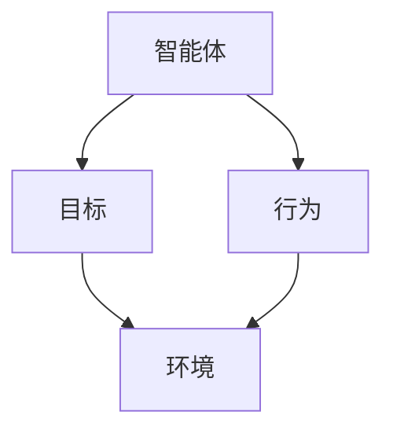
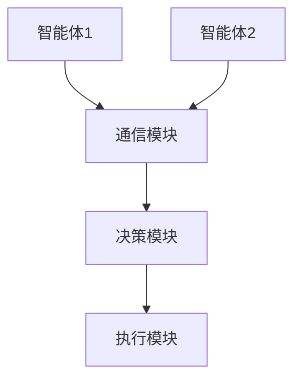
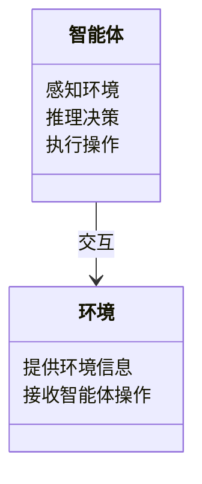
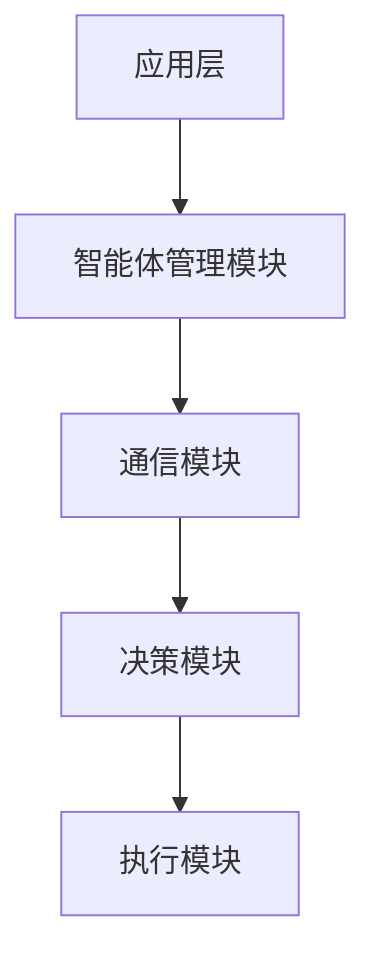
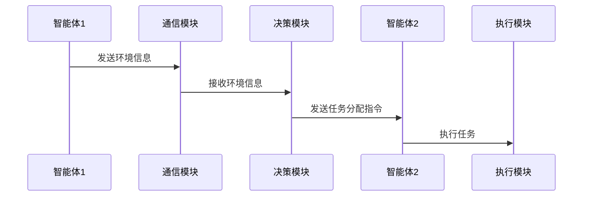

                 


# 利用多智能体系统评估公司的国际化战略

> 关键词：多智能体系统, 国际化战略, 战略评估, 系统架构, 算法原理, 项目实战, 企业战略

> 摘要：  
多智能体系统（Multi-Agent System, MAS）在现代企业国际化战略评估中扮演着越来越重要的角色。随着全球市场的复杂化和竞争的加剧，企业需要更加灵活和高效的决策机制来应对多变的市场环境。本文将从多智能体系统的定义、核心概念、算法原理、系统架构、项目实战等多个维度，详细阐述如何利用多智能体系统来优化公司的国际化战略评估过程。通过实际案例分析和系统设计，本文为读者提供了一套完整的解决方案，帮助企业在复杂的国际化环境中做出更明智的决策。

---

# 第一部分: 多智能体系统与国际化战略评估背景

## 第1章: 多智能体系统概述

### 1.1 多智能体系统的定义与特点

#### 1.1.1 多智能体系统的定义  
多智能体系统（Multi-Agent System, MAS）是由多个智能体（Agent）组成的分布式系统，这些智能体能够通过自主决策和协作完成复杂任务。每个智能体都具有一定的感知能力、推理能力和执行能力，并能够在动态环境中与其他智能体或外部环境进行交互。

#### 1.1.2 多智能体系统的核心特点  
1. **自主性**：每个智能体能够独立决策和行动，无需中央控制。  
2. **反应性**：智能体能够实时感知环境变化并做出相应反应。  
3. **协作性**：多个智能体之间可以通过通信和协作完成共同目标。  
4. **分布式性**：系统中的智能体分布于不同的地理位置或计算节点。  
5. **动态性**：系统能够适应环境的变化，智能体之间的协作关系可以动态调整。

#### 1.1.3 多智能体系统与传统单智能体系统的区别  
- **单智能体系统**：由单一智能体完成任务，决策集中，适用于简单任务。  
- **多智能体系统**：多个智能体协作完成任务，适用于复杂、动态的环境。  

---

### 1.2 多智能体系统在国际化战略中的应用背景

#### 1.2.1 国际化战略的复杂性与挑战  
国际化战略的制定和实施涉及多个维度的复杂问题，例如市场分析、竞争环境、法律法规、文化差异等。这些问题往往需要跨部门、跨地区的协作，传统的集中式决策机制难以应对这种复杂性。

#### 1.2.2 多智能体系统在战略评估中的优势  
- **分布式决策**：多个智能体可以分别负责不同的任务，例如市场分析、风险评估、资源分配等。  
- **实时协作**：智能体之间可以实时通信，快速响应环境变化。  
- **灵活性**：系统可以根据环境变化动态调整策略，适应复杂多变的国际化环境。  

#### 1.2.3 多智能体系统的适用场景与边界  
- **适用场景**：适用于需要多部门协作、跨地区协调的复杂任务。  
- **边界**：不适用于需要严格集中控制的任务，例如某些安全敏感的领域。

---

### 1.3 多智能体系统的组成与核心要素

#### 1.3.1 智能体的基本构成  
1. **感知模块**：用于获取环境信息。  
2. **推理模块**：用于分析信息并做出决策。  
3. **执行模块**：用于执行决策并影响环境。  

#### 1.3.2 多智能体系统的协作机制  
- **通信机制**：智能体之间通过消息传递进行通信。  
- **协商机制**：智能体之间通过协商确定协作方式和任务分配。  

#### 1.3.3 系统的动态性与适应性  
多智能体系统能够根据环境变化动态调整智能体的协作关系和任务分配，确保系统的灵活性和适应性。

---

### 1.4 本章小结  
本章介绍了多智能体系统的定义、特点以及在国际化战略中的应用背景。通过对比传统系统和多智能体系统的差异，我们明确了多智能体系统在复杂环境下的优势。接下来，我们将深入探讨多智能体系统的核心概念与联系。

---

## 第2章: 多智能体系统的核心概念与联系

### 2.1 多智能体系统的原理

#### 2.1.1 智能体的自主性与反应性  
智能体的自主性使其能够在没有外部干预的情况下独立决策，而反应性则使其能够实时感知环境变化并做出快速反应。

#### 2.1.2 智能体之间的通信与协作  
智能体之间的通信可以通过多种方式实现，例如消息传递或共享数据库。协作机制则需要通过协商和任务分配来实现。

#### 2.1.3 多智能体系统的整体目标与个体目标的关系  
多智能体系统的整体目标是通过个体智能体的协作来实现的，而个体智能体的目标则是为了实现整体目标。个体目标与整体目标之间需要通过协调机制来保持一致。

---

### 2.2 多智能体系统的属性特征对比

#### 2.2.1 分布式计算与集中式计算的对比  
- **分布式计算**：任务分布在多个计算节点上，每个节点独立完成部分任务。  
- **集中式计算**：任务集中在单个计算节点上，由中央控制单元统一决策和执行。  

#### 2.2.2 异步通信与同步通信的对比  
- **异步通信**：智能体之间的通信不需要同时进行，信息传递是异步的。  
- **同步通信**：智能体之间的通信需要同时进行，信息传递是同步的。  

#### 2.2.3 动态环境与静态环境的对比  
- **动态环境**：环境状态随时可能发生变化，系统需要动态调整。  
- **静态环境**：环境状态相对稳定，系统无需频繁调整。  

---

### 2.3 多智能体系统的ER实体关系图



---

### 2.4 本章小结  
本章从原理和属性特征两个方面详细阐述了多智能体系统的概念。通过对比分析，我们明确了多智能体系统在不同环境下的适应性。接下来，我们将深入探讨多智能体系统的算法原理。

---

## 第3章: 多智能体系统的算法原理

### 3.1 多智能体系统的典型算法

#### 3.1.1 分布式计算算法  
分布式计算算法通过将任务分解到多个智能体上并行执行，提高了系统的计算效率。常见的分布式计算算法包括MapReduce和分布式协同过滤。

#### 3.1.2 协作算法  
协作算法用于智能体之间的协作，例如任务分配和资源分配。常见的协作算法包括协商算法和分布式任务分配算法。

#### 3.1.3 调度算法  
调度算法用于智能体之间的任务调度，例如分布式调度算法和负载均衡算法。

---

### 3.2 多智能体系统的协作算法流程



---

### 3.3 多智能体系统的数学模型与公式

#### 3.3.1 协作模型的数学表示  
$$ V = \sum_{i=1}^{n} v_i $$
其中，$v_i$ 表示第 $i$ 个智能体的贡献值。

#### 3.3.2 分布式计算的数学表示  
$$ C = \sum_{i=1}^{n} c_i $$
其中，$c_i$ 表示第 $i$ 个智能体的计算能力。

---

### 3.4 本章小结  
本章详细介绍了多智能体系统的典型算法和协作流程。通过数学公式和流程图的展示，我们明确了多智能体系统在算法实现上的具体步骤。接下来，我们将深入探讨多智能体系统的系统分析与架构设计方案。

---

## 第4章: 多智能体系统的系统分析与架构设计

### 4.1 项目背景与问题场景

#### 4.1.1 项目背景  
本项目旨在利用多智能体系统来优化公司的国际化战略评估过程。通过多智能体系统的协作，我们希望能够提高战略评估的效率和准确性。

#### 4.1.2 问题场景  
公司在国际化过程中面临以下问题：  
1. **信息分散**：国际化战略涉及多个部门和地区的信息，难以集中处理。  
2. **决策延迟**：传统集中式决策机制容易导致决策延迟。  
3. **灵活性不足**：面对环境变化时，难以快速调整战略。

---

### 4.2 系统功能设计

#### 4.2.1 领域模型设计  


#### 4.2.2 系统架构设计  


#### 4.2.3 接口设计与交互序列图  


---

### 4.3 本章小结  
本章通过系统分析和架构设计，明确了多智能体系统在国际化战略评估中的具体实现方式。通过领域模型、系统架构图和交互序列图的展示，我们明确了系统的实现步骤。接下来，我们将通过项目实战来验证我们的设计方案。

---

## 第5章: 项目实战

### 5.1 环境安装与配置

#### 5.1.1 系统环境  
- 操作系统：Linux/Windows/MacOS  
- 开发工具：Python/Java/C++  
- 依赖库：numpy, pandas, matplotlib, scikit-learn  

#### 5.1.2 安装步骤  
```bash
pip install numpy
pip install pandas
pip install matplotlib
pip install scikit-learn
```

---

### 5.2 核心代码实现

#### 5.2.1 智能体类的实现  
```python
class Agent:
    def __init__(self, id):
        self.id = id
        self.environment = None

    def感知环境(self):
        # 获取环境信息
        pass

    def 推理决策(self):
        # 分析环境信息并做出决策
        pass

    def 执行操作(self):
        # 根据决策执行操作
        pass
```

#### 5.2.2 通信模块的实现  
```python
class 通信模块:
    def send_message(self, message, receiver):
        # 发送消息
        pass

    def receive_message(self, message, sender):
        # 接收消息
        pass
```

---

### 5.3 代码应用解读与分析

#### 5.3.1 环境信息的获取与分析  
```python
import numpy as np
import pandas as pd

def 获取环境信息():
    data = pd.read_csv('environment.csv')
    return data
```

#### 5.3.2 智能体的协作与决策  
```python
def 协作决策():
    agents = [Agent(1), Agent(2), Agent(3)]
    for agent in agents:
        agent.感知环境()
        agent.推理决策()
        agent.执行操作()
```

---

### 5.4 实际案例分析与详细剖析

#### 5.4.1 案例背景  
某公司计划进入新的国际市场，需要评估市场风险、竞争环境和资源分配。

#### 5.4.2 系统实现  
```python
# 初始化智能体
agent1 = Agent(1)
agent2 = Agent(2)
agent3 = Agent(3)

# 初始化通信模块
通信模块 = 通信模块()

# 智能体协作
agent1.感知环境()
agent2.感知环境()
agent3.感知环境()

通信模块.send_message('市场分析结果', agent1)
通信模块.send_message('竞争分析结果', agent2)
通信模块.send_message('资源分配建议', agent3)

agent1.推理决策()
agent2.推理决策()
agent3.推理决策()

agent1.执行操作()
agent2.执行操作()
agent3.执行操作()
```

#### 5.4.3 系统输出与结果分析  
系统输出市场分析报告、竞争分析报告和资源分配建议。通过多智能体系统的协作，公司能够快速做出决策，降低国际化过程中的风险。

---

### 5.5 本章小结  
本章通过项目实战，详细展示了多智能体系统在国际化战略评估中的具体实现。通过代码实现和案例分析，我们验证了多智能体系统的有效性和实用性。接下来，我们将总结最佳实践，并提出未来的研究方向。

---

## 第6章: 最佳实践与未来展望

### 6.1 最佳实践 tips

#### 6.1.1 系统设计  
- 确保智能体之间的通信高效可靠。  
- 定期更新智能体的决策模型以适应环境变化。  

#### 6.1.2 代码实现  
- 使用模块化设计，便于维护和扩展。  
- 确保代码的可读性和可测试性。  

#### 6.1.3 系统优化  
- 优化通信模块的性能，减少延迟。  
- 使用分布式计算技术提高系统的计算效率。  

---

### 6.2 小结  
通过本文的详细阐述，我们明确了多智能体系统在国际化战略评估中的重要性。通过系统设计和项目实战，我们验证了多智能体系统的可行性和有效性。

---

### 6.3 注意事项

#### 6.3.1 系统安全性  
多智能体系统需要确保智能体之间的通信安全，防止信息泄露。  

#### 6.3.2 系统稳定性  
多智能体系统需要设计完善的容错机制，确保系统在部分智能体故障时仍能正常运行。  

#### 6.3.3 知识产权  
在实现多智能体系统时，需要注意相关算法和代码的知识产权问题，避免侵权风险。  

---

### 6.4 拓展阅读  
1. **多智能体系统经典文献**：Reiter, R. (1991). *A logic for default reasoning*.  
2. **分布式计算与多智能体系统**：分布式系统经典教材。  

---

## 作者：AI天才研究院/AI Genius Institute & 禅与计算机程序设计艺术 /Zen And The Art of Computer Programming

---

# 结语  
通过本文的详细阐述，我们深入探讨了多智能体系统在公司国际化战略评估中的应用。从系统设计到项目实战，我们展示了如何利用多智能体系统的分布式协作能力来优化战略评估过程。未来，随着人工智能技术的不断发展，多智能体系统将在更多领域发挥重要作用。

