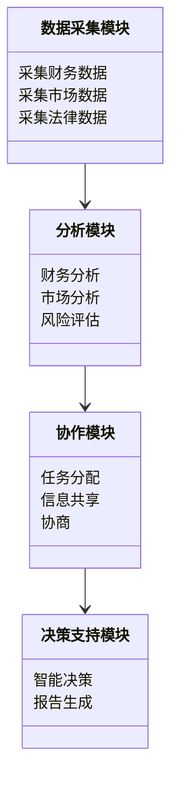
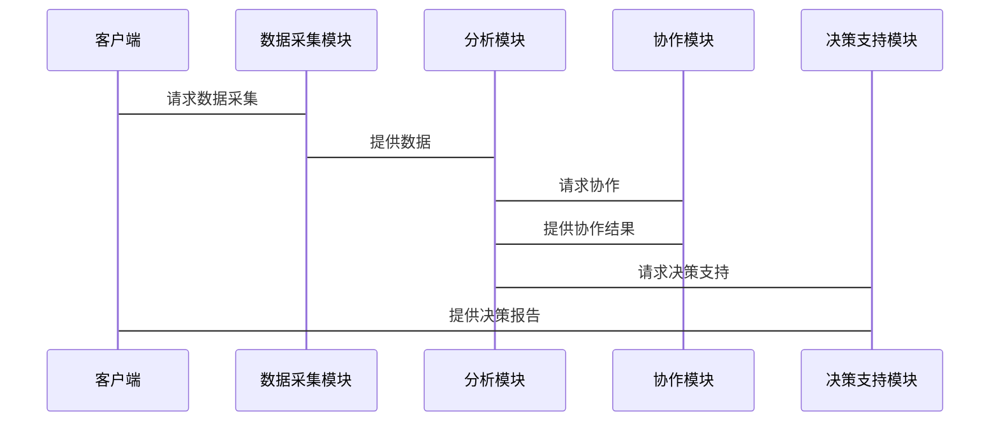

                 


# 多智能体系统在并购分析中的应用：评估长期价值创造

## 关键词：多智能体系统, 并购分析, 长期价值, 人工智能, 系统架构

## 摘要：本文探讨了多智能体系统（MAS）在并购分析中的应用，特别是如何利用MAS评估长期价值创造。通过分析传统并购分析方法的局限性，本文提出了一种基于MAS的多维度、动态协作的方法，结合博弈论和分布式计算，构建了一个智能化的并购分析框架。文章详细介绍了MAS的核心原理、算法设计、系统架构，并通过实际案例展示了其在并购分析中的优势。

---

# 第1章: 多智能体系统与并购分析概述

## 1.1 多智能体系统的基本概念

### 1.1.1 多智能体系统的定义
多智能体系统（Multi-Agent System, MAS）是由多个智能体（Agent）组成的分布式系统，每个智能体都是一个能够感知环境、自主决策、与其他智能体协作的实体。MAS的核心在于智能体之间的协作与通信，以实现整体目标。

### 1.1.2 多智能体系统的特性
| 特性 | 描述 |
|------|------|
| 分布式 | 智能体独立运行，无中心控制节点 |
| 协作性 | 智能体之间通过协作完成复杂任务 |
| 反应性 | 智能体能够实时感知环境并做出反应 |
| 动态性 | 系统环境和智能体状态动态变化 |

### 1.1.3 多智能体系统与传统单智能体系统的对比
| 对比维度 | 多智能体系统 | 单智能体系统 |
|----------|--------------|---------------|
| 系统复杂性 | 高 | 低 |
| 可扩展性 | 高 | 低 |
| 协作能力 | 强 | 弱 |

## 1.2 并购分析的基本概念

### 1.2.1 并购的定义与类型
- **并购**：企业间的合并或收购行为，分为横向并购、纵向并购和混合并购。
- **横向并购**：同一行业内的并购，旨在扩大市场份额。
- **纵向并购**：产业链上下游的并购，旨在整合资源。
- **混合并购**：与主业无关的并购，旨在多元化发展。

### 1.2.2 并购分析的主要方法
| 方法 | 描述 |
|------|------|
| 财务指标分析 | 通过财务数据评估企业价值 |
| 市场价值评估 | 通过市场数据和模型评估企业价值 |
| 风险评估 | 识别并购中的潜在风险 |

### 1.2.3 并购分析的挑战与难点
- 数据复杂性：涉及财务、市场、法律等多维度数据。
- 动态变化：市场环境和企业战略动态变化。
- 协作性：需要多个部门协作完成分析。

## 1.3 多智能体系统在并购分析中的应用

### 1.3.1 多智能体系统在并购分析中的优势
- **多维度分析**：MAS能够同时处理财务、市场、法律等多维度数据。
- **动态协作**：MAS能够实时协作，适应市场变化。
- **智能化决策**：MAS能够基于数据驱动的决策支持。

### 1.3.2 多智能体系统与并购分析的结合场景
- **协同分析**：多个智能体分别负责不同的分析任务，如财务分析、市场分析、法律风险评估。
- **动态优化**：MAS能够根据市场变化动态调整分析策略。
- **决策支持**：MAS能够为并购决策提供智能化支持。

### 1.3.3 本书的研究目标与意义
- **研究目标**：探索MAS在并购分析中的应用，提出基于MAS的长期价值评估方法。
- **研究意义**：通过MAS的协作性和智能性，提升并购分析的准确性和效率。

## 1.4 本章小结
本章介绍了多智能体系统的基本概念、特性以及在并购分析中的应用优势。通过对比MAS与传统单智能体系统的区别，明确了MAS在并购分析中的独特价值。

---

# 第2章: 多智能体系统的核心原理

## 2.1 多智能体系统的体系结构

### 2.1.1 分布式计算架构
- **分布式计算**： MAS中的智能体分布在网络中，通过通信协议进行协作。
- **通信协议**：定义智能体之间的通信规则，如消息传递、服务调用。

### 2.1.2 协作与通信机制
- **协作机制**：智能体之间通过协作协议完成任务，如任务分配、资源共享。
- **通信机制**：智能体通过消息队列或事件驱动的方式进行通信。

### 2.1.3 任务分配与协调
- **任务分配**：基于智能体的能力和当前负载，动态分配任务。
- **协调机制**：通过协商和仲裁机制解决冲突，确保任务顺利执行。

## 2.2 多智能体系统的协作机制

### 2.2.1 协作协议
- **分布式一致性协议**：如Paxos、Raft，用于确保系统一致性。
- **分布式共识协议**：如拜占庭容错（Byzantine Fault Tolerance, BFT），用于确保协议达成共识。

### 2.2.2 信息共享与隐私保护
- **信息共享**：智能体之间共享必要的信息，但需要确保隐私和数据安全。
- **隐私保护**：通过加密技术或隐私计算（如联邦学习）保护数据隐私。

### 2.2.3 协作策略
- **合作策略**：智能体基于共同目标制定协作策略，如资源分配、任务分工。
- **竞争策略**：在协作中引入竞争机制，以提高系统效率。

## 2.3 多智能体系统的博弈论模型

### 2.3.1 博弈论基础
- **博弈论**：研究理性决策者在竞争环境中的策略选择。
- ** Nash均衡**：所有参与者策略的最优反应，无人单方面改变策略能提高自身收益。

### 2.3.2 多智能体博弈模型
- **多智能体博弈**：多个智能体在共享环境中互动，目标是最大化自身收益。
- ** Nash均衡**：在多智能体博弈中，各智能体策略达到 Nash均衡时，系统达到稳定状态。

### 2.3.3 Nash均衡与协作优化
- ** Nash均衡**：每个智能体策略的最优反应，但可能不是全局最优。
- **协作优化**：通过协作协议和博弈论模型，优化系统整体收益。

## 2.4 本章小结
本章介绍了多智能体系统的体系结构、协作机制和博弈论模型。通过分析协作协议、通信机制和博弈论模型，明确了MAS在并购分析中的协作优化能力。

---

# 第3章: 并购分析中的长期价值评估

## 3.1 并购分析的传统方法

### 3.1.1 财务指标分析
- **财务指标**：如市盈率（P/E）、市净率（P/B）、ROE（净资产收益率）等。
- **财务分析**：通过财务指标评估企业价值和并购后的协同效应。

### 3.1.2 市场价值评估
- **市场价值**：通过股票价格、行业地位等评估企业市场价值。
- **市场分析**：分析行业趋势和市场竞争格局，评估并购后的市场潜力。

### 3.1.3 并购风险评估
- **风险评估**：识别并购中的法律、财务、市场等风险。
- **风险控制**：通过风险评估模型，制定风险管理策略。

## 3.2 长期价值创造的核心要素

### 3.2.1 资源整合
- **资源整合**：充分利用并购双方的资源，如技术、市场、人才等。
- **协同效应**：通过资源整合实现1+1>2的协同效应。

### 3.2.2 组织协同
- **组织结构**：优化组织结构，确保并购后组织的高效运作。
- **文化整合**：融合企业文化，促进员工协作。

### 3.2.3 战略一致性
- **战略规划**：确保并购战略与企业长期战略一致。
- **战略执行**：制定详细的执行计划，确保战略落地。

## 3.3 多智能体系统在长期价值评估中的优势

### 3.3.1 动态协作能力
- **动态协作**：MAS能够根据市场变化动态调整协作策略，优化长期价值。

### 3.3.2 多维度信息处理
- **多维度分析**：MAS能够同时处理财务、市场、法律等多维度信息，全面评估长期价值。

### 3.3.3 智能决策支持
- **智能决策**：通过MAS的协作和博弈论模型，提供智能化的决策支持，优化长期价值。

## 3.4 本章小结
本章分析了传统并购分析方法的局限性，并提出了基于MAS的长期价值评估方法。通过多维度信息处理和动态协作，MAS能够更准确地评估并购的长期价值。

---

# 第4章: 多智能体系统在并购分析中的算法原理

## 4.1 多智能体协作算法

### 4.1.1 分布式协作算法
- **分布式协作算法**：如分布式一致性算法（Paxos、Raft）和分布式共识算法（BFT）。
- **协作流程**：智能体通过通信协议协作完成任务，如任务分配、资源共享。

### 4.1.2 联合学习（Federated Learning）
- **联合学习**：多个智能体在不共享数据的情况下，通过模型更新协作学习。
- **应用场景**：在并购分析中，保护数据隐私的同时，实现模型协作。

### 4.1.3 跨智能体决策优化
- **决策优化**：通过协作优化算法，提升系统整体决策效率。
- **优化方法**：如分布式优化算法（ADMM）、协同优化算法（Coordinated Optimization）。

## 4.2 并购分析中的博弈论算法

### 4.2.1 Nash均衡计算
- **Nash均衡**：通过计算智能体的策略组合，找到最优均衡点。
- **计算方法**：通过迭代算法（如不动点算法）计算Nash均衡。

### 4.2.2 博弈树构建
- **博弈树**：构建多智能体博弈的决策树，分析所有可能的策略组合。
- **博弈树分析**：通过博弈树分析智能体的策略选择，找到最优解。

### 4.2.3 多智能体博弈模拟
- **博弈模拟**：通过模拟多智能体的博弈过程，评估并购的长期价值。
- **模拟工具**：使用博弈论框架（如Game Theory Framework）进行模拟。

## 4.3 算法实现的数学模型

### 4.3.1 协作优化模型
- **协作优化模型**：定义智能体的协作目标和约束条件，通过优化算法求解。
- **数学表达式**：目标函数、约束条件。

### 4.3.2 动态博弈模型
- **动态博弈模型**：描述智能体在动态环境下的博弈过程。
- **模型参数**：智能体的策略空间、收益函数、转移概率等。

### 4.3.3 联合学习框架
- **联合学习框架**：定义智能体的协作学习过程，包括模型更新、参数同步。
- **数学公式**：模型更新规则、参数同步机制。

## 4.4 本章小结
本章介绍了多智能体协作算法和博弈论算法在并购分析中的应用。通过协作优化和博弈模拟，MAS能够实现动态协作和智能化决策。

---

# 第5章: 并购分析的多智能体系统数学模型

## 5.1 多智能体系统的数学表示

### 5.1.1 智能体表示
- **智能体表示**：用状态、动作、奖励等描述智能体的行为。
- **数学表达**：状态空间S，动作空间A，奖励函数R(s, a)。

### 5.1.2 系统协作模型
- **协作模型**：定义智能体之间的协作关系和协作规则。
- **数学表达**：协作矩阵C，描述智能体之间的协作权重。

### 5.1.3 动态博弈模型
- **博弈模型**：定义智能体的策略空间、收益函数和博弈规则。
- **数学表达**：收益函数U(a1, a2, ..., an)，策略空间A_i。

## 5.2 并购分析的数学模型

### 5.2.1 财务指标模型
- **财务指标模型**：定义并购前后的财务指标变化。
- **数学公式**：如ROE变化、协同效应计算。

### 5.2.2 市场价值模型
- **市场价值模型**：定义并购后的市场价值评估方法。
- **数学公式**：如EV/EBITDA倍数、股票价格预测。

### 5.2.3 风险评估模型
- **风险评估模型**：定义并购中的风险因素及其影响程度。
- **数学公式**：如风险概率P(i)，风险影响I(i)。

## 5.3 本章小结
本章通过数学模型描述了多智能体系统在并购分析中的应用。通过定义智能体表示、协作模型和博弈模型，构建了一个完整的并购分析框架。

---

# 第6章: 并购分析的多智能体系统架构设计

## 6.1 项目介绍

### 6.1.1 项目背景
- **项目背景**：企业并购分析的复杂性和挑战。
- **项目目标**：构建基于MAS的并购分析系统。

### 6.1.2 项目需求
- **功能需求**：实现并购分析的多维度评估。
- **性能需求**：高效处理多维度数据，实时协作。

## 6.2 系统功能设计

### 6.2.1 系统功能模块
- **数据采集模块**：采集财务、市场、法律等数据。
- **分析模块**：进行多维度分析，如财务分析、市场分析、风险评估。
- **协作模块**：智能体协作完成分析任务。
- **决策支持模块**：提供智能化的决策支持。

### 6.2.2 领域模型（Mermaid类图）


### 6.2.3 系统架构设计（Mermaid架构图）


## 6.3 系统接口设计

### 6.3.1 接口描述
- **数据接口**：数据采集模块与外部数据源的接口。
- **协作接口**：智能体之间的协作接口，如任务分配、信息共享。
- **决策接口**：决策支持模块与用户的接口，提供决策支持。

### 6.3.2 接口协议
- **数据接口协议**：如HTTP、WebSocket。
- **协作接口协议**：如RPC（远程过程调用）、RESTful API。

## 6.4 系统交互流程（Mermaid序列图）



## 6.5 本章小结
本章通过系统架构设计和接口设计，详细描述了基于MAS的并购分析系统的实现方案。通过领域模型和系统架构图，明确了各模块的功能和协作关系。

---

# 第7章: 项目实战

## 7.1 环境安装

### 7.1.1 系统需求
- **操作系统**：Windows、Linux、macOS。
- **开发工具**：Python、Jupyter Notebook、IDE（如PyCharm）。
- **依赖库**：如scikit-learn、numpy、pandas、networkx、mermaid、latex。

### 7.1.2 安装步骤
1. 安装Python和pip。
2. 安装所需的依赖库：`pip install scikit-learn numpy pandas networkx mermaid python-frontmatter`。

## 7.2 系统核心实现

### 7.2.1 数据采集模块实现
- **数据源**：假设我们从CSV文件中读取数据。
- **实现代码**：
  ```python
  import pandas as pd

  def read_data(file_path):
      data = pd.read_csv(file_path)
      return data

  # 示例使用
  data = read_data('并购数据.csv')
  print(data.head())
  ```

### 7.2.2 分析模块实现
- **财务分析**：计算ROE、EBITDA等指标。
- **实现代码**：
  ```python
  import pandas as pd

  def calculate_roe(data):
      roe = data['净利润'] / data['净资产'] * 100
      return roe

  # 示例使用
  data['ROE'] = calculate_roe(data)
  print(data['ROE'].describe())
  ```

### 7.2.3 协作模块实现
- **任务分配**：基于智能体的能力分配任务。
- **实现代码**：
  ```python
  import numpy as np

  def assign_task(agent_ability, tasks):
      # 假设agent_ability是每个智能体的能力分数
      # tasks是需要分配的任务列表
      agent_tasks = []
      for task in tasks:
          # 选择能力最高的智能体分配任务
          selected_agent = np.argmax(agent_ability)
          agent_tasks.append((task, selected_agent))
      return agent_tasks

  # 示例使用
  agent_ability = [0.8, 0.6, 0.9]
  tasks = ['财务分析', '市场分析', '风险评估']
  result = assign_task(agent_ability, tasks)
  print(result)
  ```

### 7.2.4 决策支持模块实现
- **智能决策**：基于分析结果提供决策支持。
- **实现代码**：
  ```python
  import numpy as np

  def decision_support(analysis_results):
      # 假设analysis_results是各模块的分析结果
      # 综合评估并购价值
      weighted_sum = np.dot(analysis_results, [0.4, 0.3, 0.3])
      if weighted_sum > 0.7:
          return '推荐并购'
      else:
          return '不推荐并购'

  # 示例使用
  analysis_results = [0.8, 0.6, 0.7]
  decision = decision_support(analysis_results)
  print(decision)
  ```

## 7.3 项目小结
本章通过项目实战，详细介绍了基于MAS的并购分析系统的实现过程。通过数据采集、分析、协作和决策支持模块的实现，展示了MAS在并购分析中的实际应用。

---

# 第8章: 总结与展望

## 8.1 总结
本章总结了全文的主要内容，强调了MAS在并购分析中的优势和应用价值。通过MAS的协作性和智能性，能够提升并购分析的准确性和效率。

## 8.2 未来研究方向
- **MAS优化**：进一步优化MAS的协作算法和博弈论模型，提升系统的效率和准确性。
- **应用拓展**：将MAS应用到更多领域，如供应链管理、金融投资等。
- **隐私保护**：加强隐私保护技术的研究，确保数据安全。

## 8.3 实践中的注意事项
- **数据质量**：确保数据的准确性和完整性。
- **系统维护**：定期维护和更新系统，确保其稳定运行。
- **团队协作**：加强团队协作，确保各模块的协调工作。

## 8.4 拓展阅读
- 推荐阅读《Multi-Agent Systems: Complexity Decomposition and Its Applications》和《Game Theory and Its Applications in the Social and Behavioral Sciences》。

## 8.5 本章小结
本章总结了全文的主要内容，并展望了MAS在并购分析中的未来研究方向和应用前景。

---

# 作者：AI天才研究院/AI Genius Institute & 禅与计算机程序设计艺术/Zen And The Art of Computer Programming

