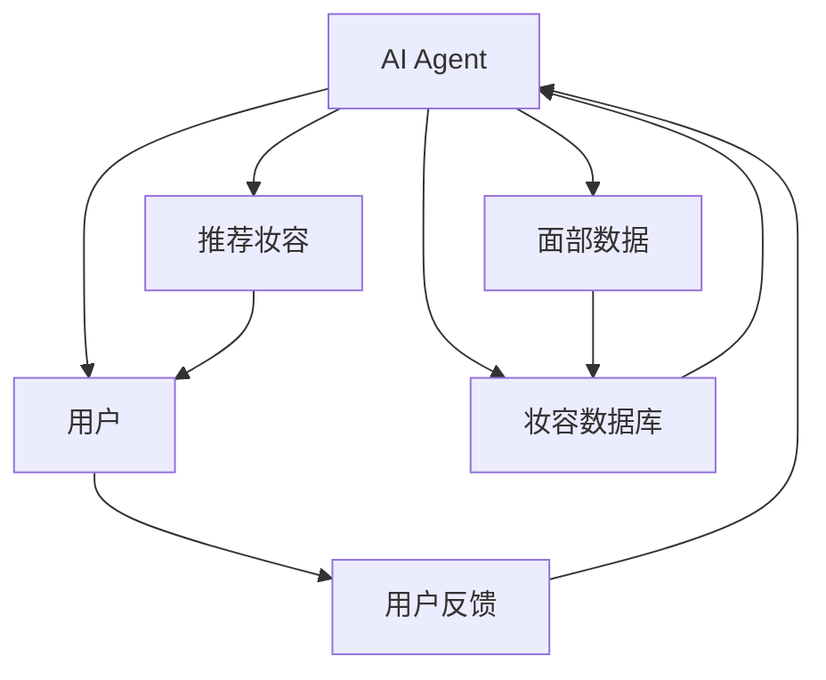
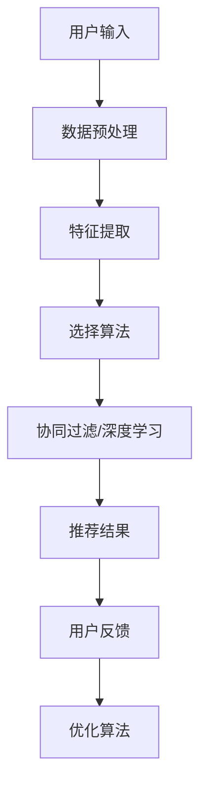
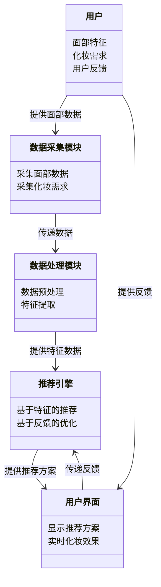
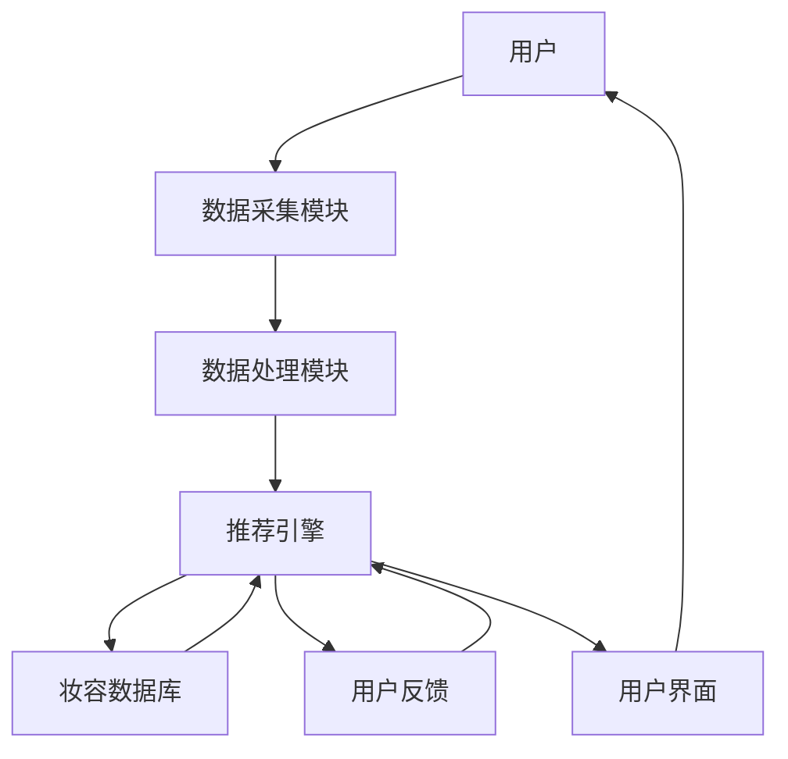
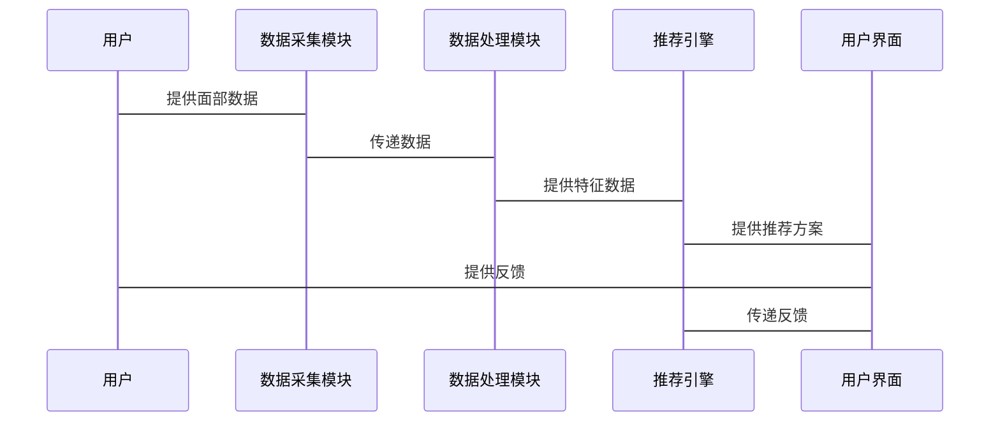

                 


# 第一部分: 背景与概念

## 第1章: 智能浴室镜与AI Agent概述

### 1.1 问题背景
#### 1.1.1 化妆与个人形象的重要性
在现代社会，化妆不仅仅是美容的一部分，更是个人形象管理的重要手段。无论是日常生活还是重要场合，妆容的正确选择都能给人留下深刻的第一印象。

#### 1.1.2 传统化妆指导的局限性
传统的化妆指导依赖于经验丰富的美容顾问，但这种方式存在成本高、时间长、个性化不足等问题。许多人在没有专业指导的情况下，难以准确找到适合自己的妆容，尤其是在早晨时间紧迫的情况下，往往只能尝试几次，导致效率低下。

#### 1.1.3 AI技术在化妆指导中的潜力
随着人工智能技术的飞速发展，AI在图像处理、自然语言处理、推荐系统等方面展现出巨大潜力。通过AI技术，可以实时分析用户的面部特征、肤色、五官结构等，推荐适合的妆容方案，大大提升化妆指导的效率和个性化。

### 1.2 问题描述
#### 1.2.1 用户需求分析
用户需要一种高效、便捷、个性化的化妆指导工具，能够在早晨或其他场合快速找到适合自己的妆容方案。

#### 1.2.2 智能浴室镜的功能定位
智能浴室镜不仅仅是一个普通的镜子，它是一个集成了AI技术的智能终端设备，能够通过摄像头捕捉用户的面部信息，结合AI算法推荐适合的妆容。

#### 1.2.3 AI Agent在化妆指导中的角色
AI Agent作为智能浴室镜的核心，负责数据采集、处理、分析和推荐，为用户提供个性化的妆容建议。

### 1.3 问题解决
#### 1.3.1 AI Agent的核心功能
- 面部特征识别：通过摄像头捕捉用户的面部特征，包括肤色、五官位置、表情等。
- 妆容推荐：基于面部特征和用户偏好，推荐适合的妆容方案，包括底妆、眼影、唇色等。
- 实时调整：根据用户的实时反馈，动态调整推荐方案，优化妆容效果。

#### 1.3.2 智能浴室镜的技术实现
- 硬件部分：高分辨率摄像头、传感器、显示屏等。
- 软件部分：AI算法、数据处理模块、用户界面等。
- 数据流与交互：用户面部数据采集→数据处理→妆容推荐→用户反馈→动态调整。

#### 1.3.3 用户体验的优化
- 提供多样化的妆容选择，满足不同用户的需求。
- 实时互动，快速响应用户的化妆需求。
- 个性化推荐，根据用户的面部特征和偏好，提供精准的妆容建议。

### 1.4 边界与外延
#### 1.4.1 智能浴室镜的应用场景
- 个人日常化妆指导
- 化妆培训和学习辅助
- 商业场景中的试妆体验

#### 1.4.2 AI Agent的能力边界
- 数据采集和处理能力
- 妆容推荐的准确性和多样性
- 用户反馈的实时处理能力

#### 1.4.3 与其他智能设备的协同
- 与手机APP联动，提供更丰富的化妆方案
- 与智能家居系统集成，实现更智能化的用户体验
- 与其他智能镜子或化妆工具的数据互通

### 1.5 概念结构与核心要素
#### 1.5.1 系统组成
- 用户端：智能浴室镜、摄像头、显示屏
- 服务端：AI算法、数据处理模块、推荐引擎
- 数据端：用户面部数据、妆容数据库、用户偏好数据

#### 1.5.2 核心功能模块
- 数据采集模块：负责采集用户的面部数据
- 数据处理模块：对采集的数据进行预处理和特征提取
- 推荐引擎：基于特征数据推荐适合的妆容方案
- 用户反馈模块：收集用户的反馈并优化推荐算法

#### 1.5.3 用户与系统的交互流程
1. 用户站在智能浴室镜前，系统通过摄像头采集用户的面部数据。
2. 数据处理模块对采集的数据进行分析，提取用户的面部特征。
3. 推荐引擎基于用户的特征数据和偏好，推荐适合的妆容方案。
4. 用户查看推荐方案，选择其中一个进行尝试。
5. 系统实时调整推荐方案，优化妆容效果。

## 第2章: AI Agent的核心概念

### 2.1 AI Agent的基本原理
#### 2.1.1 定义与分类
AI Agent是一种智能体，能够感知环境并采取行动以实现目标。根据智能体的智能水平和应用领域，可以分为简单反应式AI Agent、基于模型的反应式AI Agent、实用推理AI Agent等。

#### 2.1.2 AI Agent的核心特征
- 智能感知：能够感知环境并获取相关信息。
- 自主决策：基于感知信息做出决策并采取行动。
- 学习能力：通过经验优化自身的决策和推荐能力。
- 人机交互：能够与用户进行自然的交互，理解用户需求。

#### 2.1.3 与传统软件的区别
传统的软件是基于规则的，而AI Agent具有自主决策和学习能力，能够根据环境和用户反馈动态调整自身的行为和推荐策略。

### 2.2 智能浴室镜的系统架构
#### 2.2.1 硬件部分
- 高分辨率摄像头：用于采集用户的面部数据。
- 环境传感器：检测光线、温度等环境因素，优化显示效果。
- 显示屏：高清晰度显示屏，用于显示推荐的妆容方案和实时化妆效果。

#### 2.2.2 软件部分
- 数据处理模块：负责对采集的面部数据进行预处理和特征提取。
- AI算法模块：基于特征数据进行妆容推荐，包括底妆、眼影、唇色等。
- 用户界面：直观的用户界面，方便用户查看和选择推荐方案。

#### 2.2.3 数据流与交互
- 用户面部数据采集→数据处理→妆容推荐→用户反馈→动态调整。

### 2.3 AI Agent与用户交互
#### 2.3.1 用户需求分析
- 用户的面部特征：肤色、五官位置、皮肤状况等。
- 用户的化妆需求：场合、时间、个人喜好等。
- 用户的反馈：对推荐妆容的满意度和调整需求。

#### 2.3.2 自然语言处理
- 通过自然语言处理技术，理解用户的语言指令和反馈。
- 支持多语言交互，满足不同地区用户的需求。

#### 2.3.3 视觉识别技术
- 通过视觉识别技术，实时分析用户的面部特征和化妆效果。
- 提供实时的化妆指导，帮助用户快速找到适合的妆容。

## 第3章: 核心概念与联系

### 3.1 核心概念原理
#### 3.1.1 数据采集与处理
- 数据采集：通过摄像头采集用户的面部数据，包括图像和视频流。
- 数据预处理：对采集的数据进行去噪、增强等处理，优化数据质量。
- 特征提取：从预处理后的数据中提取有用的特征，如面部关键点、肤色特征等。

#### 3.1.2 算法推荐机制
- 基于特征的推荐：根据用户的面部特征和偏好，推荐适合的妆容方案。
- 基于行为的推荐：根据用户的化妆历史和反馈，动态调整推荐策略。
- 基于协同的推荐：参考其他用户的反馈和偏好，推荐相似的妆容方案。

#### 3.1.3 用户反馈与优化
- 收集用户的反馈，包括对推荐妆容的满意度和调整需求。
- 根据反馈优化推荐算法，提升推荐的准确性和用户的满意度。

### 3.2 概念属性特征对比表
| 概念 | 属性 | 特征 |
|------|------|------|
| AI Agent | 智能感知 | 能够感知环境并获取相关信息 |
|        | 自主决策 | 基于感知信息做出决策并采取行动 |
|        | 学习能力 | 通过经验优化自身的决策和推荐能力 |
| 智能浴室镜 | 数据采集 | 通过摄像头采集用户的面部数据 |
|          | 数据处理 | 对采集的数据进行预处理和特征提取 |
|          | 推荐引擎 | 基于特征数据推荐适合的妆容方案 |

### 3.3 实体关系图



解释：AI Agent通过采集用户的面部数据，并结合妆容数据库中的信息，推荐适合的妆容方案给用户。同时，用户对推荐方案的反馈也会被AI Agent用于优化推荐算法。

## 第4章: 算法原理

### 4.1 推荐算法概述
推荐算法是AI Agent的核心，通过分析用户的面部特征和行为数据，推荐适合的妆容方案。常见的推荐算法包括协同过滤、基于内容的推荐和基于深度学习的推荐。

### 4.2 协同过滤算法
协同过滤是一种基于用户相似性推荐的算法，通过分析用户的偏好和行为，找到与用户相似的其他用户，推荐他们喜欢的妆容方案。

#### 4.2.1 用户相似度计算
- 使用余弦相似度计算用户之间的相似度：
  $$ \text{相似度} = \frac{\sum_{i=1}^{n} u_i v_i}{\sqrt{\sum_{i=1}^{n} u_i^2} \sqrt{\sum_{i=1}^{n} v_i^2}} $$
  其中，\( u \) 和 \( v \) 分别是两个用户的偏好向量。

#### 4.2.2 基于协同过滤的推荐流程
1. 计算用户之间的相似度。
2. 找到与目标用户相似度最高的用户。
3. 推荐这些用户喜欢的妆容方案。

### 4.3 基于深度学习的推荐算法
基于深度学习的推荐算法通过训练深度神经网络，提取用户的深层特征，推荐适合的妆容方案。

#### 4.3.1 网络结构
- 输入层：用户的面部特征和偏好。
- 隐层：通过多层感知机提取特征。
- 输出层：推荐的妆容方案。

#### 4.3.2 损失函数
- 使用交叉熵损失函数：
  $$ \text{损失} = -\sum_{i=1}^{n} y_i \log(p_i) + (1 - y_i) \log(1 - p_i) $$
  其中，\( y_i \) 是真实标签，\( p_i \) 是预测概率。

#### 4.3.3 训练过程
1. 数据预处理：归一化和特征提取。
2. 模型训练：优化损失函数，调整模型参数。
3. 模型评估：验证集上评估模型性能。

### 4.4 算法流程图



解释：用户输入面部数据和偏好后，系统进行数据预处理和特征提取，选择协同过滤或深度学习算法进行推荐，得到推荐结果并反馈给用户，根据用户反馈优化推荐算法。

## 第5章: 系统分析与架构设计

### 5.1 系统功能设计
- 数据采集模块：采集用户的面部数据。
- 数据处理模块：对数据进行预处理和特征提取。
- 推荐引擎：基于特征数据推荐适合的妆容方案。
- 用户界面：直观展示推荐方案和实时化妆效果。

### 5.2 领域模型设计



解释：用户通过数据采集模块提供面部数据和化妆需求，数据处理模块进行预处理和特征提取，推荐引擎基于特征数据和用户反馈推荐妆容方案，用户界面展示推荐结果并实时更新化妆效果。

### 5.3 系统架构设计



解释：用户通过数据采集模块提供面部数据和化妆需求，数据处理模块对数据进行预处理和特征提取，推荐引擎基于特征数据和用户反馈推荐妆容方案，用户界面展示推荐结果并实时更新化妆效果。

### 5.4 系统接口设计
- 数据接口：与数据采集模块和数据处理模块之间的数据传输接口。
- 用户反馈接口：接收用户的反馈并优化推荐算法。
- 用户界面接口：与用户进行交互，展示推荐方案和实时化妆效果。

### 5.5 系统交互流程图



解释：用户通过数据采集模块提供面部数据和化妆需求，数据处理模块对数据进行预处理和特征提取，推荐引擎基于特征数据和用户反馈推荐妆容方案，用户界面展示推荐结果并实时更新化妆效果。

## 第6章: 项目实战

### 6.1 环境安装
- 安装Python和必要的Python库：numpy、pandas、scikit-learn、tensorflow、openCV。
- 安装智能浴室镜硬件设备：摄像头、显示屏、传感器等。

### 6.2 核心代码实现

#### 6.2.1 数据预处理代码
```python
import cv2
import numpy as np

def preprocess_image(image_path):
    image = cv2.imread(image_path)
    # 转换为灰度图像
    gray = cv2.cvtColor(image, cv2.COLOR_BGR2GRAY)
    # 调整图像大小
    resized = cv2.resize(gray, (224, 224))
    # 归一化处理
    normalized = resized / 255.0
    return normalized
```

#### 6.2.2 基于协同过滤的推荐算法
```python
from sklearn.metrics.pairwise import cosine_similarity

def collaborative_filtering(user_data, target_user):
    # 计算用户相似度
    similarity = cosine_similarity(user_data, target_user)
    # 找到相似度最高的用户
    top_k_users = similarity.argsort()[::-1][:5]
    # 推荐这些用户喜欢的妆容方案
    recommended_cosmetics = []
    for user in top_k_users:
        recommended_cosmetics.extend(user_cosmetics[user])
    return recommended_cosmetics
```

#### 6.2.3 基于深度学习的推荐算法
```python
import tensorflow as tf
from tensorflow.keras.models import Model
from tensorflow.keras.layers import Dense, Input

def deep_learning_model(input_dim):
    inputs = Input(shape=(input_dim,))
    x = Dense(64, activation='relu')(inputs)
    predictions = Dense(1, activation='sigmoid')(x)
    model = Model(inputs=inputs, outputs=predictions)
    return model

model = deep_learning_model(50)
model.compile(optimizer='adam', loss='binary_crossentropy', metrics=['accuracy'])
model.fit(X_train, y_train, epochs=10, batch_size=32)
```

### 6.3 代码应用解读
- 数据预处理代码：对采集的面部图像进行预处理，包括灰度转换、调整大小和归一化处理。
- 协同过滤推荐算法：通过计算用户相似度，推荐相似用户的喜欢的妆容方案。
- 深度学习推荐算法：训练深度神经网络，提取用户的深层特征，推荐适合的妆容方案。

### 6.4 实际案例分析
- 案例1：用户A的面部特征和偏好分析，推荐适合的底妆、眼影和唇色。
- 案例2：用户B的面部特征和偏好分析，推荐适合的眉形、腮红和口红。

### 6.5 项目小结
通过项目实战，我们详细讲解了智能浴室镜的实现过程，包括环境安装、数据预处理、推荐算法实现和实际案例分析。读者可以通过这些代码和案例，掌握智能浴室镜的核心技术，并能够在实际项目中应用这些技术。

## 第7章: 最佳实践

### 7.1 小结
智能浴室镜结合了AI技术，为用户提供个性化的妆容推荐服务。通过AI Agent的核心概念、算法原理和系统架构设计，我们可以实现高效的化妆指导。

### 7.2 注意事项
- 数据隐私和安全：确保用户的面部数据和偏好不被滥用。
- 系统性能优化：提升数据处理和推荐算法的效率，确保实时响应。
- 用户体验优化：设计直观的用户界面，提升用户的使用体验。

### 7.3 拓展阅读
- 推荐阅读《AI技术在化妆领域的应用》
- 参考文献：《智能镜子的设计与实现》
- 在线资源：智能镜子开发社区、AI化妆推荐算法开源项目

## 作者信息

作者：AI天才研究院/AI Genius Institute  
作者信息：禅与计算机程序设计艺术 /Zen And The Art of Computer Programming

