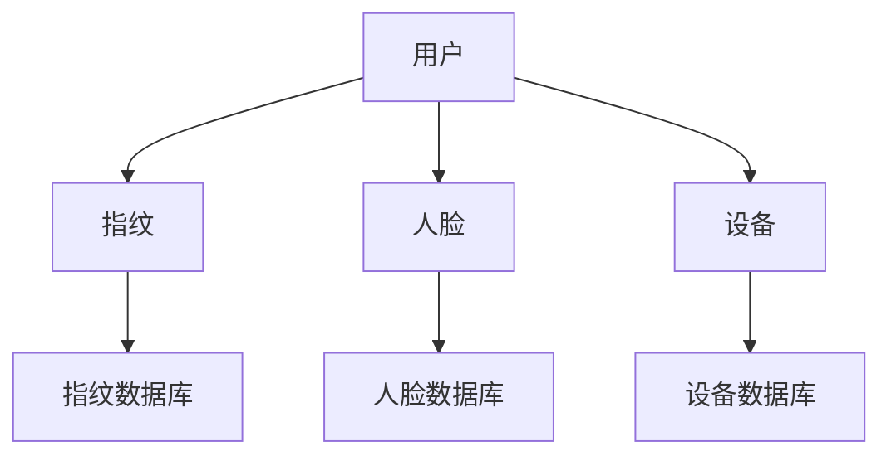
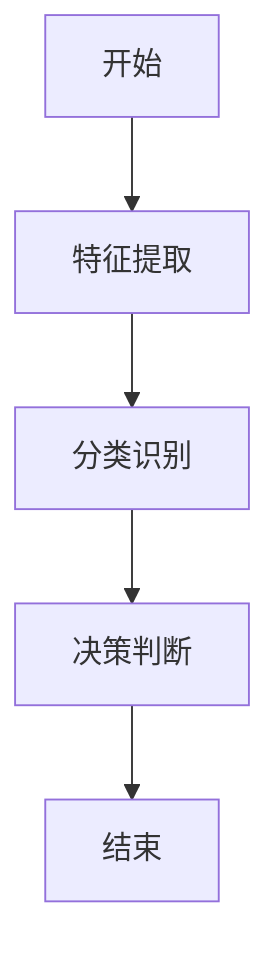
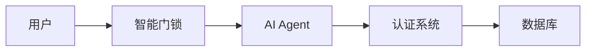
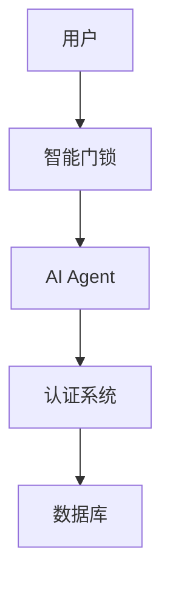

                 


# 智能门锁：AI Agent的多因素安全认证系统

## 关键词：智能门锁，AI Agent，多因素认证，安全系统，人工智能，门禁系统

## 摘要：  
本文探讨了智能门锁与AI Agent结合的多因素安全认证系统，详细分析了其核心概念、算法原理、系统架构及实际应用。通过背景介绍、核心概念对比、算法流程图、系统架构图、项目实战案例等多维度的深入解析，展示了AI Agent在智能门锁中的创新应用及其对安全认证领域的深远影响。

---

# 第1章: 智能门锁与AI Agent概述

## 1.1 智能门锁的定义与特点

### 1.1.1 传统门锁的局限性  
传统门锁依赖机械钥匙，存在易复制、难管理等问题，无法适应现代智能环境的需求。  

### 1.1.2 智能门锁的核心功能  
智能门锁通过集成传感器、蓝牙/NFC、指纹识别等技术，实现远程控制、权限管理、实时监控等功能。  

### 1.1.3 智能门锁的市场现状与发展趋势  
随着物联网技术的发展，智能门锁市场快速增长，用户对安全性、便捷性和智能化的需求日益增加。  

---

## 1.2 AI Agent的基本概念

### 1.2.1 人工智能代理的定义  
AI Agent是一种能够感知环境、自主决策并执行任务的智能实体，具备学习、推理和自适应能力。  

### 1.2.2 AI Agent的核心特点  
- **感知能力**：通过传感器、摄像头等获取环境信息。  
- **决策能力**：基于数据进行判断并执行操作。  
- **自适应能力**：根据环境变化动态调整行为。  

### 1.2.3 AI Agent在智能门锁中的应用潜力  
AI Agent可实现用户识别、权限管理、异常检测等功能，提升门锁的安全性和智能化水平。  

---

## 1.3 多因素安全认证系统的概念

### 1.3.1 多因素认证的基本定义  
多因素认证（MFA）通过结合多种认证因子（如身份验证、行为分析、环境验证）来增强安全性。  

### 1.3.2 多因素认证的优势与应用场景  
- **优势**：安全性高，难以被仿冒或破解。  
- **应用场景**：适用于高安全需求的场所，如家庭、企业、公共设施等。  

### 1.3.3 多因素认证在智能门锁中的具体实现  
通过结合指纹识别、人脸识别、蓝牙/NFC等多种认证方式，构建多层次的安全认证体系。  

---

## 1.4 本章小结

- **智能门锁的背景与意义**：传统门锁的局限性推动了智能门锁的发展。  
- **AI Agent与多因素认证的结合**：AI Agent为智能门锁提供了智能化的决策能力，多因素认证则增强了系统的安全性。  

---

# 第2章: AI Agent与多因素认证的核心概念

## 2.1 AI Agent的核心原理

### 2.1.1 代理的感知与决策机制  
AI Agent通过传感器、摄像头等设备感知环境，并基于感知数据进行决策。  

### 2.1.2 基于AI的特征提取与识别  
利用深度学习模型提取用户特征（如指纹、人脸）并进行识别。  

### 2.1.3 AI Agent的自适应学习能力  
通过机器学习模型不断优化识别算法，提升准确性。  

---

## 2.2 多因素认证的系统架构

### 2.2.1 认证因子的分类与特点  
- **身份验证**：如指纹、人脸识别。  
- **行为分析**：如行为模式、步态识别。  
- **环境验证**：如地理位置、时间验证。  

### 2.2.2 多因素认证的逻辑架构  
多因素认证系统通过多个认证因子的组合，判断用户身份的合法性。  

### 2.2.3 多因素认证的实体关系模型  

#### 实体关系对比表格  
| 认证因子 | 描述 | 优势 | 局限性 |
|----------|------|------|--------|
| 指纹识别 | 基于指纹特征 | 高精度 | 易受环境影响 |
| 人脸识别 | 基于面部特征 | 非接触式 | 易受化妆影响 |
| 蓝牙/NFC | 基于设备距离 | 便捷性高 | 易被截获 |

#### ER图分析  


---

## 2.3 AI Agent与多因素认证的结合

### 2.3.1 AI Agent在多因素认证中的角色  
AI Agent负责协调多个认证因子，进行数据处理和决策判断。  

### 2.3.2 多因素认证对AI Agent的增强作用  
多因素认证提高了系统的安全性，AI Agent则提供了智能化的处理能力。  

### 2.3.3 两者的协同工作流程  
1. 用户发起开门请求。  
2. AI Agent启动多因素认证。  
3. 系统验证多个因子后，判断是否允许开门。  

---

## 2.4 本章小结

- **AI Agent的核心原理**：通过感知和学习提升识别能力。  
- **多因素认证的系统架构**：结合多种认证因子，增强安全性。  
- **AI Agent与多因素认证的结合**：协同工作，提升系统智能化和安全性。  

---

# 第3章: AI Agent多因素认证的算法原理

## 3.1 基于AI的特征提取与识别算法

### 3.1.1 传统特征提取方法的局限性  
传统方法依赖人工特征设计，效率低且易受干扰。  

### 3.1.2 基于深度学习的特征提取  
利用卷积神经网络（CNN）提取高维特征，具有更高的准确性和鲁棒性。  

### 3.1.3 深度学习模型的选择与优化  
选择适合目标的模型（如ResNet、MobileNet）并进行调优。  

---

## 3.2 多因素认证的分类与识别算法

### 3.2.1 基于机器学习的分类算法  
如支持向量机（SVM）、随机森林（Random Forest）等，适用于小规模数据。  

### 3.2.2 基于深度学习的分类算法  
如卷积神经网络（CNN）、循环神经网络（RNN）等，适合大规模数据。  

### 3.2.3 分类算法的性能对比与优化  
通过实验对比不同算法的准确率、召回率等指标，选择最优模型。  

---

## 3.3 AI Agent的决策逻辑与算法实现

### 3.3.1 基于概率的决策模型  
根据各认证因子的识别概率，综合判断整体风险。  

### 3.3.2 基于规则的决策模型  
根据预设规则（如“必须同时通过指纹和人脸识别”）进行判断。  

### 3.3.3 基于强化学习的决策模型  
通过强化学习不断优化决策策略，提升系统安全性。  

---

## 3.4 算法流程图与代码实现

### 3.4.1 算法流程图（mermaid）  


### 3.4.2 Python代码实现  

#### 特征提取代码  
```python
import tensorflow as tf
from tensorflow.keras import layers

model = tf.keras.Sequential([
    layers.Conv2D(32, (3,3), activation='relu', input_shape=(224, 224, 3)),
    layers.MaxPooling2D((2,2)),
    layers.Conv2D(64, (3,3), activation='relu'),
    layers.MaxPooling2D((2,2)),
    layers.Flatten(),
    layers.Dense(64, activation='relu'),
    layers.Dense(1, activation='sigmoid')
])
```

#### 分类识别代码  
```python
import numpy as np

def classify(features):
    model = load_model('model.h5')
    prediction = model.predict(features)
    return np.argmax(prediction, axis=1)
```

---

## 3.5 数学模型与公式解析

### 3.5.1 分类算法的损失函数  
$$ 
\text{损失函数} = -\frac{1}{n}\sum_{i=1}^{n} y_i \log(p_i) + (1 - y_i)\log(1 - p_i)
$$  

### 3.5.2 决策树模型的决策边界  
$$ 
\text{决策边界} = \{x | f(x) = 0\}
$$  

---

# 第4章: 系统分析与架构设计

## 4.1 系统应用场景介绍

### 4.1.1 家庭场景  
智能门锁用于家庭门禁，支持指纹、人脸识别等多种方式。  

### 4.1.2 企业场景  
应用于办公楼宇，结合考勤系统实现智能化管理。  

### 4.1.3 公共场景  
如酒店、学校等场所，提升管理效率和安全性。  

---

## 4.2 系统功能设计

### 4.2.1 用户管理  
- 用户注册与权限设置。  
- 用户信息的存储与管理。  

### 4.2.2 门锁控制  
- 远程开门/关门控制。  
- 状态监控与报警。  

### 4.2.3 认证管理  
- 多因素认证的协同处理。  
- 认证日志的记录与分析。  

---

## 4.3 系统架构设计

### 4.3.1 系统架构图（mermaid）  


### 4.3.2 模块划分与功能说明  
- **用户模块**：处理用户的注册、登录等操作。  
- **门锁模块**：负责门锁的控制与状态监控。  
- **AI Agent模块**：协调各模块，执行智能决策。  
- **认证系统模块**：处理多因素认证逻辑。  

---

## 4.4 接口设计与交互流程

### 4.4.1 系统接口设计  
- 用户认证接口：`POST /auth`  
- 门锁控制接口：`POST /lock`  

### 4.4.2 交互流程图（mermaid）  


---

# 第5章: 项目实战

## 5.1 环境安装与配置

### 5.1.1 系统环境要求  
- 操作系统：Windows/Mac/Linux  
- 开发工具：PyCharm/VSCode  
- 依赖库：TensorFlow、OpenCV、Flask  

### 5.1.2 安装步骤  
```bash
pip install tensorflow opencv-python flask
```

---

## 5.2 核心系统实现

### 5.2.1 AI Agent实现  
```python
class AIAgent:
    def __init__(self):
        self.models = {}  # 存储各认证模型

    def authenticate(self, factor):
        # 调用对应的认证模型进行识别
        return self.models[factor].predict(factor_data)
```

### 5.2.2 多因素认证实现  
```python
def multi_factor_authenticate(agent, factors):
    results = {}
    for factor in factors:
        results[factor] = agent.authenticate(factor)
    return all(results.values())
```

---

## 5.3 案例分析与代码解读

### 5.3.1 案例分析  
以家庭场景为例，实现指纹和人脸识别的多因素认证。  

### 5.3.2 代码解读  
```python
# 指纹识别模型
def fingerprint_authenticate(fingerprint):
    model = load_model('fingerprint_model.h5')
    return model.predict(fingerprint)

# 人脸识别模型
def face_authenticate(face_image):
    model = load_model('face_model.h5')
    return model.predict(face_image)
```

---

## 5.4 本章小结

- **项目实战的意义**：通过实际案例深入理解系统实现。  
- **代码实现的关键点**：AI Agent的协调作用，多因素认证的协同实现。  

---

# 第6章: 总结与展望

## 6.1 总结

- **智能门锁的发展**：从单一认证到多因素认证的演变。  
- **AI Agent的作用**：提升系统的智能化和安全性。  

## 6.2 展望

- **技术进步**：深度学习、强化学习的进一步应用。  
- **应用场景扩展**：智能门锁在更多领域的应用。  

---

# 第7章: 最佳实践与注意事项

## 7.1 最佳实践 tips

- **安全性优先**：确保数据加密传输与存储。  
- **用户体验优化**：简化操作流程，提升便捷性。  
- **系统维护**：定期更新模型，修复潜在漏洞。  

## 7.2 注意事项

- **数据隐私**：严格保护用户隐私数据。  
- **系统兼容性**：确保不同设备和平台的兼容性。  
- **异常处理**：设计完善的异常处理机制，确保系统稳定运行。  

---

# 参考文献  
1. [深度学习入门书籍]  
2. [AI Agent相关论文]  
3. [多因素认证技术文档]  

---

# 附录  

## 附录A: 项目源代码  

```python
# 智能门锁系统实现
class SmartLock:
    def __init__(self):
        self.agent = AIAgent()
        self.auth_factors = ['fingerprint', 'face']

    def authenticate(self, factor):
        return self.agent.authenticate(factor)

    def open_door(self):
        return self.authenticate(self.auth_factors)

# AI Agent实现
class AIAgent:
    def __init__(self):
        self.models = {}

    def authenticate(self, factor):
        return self.models[factor].predict(factor_data)
```

---

# 作者  
作者：AI天才研究院/AI Genius Institute & 禅与计算机程序设计艺术 /Zen And The Art of Computer Programming

