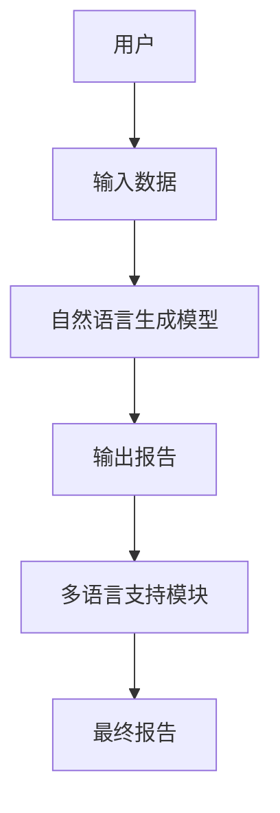
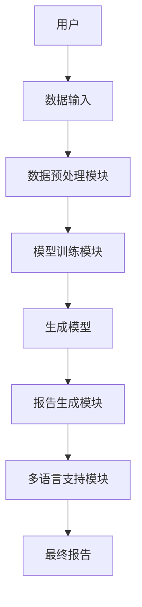

                 


# 构建企业级自然语言生成报告系统：多语言财务报告自动化

## 关键词
自然语言生成, 多语言处理, 财务报告, 企业级系统, 人工智能, 深度学习

## 摘要
本文详细探讨了构建企业级自然语言生成报告系统的多语言财务报告自动化的关键技术和实现方案。从问题背景、核心概念、算法原理、系统架构到项目实战，系统性地分析了如何利用自然语言生成技术解决企业财务报告生成的痛点，提出了多语言支持的技术方案，并通过实际案例展示了系统的实现过程和应用价值。

---

# 第一部分: 企业级自然语言生成报告系统背景与概述

## 第1章: 背景介绍

### 1.1 问题背景

#### 1.1.1 传统财务报告生成的痛点
传统的财务报告生成过程依赖人工操作，效率低、成本高且容易出错。企业在跨国经营中需要生成多种语言的财务报告，这进一步增加了工作量和复杂性。

#### 1.1.2 自然语言生成技术的引入
自然语言生成（Natural Language Generation, NLP）技术能够自动生成结构化文本，显著提高了报告生成的效率和准确性。通过NLP技术，企业可以快速生成符合要求的财务报告。

#### 1.1.3 多语言支持的需求
随着全球化的发展，企业需要在不同国家或地区生成多种语言的财务报告。多语言支持是实现企业级财务报告自动化的关键需求。

### 1.2 问题描述

#### 1.2.1 财务报告生成的复杂性
财务报告包含大量专业术语和结构化数据，需要严格遵守相关法规和格式要求。

#### 1.2.2 传统报告生成的效率瓶颈
传统的人工报告生成方式效率低下，且容易出错。企业需要一种自动化解决方案来提高效率。

#### 1.2.3 自然语言生成的优势
自然语言生成技术能够快速处理大量数据，生成高质量的文本内容，显著提高了报告生成的效率和准确性。

### 1.3 问题解决

#### 1.3.1 自然语言生成技术的应用场景
自然语言生成技术可以应用于财务报告、商业分析、市场报告等领域。

#### 1.3.2 多语言支持的技术挑战
多语言支持需要处理不同语言的语法、词汇和文化差异，增加了技术实现的复杂性。

#### 1.3.3 系统设计的目标与范围
系统设计的目标是实现一个多语言、高效的财务报告生成系统，覆盖从数据输入到报告输出的完整流程。

### 1.4 边界与外延

#### 1.4.1 系统边界定义
系统的主要功能包括数据输入、模型训练、报告生成和输出。边界外的部分包括数据源的获取和外部系统的集成。

#### 1.4.2 相关领域的区别与联系
自然语言生成与自然语言理解（NLU）的区别在于，NLP专注于生成文本，而NLU专注于理解文本。两者在技术上有一定的联系，但在实现目标上有所不同。

#### 1.4.3 系统的可扩展性与局限性
系统设计具有良好的可扩展性，支持多种语言和多种报告类型。但在处理非常复杂或模糊的数据时，可能需要人工干预。

### 1.5 核心概念与联系

#### 1.5.1 核心概念原理
自然语言生成系统的核心是将结构化数据转化为自然语言文本。多语言支持则需要处理不同语言的语法和文化差异。

#### 1.5.2 概念属性特征对比表格
以下是一个核心概念对比表格：

| 概念       | 特征                  |
|------------|-----------------------|
| NLP         | 数据输入：结构化数据；输出：自然语言文本；技术：生成模型；应用：报告生成 |
| 多语言支持  | 数据输入：多语言结构化数据；输出：多语言报告；技术：跨语言迁移学习；应用：跨国企业报告生成 |

#### 1.5.3 ER实体关系图
以下是系统的核心实体关系图：



---

## 第2章: 核心概念与联系

### 2.1 自然语言生成技术

#### 2.1.1 NLP基础概念
自然语言生成（NLP）是人工智能的一个分支，旨在让计算机能够自动生成人类语言文本。NLP的核心任务包括文本生成、机器翻译、问答系统等。

#### 2.1.2 自然语言生成的原理
自然语言生成的原理包括数据输入、模型训练、生成策略和输出优化。数据输入通常是结构化数据或半结构化数据，模型训练使用概率模型或深度学习模型，生成策略包括贪心算法和采样算法，输出优化则包括语言模型优化和人类可读性优化。

#### 2.1.3 生成式模型的分类
生成式模型主要分为基于规则的生成模型和基于统计的生成模型。基于规则的生成模型依赖预定义的规则，生成文本的准确性和灵活性较低。基于统计的生成模型利用概率模型生成文本，具有较高的灵活性和准确性。

### 2.2 多语言处理技术

#### 2.2.1 多语言模型的挑战
多语言模型需要处理不同语言的语法、词汇和文化差异，增加了模型训练和优化的复杂性。

#### 2.2.2 跨语言迁移学习
跨语言迁移学习是一种通过共享不同语言之间的特征来提高模型性能的技术。它可以在数据 scarce 的语言上利用数据丰富的语言进行训练，从而提高模型的泛化能力。

#### 2.2.3 多语言数据处理的策略
多语言数据处理的策略包括多语言数据预处理、跨语言特征提取和多语言模型优化。多语言数据预处理包括数据清洗、格式转换和语言标记。跨语言特征提取包括跨语言词嵌入和跨语言句法分析。多语言模型优化包括多任务学习和模型蒸馏。

### 2.3 财务报告生成的特点

#### 2.3.1 财务报告的结构化特征
财务报告通常具有严格的结构和格式，包括标题、正文和附注等部分。结构化特征使得报告生成具有较高的可预测性。

#### 2.3.2 专业术语的处理
财务报告中包含大量专业术语和行业术语，这些术语需要准确无误地生成和解释。自然语言生成系统需要具备对这些术语的深度理解和准确生成能力。

#### 2.3.3 报告的合规性要求
财务报告需要遵守相关法规和标准，生成系统需要确保报告内容的合规性。这要求生成系统具备一定的法律知识和合规性检查能力。

---

## 第3章: 算法原理

### 3.1 自然语言生成模型的数学模型

#### 3.1.1 概率论基础
概率论是自然语言生成的理论基础。生成模型通过计算文本序列的概率分布来生成文本。概率模型通常基于马尔可夫假设，假设当前词的概率仅依赖于前几个词。

#### 3.1.2 统计模型
统计模型是基于概率的生成模型。常用的统计模型包括n-gram模型和隐马尔可夫模型（HMM）。n-gram模型通过计算词序列的概率来生成文本，HMM则通过状态转移和观测概率来生成文本。

#### 3.1.3 深度学习模型
深度学习模型是基于神经网络的生成模型。常用的深度学习模型包括循环神经网络（RNN）、长短期记忆网络（LSTM）和Transformer模型。这些模型通过训练大量的数据来生成高质量的文本。

### 3.2 模型训练与优化

#### 3.2.1 监督学习
监督学习是模型训练的常用方法。监督学习通过标注数据训练模型，使其能够生成与训练数据一致的文本。标注数据包括输入和期望输出。

#### 3.2.2 无监督学习
无监督学习通过未标注数据训练模型，使其能够发现数据中的潜在结构。无监督学习适用于数据 scarce 的场景。

#### 3.2.3 迁移学习
迁移学习是一种通过利用已有的知识或经验来提高模型性能的技术。跨语言迁移学习在多语言支持中尤为重要。

#### 3.2.4 损失函数与优化算法
常用的损失函数包括交叉熵损失和KL散度。优化算法包括随机梯度下降（SGD）、Adam和Adagrad。

### 3.3 生成策略

#### 3.3.1 贪心算法
贪心算法是一种简单的生成策略。它通过在每一步选择概率最高的词来生成文本。

#### 3.3.2 采样算法
采样算法包括随机采样和_beam search_。随机采样通过随机选择词生成文本，_beam search_通过选择部分可能的词生成文本。

#### 3.3.3 多样性控制
多样性控制通过限制生成文本的重复性和相关性来提高生成文本的质量。

---

## 第4章: 系统架构

### 4.1 问题场景介绍

#### 4.1.1 系统目标
系统目标是实现一个多语言、高效的财务报告生成系统，覆盖从数据输入到报告输出的完整流程。

#### 4.1.2 系统特点
系统特点包括高效率、高准确性、多语言支持和良好的可扩展性。

### 4.2 系统功能设计

#### 4.2.1 数据预处理模块
数据预处理模块负责将输入数据进行清洗、格式转换和语言标记。

#### 4.2.2 模型训练模块
模型训练模块负责训练自然语言生成模型，包括数据准备、模型选择和训练过程。

#### 4.2.3 报告生成模块
报告生成模块负责根据输入数据生成多语言财务报告，包括文本生成和格式化输出。

### 4.3 系统架构设计

#### 4.3.1 整体架构图
以下是系统整体架构图：



#### 4.3.2 模块交互流程图
以下是模块交互流程图：


### 4.4 系统接口设计

#### 4.4.1 数据接口
数据接口包括输入数据格式、数据清洗和数据转换。

#### 4.4.2 模型接口
模型接口包括模型训练、模型评估和模型部署。

#### 4.4.3 报告接口
报告接口包括报告生成、报告输出和报告格式化。

---

## 第5章: 项目实战

### 5.1 环境安装

#### 5.1.1 Python安装
安装Python 3.x版本，推荐使用Anaconda或virtualenv管理环境。

#### 5.1.2 库安装
安装必要的库，如numpy、pandas、tensorflow、transformers等。

### 5.2 系统核心实现

#### 5.2.1 数据预处理
以下是一个数据预处理代码示例：

```python
import pandas as pd
from transformers import AutoTokenizer

# 加载数据
data = pd.read_csv('financial_data.csv')

# 数据清洗
data = data.dropna()
data = data.drop_duplicates()

# 数据转换
tokenizer = AutoTokenizer.from_pretrained('bert-base')
encoded_data = tokenizer(data['content'], truncation=True, padding=True)
```

#### 5.2.2 模型训练
以下是一个模型训练代码示例：

```python
import torch
from torch import nn
from torch.utils.data import Dataset, DataLoader

class NLPModel(nn.Module):
    def __init__(self, vocab_size):
        super(NLPModel, self).__init__()
        self.embedding = nn.Embedding(vocab_size, 128)
        self.rnn = nn.LSTM(128, 64, batch_first=True)
        self.fc = nn.Linear(64, vocab_size)

    def forward(self, x):
        embed = self.embedding(x)
        out, _ = self.rnn(embed)
        out = self.fc(out)
        return out

# 定义数据集和数据加载器
class FinancialDataset(Dataset):
    def __init__(self, encoded_data):
        self.encoded_data = encoded_data

    def __len__(self):
        return len(self.encoded_data)

    def __getitem__(self, idx):
        return self.encoded_data[idx]

# 训练过程
model = NLPModel(len(tokenizer.vocab))
criterion = nn.CrossEntropyLoss()
optimizer = torch.optim.Adam(model.parameters(), lr=0.001)

dataset = FinancialDataset(encoded_data)
dataloader = DataLoader(dataset, batch_size=32, shuffle=True)

for epoch in range(10):
    for batch in dataloader:
        outputs = model(batch)
        loss = criterion(outputs, batch)
        optimizer.zero_grad()
        loss.backward()
        optimizer.step()
```

#### 5.2.3 报告生成
以下是一个报告生成代码示例：

```python
def generate_report(model, tokenizer, input_data):
    with torch.no_grad():
        inputs = tokenizer(input_data, return_tensors='pt')
        outputs = model.generate(inputs['input_ids'], max_length=500)
        return tokenizer.decode(outputs[0], skip_special_tokens=True)

report = generate_report(model, tokenizer, " quarterly financial report ")
print(report)
```

### 5.3 代码解读与分析

#### 5.3.1 数据预处理代码解读
数据预处理代码包括数据加载、清洗和转换。使用了AutoTokenizer对数据进行编码，确保数据格式符合模型输入要求。

#### 5.3.2 模型训练代码解读
模型训练代码包括模型定义、数据集定义、数据加载器定义和训练循环。模型使用了嵌入层、LSTM层和全连接层，训练过程包括前向传播、损失计算和反向传播。

#### 5.3.3 报告生成代码解读
报告生成代码使用了预训练的生成模型，通过输入数据生成自然语言文本。

### 5.4 实际案例分析

#### 5.4.1 案例描述
以 quarterly financial report 为例，生成多语言财务报告。

#### 5.4.2 案例分析
通过分析生成的报告，评估系统的准确性和效率。

### 5.5 项目小结

#### 5.5.1 系统性能评估
评估系统的生成效率、准确性和可扩展性。

#### 5.5.2 实践经验总结
总结项目中的经验教训，提出改进建议。

---

## 第6章: 最佳实践

### 6.1 小结

#### 6.1.1 核心观点总结
总结自然语言生成技术在企业级财务报告生成中的应用价值。

#### 6.1.2 关键技术总结
总结多语言支持、模型训练和系统架构设计的关键技术。

### 6.2 注意事项

#### 6.2.1 数据质量管理
数据质量是生成系统性能的关键因素，需要特别注意数据清洗和预处理。

#### 6.2.2 模型调优
模型调优包括超参数优化、模型剪枝和模型融合，可以显著提高生成质量。

#### 6.2.3 系统可扩展性
系统设计需要考虑可扩展性，以适应未来更多的语言和报告类型。

### 6.3 拓展阅读

#### 6.3.1 相关文献
推荐一些与自然语言生成和多语言处理相关的文献和资源。

#### 6.3.2 技术博客
推荐一些相关的技术博客和开源项目，供读者进一步学习和研究。

---

## 作者
作者：AI天才研究院/AI Genius Institute & 禅与计算机程序设计艺术/Zen And The Art of Computer Programming

