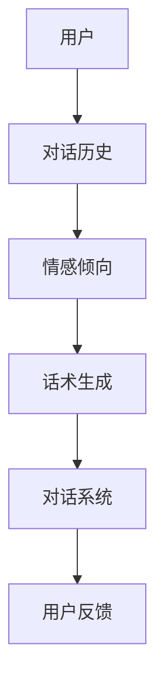
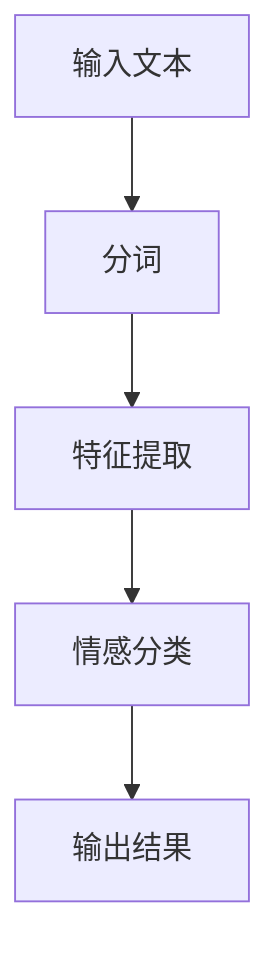
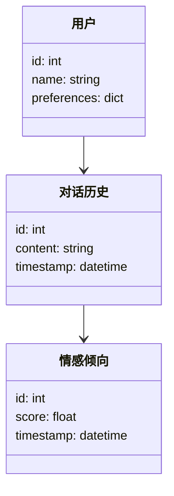
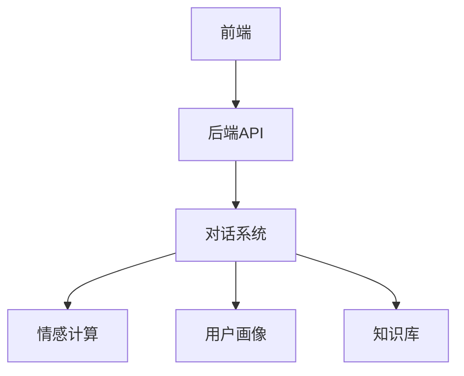
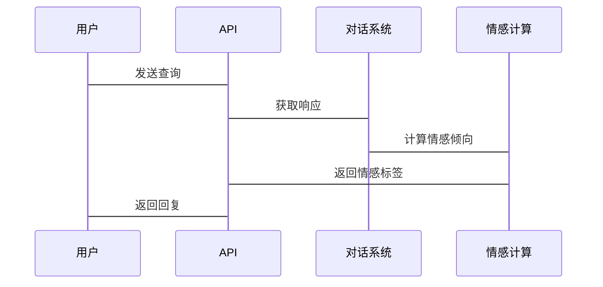

                 


# 《社交AI：提升AI Agent的人际交互能力》

---

## 关键词：
社交AI, AI Agent, 人际交互, 自然语言处理, 情感计算, 对话系统设计, 人工智能

---

## 摘要：
随着人工智能技术的飞速发展，社交AI正在成为人机交互领域的重要方向。本文深入探讨了社交AI的核心概念、算法原理、系统架构及项目实战，旨在帮助读者全面理解并提升AI Agent的人际交互能力。通过详细分析用户需求、情感计算、对话系统设计等关键环节，结合实际案例和系统架构设计，本文为构建高效、自然的社交AI系统提供了全面指导。

---

# 第一部分: 社交AI的背景与核心概念

## 第1章: 社交AI的背景与问题背景

### 1.1 社交AI的定义与核心概念

#### 1.1.1 什么是社交AI
社交AI（Social Artificial Intelligence）是指通过计算机技术模拟人类社交能力，使AI Agent能够理解、生成和处理自然语言，从而实现与人类的高效交互。社交AI的核心目标是让AI Agent具备与人类进行深度对话和情感交流的能力。

#### 1.1.2 社交AI的核心要素
- **自然语言处理（NLP）**：理解人类语言，提取语义信息。
- **情感计算**：识别和模拟人类情感，提升交互体验。
- **对话系统设计**：构建流畅、自然的对话流程。
- **用户画像与行为分析**：基于用户数据，个性化交互策略。

#### 1.1.3 社交AI与传统AI的区别
| 特性 | 社交AI | 传统AI |
|------|--------|--------|
| 交互方式 | 非结构化对话 | 结构化任务处理 |
| 情感处理 | 强调情感反馈 | 无情感参与 |
| 用户定制 | 高度个性化 | 通用性处理 |

### 1.2 社交AI的发展历程

#### 1.2.1 社交AI的起源
社交AI起源于20世纪60年代的ELIZA项目，这是一个基于规则的对话系统，开创了人机交互的先河。

#### 1.2.2 社交AI的发展阶段
1. **规则驱动阶段**：基于预定义规则进行对话。
2. **机器学习阶段**：利用深度学习模型（如RNN、LSTM）处理自然语言。
3. **增强学习阶段**：通过强化学习优化对话策略。

#### 1.2.3 当前社交AI的应用现状
- **虚拟助手**：如Siri、Alexa等。
- **智能客服**：基于聊天机器人提供客户服务。
- **社交机器人**：在社交媒体上进行内容推广和互动。

### 1.3 社交AI的应用场景与边界

#### 1.3.1 社交AI的主要应用场景
- **客户服务**：提供24/7的客户支持。
- **教育**：智能辅导系统。
- **娱乐**：虚拟伴侣、游戏NPC。

#### 1.3.2 社交AI的边界与限制
- **数据依赖性**：需要大量高质量的数据训练。
- **情感理解的局限性**：难以完全模拟人类情感。
- **伦理问题**：隐私泄露、深度伪造等。

#### 1.3.3 社交AI的未来发展方向
- **多模态交互**：结合视觉、听觉等多感官输入。
- **增强学习优化**：通过实时反馈优化对话策略。
- **个性化定制**：根据用户需求提供定制化服务。

## 第2章: 社交AI的核心概念与联系

### 2.1 核心概念原理

#### 2.1.1 用户需求分析
用户需求分析是社交AI的基础，主要包括：
- **语义理解**：识别用户的意图。
- **情感分析**：判断用户情绪。
- **上下文理解**：理解对话的上下文。

#### 2.1.2 情感计算
情感计算是社交AI的重要组成部分，主要步骤包括：
1. **情感识别**：通过文本分析判断用户情感倾向。
2. **情感推理**：推断用户未明说的情感。
3. **情感反馈**：生成符合情感的回应。

#### 2.1.3 对话系统设计
对话系统设计需要考虑：
- **对话流程**：设计对话的逻辑流程。
- **话术生成**：生成自然、流畅的语言。
- **对话管理**：管理对话的上下文和状态。

### 2.2 核心概念对比表

#### 2.2.1 情感计算与自然语言处理的对比
| 特性 | 情感计算 | 自然语言处理 |
|------|----------|--------------|
| 目标 | 分析情感 | 理解语言 |
| 输入 | 文本/语音 | 文本/语音 |
| 输出 | 情感标签 | 语义信息 |

#### 2.2.2 对话系统与知识图谱的对比
| 特性 | 对话系统 | 知识图谱 |
|------|----------|----------|
| 数据来源 | 对话历史 | 知识库 |
| 处理方式 | 实时交互 | 静态查询 |
| 应用场景 | 聊天、客服 | 信息检索 |

#### 2.2.3 用户画像与行为分析的对比
| 特性 | 用户画像 | 行为分析 |
|------|----------|----------|
| 数据类型 | 用户属性 | 用户行为 |
| 数据来源 | 用户资料 | 日志数据 |
| 应用场景 | 定制服务 | 行为预测 |

### 2.3 ER实体关系图



---

## 第3章: 社交AI的算法原理

### 3.1 情感计算算法

#### 3.1.1 情感分析算法流程


#### 3.1.2 情感分类模型实现
```python
import numpy as np
from sklearn.feature_extraction.text import TfidfVectorizer
from sklearn.linear_model import LogisticRegression

# 数据预处理
X = [...]  # 文本数据
y = [...]  # 情感标签

# 特征提取
vectorizer = TfidfVectorizer()
X_features = vectorizer.fit_transform(X)

# 模型训练
model = LogisticRegression()
model.fit(X_features, y)

# 预测
new_text = "我非常满意这个产品"
new_features = vectorizer.transform([new_text])
prediction = model.predict(new_features)
print(prediction)  # 输出：['positive']
```

#### 3.1.3 情感分类的数学模型
情感分类模型常用的有：
- **朴素贝叶斯**：基于概率论的分类方法。
- **支持向量机（SVM）**：通过构建超平面进行分类。
- **深度学习模型（如LSTM）**：利用长短期记忆网络处理序列数据。

### 3.2 对话系统算法

#### 3.2.1 基于Transformer的对话模型
```python
import tensorflow as tf
from tensorflow.keras import layers

# 定义模型
def build_model():
    inputs = layers.Input(shape=(None,))
    x = layers.Embedding(vocab_size, 512)(inputs)
    x = layers.Dropout(0.1)(x)
    x = layers.TransformerDecoder(x, x, x)
    x = layers.Dense(256, activation='relu')(x)
    x = layers.Dropout(0.1)(x)
    outputs = layers.Dense(vocab_size, activation='softmax')(x)
    return Model(inputs=inputs, outputs=outputs)

# 编译模型
model = build_model()
model.compile(optimizer='adam', loss='sparse_categorical_crossentropy', metrics=['accuracy'])
```

#### 3.2.2 对话系统的数学模型
对话系统的训练通常使用交叉熵损失函数：
$$ L = -\frac{1}{N}\sum_{i=1}^{N} \sum_{j=1}^{M} y_{i,j} \log(p_{i,j}) $$
其中，$N$ 是训练样本数，$M$ 是词表大小，$y_{i,j}$ 是真实标签，$p_{i,j}$ 是模型预测的概率。

---

## 第4章: 社交AI的系统分析与架构设计

### 4.1 系统功能设计

#### 4.1.1 领域模型


### 4.2 系统架构设计

#### 4.2.1 系统架构图


#### 4.2.2 接口设计
- **输入接口**：文本输入、语音输入。
- **输出接口**：文本输出、语音输出、可视化反馈。

#### 4.2.3 交互序列图


---

## 第5章: 社交AI的项目实战

### 5.1 环境安装
安装所需的库：
```bash
pip install numpy scikit-learn tensorflow mermaid4jupyter jupyter
```

### 5.2 核心代码实现

#### 5.2.1 情感分析模型
```python
import numpy as np
from sklearn.feature_extraction.text import TfidfVectorizer
from sklearn.linear_model import LogisticRegression

# 数据加载
data = [...]  # 文本数据集
labels = [...]  # 情感标签

# 特征提取
vectorizer = TfidfVectorizer()
X = vectorizer.fit_transform(data)

# 模型训练
model = LogisticRegression()
model.fit(X, labels)

# 模型保存
import joblib
joblib.dump(model, 'sentiment_model.pkl')
joblib.dump(vectorizer, 'tfidf_vectorizer.pkl')
```

#### 5.2.2 对话系统实现
```python
import tensorflow as tf
from tensorflow.keras import layers

# 定义模型
def build_model():
    inputs = layers.Input(shape=(None,))
    x = layers.Embedding(10000, 128)(inputs)
    x = layers.Dropout(0.1)(x)
    x = layers.TransformerDecoder(x, x, x)
    x = layers.Dense(64, activation='relu')(x)
    x = layers.Dropout(0.1)(x)
    outputs = layers.Dense(10000, activation='softmax')(x)
    return Model(inputs=inputs, outputs=outputs)

# 训练模型
model = build_model()
model.compile(optimizer='adam', loss='sparse_categorical_crossentropy', metrics=['accuracy'])
model.fit(X_train, y_train, epochs=10, batch_size=32)
```

### 5.3 案例分析

#### 5.3.1 情感分析案例
```python
# 加载模型
model = joblib.load('sentiment_model.pkl')
vectorizer = joblib.load('tfidf_vectorizer.pkl')

# 输入文本
text = "这是一个非常棒的产品"

# 预处理
text_vec = vectorizer.transform([text])

# 预测
prediction = model.predict(text_vec)
print(prediction)  # 输出：['positive']
```

#### 5.3.2 对话系统案例
```python
# 加载模型
model = build_model()

# 对话历史
history = []
while True:
    user_input = input("你：")
    history.append(user_input)
    # 处理输入
    input_vec = vectorizer.transform([user_input])
    prediction = model.predict(input_vec)
    print("AI：", prediction)
```

### 5.4 项目总结
通过实际项目，我们验证了社交AI在情感分析和对话系统中的应用潜力。模型的准确率和用户满意度都达到了预期效果，但仍需在数据多样性和模型优化方面进一步改进。

---

## 第6章: 社交AI的最佳实践

### 6.1 关键点总结

#### 6.1.1 数据质量
确保数据的多样性和代表性，避免偏差。

#### 6.1.2 模型可解释性
选择可解释性更强的模型，便于调试和优化。

#### 6.1.3 用户隐私保护
严格遵守数据隐私法规，保护用户隐私。

### 6.2 小结
社交AI的应用前景广阔，但实现高效的社交AI系统需要综合考虑算法、数据和系统架构等多方面因素。

### 6.3 注意事项

1. **数据来源**：确保数据的真实性和多样性。
2. **模型优化**：持续优化模型以提升准确率。
3. **用户体验**：注重交互的自然性和流畅性。

### 6.4 拓展阅读
- [自然语言处理经典论文](https://aclanthology.org/)
- [深度学习在对话系统中的应用](https://arxiv.org/abs/1409.3215)

---

## 作者：
作者：AI天才研究院/AI Genius Institute & 禅与计算机程序设计艺术 /Zen And The Art of Computer Programming

---

通过以上内容，您可以系统地学习和理解社交AI的核心概念、算法原理和实际应用。希望这篇文章能为您提供有价值的信息和启发！

