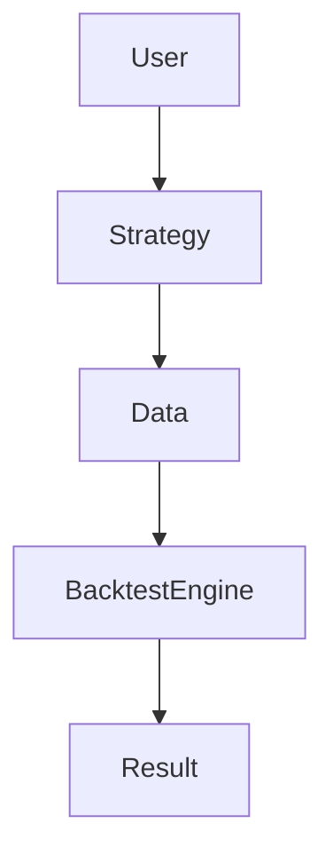
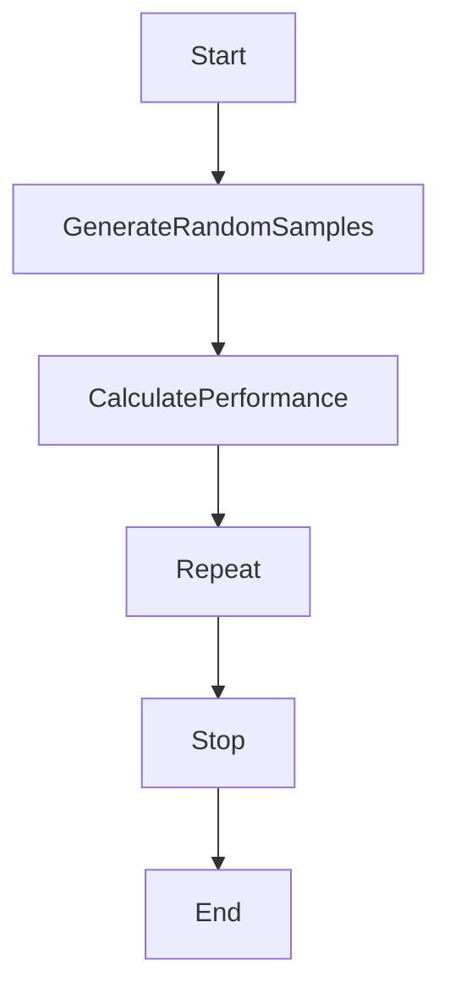
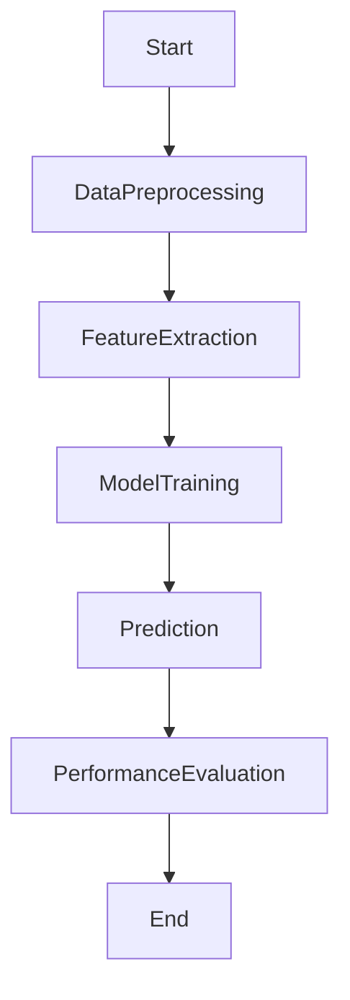
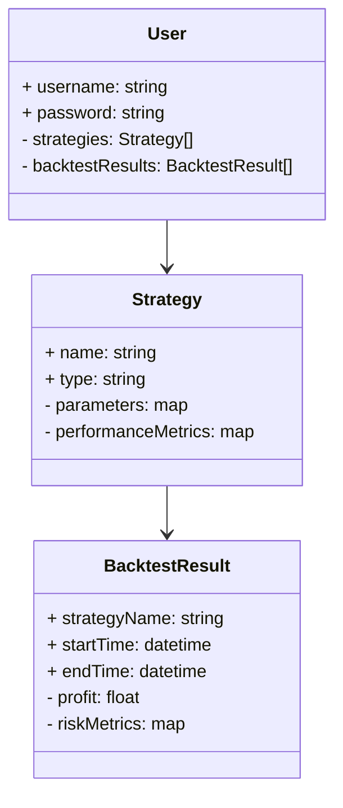
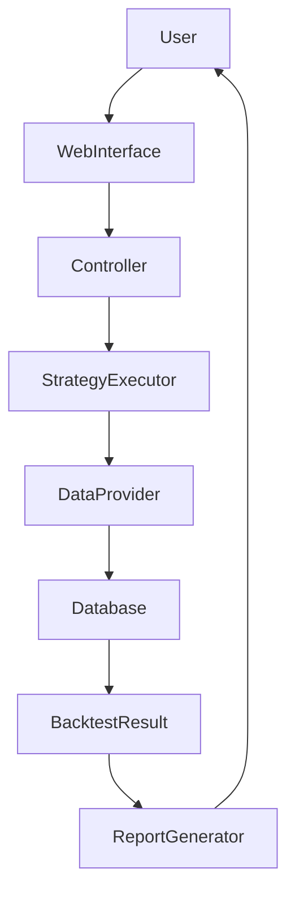
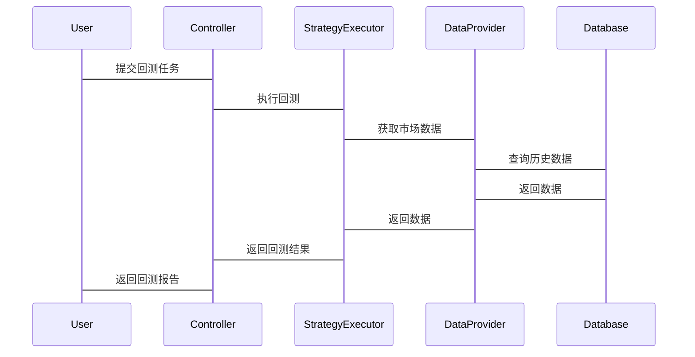

                 


# 《金融高频交易策略回测平台》

## 关键词：高频交易，回测平台，算法策略，系统架构，金融数据

## 摘要：  
本文详细探讨了金融高频交易策略回测平台的构建与实现。从高频交易的背景与特点出发，分析了回测平台在金融决策中的重要性。通过系统的架构设计、算法原理的深入剖析，结合实际项目实战，展示了如何高效地构建一个金融高频交易策略回测平台。文章内容涵盖数据处理、策略模型、回测引擎、结果分析等多个方面，并通过详细的代码实现与案例分析，为读者提供了从理论到实践的完整指导。

---

# 第一部分: 金融高频交易策略回测平台背景介绍

---

## 第1章: 高频交易与回测平台概述

### 1.1 高频交易的定义与特点

#### 1.1.1 高频交易的定义  
高频交易是指在极短时间内利用计算机算法进行大量交易的行为。其核心在于通过高速的数据处理和算法执行，捕捉市场中的微小价格波动，实现快速盈利。

#### 1.1.2 高频交易的核心特点  
- **高速性**：交易指令的生成和执行时间极短，通常以毫秒甚至微秒为单位。  
- **自动化**：交易策略由算法驱动，无需人工干预。  
- **高频性**：短时间内生成大量交易指令。  
- **低延迟**：依赖高效的硬件和网络，确保交易指令的快速传输和执行。

#### 1.1.3 高频交易的典型应用场景  
- 股票市场  
- 期货市场  
- 外汇市场  
- 加密货币市场  

---

### 1.2 回测平台的定义与作用

#### 1.2.1 回测平台的定义  
回测平台是一种用于测试和验证交易策略的工具，通过模拟历史市场数据，评估策略的收益、风险和稳定性。

#### 1.2.2 回测平台的核心作用  
- **策略验证**：通过历史数据测试交易策略的有效性。  
- **风险控制**：评估策略在不同市场条件下的表现，识别潜在风险。  
- **优化改进**：通过回测结果优化交易策略参数。  

#### 1.2.3 回测平台的边界与外延  
- **边界**：仅专注于策略的回测，不涉及实际交易执行。  
- **外延**：可以与实际交易系统集成，提供策略验证和优化支持。

---

### 1.3 金融高频交易策略回测平台的重要性

#### 1.3.1 高频交易策略的验证需求  
- 高频交易策略需要在极短时间内完成交易，因此需要通过回测验证其在不同市场条件下的表现。  

#### 1.3.2 回测平台在金融决策中的价值  
- 提供可靠的策略测试环境，降低实际交易的风险。  
- 通过历史数据模拟，优化交易策略的参数和逻辑。  

#### 1.3.3 回测平台的技术挑战与解决方案  
- **技术挑战**：高频交易对计算性能要求极高，需要高效的算法和低延迟的系统架构。  
- **解决方案**：采用分布式计算、并行处理和高速数据存储技术，确保回测平台的性能需求。

---

## 1.4 本章小结  
本章从高频交易的定义、特点和应用场景出发，分析了回测平台在金融高频交易中的重要性。同时，探讨了回测平台的技术挑战与解决方案，为后续章节的深入分析奠定了基础。

---

# 第二部分: 核心概念与联系

---

## 第2章: 金融高频交易策略回测的核心概念

### 2.1 高频交易策略的构成要素

#### 2.1.1 数据源与数据类型  
- **市场数据**：包括实时价格、订单簿、成交数据等。  
- **历史数据**：用于回测策略的模拟运行。  

#### 2.1.2 策略模型与算法  
- **时间序列分析**：如ARIMA模型、GARCH模型。  
- **机器学习算法**：如随机森林、神经网络。  

#### 2.1.3 执行引擎与交易平台  
- **执行引擎**：负责生成交易指令并提交至交易平台。  
- **交易平台**：如交易所API、经纪商系统。  

---

### 2.2 回测平台的系统架构

#### 2.2.1 数据采集模块  
- 负责从数据源获取市场数据，支持多种数据格式（如CSV、JSON）。  
- 数据预处理：清洗、标准化、特征提取。  

#### 2.2.2 回测引擎模块  
- 执行交易策略的模拟运行，计算收益、风险指标（如VaR、波动率）。  
- 支持多种回测模式：全样本回测、滚动回测、区间回测。  

#### 2.2.3 结果分析与可视化模块  
- 生成回测报告，包括绩效指标、风险指标、策略表现图表。  
- 可视化界面：支持用户交互，便于分析和优化策略。  

---

### 2.3 核心概念的ER实体关系图



---

### 2.4 核心概念属性特征对比表

| 属性       | 高频交易策略                   | 回测平台                       |
|------------|-------------------------------|-------------------------------|
| 数据源     | 市场数据、历史数据             | 数据采集、存储                 |
| 算法       | 时间序列分析、机器学习算法     | 回测引擎、结果分析             |
| 输出       | 交易指令、执行结果             | 绩效指标、风险指标             |

---

## 2.5 本章小结  
本章详细分析了高频交易策略的构成要素，介绍了回测平台的系统架构，并通过ER图和对比表展示了核心概念之间的关系。

---

# 第三部分: 算法原理讲解

---

## 第3章: 回测算法的核心原理

### 3.1 蒙特卡洛方法

#### 3.1.1 蒙特卡洛方法的原理  
- 通过随机采样模拟市场数据，评估交易策略的鲁棒性。  
- 公式：  
  $$ P(\text{事件发生}) = \frac{\text{事件发生次数}}{\text{总样本数}} $$  

#### 3.1.2 蒙特卡洛方法的流程  



---

### 3.2 机器学习算法在回测中的应用

#### 3.2.1 算法选择与实现  
- 使用随机森林预测市场趋势，生成交易信号。  
- 神经网络识别市场模式，优化交易策略参数。  

#### 3.2.2 算法流程图  



---

### 3.3 算法的数学模型与公式

#### 3.3.1 时间序列模型  
- ARIMA模型：  
  $$ y_t = \phi y_{t-1} + \theta \epsilon_t + \epsilon_{t-1} $$  

#### 3.3.2 机器学习模型  
- 线性回归模型：  
  $$ y = \beta_0 + \beta_1 x + \epsilon $$  

---

## 3.4 本章小结  
本章重点介绍了回测算法的核心原理，包括蒙特卡洛方法和机器学习算法的应用，并通过流程图和数学公式详细讲解了算法的实现过程。

---

# 第四部分: 系统分析与架构设计方案

---

## 第4章: 高频交易回测系统的分析与设计

### 4.1 问题场景介绍  
- 用户需要一个高效的回测平台，支持高频交易策略的快速验证和优化。  

### 4.2 项目介绍  
- 项目目标：构建一个支持高频交易策略回测的平台。  
- 项目范围：涵盖数据采集、策略执行、结果分析等功能。  

### 4.3 系统功能设计  

#### 4.3.1 领域模型（Mermaid类图）  



---

### 4.4 系统架构设计  

#### 4.4.1 系统架构（Mermaid架构图）  



---

### 4.5 系统接口设计  
- **数据接口**：提供API用于数据的读取和写入。  
- **策略接口**：支持多种策略的加载和执行。  
- **结果接口**：返回回测结果的性能指标和风险指标。  

---

### 4.6 系统交互流程（Mermaid序列图）  



---

## 4.7 本章小结  
本章通过系统分析和架构设计，展示了如何构建一个高效的高频交易回测平台。通过类图、架构图和交互图，详细描述了系统的各个模块及其交互方式。

---

# 第五部分: 项目实战

---

## 第5章: 回测平台的实现与案例分析

### 5.1 环境搭建

#### 5.1.1 安装Python与相关库  
- 安装Python 3.9+  
- 安装库：pandas、numpy、backtrader、matplotlib  

#### 5.1.2 安装依赖项  
- 数据库：MySQL、MongoDB  
- 开发工具：PyCharm、Jupyter Notebook  

---

### 5.2 系统核心实现源代码

#### 5.2.1 数据处理模块  

```python
import pandas as pd

def load_data(file_path):
    """加载数据"""
    df = pd.read_csv(file_path)
    return df

def preprocess_data(df):
    """数据预处理"""
    df = df.dropna()
    df['date'] = pd.to_datetime(df['date'])
    return df
```

#### 5.2.2 回测引擎模块  

```python
from backtrader import Strategy

class SimpleStrategy(Strategy):
    """简单交易策略"""
    def __init__(self):
        self.position = 0
        self.entry_price = 0

    def next(self):
        """策略逻辑"""
        if self.data.close > self.data.close.mean(5):
            self.position = self.buy()
            self.entry_price = self.data.close
        elif self.data.close < self.data.close.mean(5):
            if self.position:
                self.position.close()
```

#### 5.2.3 结果分析模块  

```python
import matplotlib.pyplot as plt

def plot_results(results):
    """绘制回测结果图表"""
    plt.figure(figsize=(10, 6))
    plt.plot(results, label='Strategy Performance')
    plt.xlabel('Time')
    plt.ylabel('Performance')
    plt.legend()
    plt.show()
```

---

### 5.3 代码应用解读与分析  
- 数据处理模块：加载和预处理市场数据，确保数据的可用性。  
- 回测引擎模块：实现交易策略的逻辑，根据市场数据生成交易信号。  
- 结果分析模块：绘制回测结果图表，评估策略的性能和风险。  

---

### 5.4 实际案例分析  

#### 5.4.1 案例背景  
假设我们有一个简单的动量策略，基于5天均线进行买卖决策。  

#### 5.4.2 案例实现  
```python
# 示例代码
data = load_data('data.csv')
processed_data = preprocess_data(data)
strategy = SimpleStrategy()
results = strategy.run_backtest(processed_data)
plot_results(results)
```

#### 5.4.3 案例分析  
- 策略在测试期间的表现如何？  
- 是否存在过度拟合的问题？  
- 如何优化策略参数以提高收益？  

---

### 5.5 项目小结  
本章通过实际项目实战，详细展示了回测平台的实现过程。从环境搭建到代码实现，再到案例分析，帮助读者掌握高频交易回测平台的核心技术。

---

# 第六部分: 最佳实践与总结

---

## 第6章: 最佳实践与注意事项

### 6.1 高频交易中的注意事项  
- 确保数据的实时性和准确性。  
- 优化算法的执行效率，降低延迟。  
- 注意交易成本和滑点的影响。  

### 6.2 回测平台的优化建议  
- 使用分布式计算提高回测效率。  
- 采用缓存技术减少数据访问延迟。  
- 定期更新策略模型，适应市场变化。  

---

### 6.3 小结与展望  
- **小结**：本文详细介绍了金融高频交易策略回测平台的构建与实现，从理论到实践，为读者提供了全面的指导。  
- **展望**：未来，随着人工智能和大数据技术的不断发展，高频交易回测平台将更加智能化和自动化。

---

## 作者：AI天才研究院/AI Genius Institute & 禅与计算机程序设计艺术/Zen And The Art of Computer Programming

