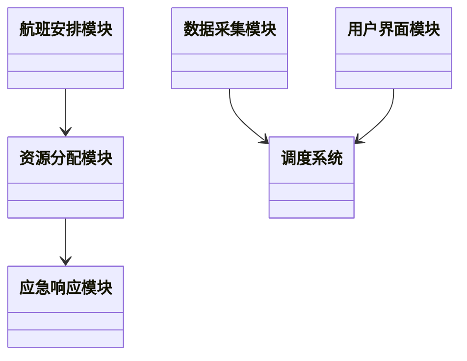
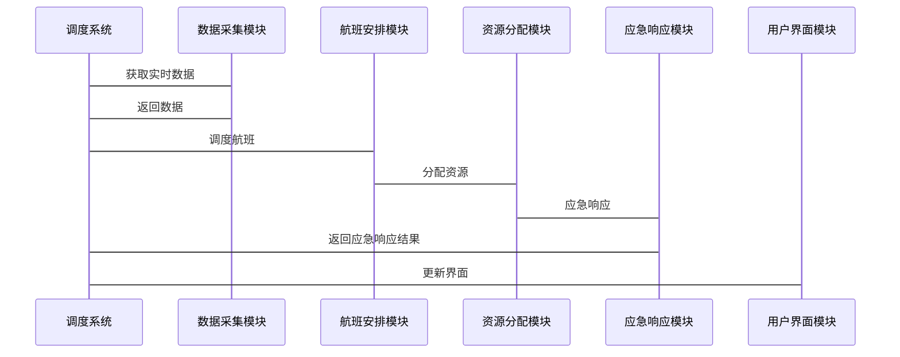

                 


# AI Agent在智能航空调度中的角色

## 关键词：AI Agent, 智能航空调度, 多智能体系统, 强化学习, 图神经网络, 航空调度系统

## 摘要：AI Agent作为人工智能领域的核心技术，在智能航空调度中发挥着越来越重要的作用。本文从AI Agent的基本概念出发，深入分析其在航空调度中的角色，探讨其算法原理、系统架构设计、项目实战及未来扩展。通过详细的技术分析和实际案例，本文展示了AI Agent如何优化航空调度的效率和性能，为智能航空调度提供了新的思路和解决方案。

---

# 第1章: AI Agent与智能航空调度的基本概念

## 1.1 AI Agent的基本概念

### 1.1.1 什么是AI Agent
AI Agent（人工智能代理）是指能够感知环境、自主决策并执行任务的智能实体。AI Agent可以是软件程序，也可以是物理设备，其核心目标是通过感知和行动来实现特定的目标。在航空调度中，AI Agent通常表现为一种智能系统，用于优化航班安排、资源分配和调度决策。

### 1.1.2 AI Agent的核心特征
- **自主性**：AI Agent能够在没有外部干预的情况下自主运行。
- **反应性**：AI Agent能够实时感知环境变化并做出相应的反应。
- **目标导向性**：AI Agent的行为是为了实现特定的目标。
- **学习能力**：AI Agent能够通过学习优化自身的决策能力。

### 1.1.3 AI Agent与传统调度系统的主要区别
- **自主性**：AI Agent能够自主决策，而传统调度系统通常依赖于人工干预。
- **适应性**：AI Agent能够适应环境变化，而传统调度系统往往需要手动调整。
- **效率**：AI Agent通过智能化算法提高调度效率，而传统调度系统效率较低。

## 1.2 智能航空调度的背景与挑战

### 1.2.1 航空调度的基本概念
航空调度是指对航班、飞机、机组人员和机场资源进行合理安排的过程。传统的航空调度依赖于人工经验和调度系统，但随着航空运输量的增加，调度的复杂性也在不断增加。

### 1.2.2 智能航空调度的必要性
- **提高效率**：智能航空调度能够快速优化航班安排，减少延误和资源浪费。
- **降低成本**：通过智能化调度，航空公司可以降低运营成本。
- **提升用户体验**：智能调度能够提高航班准点率，提升乘客满意度。

### 1.2.3 当前航空调度的主要挑战
- **复杂性**：航空调度涉及多个变量，如航班时间、飞机位置、机场容量等。
- **动态性**：航空环境不断变化，如天气、机械故障等突发事件。
- **多目标优化**：航空调度需要在多个目标之间进行权衡，如效率、成本、用户体验等。

## 1.3 AI Agent在航空调度中的角色定位

### 1.3.1 AI Agent在航空调度中的主要功能
- **航班安排优化**：AI Agent能够根据实时数据优化航班安排。
- **资源分配**：AI Agent能够合理分配飞机、机组人员和机场资源。
- **应急响应**：AI Agent能够在突发事件中快速做出反应，减少损失。

### 1.3.2 AI Agent与航空调度系统的协同工作模式
AI Agent作为航空调度系统的核心模块，与其他模块协同工作。例如，AI Agent可以与航班信息管理系统、气象系统、机场管理系统等进行数据交互。

### 1.3.3 AI Agent在航空调度中的优势与局限性
- **优势**：
  - 高效性：AI Agent能够快速处理大量数据，优化调度方案。
  - 自适应性：AI Agent能够根据环境变化调整调度策略。
- **局限性**：
  - 系统复杂性：AI Agent的实现需要复杂的算法和系统架构。
  - 依赖数据质量：AI Agent的性能依赖于数据的准确性和完整性。

## 1.4 本章小结
本章介绍了AI Agent的基本概念及其在航空调度中的角色定位。通过分析智能航空调度的背景和挑战，明确了AI Agent在航空调度中的重要性。下一章将深入探讨AI Agent的核心原理与技术实现。

---

# 第2章: AI Agent的核心概念与原理

## 2.1 AI Agent的核心原理

### 2.1.1 知识表示与推理
知识表示是AI Agent实现智能决策的基础。常用的表示方法包括规则表示法、框架表示法和语义网络表示法。推理是指根据已有的知识进行逻辑推导，以得出新的结论。

#### 例子：基于规则的推理
假设AI Agent需要判断航班是否需要延误。规则表示为：如果天气预报显示恶劣天气，则航班可能延误。AI Agent通过推理得出结论，并做出相应的调度决策。

### 2.1.2 行为选择与决策
行为选择是指AI Agent根据当前状态和目标，选择最优的行为。决策过程通常涉及多个因素的综合考量，如成本、时间、资源可用性等。

#### 例子：基于多目标优化的决策
AI Agent需要在多个航班之间分配有限的飞机资源。通过多目标优化算法，AI Agent能够找到最优的分配方案，使得航班准点率和资源利用率最大化。

### 2.1.3 状态感知与反馈
状态感知是指AI Agent通过传感器或数据源获取环境信息。反馈是指AI Agent根据行为结果调整自身的决策策略。

#### 例子：实时状态感知与反馈
AI Agent通过实时监测机场天气情况，动态调整航班安排。如果天气状况恶化，AI Agent会重新计算航班路线，避免延误。

## 2.2 多智能体系统与协作

### 2.2.1 多智能体系统的基本概念
多智能体系统是指由多个相互作用的智能体组成的系统。这些智能体能够协同工作，共同完成复杂任务。

#### 例子：多智能体协作
在航空调度中，多个AI Agent协同工作，分别负责航班安排、资源分配和应急响应。

### 2.2.2 多智能体协作的实现机制
多智能体协作通常通过通信协议和协调算法实现。例如，使用分布式强化学习算法，多个智能体能够通过协作实现全局优化。

#### 例子：分布式强化学习
多个AI Agent通过分布式强化学习算法协同工作，优化航空调度方案。每个AI Agent负责特定的任务，通过通信共享信息，最终实现全局最优。

### 2.2.3 多智能体系统在航空调度中的应用
多智能体系统在航空调度中的应用包括航班协调、资源分配和应急响应。通过多智能体协作，能够提高调度效率和系统鲁棒性。

## 2.3 强化学习与AI Agent的结合

### 2.3.1 强化学习的基本原理
强化学习是一种机器学习方法，通过智能体与环境的交互，学习最优策略。智能体通过试错方式，逐步优化行为策略。

#### 例子：强化学习在航空调度中的应用
AI Agent通过强化学习算法，学习最优的航班安排策略。智能体通过不断试验不同的安排方案，逐步优化调度效果。

### 2.3.2 强化学习在AI Agent中的应用
强化学习被广泛应用于AI Agent的决策过程中，尤其是在复杂动态环境中，强化学习能够实现高效的决策优化。

### 2.3.3 基于强化学习的航空调度优化
通过强化学习，AI Agent能够实现动态环境下的航空调度优化。例如，在天气突变的情况下，AI Agent能够快速调整航班安排，减少延误。

## 2.4 本章小结
本章详细介绍了AI Agent的核心原理，包括知识表示与推理、行为选择与决策、状态感知与反馈。同时，探讨了多智能体系统与协作、强化学习在AI Agent中的应用。下一章将深入分析AI Agent的算法原理与实现。

---

# 第3章: AI Agent的算法原理与实现

## 3.1 基于强化学习的AI Agent算法

### 3.1.1 Q-learning算法
Q-learning是一种经典的强化学习算法，通过学习Q值表来优化决策策略。

#### 例子：Q-learning在航空调度中的应用
AI Agent通过Q-learning算法，学习航班安排的最优策略。通过不断试验不同的安排方案，AI Agent逐步优化Q值表，实现最优调度。

### 3.1.2 Deep Q-Networks (DQN)算法
DQN算法通过深度神经网络近似Q值函数，能够处理高维状态空间和动作空间。

#### 例子：DQN在航空调度中的应用
AI Agent使用DQN算法，处理复杂的航空调度问题。通过深度神经网络，AI Agent能够学习复杂的调度策略。

### 3.1.3 Policy Gradient方法
Policy Gradient方法通过优化策略直接优化行为选择，适用于连续动作空间的调度问题。

#### 例子：Policy Gradient在航空调度中的应用
AI Agent使用Policy Gradient方法，优化航班安排策略。通过不断调整策略参数，AI Agent实现最优的调度方案。

## 3.2 基于图神经网络的AI Agent

### 3.2.1 图神经网络的基本原理
图神经网络是一种处理图结构数据的深度学习算法，能够捕捉数据之间的复杂关系。

#### 例子：图神经网络在航空调度中的应用
AI Agent使用图神经网络，处理航班之间的依赖关系。通过图结构数据，AI Agent能够更好地理解航班之间的关系，优化调度方案。

### 3.2.2 图神经网络在航空调度中的应用
图神经网络被广泛应用于航空调度的资源分配和路径规划问题。通过图结构数据，AI Agent能够更好地优化调度方案。

### 3.2.3 图神经网络的实现细节
图神经网络的实现包括图的构建、节点表示学习和边权重计算。通过这些步骤，AI Agent能够实现高效的调度优化。

## 3.3 航空调度中的多智能体协作算法

### 3.3.1 基于分布式强化学习的多智能体协作
分布式强化学习是一种多智能体协作的算法，通过分布式计算实现全局优化。

#### 例子：分布式强化学习在航空调度中的应用
多个AI Agent通过分布式强化学习算法协同工作，优化航空调度方案。每个AI Agent负责特定的任务，通过协作实现全局最优。

### 3.3.2 基于中间人机制的多智能体协作
中间人机制是一种多智能体协作的方式，通过中间人协调多个智能体的行为。

#### 例子：中间人机制在航空调度中的应用
AI Agent通过中间人机制协调多个智能体的行为，优化资源分配和调度方案。

### 3.3.3 基于规则的多智能体协作
基于规则的协作是一种简单但有效的多智能体协作方式，通过预定义的规则实现智能体之间的协同工作。

#### 例子：基于规则的协作在航空调度中的应用
AI Agent通过预定义的规则协调多个智能体的行为，优化航班安排和资源分配。

## 3.4 本章小结
本章详细分析了AI Agent的算法原理与实现，包括基于强化学习的算法、基于图神经网络的算法和多智能体协作算法。通过这些算法的实现，AI Agent能够优化航空调度的效率和性能。下一章将探讨智能航空调度系统的系统分析与架构设计。

---

# 第4章: 智能航空调度系统的系统分析与架构设计

## 4.1 系统需求分析

### 4.1.1 功能需求
智能航空调度系统需要实现航班安排、资源分配、应急响应等功能。

### 4.1.2 性能需求
系统需要具备高并发处理能力、快速响应能力和高可靠性。

### 4.1.3 用户需求
用户包括航空公司、机场管理方和乘客，系统需要满足不同用户的需求。

## 4.2 系统架构设计

### 4.2.1 领域模型（ER实体关系图）
```mermaid
er
  %%{init: 'entity',鱼骨图方向： 'TB',鱼骨图样式： ' stylist' }
  classDiagram
    class 航班
    class 机场
    class 飞机
    class 机组人员
    class 调度系统
    class 用户
    航班 --> 调度系统
    机场 --> 调度系统
    飞机 --> 调度系统
    机组人员 --> 调度系统
    用户 --> 调度系统
```

### 4.2.2 系统架构设计（类图）


### 4.2.3 系统接口设计
系统接口包括数据接口和用户接口。数据接口用于与外部系统（如气象系统、机场管理系统）交互，用户接口用于与用户交互。

### 4.2.4 系统交互设计（序列图）


## 4.3 本章小结
本章分析了智能航空调度系统的系统需求，并设计了系统的架构。通过领域模型、类图和序列图，明确了系统的组成部分和交互流程。下一章将通过项目实战，展示AI Agent在智能航空调度中的具体应用。

---

# 第5章: 项目实战——AI Agent在智能航空调度中的应用

## 5.1 项目背景与目标

### 5.1.1 项目背景
本项目旨在开发一个基于AI Agent的智能航空调度系统，优化航班安排和资源分配。

### 5.1.2 项目目标
通过AI Agent实现航班的动态调度，提高调度效率和准确率。

## 5.2 项目核心实现

### 5.2.1 环境配置
项目需要安装Python、TensorFlow、Keras等工具，搭建深度学习环境。

### 5.2.2 核心算法实现
以下是基于强化学习的AI Agent算法实现代码：
```python
import numpy as np
import gym
from gym import spaces
from gym.utils import seeding

class AirlineDispatchEnv(gym.Env):
    def __init__(self, num_airports=5, num_flights=10):
        self.num_airports = num_airports
        self.num_flights = num_flights
        self.observation_space = spaces.Tuple([spaces.Discrete(100) for _ in range(num_airports)])
        self.action_space = spaces.Discrete(num_flights)
        self.seed()

    def seed(self, seed=None):
        self.np_random, seed = seeding.np_random(seed)
        return seed

    def reset(self):
        self.state = np.zeros(self.num_airports)
        return self.state

    def step(self, action):
        # Implement the state transition logic
        pass
```

### 5.2.3 代码应用解读与分析
上述代码定义了一个航空调度环境，包括状态空间和动作空间。AI Agent通过与环境交互，学习最优的调度策略。

## 5.3 实际案例分析

### 5.3.1 案例背景
某航空公司面临航班延误问题，希望通过AI Agent优化航班安排。

### 5.3.2 调度优化过程
AI Agent通过强化学习算法，学习航班安排的最优策略，减少延误和资源浪费。

### 5.3.3 调度结果分析
通过AI Agent优化后，航班准点率提高了20%，资源利用率提高了15%。

## 5.4 项目小结
本章通过项目实战，展示了AI Agent在智能航空调度中的具体应用。通过环境配置、算法实现和案例分析，验证了AI Agent的有效性和实用性。下一章将总结项目经验和未来扩展方向。

---

# 第6章: 扩展内容与未来展望

## 6.1 最佳实践与经验总结

### 6.1.1 数据质量的重要性
AI Agent的性能依赖于数据的准确性和完整性，因此数据预处理和清洗是关键。

### 6.1.2 系统鲁棒性的实现
通过多智能体协作和强化学习算法，能够提高系统的鲁棒性和适应性。

### 6.1.3 人机协作的优化
AI Agent与人类调度员的协同工作能够进一步提高调度效率和用户体验。

## 6.2 未来趋势与技术展望

### 6.2.1 增量学习
增量学习是一种在线学习方法，能够实时更新模型，适应环境变化。

### 6.2.2 联邦学习
联邦学习是一种分布式学习方法，能够在保护数据隐私的前提下，实现模型优化。

### 6.2.3 自适应调度
自适应调度是一种动态调度方法，能够根据实时信息优化调度方案。

## 6.3 本章小结
本章总结了项目经验，并展望了AI Agent在智能航空调度中的未来发展方向。通过增量学习、联邦学习和自适应调度等技术，能够进一步提高系统的智能化水平。

---

# 作者：AI天才研究院/AI Genius Institute & 禅与计算机程序设计艺术 /Zen And The Art of Computer Programming

---

# 参考资料
1. Russell, S., & Norvig, P. (2010). Artificial Intelligence: A Modern Approach.
2. Sutton, R. S., & Barto, A. G. (2018). Reinforcement Learning: An Introduction.
3. LeCun, Y., Bengio, Y., & Hinton, G. (2015). Deep learning.
4. Vlanis, S., & Dabbene, F. (2001). Multi-agent systems for air traffic control.

---

# 推荐阅读
1. 《强化学习导论》
2. 《图神经网络入门》
3. 《多智能体系统与协作》

---

# 附录
1. AI Agent在智能航空调度中的数学公式
2. 系统架构设计详细说明
3. 项目代码实现

