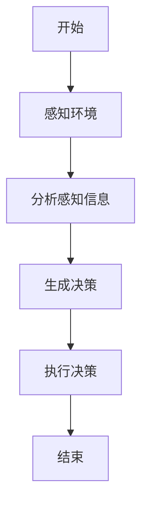
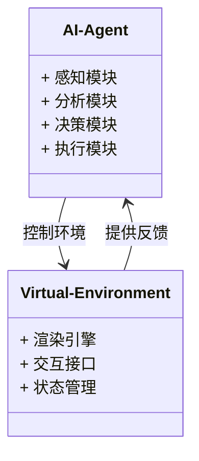
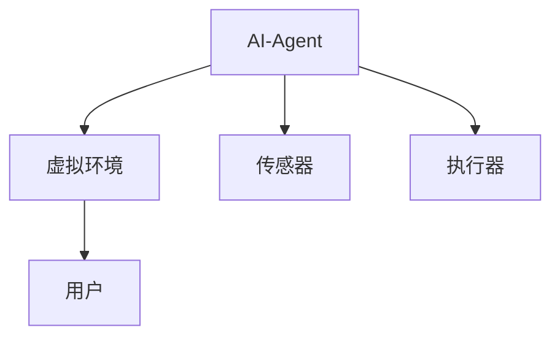

                 


# AI Agent在虚拟现实中的应用：沉浸式体验增强

> 关键词：AI Agent，虚拟现实，沉浸式体验，智能交互，系统架构，项目实战

> 摘要：本文探讨了AI Agent在虚拟现实中的应用，重点分析了如何通过AI Agent提升沉浸式体验。从AI Agent的基本原理到系统架构设计，再到项目实战，全面解析了AI Agent在虚拟现实中的技术实现与应用场景。

---

## 第一部分：AI Agent与虚拟现实概述

### 第1章：AI Agent与虚拟现实的背景介绍

#### 1.1 AI Agent的基本概念

##### 1.1.1 AI Agent的定义与特点
AI Agent（人工智能代理）是指能够感知环境、自主决策并执行任务的智能实体。其特点包括：
- **自主性**：能够在没有外部干预的情况下独立运作。
- **反应性**：能够实时感知环境并做出反应。
- **学习能力**：通过数据和经验不断优化自身行为。
- **社交能力**：能够与其他AI Agent或人类进行有效交互。

##### 1.1.2 虚拟现实的基本概念与技术特点
虚拟现实（VR）是一种能够提供沉浸式体验的技术，通过模拟三维环境，让用户获得身临其境的感受。其技术特点包括：
- **沉浸性**：用户能够完全沉浸在虚拟环境中。
- **交互性**：用户可以通过设备与虚拟环境进行实时交互。
- **实时渲染**：高帧率渲染确保用户体验流畅。

##### 1.1.3 AI Agent与虚拟现实的结合背景
随着技术的进步，虚拟现实的沉浸式体验需求日益增长，而AI Agent的智能性为其实现提供了新的可能性。通过结合AI Agent，虚拟现实系统能够提供更加智能化、个性化的交互体验。

#### 1.2 沉浸式体验的定义与重要性

##### 1.2.1 沉浸式体验的核心要素
沉浸式体验是指用户在虚拟环境中感受到的高度真实感和深度参与感。其核心要素包括：
- **视觉效果**：高分辨率和逼真的图形渲染。
- **听觉效果**：立体声音效提升用户的沉浸感。
- **触觉反馈**：通过设备提供真实的触感反馈。
- **智能交互**：AI Agent提供的智能化服务增强用户体验。

##### 1.2.2 虚拟现实如何提升沉浸式体验
虚拟现实通过模拟真实环境，使用户能够在虚拟空间中进行自然交互，从而提升沉浸感。例如，在游戏、教育和培训等领域，虚拟现实能够为用户提供更加真实和丰富的体验。

##### 1.2.3 AI Agent在沉浸式体验中的作用
AI Agent在虚拟现实中的作用主要体现在以下几个方面：
- **智能交互**：通过自然语言处理和机器学习，AI Agent能够与用户进行更自然的对话。
- **个性化服务**：根据用户的行为和偏好，AI Agent能够提供个性化的推荐和指导。
- **环境适应**：AI Agent能够实时调整虚拟环境，以适应用户的需求和行为。

---

### 第2章：AI Agent在虚拟现实中的应用价值

#### 2.1 AI Agent的核心功能与应用场景

##### 2.1.1 AI Agent在虚拟现实中的核心功能
AI Agent在虚拟现实中的核心功能包括：
- **环境感知**：通过传感器和摄像头感知虚拟环境的变化。
- **用户行为分析**：分析用户的动作和行为，预测用户的意图。
- **智能决策**：基于感知和分析结果，做出最优决策。
- **交互执行**：通过虚拟环境中的动作或声音反馈执行决策。

##### 2.1.2 AI Agent在虚拟现实中的典型应用场景
AI Agent在虚拟现实中的典型应用场景包括：
- **虚拟助手**：在虚拟环境中为用户提供信息查询、任务管理和个性化推荐服务。
- **智能NPC**：在游戏中，AI Agent可以模拟非玩家角色的行为，提升游戏的互动性和趣味性。
- **教育培训**：在教育和培训场景中，AI Agent可以作为虚拟导师，为用户提供个性化的学习指导。

##### 2.1.3 AI Agent如何提升用户体验
通过提供智能化的交互服务，AI Agent能够显著提升虚拟现实的用户体验：
- **提高效率**：AI Agent能够快速响应用户需求，减少用户的等待时间。
- **增强互动性**：AI Agent通过智能交互，使用户在虚拟环境中感受到更加真实的互动。
- **个性化体验**：AI Agent能够根据用户的偏好和行为，提供个性化的服务，提升用户的满意度。

#### 2.2 虚拟现实中的沉浸式体验增强

##### 2.2.1 沉浸式体验的实现技术
沉浸式体验的实现技术包括：
- **高精度渲染**：使用光线追踪等技术提升画面的逼真度。
- **实时语音合成**：通过AI技术生成自然的语音反馈。
- **触觉反馈技术**：通过力反馈设备提供真实的触感体验。

##### 2.2.2 AI Agent在沉浸式体验中的创新应用
AI Agent在沉浸式体验中的创新应用包括：
- **动态环境调整**：根据用户的实时行为和反馈，动态调整虚拟环境的光照、音效等元素。
- **个性化内容推荐**：基于用户的兴趣和行为，推荐适合的内容，如游戏关卡、教育课程等。
- **智能情感交互**：通过情感计算技术，AI Agent能够识别用户的情绪，并做出相应的反馈。

##### 2.2.3 沉浸式体验的未来发展趋势
沉浸式体验的未来发展趋势包括：
- **多感官融合**：通过整合视觉、听觉、触觉等多种感官体验，进一步提升沉浸感。
- **AI Agent的智能化升级**：通过深度学习和强化学习，提升AI Agent的自主决策能力和交互能力。
- **虚拟与现实的无缝融合**：通过混合现实（MR）技术，实现虚拟与现实世界的无缝连接。

---

## 第二部分：AI Agent的核心技术与原理

### 第3章：AI Agent的核心概念与原理

#### 3.1 AI Agent的基本原理

##### 3.1.1 AI Agent的感知与决策机制
AI Agent的感知与决策机制包括：
- **感知**：通过传感器、摄像头等设备获取环境信息。
- **分析**：利用机器学习算法对感知信息进行分析和理解。
- **决策**：基于分析结果，生成最优的行动方案。

##### 3.1.2 AI Agent的学习与进化能力
AI Agent的学习与进化能力主要体现在：
- **监督学习**：通过标注数据进行训练，提升分类和回归能力。
- **无监督学习**：通过聚类等技术发现数据中的隐含模式。
- **强化学习**：通过与环境的交互，学习最优策略。

##### 3.1.3 AI Agent的交互与执行过程
AI Agent的交互与执行过程包括：
- **用户输入**：通过语音、手势等方式接收用户的指令。
- **响应生成**：基于用户的输入，生成相应的反馈或行动。
- **执行**：通过虚拟环境中的动作或声音反馈执行决策。

#### 3.2 AI Agent的核心算法与技术

##### 3.2.1 机器学习算法
机器学习算法是AI Agent的核心技术之一，主要包括：
- **监督学习**：如支持向量机（SVM）、随机森林等。
- **无监督学习**：如k-means聚类、t-SNE等。
- **强化学习**：如Q-learning、Deep Q-Network（DQN）等。

##### 3.2.2 自然语言处理技术
自然语言处理技术（NLP）在AI Agent中的应用包括：
- **文本理解**：通过词袋模型、TF-IDF等技术理解用户输入的文本。
- **文本生成**：通过生成式模型（如GPT）生成自然的文本反馈。
- **对话管理**：通过对话树或状态机管理对话流程。

##### 3.2.3 计算机视觉技术
计算机视觉技术在AI Agent中的应用包括：
- **图像识别**：通过卷积神经网络（CNN）识别图像中的物体和场景。
- **目标检测**：通过区域建议网络（RPN）和Faster R-CNN等技术定位图像中的目标。
- **视频处理**：通过视频流处理技术实现实时的视频分析。

#### 3.3 AI Agent的系统架构与设计

##### 3.3.1 系统架构设计
AI Agent的系统架构设计包括以下几个模块：
- **感知模块**：负责获取环境信息。
- **分析模块**：对感知信息进行分析和理解。
- **决策模块**：基于分析结果生成决策。
- **执行模块**：通过虚拟环境中的动作或声音反馈执行决策。

##### 3.3.2 实体关系图（ER图）
以下是AI Agent与虚拟现实环境的实体关系图：

```mermaid
erd
    actor User
    actor AI-Agent
    actor Virtual-Environment
    actor Feedback-System

    User --> AI-Agent: 提供输入
    AI-Agent --> Virtual-Environment: 控制环境
    Virtual-Environment --> Feedback-System: 提供反馈
    Feedback-System --> AI-Agent: 提供反馈
```

---

### 第4章：AI Agent在虚拟现实中的算法实现

#### 4.1 算法原理与流程图

##### 4.1.1 算法原理
以下是AI Agent在虚拟现实中的算法原理：



##### 4.1.2 算法实现代码
以下是AI Agent的核心算法实现代码：

```python
class AI-Agent:
    def __init__(self):
        self.sensors = []
        self.effectors = []
    
    def perceive(self):
        # 获取环境信息
        return [s感知结果 for s in self.sensors]
    
    def analyze(self, 环境信息):
        # 分析环境信息
        return 分析结果
    
    def decide(self, 分析结果):
        # 生成决策
        return 决策
    
    def act(self, 决策):
        # 执行决策
        [e执行动作 for e in self.effectors]
```

#### 4.2 算法优化与改进

##### 4.2.1 算法优化
通过强化学习优化AI Agent的决策能力：

```python
class DQN-Agent:
    def __init__(self):
        self.model = 深度神经网络
        self.memory = 经验回放池
        self.gamma = 折扣因子
    
    def act(self, 状态):
        # 选择动作
        return self.model.predict(状态)
    
    def remember(self, 状态, 动作, 奖励, 下一状态):
        # 存储经验
        self.memory.add(经验)
    
    def replay(self):
        # 回放经验
        mini-batch = self.memory.sample()
        self.model.fit(mini-batch)
```

##### 4.2.2 算法改进
通过多模态学习提升AI Agent的感知能力：

```python
class Multi-modal-Agent:
    def __init__(self):
        self.vision_model = 视觉模型
        self.hearing_model = 听觉模型
        self.smell_model = 嗅觉模型
    
    def perceive(self, 环境输入):
        # 多模态感知
        视觉特征 = self.vision_model.extract(环境输入)
        听觉特征 = self.hearing_model.extract(环境输入)
        嗅觉特征 = self.smell_model.extract(环境输入)
        return 综合特征
```

---

## 第三部分：AI Agent在虚拟现实中的系统设计与实现

### 第5章：系统设计与架构

#### 5.1 系统功能设计

##### 5.1.1 功能模块划分
以下是AI Agent在虚拟现实中的功能模块划分：



#### 5.2 系统架构设计

##### 5.2.1 系统架构图
以下是AI Agent与虚拟现实系统的架构图：



#### 5.3 系统接口设计

##### 5.3.1 接口设计
以下是AI Agent与虚拟环境的接口设计：

```python
interface VirtualEnvironment {
    def update(决策):
        # 更新虚拟环境
        pass
    def get_feedback():
        # 获取反馈
        pass
}
```

#### 5.4 系统交互流程图

##### 5.4.1 交互流程图
以下是AI Agent与用户的交互流程图：

```mermaid
graph TD
    User --> AI-Agent: 提供输入
    AI-Agent --> Virtual-Environment: 控制环境
    Virtual-Environment --> AI-Agent: 提供反馈
    AI-Agent --> User: 提供输出
```

---

### 第6章：项目实战

#### 6.1 项目介绍

##### 6.1.1 项目背景
本项目旨在通过AI Agent提升虚拟现实中的沉浸式体验，实现智能化的用户交互。

##### 6.1.2 项目目标
- 实现AI Agent在虚拟现实中的智能交互。
- 提升用户的沉浸式体验。

#### 6.2 核心实现

##### 6.2.1 环境搭建
以下是项目环境搭建步骤：

```bash
# 安装必要的库
pip install numpy
pip install tensorflow
pip install pygame
```

##### 6.2.2 核心代码实现
以下是AI Agent的核心代码实现：

```python
class VR-Agent:
    def __init__(self):
        self.model = 深度神经网络模型
        self.env = 虚拟环境实例
    
    def run(self):
        while True:
            状态 = self.env.get_state()
            动作 = self.model.predict(状态)
            self.env.execute_action(动作)
```

##### 6.2.3 代码应用解读
通过上述代码，AI Agent能够实时感知虚拟环境的状态，生成相应的动作，并通过虚拟环境实例执行这些动作，从而实现智能化的用户交互。

#### 6.3 实际案例分析

##### 6.3.1 案例分析
以下是一个具体的案例分析：

- **案例背景**：在虚拟现实游戏中，AI Agent作为NPC（非玩家角色）与玩家进行互动。
- **案例实现**：AI Agent通过感知玩家的行为和环境变化，动态调整NPC的行为模式，提升游戏的趣味性和互动性。

##### 6.3.2 案例小结
通过上述案例，AI Agent在虚拟现实中的应用能够显著提升用户体验，同时降低开发者的实现难度。

---

## 第四部分：拓展与未来展望

### 第7章：AI Agent与虚拟现实的未来发展方向

#### 7.1 当前技术的局限性与挑战

##### 7.1.1 技术局限性
- **计算资源需求**：复杂的AI算法需要大量的计算资源。
- **数据隐私问题**：用户数据的隐私保护是一个重要挑战。

##### 7.1.2 应用挑战
- **实时性要求**：虚拟现实对实时性要求较高，AI Agent需要快速响应。
- **多模态融合**：如何有效融合多种感官体验是一个技术难题。

#### 7.2 未来发展方向

##### 7.2.1 技术创新
- **更高效的算法**：开发更高效的算法，降低计算资源需求。
- **多模态融合**：通过多模态技术提升沉浸式体验。

##### 7.2.2 应用场景拓展
- **教育领域**：通过虚拟现实与AI Agent的结合，提供个性化的学习体验。
- **医疗领域**：在虚拟环境中模拟手术过程，提供实时的AI指导。

#### 7.3 最佳实践与注意事项

##### 7.3.1 最佳实践
- **模块化设计**：将系统设计模块化，便于维护和扩展。
- **数据安全**：重视用户数据的隐私保护，确保数据安全。

##### 7.3.2 注意事项
- **性能优化**：在实现过程中，注意性能优化，确保系统的流畅运行。
- **用户体验**：始终以用户体验为核心，不断优化交互设计。

---

## 结语

AI Agent在虚拟现实中的应用为沉浸式体验的提升提供了新的可能性。通过结合AI Agent的智能性与虚拟现实的沉浸性，用户能够获得更加丰富和个性化的体验。未来，随着技术的不断进步，AI Agent在虚拟现实中的应用将更加广泛和深入，为用户带来更加智能化和个性化的服务。

---

## 作者：AI天才研究院/AI Genius Institute & 禅与计算机程序设计艺术 /Zen And The Art of Computer Programming

