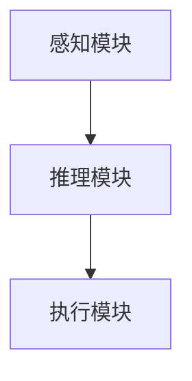

                 


# AI Agent的few-shot学习能力实现

> 关键词：AI Agent, few-shot学习, 元学习, 系统架构, 技术实现

> 摘要：本文深入探讨了AI Agent实现few-shot学习能力的核心原理、算法设计和系统架构。通过分析few-shot学习的关键技术，如元学习、基于度量的算法和生成模型，结合AI Agent的感知与决策机制，提出了一个高效的系统架构设计方案。同时，通过具体案例分析，详细讲解了实现过程和应用前景，为读者提供了全面的技术指南。

---

## 第1章: AI Agent与few-shot学习概述

### 1.1 AI Agent的基本概念

#### 1.1.1 AI Agent的定义
AI Agent（智能体）是指能够感知环境、采取行动以实现目标的实体。它可以是一个软件程序或物理设备，通过与环境交互来完成特定任务。

#### 1.1.2 AI Agent的核心特征
- **自主性**：能够在没有外部干预的情况下自主决策。
- **反应性**：能够实时感知环境并做出反应。
- **目标导向**：所有行为都以实现特定目标为导向。
- **学习能力**：能够通过经验或数据提升自身的性能。

#### 1.1.3 AI Agent的应用场景
- 智能助手（如Siri、Alexa）。
- 自动驾驶系统。
- 智能推荐系统。
- 智能监控系统。

### 1.2 few-shot学习的定义与特点

#### 1.2.1 few-shot学习的定义
few-shot学习是指在仅有少量样本的情况下，学习模型能够快速适应新任务的能力。与传统机器学习需要大量数据不同，few-shot学习通过利用已有的知识和经验，减少对新数据的依赖。

#### 1.2.2 few-shot学习与传统学习的区别
| 特性         | 传统机器学习                     | few-shot学习                     |
|--------------|----------------------------------|----------------------------------|
| 数据需求     | 需要大量标注数据                 | 仅需要少量样本                   |
| 适应能力     | 适应特定任务，需要重新训练       | 能够快速适应新任务               |
| 应用场景     | 图像分类、自然语言处理           | 小样本数据场景、实时应用         |

#### 1.2.3 few-shot学习的优势与挑战
- **优势**：
  - 适用于数据 scarce 的场景。
  - 节省数据收集和标注的成本。
  - 提高模型的灵活性和适应性。
- **挑战**：
  - 模型的泛化能力有限。
  - 对噪声数据的处理能力不足。
  - 需要高效的算法设计。

### 1.3 AI Agent与few-shot学习的结合

#### 1.3.1 AI Agent的智能性需求
AI Agent需要具备快速学习和适应新任务的能力，以应对复杂多变的环境。

#### 1.3.2 few-shot学习在AI Agent中的作用
通过few-shot学习，AI Agent可以在没有大量数据的情况下，快速掌握新任务的规律和模式。

#### 1.3.3 few-shot学习如何提升AI Agent的能力
- 提高决策的准确性。
- 增强环境适应能力。
- 降低对大数据的依赖。

---

## 第2章: few-shot学习的核心概念与原理

### 2.1 few-shot学习的核心概念

#### 2.1.1 元学习（Meta-Learning）
元学习是一种通过学习如何学习的方法，目的是让模型能够快速适应新任务。例如，Meta-LSTM通过在多个任务上进行训练，能够在新任务上快速调整模型参数。

#### 2.1.2 少样本分类（Few-shot Classification）
少样本分类是指在仅有少量样本的情况下，对新类别进行分类。例如，使用支持向量数据挖掘（SVM）在仅有几个样本的情况下进行分类。

#### 2.1.3 知识表示与推理
知识表示是将知识以某种形式存储起来，以便计算机能够理解和推理。例如，使用图结构表示知识，节点表示实体，边表示关系。

### 2.2 few-shot学习的原理

#### 2.2.1 基于度量的few-shot学习
基于度量的few-shot学习通过计算样本之间的相似性来分类。例如，Siamese网络通过比较两个样本的特征向量，计算它们之间的距离。

- **Siamese网络结构**：
  - 输入两个样本，分别通过相同的网络提取特征。
  - 使用Triplet损失函数优化特征向量，使同类样本距离近，不同类样本距离远。

#### 2.2.2 基于生成模型的few-shot学习
基于生成模型的few-shot学习通过生成更多的样本来增强模型的泛化能力。例如，生成对抗网络（GAN）可以生成新的样本，增加训练数据量。

- **生成对抗网络（GAN）**：
  - 对抗网络由生成器和判别器组成。
  - 生成器生成新的样本，判别器判断样本是真实还是生成的。
  - 通过不断迭代优化生成器和判别器的参数，生成逼真的样本。

#### 2.2.3 基于图结构的few-shot学习
基于图结构的few-shot学习利用图神经网络（GNN）进行特征提取和分类。例如，使用图注意力机制关注重要的节点特征。

- **图神经网络（GNN）**：
  - 节点表示：将每个节点的特征表示为一个向量。
  - 边关系：通过边权重表示节点之间的关系。
  - 图结构：节点之间的连接方式决定了特征传播的方向和权重。

### 2.3 few-shot学习的关键技术

#### 2.3.1 迁移学习
迁移学习是通过将一个领域学到的知识应用到另一个领域。例如，将图像分类任务中学到的知识应用到相似的任务中。

#### 2.3.2 零样本学习（Zero-shot Learning）
零样本学习是指在没有训练数据的情况下，通过元数据或属性进行分类。例如，通过物体的属性（如颜色、形状）进行分类。

#### 2.3.3 对抗学习
对抗学习是通过两个模型相互对抗来优化性能。例如，生成对抗网络通过生成器和判别器的对抗来生成高质量的样本。

---

## 第3章: few-shot学习的算法原理

### 3.1 基于度量的few-shot学习算法

#### 3.1.1 Siamese网络
Siamese网络是一种用于度量学习的双输入网络，用于比较两个样本的相似性。

- **Siamese网络结构**：
  - 输入两个样本，分别通过相同的网络提取特征。
  - 使用对比损失函数优化特征向量。

#### 3.1.2 Triplet损失函数
Triplet损失函数用于优化特征向量，使同类样本距离近，不同类样本距离远。

- **Triplet损失函数公式**：
  $$ L = \max(0, d(x_i, x_j) - d(x_i, x_k)) $$

#### 3.1.3 度量学习的数学模型
度量学习的目标是学习一个距离函数，使得同类样本的距离小于不同类样本的距离。

- **度量学习目标函数**：
  $$ \min_{d} \sum_{i<j} [d(x_i, x_j) - d(x_i, x_k)] $$

### 3.2 基于生成模型的few-shot学习

#### 3.2.1 变分自编码器（VAE）
变分自编码器是一种生成模型，通过最大化似然函数来生成样本。

- **VAE损失函数**：
  $$ \mathcal{L} = \mathbb{E}_{x}[ \log p(x|z)] + \mathbb{E}_z[\log q(z|x)] $$

#### 3.2.2 生成对抗网络（GAN）
生成对抗网络由生成器和判别器组成，通过对抗训练生成样本。

- **判别器损失函数**：
  $$ \mathcal{L}_D = -\mathbb{E}_{x \sim p_0(x)}[\log D(x)] - \mathbb{E}_{z}[ \log(1 - D(G(z)))] $$
- **生成器损失函数**：
  $$ \mathcal{L}_G = -\mathbb{E}_z[ \log D(G(z))] $$

#### 3.2.3 图生成网络（Graph Generative Networks）
图生成网络通过学习图的结构来生成新的图数据。

- **图生成网络目标函数**：
  $$ \mathcal{L} = \sum_{i=1}^n \log p_{\theta}(A_{ij} | \text{其他节点}) $$

### 3.3 基于图结构的few-shot学习

#### 3.3.1 图神经网络（GNN）
图神经网络通过聚合节点特征和边关系来生成节点表示。

- **GNN聚合函数**：
  $$ h_i^{(l+1)} = \sigma(\sum_{j \in N(i)} W_{ij} h_j^{(l)}) $$

#### 3.3.2 图注意力机制
图注意力机制通过注意力权重来聚合节点特征。

- **注意力权重计算**：
  $$ \alpha_{ij} = \frac{\exp(\text{sim}(h_i, h_j))}{\sum_{k} \exp(\text{sim}(h_i, h_k))} $$
- **节点表示更新**：
  $$ h_i^{(l+1)} = \sum_{j} \alpha_{ij} h_j^{(l)} $$

#### 3.3.3 图嵌入技术
图嵌入技术将图结构转换为低维向量表示。

- **节点嵌入表示**：
  $$ z_i = \text{aggregate}(\{z_j | j \in N(i)\}) $$

---

## 第4章: few-shot学习的系统架构设计

### 4.1 问题场景介绍
在AI Agent的应用中，常常需要在数据 scarce 的情况下快速学习和适应新任务。例如，在智能监控系统中，需要快速识别新的异常行为模式。

### 4.2 系统功能设计

#### 4.2.1 系统功能模块
- **感知模块**：负责收集环境中的数据。
- **推理模块**：负责对数据进行分析和推理。
- **执行模块**：负责根据推理结果采取行动。

#### 4.2.2 系统功能流程
1. 感知模块收集环境数据。
2. 推理模块利用few-shot学习算法对数据进行分类和推理。
3. 执行模块根据推理结果采取相应的行动。

### 4.3 系统架构设计

#### 4.3.1 系统架构图


#### 4.3.2 接口设计
- 感知模块接口：提供数据收集和预处理功能。
- 推理模块接口：提供数据分析和推理功能。
- 执行模块接口：提供行动执行功能。

#### 4.3.3 交互流程
1. 感知模块收集环境数据并传递给推理模块。
2. 推理模块利用few-shot学习算法进行分析和推理。
3. 推理模块将推理结果传递给执行模块。
4. 执行模块根据推理结果采取相应的行动。

---

## 第5章: 项目实战

### 5.1 环境安装
- 安装Python和相关库（如TensorFlow、Keras、PyTorch）。
- 安装图神经网络库（如PyG、DGL）。

### 5.2 系统核心实现

#### 5.2.1 few-shot学习算法实现
```python
import tensorflow as tf
from tensorflow.keras.layers import Dense, Input
from tensorflow.keras.models import Model

# 定义Siamese网络
def siamese_network(input_dim):
    input_a = Input(shape=(input_dim,))
    input_b = Input(shape=(input_dim,))
    
    hidden_layer = Dense(128, activation='relu')
    output_a = hidden_layer(input_a)
    output_b = hidden_layer(input_b)
    
    concatenated = tf.keras.layers.concatenate([output_a, output_b])
    dense_layer = Dense(1, activation='sigmoid')(concatenated)
    
    model = Model(inputs=[input_a, input_b], outputs=dense_layer)
    return model
```

#### 5.2.2 系统功能实现
```python
class AIAgent:
    def __init__(self, model):
        self.model = model
    
    def perceive(self, data):
        # 数据处理
        return data
    
    def reason(self, data):
        # 推理过程
        return self.model.predict(data)
    
    def act(self, result):
        # 行动执行
        return result
```

### 5.3 实际案例分析

#### 5.3.1 案例描述
在智能监控系统中，使用few-shot学习算法快速识别异常行为模式。

#### 5.3.2 代码实现
```python
agent = AIAgent(siamese_network(128))
data = perceive(input_data)
result = agent.reason(data)
action = agent.act(result)
```

#### 5.3.3 结果分析
通过分析推理结果，智能监控系统能够快速识别异常行为模式并采取相应的行动。

### 5.4 项目小结
通过本项目，我们成功实现了AI Agent的few-shot学习能力，并通过具体案例展示了其实际应用价值。

---

## 第6章: 总结与展望

### 6.1 最佳实践 tips
- 在实际应用中，建议结合具体场景选择合适的few-shot学习算法。
- 定期更新模型，以保持其性能和适应能力。

### 6.2 小结
本文详细探讨了AI Agent实现few-shot学习能力的核心原理、算法设计和系统架构。通过具体的案例分析，展示了其实际应用价值。

### 6.3 注意事项
- 数据质量对模型性能有重要影响，需要确保数据的准确性和完整性。
- 模型的泛化能力有限，需要结合具体场景进行优化。

### 6.4 拓展阅读
- 《Meta-Learning for Few-Shot Classification》
- 《Graph Neural Networks: A Review of the State of the Art》

---

作者：AI天才研究院/AI Genius Institute & 禅与计算机程序设计艺术 /Zen And The Art of Computer Programming

