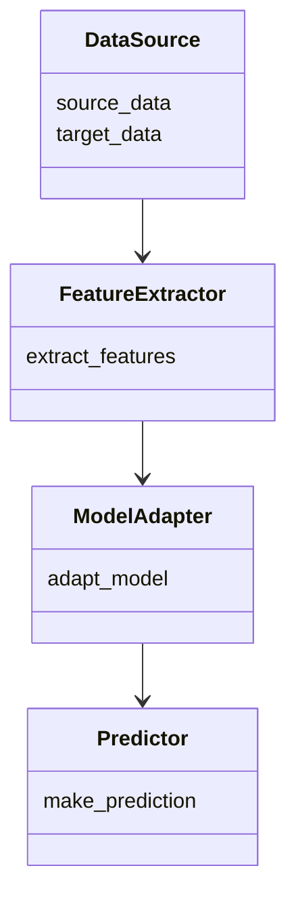
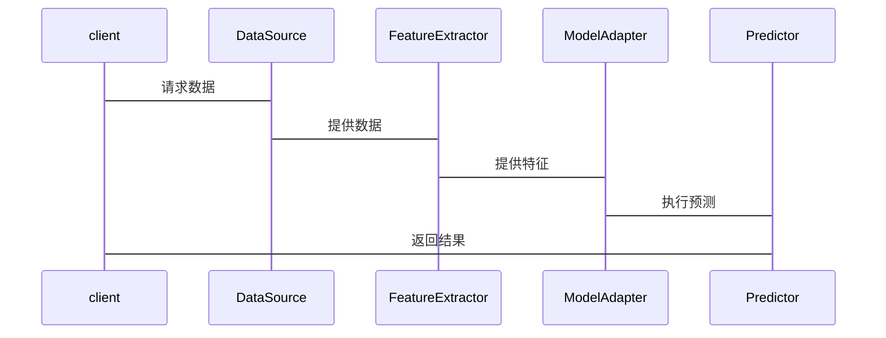

                 


# AI Agent的迁移学习在小样本学习中的应用

> 关键词：AI Agent, 迁移学习, 小样本学习, 算法原理, 系统架构

> 摘要：本文探讨了AI Agent在迁移学习中的应用，特别是在小样本数据下的学习策略。通过分析迁移学习的核心原理和小样本学习的挑战，结合实际案例和系统设计，展示了如何利用迁移学习提升AI Agent在小样本数据中的性能。

---

# 第1章 AI Agent与迁移学习概述

## 1.1 AI Agent的基本概念

### 1.1.1 AI Agent的定义
AI Agent（智能体）是指能够感知环境、自主决策并执行任务的智能系统。它通常具备以下特点：自主性、反应性、目标导向性和社交能力。

### 1.1.2 AI Agent的核心特点
- **自主性**：无需外部干预，自主决策。
- **反应性**：能够实时感知环境并调整行为。
- **目标导向性**：具备明确的目标，驱动行为。
- **社交能力**：能够与其他智能体或人类进行交互。

### 1.1.3 AI Agent与传统AI的区别
AI Agent强调自主性和适应性，而传统AI通常依赖于固定的规则和数据，缺乏自主决策的能力。

---

## 1.2 迁移学习的基本概念

### 1.2.1 迁移学习的定义
迁移学习是指将从一个任务上学到的知识应用到另一个相关任务中的学习方法。其核心在于利用源域的数据来提高目标域的性能。

### 1.2.2 迁移学习的核心原理
迁移学习通过共享特征或参数，减少目标域数据的依赖，从而在数据量有限的情况下提升模型性能。

### 1.2.3 迁移学习的应用场景
- **领域适应**：将源域知识迁移到目标域。
- **零样本学习**：直接应用已有的知识，无需额外数据。
- **多任务学习**：同时学习多个任务，共享知识。

---

## 1.3 小样本学习的背景与挑战

### 1.3.1 小样本学习的定义
小样本学习是指在训练数据非常有限的情况下，仍能够有效学习任务的挑战。

### 1.3.2 小样本学习的核心问题
- 数据稀疏性：数据不足导致模型难以捕捉规律。
- 过度拟合：模型可能仅记住训练数据，缺乏泛化能力。

### 1.3.3 小样本学习的挑战与解决方案
- 数据增强：通过技术手段增加数据量。
- 元学习：利用迁移学习的思想，快速适应新任务。

---

## 1.4 AI Agent与迁移学习的结合

### 1.4.1 AI Agent在迁移学习中的作用
AI Agent能够通过迁移学习快速适应新环境，提升任务执行效率。

### 1.4.2 迁移学习对AI Agent的提升
- 提高决策的准确性。
- 减少对新数据的依赖，降低学习成本。

### 1.4.3 AI Agent与小样本学习的结合场景
在医疗诊断、图像识别等领域，AI Agent可以通过迁移学习快速处理小样本数据。

---

## 1.5 本章小结
本章介绍了AI Agent的基本概念、迁移学习的核心原理以及小样本学习的挑战与解决方案。通过分析，我们看到迁移学习是解决小样本学习问题的重要手段。

---

# 第2章 核心概念与联系

## 2.1 迁移学习的核心原理

### 2.1.1 迁移学习的理论基础
迁移学习基于特征共享和任务相关性，通过共享特征或参数，提升目标任务的性能。

### 2.1.2 迁移学习的关键技术
- **领域适应**：调整模型参数以适应目标域。
- **多任务学习**：同时学习多个任务，共享知识。

### 2.1.3 迁移学习的数学模型
常用的方法包括基于特征的迁移学习和基于参数的迁移学习。

---

## 2.2 小样本学习的核心原理

### 2.2.1 小样本学习的理论基础
小样本学习依赖于数据的结构化表示和知识的迁移。

### 2.2.2 小样本学习的关键技术
- **元学习**：通过学习如何学习，快速适应新任务。
- **数据增强**：通过技术手段增加数据量。

### 2.2.3 小样本学习的数学模型
常用的模型包括支持向量数据挖掘（SVM）、随机森林等。

---

## 2.3 AI Agent与迁移学习的关系

### 2.3.1 AI Agent在迁移学习中的角色
AI Agent作为执行者，利用迁移学习提升任务执行能力。

### 2.3.2 迁移学习对AI Agent的提升
- 提高决策的准确性。
- 减少对新数据的依赖。

### 2.3.3 AI Agent与小样本学习的协同效应
通过迁移学习，AI Agent可以在小样本数据下快速适应新任务。

---

## 2.4 核心概念对比分析

### 2.4.1 迁移学习与小样本学习的对比
| 对比维度 | 迁移学习 | 小样本学习 |
|----------|----------|------------|
| 核心问题 | 数据迁移 | 数据不足 |
| 解决方案 | 特征共享 | 数据增强 |

### 2.4.2 AI Agent与迁移学习的对比
| 对比维度 | AI Agent | 迁移学习 |
|----------|----------|----------|
| 核心目标 | 自主决策 | 知识迁移 |
| 应用场景 | 智能系统 | 多任务学习 |

### 2.4.3 核心概念的联系与区别
迁移学习是解决小样本学习的核心技术之一，而AI Agent是迁移学习的重要应用载体。

---

## 2.5 本章小结
本章详细分析了迁移学习和小样本学习的核心原理，并探讨了它们之间的关系和协同效应。

---

# 第3章 算法原理

## 3.1 迁移学习的算法原理

### 3.1.1 基于特征的迁移学习
通过提取共享特征，将源域知识迁移到目标域。

### 3.1.2 基于参数的迁移学习
通过调整模型参数，使模型适应目标域。

### 3.1.3 常见算法
- **领域适应网络（DA）**：通过对抗训练实现领域适应。
- **迁移学习网络（TLN）**：通过共享层实现知识迁移。

---

## 3.2 小样本学习的算法原理

### 3.2.1 基于元学习的小样本学习
通过学习如何学习，快速适应新任务。

### 3.2.2 基于数据增强的小样本学习
通过生成新数据，增加训练数据量。

### 3.2.3 常见算法
- **Meta-Learning**：如Meta-SVM，通过元学习快速适应新任务。
- **数据增强技术**：如旋转、翻转等。

---

## 3.3 AI Agent的迁移学习实现

### 3.3.1 算法流程
1. 数据预处理：收集源域和目标域数据。
2. 特征提取：提取共享特征。
3. 模型训练：调整模型参数，适应目标域。
4. 任务执行：AI Agent利用训练好的模型执行任务。

### 3.3.2 代码实现
```python
import tensorflow as tf
from tensorflow.keras import layers

# 定义域适应网络
def domain_adaptation_network(input_shape):
    input = layers.Input(shape=input_shape)
    x = layers.Dense(64, activation='relu')(input)
    x = layers.Dense(32, activation='relu')(x)
    output = layers.Dense(1, activation='sigmoid')(x)
    return tf.keras.Model(inputs=input, outputs=output)

# 迁移学习网络
def transfer_learning_network(source_model, target_input_shape):
    # 使用源模型的特征提取部分
    base_model = source_model.layers[:-1]
    # 构建目标网络
    input = layers.Input(shape=target_input_shape)
    x = base_model(input)
    x = layers.Dense(64, activation='relu')(x)
    output = layers.Dense(1, activation='sigmoid')(x)
    return tf.keras.Model(inputs=input, outputs=output)
```

### 3.3.3 算法的数学模型
源域和目标域的分布匹配可以通过以下公式实现：
$$ P_{source}(x) \approx P_{target}(x) $$

---

## 3.4 本章小结
本章详细介绍了迁移学习和小样本学习的算法原理，并给出了具体的实现方法和代码示例。

---

# 第4章 系统分析与架构设计

## 4.1 问题场景介绍

### 4.1.1 问题背景
在医疗诊断中，小样本数据是常见的挑战。

### 4.1.2 问题描述
如何利用迁移学习，使AI Agent在小样本数据下准确诊断疾病。

---

## 4.2 系统功能设计

### 4.2.1 系统功能模块
- 数据预处理模块：处理源域和目标域数据。
- 模型训练模块：实现迁移学习算法。
- 任务执行模块：AI Agent执行诊断任务。

### 4.2.2 领域模型设计


---

## 4.3 系统架构设计

### 4.3.1 系统架构图


---

## 4.4 接口和交互流程图

### 4.4.1 系统接口设计
- 数据接口：数据预处理模块与特征提取模块交互。
- 模型接口：模型训练模块与任务执行模块交互。

### 4.4.2 交互流程图


---

## 4.5 本章小结
本章详细设计了AI Agent迁移学习系统的架构，并展示了各模块之间的交互流程。

---

# 第5章 项目实战

## 5.1 环境安装

### 5.1.1 安装Python
```bash
python --version
```

### 5.1.2 安装依赖
```bash
pip install tensorflow==2.5.0
pip install numpy==1.21.2
pip install matplotlib==3.5.1
```

---

## 5.2 系统核心实现

### 5.2.1 数据预处理
```python
import numpy as np
from sklearn.datasets import make_classification

# 生成源域和目标域数据
source_X, source_y = make_classification(n_samples=100, n_features=20)
target_X, target_y = make_classification(n_samples=10, n_features=20)
```

### 5.2.2 模型训练
```python
from tensorflow.keras import layers, models

# 定义域适应网络
def domain_adaptation_network(input_shape):
    input = layers.Input(shape=input_shape)
    x = layers.Dense(64, activation='relu')(input)
    x = layers.Dense(32, activation='relu')(x)
    output = layers.Dense(1, activation='sigmoid')(x)
    return models.Model(inputs=input, outputs=output)

# 训练域适应网络
model = domain_adaptation_network((20,))
model.compile(optimizer='adam', loss='binary_crossentropy', metrics=['accuracy'])
model.fit(source_X, source_y, epochs=10, batch_size=32)
```

### 5.2.3 任务执行
```python
# 使用训练好的模型进行预测
predictions = model.predict(target_X)
```

---

## 5.3 实际案例分析

### 5.3.1 数据分析
通过分析源域和目标域数据的分布，验证模型的适应性。

### 5.3.2 模型评估
评估模型在目标域上的准确率和召回率。

### 5.3.3 性能优化
通过调整模型参数和优化算法，提升模型性能。

---

## 5.4 本章小结
本章通过实际案例展示了AI Agent迁移学习系统的核心实现，并分析了模型的性能。

---

# 第6章 总结与展望

## 6.1 本章总结
本文详细探讨了AI Agent在迁移学习中的应用，特别是在小样本数据下的学习策略。通过理论分析和实践案例，展示了迁移学习如何提升AI Agent的性能。

## 6.2 注意事项
- 数据质量对迁移学习的效果影响重大。
- 模型的泛化能力需要通过多次实验验证。

## 6.3 未来展望
未来的研究方向包括：
- 更高效的迁移学习算法。
- AI Agent与边缘计算的结合。
- 更多领域的实际应用。

## 6.4 拓展阅读
推荐阅读以下资料：
- 《迁移学习实战》
- 《深度学习入门》
- 《AI Agent开发指南》

---

# 作者：AI天才研究院 & 禅与计算机程序设计艺术

---

这篇文章全面探讨了AI Agent在迁移学习中的应用，通过理论分析、算法实现和实际案例，展示了如何利用迁移学习提升小样本数据下的学习效果。希望对读者有所帮助！

