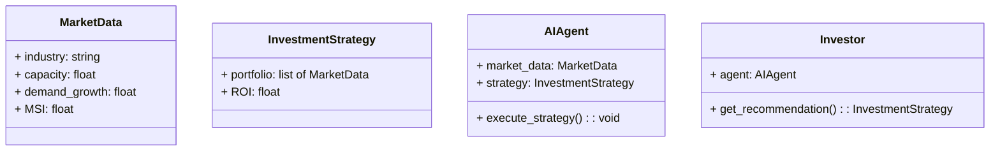
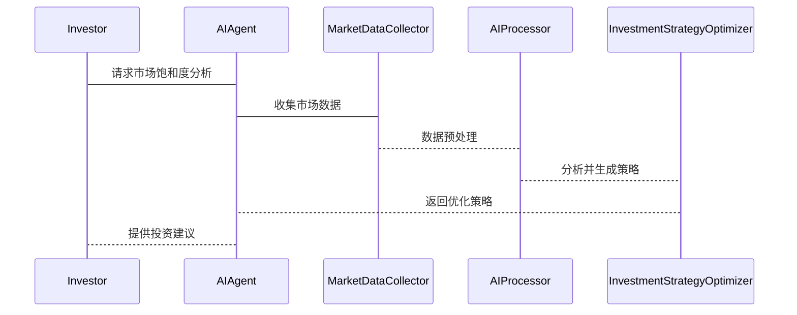

                 


# AI agents增强价值投资的市场饱和度分析

> 关键词：AI代理、价值投资、市场饱和度、算法原理、系统架构、投资决策

> 摘要：本文探讨了AI代理在价值投资中的应用，重点分析了市场饱和度的智能化分析。文章从AI代理的核心概念、价值投资的基本原理出发，详细阐述了AI代理如何通过算法优化和系统架构设计来增强市场饱和度分析，进而提升投资决策的准确性。通过实际案例分析和项目实战，本文展示了如何利用AI技术实现价值投资的智能化，并提出了相应的最佳实践和优化建议。

---

# 第一部分: AI代理与价值投资的背景与基础

## 第1章: AI代理与价值投资概述

### 1.1 AI代理的核心概念

#### 1.1.1 AI代理的定义与特征

AI代理（AI Agent）是一种能够感知环境、自主决策并执行任务的智能系统。它具有以下核心特征：
- **自主性**：能够在没有外部干预的情况下独立运行。
- **反应性**：能够根据环境变化实时调整行为。
- **学习能力**：通过数据和经验不断优化决策模型。

#### 1.1.2 价值投资的基本原理

价值投资是一种以基本面分析为基础的投资策略，强调以低于公平价值的价格购买优质资产。其核心在于识别市场中的低估资产，通过长期持有实现超额收益。

#### 1.1.3 AI代理在价值投资中的作用

AI代理可以通过以下方式增强价值投资：
- **数据处理**：快速分析海量市场数据，提取关键指标。
- **模式识别**：发现传统方法难以察觉的市场规律。
- **决策优化**：基于实时数据动态调整投资策略。

### 1.2 市场饱和度分析的基础知识

#### 1.2.1 市场饱和度的定义

市场饱和度是指某一市场中，某种产品或服务的普及程度已经达到或接近极限，消费者需求趋于稳定的状态。在投资领域，市场饱和度分析主要用于判断某个行业的竞争程度和增长潜力。

#### 1.2.2 影响市场饱和度的因素

- **行业竞争格局**：行业内主要参与者数量、市场份额分布。
- **市场需求变化**：消费者偏好、购买力、替代品的影响。
- **技术进步**：技术创新对市场需求的推动作用。
- **政策环境**：政府政策、法律法规对市场的约束与激励。

#### 1.2.3 价值投资与市场饱和度的关系

价值投资者通常关注市场饱和度较低的行业，寻找具有成长潜力的优质企业。AI代理可以通过对市场饱和度的动态分析，帮助投资者识别处于成长期的行业和企业。

---

## 第2章: 市场饱和度分析的核心概念

### 2.1 价值投资与市场饱和度的关联

#### 2.1.1 价值投资中的市场分析

价值投资者通过分析企业的财务状况、行业地位、竞争优势等基本面因素，判断其内在价值。市场饱和度分析是基本面分析的重要组成部分，帮助投资者判断行业的成长空间和竞争压力。

#### 2.1.2 市场饱和度对投资决策的影响

- **行业选择**：饱和度高的行业竞争激烈，投资回报率可能较低；饱和度低的行业可能具有更大的增长潜力。
- **企业估值**：饱和度高的行业可能需要更高的门槛和更强的竞争优势才能维持增长。
- **投资策略调整**：根据市场饱和度的变化，动态调整投资组合。

#### 2.1.3 AI代理如何优化市场饱和度分析

- **数据获取**：AI代理能够实时收集市场数据，包括行业竞争格局、企业财务数据、政策变化等。
- **模式识别**：通过机器学习算法，AI代理可以发现市场饱和度变化的潜在规律。
- **动态调整**：基于市场饱和度的实时变化，AI代理可以为投资者提供动态的投资建议。

---

## 第3章: AI代理增强价值投资的必要性

### 3.1 传统价值投资的局限性

#### 3.1.1 数据处理能力有限

传统价值投资依赖人工分析，数据处理能力有限，难以应对海量市场数据。

#### 3.1.2 分析效率低下

人工分析耗时较长，难以及时捕捉市场变化。

#### 3.1.3 主观判断偏差

投资者的主观判断可能受到情绪影响，导致决策失误。

### 3.2 AI代理在投资决策中的优势

#### 3.2.1 数据处理能力强

AI代理能够快速处理海量数据，提取关键信息。

#### 3.2.2 分析效率高

通过自动化分析，AI代理可以实时更新市场饱和度分析结果。

#### 3.2.3 客观性与准确性

AI代理基于数据和算法进行分析，减少了人为情绪干扰。

### 3.3 市场饱和度分析的智能化需求

随着市场的复杂化，传统方法难以满足市场饱和度分析的实时性和准确性需求。AI代理通过智能化分析，能够满足这一需求。

---

# 第二部分: AI代理与价值投资的核心概念

## 第4章: AI代理的核心原理

### 4.1 代理的决策机制

AI代理的决策机制包括感知、分析、决策和执行四个环节：
1. **感知**：通过传感器或数据接口获取环境信息。
2. **分析**：利用算法对信息进行处理，生成决策建议。
3. **决策**：基于分析结果，选择最优行动方案。
4. **执行**：通过执行机构或API接口实现决策。

### 4.2 基于AI的市场分析模型

#### 4.2.1 机器学习算法的应用

- **监督学习**：用于分类和回归问题。
- **无监督学习**：用于聚类和降维。
- **强化学习**：用于动态决策和策略优化。

#### 4.2.2 深度学习的应用

- **神经网络**：用于复杂模式识别。
- **卷积神经网络（CNN）**：用于图像识别。
- **循环神经网络（RNN）**：用于时间序列分析。

### 4.3 代理的自我学习与优化

通过强化学习和反馈机制，AI代理可以不断优化自身的决策模型。

---

## 第5章: 价值投资与市场饱和度的关联

### 5.1 价值投资中的市场分析

#### 5.1.1 行业分析

- **行业生命周期**：判断行业所处阶段，如导入期、成长期、成熟期、衰退期。
- **竞争格局**：分析行业内主要竞争对手的市场份额和竞争优势。

#### 5.1.2 企业分析

- **财务状况**：分析企业的盈利能力、资产负债情况、现金流等。
- **竞争优势**：分析企业的核心竞争力，如技术优势、成本优势、品牌优势等。

### 5.2 市场饱和度对投资决策的影响

#### 5.2.1 饱和度高的行业

- **竞争激烈**：企业盈利能力可能受到挤压。
- **风险较高**：行业趋于稳定，增长空间有限。

#### 5.2.2 饱和度低的行业

- **增长潜力大**：企业可能具有较大的发展空间。
- **风险较低**：行业处于成长期，投资回报可能较高。

### 5.3 AI代理如何优化市场饱和度分析

#### 5.3.1 数据采集与处理

AI代理可以通过爬虫、API接口等方式，实时采集市场数据，包括行业数据、企业数据、政策数据等。

#### 5.3.2 数据分析与建模

通过机器学习算法，AI代理可以构建市场饱和度分析模型，预测行业的饱和度变化趋势。

#### 5.3.3 结果输出与反馈

AI代理可以将分析结果以可视化的方式呈现，并根据市场变化实时调整分析模型。

---

# 第三部分: AI代理增强价值投资的算法原理

## 第6章: AI代理的核心算法

### 6.1 机器学习算法在市场分析中的应用

#### 6.1.1 监督学习

- **回归分析**：用于预测市场饱和度指数。
- **分类算法**：用于判断市场处于哪个阶段（如成长期、成熟期）。

#### 6.1.2 无监督学习

- **聚类分析**：将相似的行业或企业进行分组，分析市场饱和度。
- **关联规则挖掘**：发现市场饱和度变化的相关因素。

### 6.2 基于深度学习的市场预测模型

#### 6.2.1 神经网络的应用

- **多层感知机（MLP）**：用于非线性关系建模。
- **长短期记忆网络（LSTM）**：用于时间序列预测。

#### 6.2.2 图神经网络（GNN）

用于分析行业间的关联关系，构建市场饱和度分析的图模型。

### 6.3 强化学习在投资决策中的应用

#### 6.3.1 强化学习的基本原理

- **状态空间**：市场当前的状态，如市场饱和度、行业趋势等。
- **动作空间**：投资者可以采取的行动，如买入、卖出、持有等。
- **奖励机制**：根据投资收益和风险，给予正向或负向反馈。

#### 6.3.2 强化学习的应用场景

- **动态市场分析**：根据市场变化实时调整投资策略。
- **组合优化**：通过强化学习优化投资组合，降低风险。

---

## 第7章: 数学模型与公式

### 7.1 市场饱和度的数学模型

市场饱和度指数（Market Saturation Index, MSI）可以表示为：

$$ MSI = \frac{\text{市场容量}}{\text{需求增长率}} $$

其中，市场容量是行业规模的上限，需求增长率是市场的需求增长速度。

### 7.2 基于AI代理的价值投资公式

价值投资回报率（Return on Investment, ROI）可以表示为：

$$ ROI = \frac{\text{投资收益}}{\text{投资成本}} \times 100\% $$

其中，投资收益是基于AI代理分析的收益，投资成本是初始投资金额。

### 7.3 算法的数学推导与实例分析

以回归分析为例，假设我们有以下市场数据：

| 行业 | 市场容量 | 需求增长率 | 市场饱和度指数（MSI） |
|------|----------|------------|----------------------|
| A    | 100      | 20%        | 5                    |
| B    | 150      | 10%        | 15                   |
| C    | 200      | 5%         | 40                   |

通过回归分析，我们可以建立市场饱和度指数与投资回报率之间的关系：

$$ ROI = a \times MSI + b $$

通过训练数据，我们可以求出系数 \(a\) 和 \(b\)，从而预测未来市场的投资回报率。

---

# 第四部分: 系统分析与架构设计

## 第8章: 系统分析与设计

### 8.1 项目背景与目标

本项目旨在利用AI代理技术，增强价值投资中的市场饱和度分析能力，提高投资决策的准确性和效率。

### 8.2 系统功能设计

#### 8.2.1 领域模型（类图）



### 8.3 系统架构设计

#### 8.3.1 架构图

```mermaid
architectural [
    MarketDataCollector
    AIProcessor
    InvestmentStrategyOptimizer
    InvestorInterface
]
MarketDataCollector --> AIProcessor
AIProcessor --> InvestmentStrategyOptimizer
InvestmentStrategyOptimizer --> InvestorInterface
```

### 8.4 系统接口与交互设计

#### 8.4.1 投资者与AI代理的交互



---

## 第9章: 系统实现与代码分析

### 9.1 环境安装与配置

- **Python**：安装Python 3.8或更高版本。
- **机器学习库**：安装scikit-learn、TensorFlow、PyTorch等。
- **数据处理库**：安装pandas、numpy、requests等。

### 9.2 核心算法实现

#### 9.2.1 回归分析代码示例

```python
from sklearn.linear_model import LinearRegression

# 数据准备
market_data = {
    'MSI': [5, 15, 40],
    'ROI': [20, 30, 45]
}

# 模型训练
model = LinearRegression()
model.fit(market_data[['MSI']], market_data['ROI'])

# 预测
new_msi = [[30]]
predicted_roi = model.predict(new_msi)
print(predicted_roi)
```

#### 9.2.2 强化学习代码示例

```python
import numpy as np
from collections import deque
import random

class MarketSaturationAgent:
    def __init__(self, state_space, action_space):
        self.state_space = state_space
        self.action_space = action_space
        self.memory = deque(maxlen=1000)
        self.gamma = 0.95
        self.epsilon = 1.0
        self.epsilon_min = 0.01
        self.epsilon_decay = 0.995
        self.model = self._build_model()

    def _build_model(self):
        # 构建神经网络模型
        pass

    def remember(self, state, action, reward, next_state):
        self.memory.append((state, action, reward, next_state))

    def act(self, state):
        if random.random() < self.epsilon:
            return random.randint(0, self.action_space-1)
        else:
            return np.argmax(self.model.predict(state))

    def replay(self, batch_size):
        # 回放记忆并训练模型
        pass

    def decay_epsilon(self):
        self.epsilon *= self.epsilon_decay
        if self.epsilon < self.epsilon_min:
            self.epsilon = self.epsilon_min
```

### 9.3 代码解读与优化建议

- **回归分析**：适用于市场饱和度与投资回报率之间的线性关系分析。
- **强化学习**：适用于动态市场环境下的投资策略优化。

---

# 第五部分: 项目实战与案例分析

## 第10章: 项目实战

### 10.1 项目背景与目标

本项目旨在利用AI代理技术，增强价值投资中的市场饱和度分析能力，提高投资决策的准确性和效率。

### 10.2 核心代码实现

#### 10.2.1 数据采集与预处理

```python
import requests
import pandas as pd

def collect_market_data():
    url = "https://api.example.com/marketdata"
    response = requests.get(url)
    data = response.json()
    df = pd.DataFrame(data)
    return df

market_data = collect_market_data()
print(market_data.head())
```

#### 10.2.2 市场饱和度分析

```python
from sklearn.cluster import KMeans

def analyze_market_saturation(data):
    features = data[['capacity', 'demand_growth']]
    kmeans = KMeans(n_clusters=3)
    kmeans.fit(features)
    data['cluster'] = kmeans.predict(features)
    return data

saturated_data = analyze_market_saturation(market_data)
print(saturated_data.head())
```

### 10.3 代码解读与优化建议

- **数据采集**：使用API接口获取市场数据，包括行业容量、需求增长率等关键指标。
- **市场饱和度分析**：通过聚类分析，将市场分为不同饱和度的类别，帮助企业识别市场机会和风险。

### 10.4 实际案例分析

以某行业为例，假设我们有以下市场数据：

| 行业 | 市场容量 | 需求增长率 | 饱和度指数（MSI） | 投资回报率（ROI） |
|------|----------|------------|------------------|-------------------|
| A    | 100      | 20%        | 5                | 20%               |
| B    | 150      | 10%        | 15               | 30%               |
| C    | 200      | 5%         | 40               | 45%               |

通过聚类分析，我们可以将行业分为三个类别，分别对应低、中、高饱和度。根据分析结果，投资者可以优先选择饱和度较低的行业，如行业A，以获取更高的投资回报率。

### 10.5 项目小结

通过AI代理技术，我们可以实现市场饱和度的智能化分析，帮助投资者做出更科学的投资决策。同时，AI代理还可以通过自我学习和优化，不断提升分析的准确性和效率。

---

# 第六部分: 最佳实践与总结

## 第11章: 最佳实践

### 11.1 技术实现建议

- **数据质量**：确保数据来源可靠，数据清洗充分。
- **算法选择**：根据具体场景选择合适的算法，避免盲目追求复杂模型。
- **模型优化**：通过交叉验证、超参数调优等方法，提升模型性能。

### 11.2 业务应用建议

- **场景聚焦**：明确应用场景，避免技术与业务脱节。
- **持续监控**：实时监控市场变化，动态调整分析模型。
- **风险管理**：建立风险预警机制，降低投资风险。

## 第12章: 小结

本文详细探讨了AI代理在价值投资中的应用，重点分析了市场饱和度的智能化分析。通过理论分析、算法实现和案例实践，本文展示了如何利用AI技术提升投资决策的准确性和效率。未来，随着技术的不断发展，AI代理在价值投资中的应用将更加广泛和深入。

## 第13章: 注意事项

- **数据隐私**：确保数据处理符合相关法律法规，保护投资者隐私。
- **模型解释性**：提高模型的可解释性，便于投资者理解和信任。
- **技术可行性**：在实际应用中，需综合考虑技术可行性、成本效益等因素。

## 第14章: 拓展阅读

- **推荐书籍**：《The AI Edge in Investment》、《Machine Learning for Finance》。
- **推荐论文**：搜索“AI in Value Investing”、“Market Saturation Analysis”相关的学术论文。
- **在线课程**：推荐学习“AI for Finance”、“Machine Learning in Investment”等在线课程。

---

# 作者：AI天才研究院/AI Genius Institute & 禅与计算机程序设计艺术/Zen And The Art of Computer Programming

