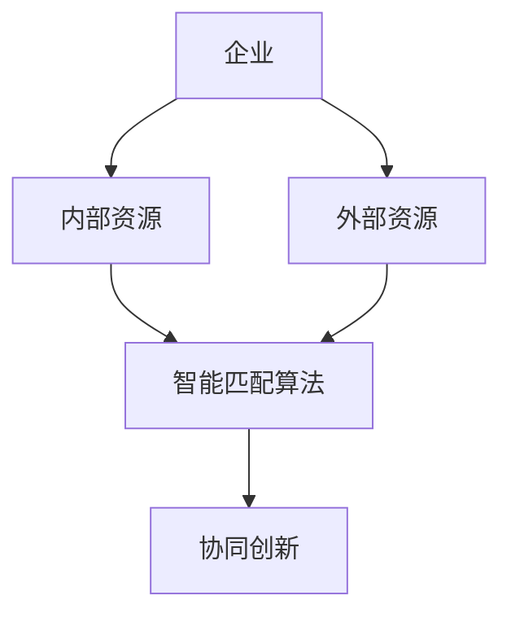
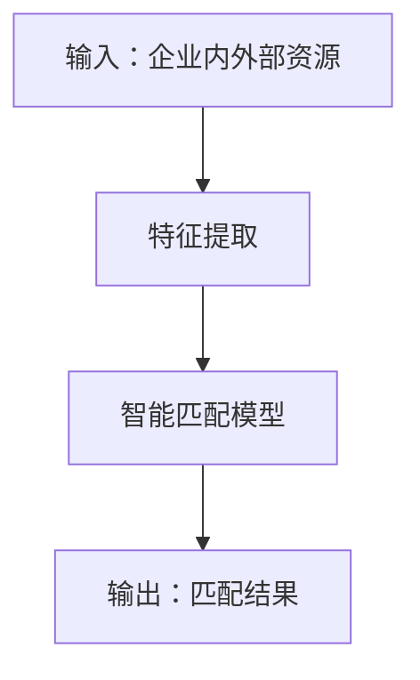
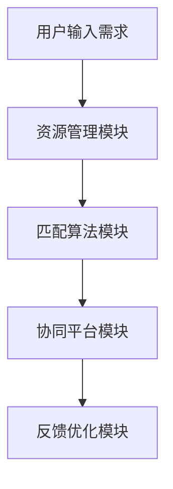
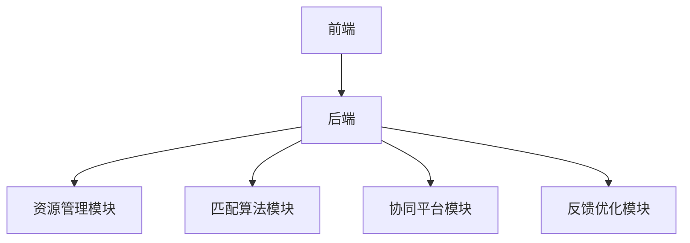
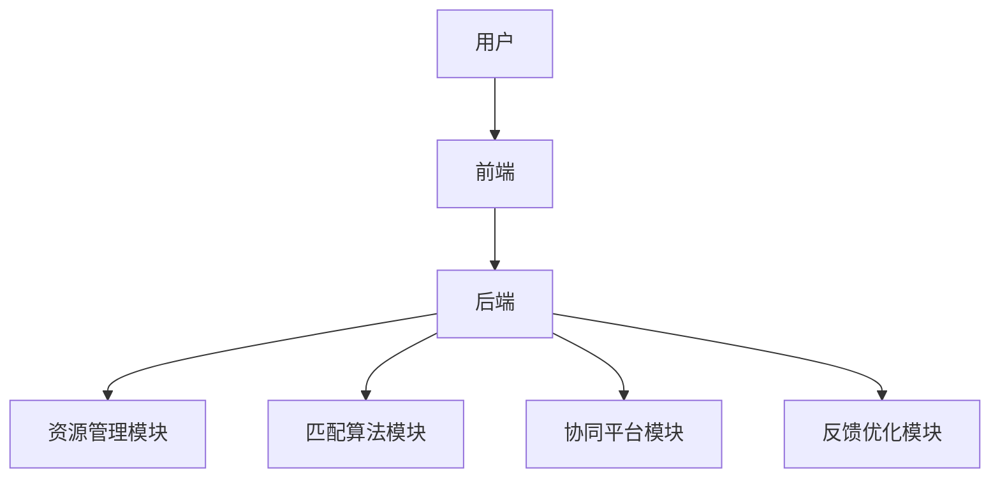

                 


# AI驱动的企业创新生态系统构建：内外部资源智能匹配与协同

## 关键词：
- 人工智能
- 企业创新
- 资源匹配
- 智能协同
- 创新生态系统

## 摘要：
随着人工智能技术的迅速发展，企业创新生态系统正在经历一场深刻的变革。AI不仅能够优化企业内部资源的配置，还能够高效地匹配外部资源，从而实现内外部资源的智能协同。本文从AI驱动的企业创新生态系统的构建出发，详细探讨了内外部资源智能匹配与协同的核心原理、算法设计、系统架构以及实际应用。通过案例分析和代码实现，本文展示了如何利用AI技术提升企业创新能力，为企业构建一个高效、智能的创新生态系统。

---

# 第一部分: AI驱动的企业创新生态系统构建概述

## 第1章: 问题背景与目标

### 1.1 问题背景
#### 1.1.1 企业创新面临的挑战
在当前快速变化的商业环境中，企业创新面临着前所未有的挑战。传统的企业创新模式依赖于线性思维和局部优化，难以应对复杂多变的市场需求和资源约束。企业内部资源的碎片化和外部资源的不确定性使得创新过程效率低下，成本高昂。

#### 1.1.2 AI技术在企业创新中的作用
人工智能技术的快速发展为企业创新提供了新的可能性。通过AI技术，企业可以实现资源的智能化匹配与协同，优化创新过程中的资源配置效率，降低创新成本，提升创新速度和质量。

#### 1.1.3 企业内外部资源协同的现状与痛点
企业内外部资源协同的现状存在以下痛点：
1. **资源匹配效率低**：传统的人工匹配方式耗时长、效率低，难以满足快速创新的需求。
2. **资源孤岛现象**：企业内部资源分散在不同的部门和系统中，外部资源分布广泛且难以整合。
3. **协同创新困难**：跨部门、跨组织的协同创新缺乏有效的沟通机制和协作平台，创新过程难以无缝衔接。

### 1.2 问题描述
#### 1.2.1 企业创新生态系统的定义
企业创新生态系统是指由企业内部资源（如技术、资金、人才）和外部资源（如合作伙伴、客户、供应商）共同构成的，能够通过协同创新实现价值创造的有机系统。

#### 1.2.2 资源匹配的核心问题
资源匹配的核心问题是如何将企业内外部资源进行高效匹配，以支持创新项目的顺利实施。这需要解决以下问题：
- **资源识别**：准确识别企业内外部资源的特征和能力。
- **资源匹配**：基于资源特征和项目需求，实现资源的最优匹配。
- **动态调整**：在创新过程中动态调整资源匹配策略，以应对需求变化。

#### 1.2.3 协同创新的关键挑战
协同创新的关键挑战包括：
- **信息孤岛**：企业内外部资源的信息分散在不同的系统中，缺乏统一的协同平台。
- **信任问题**：外部资源的可信度难以评估，导致协同创新的信任缺失。
- **协同效率**：跨组织的协同过程复杂，效率低下。

### 1.3 问题解决思路
#### 1.3.1 AI驱动的解决方案
通过AI技术，企业可以实现资源的智能化匹配与协同。AI可以通过数据挖掘、机器学习等技术，分析企业内外部资源的特征和需求，提供智能化的匹配建议。

#### 1.3.2 智能匹配与协同的核心思路
智能匹配与协同的核心思路包括：
1. **数据驱动**：基于大量数据，分析资源特征和需求，实现精准匹配。
2. **动态调整**：根据实时数据和反馈，动态优化资源匹配策略。
3. **协同平台**：构建统一的协同平台，实现企业内外部资源的高效协同。

#### 1.3.3 可持续创新的实现路径
可持续创新的实现路径包括：
1. **资源优化配置**：通过智能匹配，实现资源的最优配置。
2. **协同机制设计**：设计高效的协同机制，促进跨组织的协同创新。
3. **反馈与优化**：通过反馈机制，不断优化创新过程。

### 1.4 边界与外延
#### 1.4.1 企业创新生态系统的边界
企业创新生态系统的边界包括：
- **内部边界**：企业内部资源的范围，如技术、资金、人才等。
- **外部边界**：企业外部资源的范围，如合作伙伴、客户、供应商等。
- **创新过程边界**：创新过程的起点和终点，如创意生成、产品开发等。

#### 1.4.2 资源匹配的范围界定
资源匹配的范围界定包括：
- **资源类型**：如技术资源、人力资源、资金资源等。
- **匹配场景**：如项目需求匹配、合作伙伴匹配等。
- **匹配目标**：如最大化资源利用率、最小化匹配成本等。

#### 1.4.3 协同创新的外部延伸
协同创新的外部延伸包括：
- **跨界合作**：与不同行业的企业或机构合作，实现创新资源共享。
- **开放创新**：通过开放平台吸引外部创新资源，实现创新价值共创。
- **生态系统构建**：构建开放的创新生态系统，促进多方协同创新。

### 1.5 核心要素与组成
#### 1.5.1 创新生态系统的构成要素
创新生态系统的构成要素包括：
- **核心资源**：如技术、资金、人才等。
- **协同机制**：如沟通机制、合作机制等。
- **创新平台**：如协同平台、开放平台等。

#### 1.5.2 资源匹配的关键因素
资源匹配的关键因素包括：
- **资源特征**：如技术能力、资源类型、资源可用性等。
- **项目需求**：如项目目标、项目阶段、项目预算等。
- **匹配规则**：如优先级规则、约束条件等。

#### 1.5.3 协同创新的核心机制
协同创新的核心机制包括：
- **信息共享机制**：通过共享信息，实现资源的高效匹配。
- **利益分配机制**：通过合理分配利益，促进多方协同。
- **信任建立机制**：通过建立信任，促进外部资源的参与。

---

# 第二部分: 核心概念与理论基础

## 第2章: AI驱动的创新生态系统构建原理

### 2.1 核心概念解析
#### 2.1.1 AI在企业创新中的应用
AI在企业创新中的应用包括：
- **智能匹配**：通过AI技术，实现企业内外部资源的智能匹配。
- **协同优化**：通过AI技术，优化协同创新的过程，提升创新效率。
- **预测与决策**：通过AI技术，预测创新趋势，优化创新决策。

#### 2.1.2 智能匹配与协同的核心原理
智能匹配与协同的核心原理包括：
- **数据驱动**：基于数据，分析资源特征和需求，实现精准匹配。
- **动态优化**：根据实时数据和反馈，动态优化匹配策略。
- **协同机制**：通过协同机制，实现企业内外部资源的高效协同。

#### 2.1.3 创新生态系统构建的理论基础
创新生态系统构建的理论基础包括：
- **系统论**：将企业创新生态系统视为一个复杂的系统，分析系统的组成和运行规律。
- **协同论**：研究系统内部各部分的协同作用，实现系统的优化运行。
- **复杂适应系统理论**：研究系统在动态环境中的适应性和演化规律。

### 2.2 核心概念对比分析
#### 2.2.1 内部资源与外部资源的特征对比
内部资源与外部资源的特征对比：

| 特征维度 | 内部资源 | 外部资源 |
|----------|----------|----------|
| 资源类型 | 技术、资金、人才等 | 合作伙伴、客户、供应商等 |
| 资源控制 | 企业内部控制 | 企业外部控制 |
| 资源获取 | 内部调配 | 外部采购或合作 |

#### 2.2.2 智能匹配与传统匹配的优劣势分析
智能匹配与传统匹配的优劣势分析：

| 对比维度 | 智能匹配 | 传统匹配 |
|----------|----------|----------|
| 匹配效率 | 高 | 低 |
| 匹配精度 | 高 | 低 |
| 匹配成本 | 低 | 高 |
| 适应性 | 强 | 弱 |

#### 2.2.3 协同创新与传统协作的区别
协同创新与传统协作的区别：

| 对比维度 | 协同创新 | 传统协作 |
|----------|----------|----------|
| 协同目标 | 创新价值共创 | 完成具体任务 |
| 协同方式 | 跨组织、跨领域 | 仅限于组织内部或单一领域 |
| 协同效果 | 创新能力强、效率高 | 创新能力有限、效率低 |

### 2.3 实体关系架构
#### 2.3.1 ER实体关系图


---

# 第三部分: 算法原理与数学模型

## 第3章: 资源智能匹配算法

### 3.1 算法原理
#### 3.1.1 资源匹配的优化目标
资源匹配的优化目标包括：
1. **最大化资源利用率**：通过智能匹配，充分利用企业内外部资源。
2. **最小化匹配成本**：通过优化匹配策略，降低资源匹配的成本。
3. **提升创新效率**：通过高效匹配，提升创新项目的实施效率。

#### 3.1.2 基于AI的匹配策略
基于AI的匹配策略包括：
1. **基于机器学习的匹配**：通过机器学习算法，分析资源特征和需求，实现资源的智能匹配。
2. **基于规则的匹配**：根据预设的规则，进行资源的匹配。
3. **基于混合方法的匹配**：结合机器学习和规则的混合方法，进行资源的匹配。

#### 3.1.3 算法的数学模型
资源匹配的数学模型可以表示为以下优化问题：

$$
\text{最大化 } \sum_{i=1}^{n} \sum_{j=1}^{m} w_{ij} \cdot x_{ij}
$$

其中，$w_{ij}$ 是资源 $i$ 和资源 $j$ 的匹配权重，$x_{ij}$ 是匹配决策变量（0或1）。

### 3.2 算法流程图


### 3.3 数学模型与公式
#### 3.3.1 资源匹配的优化目标函数
$$ \text{最大化 } \sum_{i=1}^{n} \sum_{j=1}^{m} w_{ij} \cdot x_{ij} $$

其中，$w_{ij}$ 是资源 $i$ 和资源 $j$ 的匹配权重，$x_{ij}$ 是匹配决策变量（0或1）。

#### 3.3.2 约束条件
1. **资源可用性约束**：$\sum_{j=1}^{m} x_{ij} \leq 1$，表示每个资源 $i$ 只能匹配一个资源 $j$。
2. **资源需求约束**：$\sum_{i=1}^{n} x_{ij} \leq 1$，表示每个资源 $j$ 只能被匹配一次。
3. **优先级约束**：$x_{ij} \leq p_{ij}$，其中 $p_{ij}$ 是资源 $i$ 和资源 $j$ 的匹配优先级（0或1）。

---

# 第四部分: 系统分析与架构设计方案

## 第4章: 系统架构与实现

### 4.1 问题场景介绍
#### 4.1.1 企业创新生态系统的构建需求
企业创新生态系统的构建需求包括：
1. **资源智能化匹配**：实现企业内外部资源的智能匹配。
2. **协同创新机制**：构建高效的协同创新机制。
3. **动态优化能力**：具备动态优化的能力，适应变化的需求。

#### 4.1.2 系统目标
系统目标包括：
1. **提供智能化的资源匹配服务**：基于AI技术，提供智能化的资源匹配建议。
2. **支持协同创新**：构建协同创新平台，支持跨组织的协同创新。
3. **实现动态优化**：根据实时数据和反馈，动态优化资源匹配策略。

### 4.2 系统功能设计
#### 4.2.1 系统功能模块划分
系统功能模块包括：
1. **资源管理模块**：管理企业内外部资源。
2. **匹配算法模块**：实现资源的智能匹配。
3. **协同平台模块**：支持跨组织的协同创新。
4. **反馈优化模块**：根据反馈优化匹配策略。

#### 4.2.2 系统功能流程图


### 4.3 系统架构设计
#### 4.3.1 系统架构图


### 4.4 系统接口设计
#### 4.4.1 系统接口定义
1. **资源管理接口**：用于管理企业内外部资源。
2. **匹配算法接口**：用于实现资源的智能匹配。
3. **协同平台接口**：用于支持跨组织的协同创新。
4. **反馈优化接口**：用于根据反馈优化匹配策略。

#### 4.4.2 接口交互流程
1. 用户输入需求。
2. 资源管理模块管理资源。
3. 匹配算法模块实现资源匹配。
4. 协同平台模块支持协同创新。
5. 反馈优化模块优化匹配策略。

### 4.5 系统交互设计
#### 4.5.1 系统交互流程图


---

# 第五部分: 项目实战

## 第5章: 项目实现与案例分析

### 5.1 项目环境安装
#### 5.1.1 环境要求
1. **操作系统**：Windows 10 或更高版本，或 Linux 系统。
2. **编程语言**：Python 3.6 或更高版本。
3. **开发工具**：PyCharm 或其他Python开发工具。
4. **依赖库**：numpy, pandas, scikit-learn。

#### 5.1.2 安装依赖
```bash
pip install numpy pandas scikit-learn
```

### 5.2 系统核心实现
#### 5.2.1 资源匹配算法实现
```python
import numpy as np
from sklearn.metrics.pairwise import cosine_similarity

def resource_matching_algorithm(internal_resources, external_resources):
    # 特征提取
    internal_features = internal_resources[['技术', '资金', '人才']]
    external_features = external_resources[['合作伙伴', '客户', '供应商']]
    
    # 计算相似度
    similarity_matrix = cosine_similarity(internal_features, external_features)
    
    # 确定匹配结果
    matched_pairs = []
    for i in range(len(internal_resources)):
        max_similarity = max(similarity_matrix[i])
        matched_index = np.argmax(similarity_matrix[i])
        matched_pairs.append((i, matched_index))
    
    return matched_pairs
```

#### 5.2.2 协同创新平台实现
```python
class CollaborationPlatform:
    def __init__(self, internal_resources, external_resources):
        self.internal = internal_resources
        self.external = external_resources
        self.matched_pairs = []
    
    def match_resources(self):
        # 资源匹配算法
        matched_pairs = resource_matching_algorithm(self.internal, self.external)
        self.matched_pairs = matched_pairs
    
    def collaborate(self):
        # 协同创新过程
        for pair in self.matched_pairs:
            internal_resource = self.internal.iloc[pair[0]]
            external_resource = self.external.iloc[pair[1]]
            # 协同创新逻辑
            pass
```

### 5.3 代码实现与解读
#### 5.3.1 资源匹配算法实现解读
1. **特征提取**：从企业内外部资源中提取特征，如技术、资金、人才等。
2. **相似度计算**：使用余弦相似度计算资源之间的相似度。
3. **匹配结果确定**：根据相似度确定匹配结果。

#### 5.3.2 协同创新平台实现解读
1. **初始化**：初始化协同平台，传入企业内外部资源。
2. **资源匹配**：调用资源匹配算法，确定匹配结果。
3. **协同创新**：根据匹配结果，进行协同创新。

### 5.4 案例分析
#### 5.4.1 案例背景
某科技公司计划开发一款新产品，需要整合内部技术资源和外部合作伙伴资源。

#### 5.4.2 案例实施步骤
1. **资源识别**：识别内部技术资源和外部合作伙伴资源。
2. **资源匹配**：通过AI算法，匹配出最佳合作伙伴。
3. **协同创新**：与匹配的合作伙伴共同开发新产品。

#### 5.4.3 案例结果分析
通过AI驱动的资源匹配与协同创新，该公司成功开发了新产品，提升了创新效率和产品质量。

---

# 第六部分: 最佳实践与小结

## 第6章: 最佳实践与小结

### 6.1 最佳实践
#### 6.1.1 数据质量的重要性
数据质量是AI驱动的企业创新生态系统构建的基础，高质量的数据能够提升匹配的准确性和协同效率。

#### 6.1.2 模型优化的关键点
模型优化的关键点包括：
1. **特征选择**：选择合适的特征，提升模型的性能。
2. **模型调参**：通过调参优化模型的性能。
3. **模型评估**：通过评估指标，验证模型的效果。

#### 6.1.3 协同创新的组织管理
协同创新的组织管理包括：
1. **组织结构优化**：优化组织结构，促进跨组织的协同。
2. **沟通机制建立**：建立高效的沟通机制，促进信息共享。
3. **激励机制设计**：设计合理的激励机制，促进外部资源的参与。

### 6.2 小结
通过本文的详细阐述，我们可以看到，AI驱动的企业创新生态系统构建是一个复杂而系统的过程。它不仅需要企业内外部资源的智能匹配，还需要高效的协同创新机制和动态优化能力。通过本文提出的方法和实现方案，企业可以显著提升创新效率和创新能力，实现可持续发展。

---

# 作者：AI天才研究院/AI Genius Institute & 禅与计算机程序设计艺术/Zen And The Art of Computer Programming

