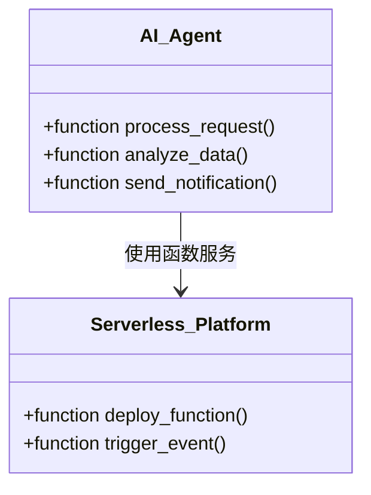
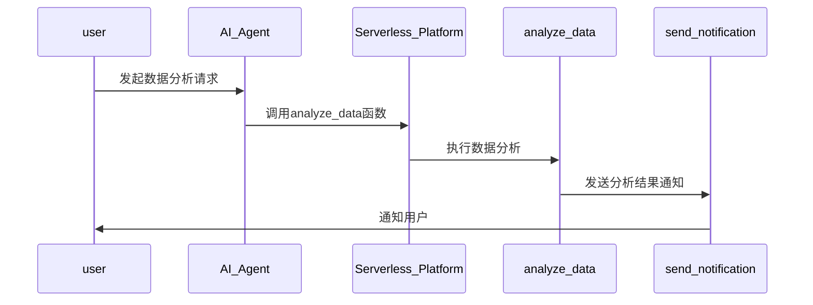

                 


# 企业AI Agent的Serverless架构优化

## 关键词
企业AI Agent, Serverless架构, 优化, 云计算, 函数即服务（FaaS）

## 摘要
随着人工智能技术的快速发展，企业AI Agent的应用越来越广泛。然而，传统的架构在资源利用率、扩展性和维护成本方面存在诸多问题。Serverless架构作为一种新兴的计算模式，以其弹性扩展、按需付费和简化运维的特点，为优化企业AI Agent的性能和成本提供了新的解决方案。本文详细探讨了企业AI Agent与Serverless架构的结合，分析了其核心概念、优化背景、系统设计、实战案例以及最佳实践。通过理论与实践相结合的方式，本文为企业在Serverless环境下优化AI Agent提供了系统的指导和参考。

---

# 目录

1. [企业AI Agent与Serverless架构概述](#企业ai-agent与serverless架构概述)
2. [Serverless架构的核心概念与原理](#serverless架构的核心概念与原理)
3. [企业AI Agent的Serverless优化背景与挑战](#企业ai-agent的serverless优化背景与挑战)
4. [AI Agent的Serverless优化设计](#ai-agent的serverless优化设计)
5. [项目实战：企业AI Agent的Serverless优化](#项目实战企业ai-agent的serverless优化)
6. [最佳实践与小结](#最佳实践与小结)
7. [参考文献](#参考文献)
8. [作者信息](#作者信息)

---

## 第1章：企业AI Agent与Serverless架构概述

### 1.1 企业AI Agent的定义与特点

#### 1.1.1 企业AI Agent的基本概念
企业AI Agent是一种能够理解、推理和执行企业级任务的智能代理，通常用于自动化业务流程、数据分析、决策支持和客户交互等领域。与个人助手（如Siri、Alexa）不同，企业AI Agent更加注重复杂任务的处理能力和与企业系统的深度集成。

#### 1.1.2 AI Agent的核心功能与优势
- **核心功能**：任务自动化、数据处理、决策支持、交互能力。
- **优势**：提高效率、降低成本、增强决策能力、提升客户体验。

#### 1.1.3 企业AI Agent的应用场景
- **自动化业务流程**：订单处理、库存管理、客户关系管理。
- **数据分析与决策**：实时数据分析、预测性维护、市场趋势分析。
- **智能交互**：智能客服、个性化推荐、内部员工辅助。

### 1.2 Serverless架构的定义与特点

#### 1.2.1 Serverless架构的基本概念
Serverless架构是一种无服务器计算模式，通过将计算资源抽象为函数（FaaS，Function-as-a-Service），实现按需扩展和按需付费。开发者无需管理服务器，只需编写代码即可部署应用。

#### 1.2.2 Serverless架构的核心优势
- **弹性扩展**：自动处理负载波动，按需分配资源。
- **简化运维**：无服务器管理，降低运维复杂性。
- **成本效益**：按需付费，避免资源浪费。

#### 1.2.3 Serverless架构的应用场景
- **Web应用后端**：API接口、动态内容生成。
- **事件驱动应用**：文件上传、日志处理、通知发送。
- **微服务架构**：独立服务部署、功能模块解耦。

### 1.3 企业AI Agent与Serverless架构的结合

#### 1.3.1 企业AI Agent对Serverless架构的需求
- **弹性计算资源**：应对AI Agent的高并发和低谷期需求。
- **快速部署与迭代**：支持AI模型的快速更新和功能扩展。
- **成本控制**：避免传统架构的资源闲置问题。

#### 1.3.2 Serverless架构对AI Agent的支持
- **按需计算**：适应AI Agent的动态负载需求。
- **事件驱动**：支持异步任务处理，提高效率。
- **函数隔离**：确保每个AI任务独立运行，减少干扰。

#### 1.3.3 企业AI Agent在Serverless架构中的应用优势
- **资源利用率高**：避免传统架构的资源浪费。
- **扩展性强**：应对业务增长的弹性需求。
- **开发效率高**：简化开发和部署流程。

---

## 第2章：Serverless架构的核心概念与原理

### 2.1 Serverless架构的核心概念

#### 2.1.1 无服务器计算的定义
无服务器计算是一种云服务模式，允许开发者通过API调用计算资源，而无需管理和维护底层服务器。其实质是将计算能力作为服务提供，按需分配资源。

#### 2.1.2 函数即服务（FaaS）的原理
FaaS是Serverless架构的核心实现方式，开发者编写函数代码，云 provider（如AWS Lambda、Azure Functions）负责运行这些函数，处理资源分配、执行和终止。

#### 2.1.3 事件驱动的架构模式
事件驱动架构通过触发器机制，将事件（如HTTP请求、文件上传、数据库变更）转化为函数执行。这种方式适合处理异步任务和松耦合系统。

### 2.2 Serverless架构的原理与实现

#### 2.2.1 无服务器环境的资源分配机制
- **动态资源分配**：根据函数请求量自动分配CPU和内存。
- **隔离执行环境**：每个函数在独立的执行环境中运行，互不影响。
- **自动扩缩容**：根据负载自动调整资源分配。

#### 2.2.2 函数的执行流程与生命周期
- **触发**：事件触发函数执行。
- **初始化**：函数环境初始化，加载依赖库。
- **执行**：处理逻辑，返回结果。
- **终止**：函数执行完毕，释放资源。

#### 2.2.3 无服务器架构中的冷启动问题
- **冷启动现象**：长时间未被调用的函数首次执行时，由于环境初始化和资源分配延迟，导致响应时间增加。
- **优化方法**：使用预留容量、设置超时机制、优化函数代码。

### 2.3 Serverless架构的核心优势

#### 2.3.1 资源按需分配的弹性扩展
- **按需付费**：只支付实际使用的资源。
- **弹性伸缩**：自动适应负载变化。

#### 2.3.2 开发者的抽象与简化
- **无服务器管理**：开发者专注于业务逻辑。
- **统一平台支持**：云 provider 提供统一的开发和部署环境。

#### 2.3.3 成本效益的优化
- **降低初始投入**：无需购买服务器硬件。
- **按需扩展**：避免过度配置资源。

---

## 第3章：企业AI Agent的Serverless优化背景与挑战

### 3.1 企业AI Agent的传统架构问题

#### 3.1.1 传统AI Agent架构的资源浪费
- **固定资源分配**：无论负载如何，都分配固定资源。
- **低利用率**：在低负载时资源闲置，造成浪费。
- **高维护成本**：需要专业的运维团队管理和维护。

#### 3.1.2 传统架构的扩展性不足
- **垂直扩展**：增加单机资源无法满足高并发需求。
- **水平扩展**：需要手动部署和管理多个实例，复杂且耗时。

#### 3.1.3 传统架构的维护成本高
- **服务器维护**：需要定期更新、打补丁和维护。
- **环境配置**：不同环境（开发、测试、生产）的配置管理复杂。

### 3.2 Serverless架构在AI Agent中的优势

#### 3.2.1 资源按需分配的高效性
- **动态资源分配**：根据AI Agent的负载自动调整资源。
- **高利用率**：在高负载时自动扩展，在低负载时释放资源。

#### 3.2.2 动态扩展的灵活性
- **弹性伸缩**：自动适应AI Agent的负载变化。
- **快速响应**：通过函数即服务模式，快速响应用户请求。

#### 3.2.3 简化运维的便捷性
- **无服务器管理**：开发者无需管理底层服务器。
- **统一平台支持**：云 provider 提供统一的运维支持。

### 3.3 企业AI Agent Serverless优化的挑战

#### 3.3.1 冷启动问题的影响
- **延迟增加**：首次请求时，函数执行延迟较高。
- **用户体验下降**：影响实时响应能力。

#### 3.3.2 函数执行的限制
- **资源限制**：单个函数的资源分配有限，难以处理复杂任务。
- **执行时间限制**：部分平台对函数执行时间有严格限制，不适合长任务。

#### 3.3.3 安全性和合规性问题
- **数据隔离**：不同租户的数据需要严格隔离，避免交叉污染。
- **合规性要求**：企业需要符合特定的行业法规和数据保护要求。

---

## 第4章：AI Agent的Serverless优化设计

### 4.1 问题场景介绍

#### 4.1.1 背景
企业AI Agent需要处理大量异步任务，例如：
- **数据处理**：从数据库中提取数据并进行分析。
- **通知发送**：向客户发送个性化通知。
- **预测计算**：基于历史数据预测未来趋势。

#### 4.1.2 问题描述
传统架构下，AI Agent的资源利用率低，扩展性差，且维护成本高。需要通过Serverless架构优化这些问题。

#### 4.1.3 问题解决
通过Serverless架构，将AI Agent的功能模块化为独立的函数，实现按需扩展和按需付费。

### 4.2 项目介绍

#### 4.2.1 项目目标
- 提高AI Agent的资源利用率。
- 实现弹性扩展，适应负载变化。
- 降低运维成本。

#### 4.2.2 项目范围
- 设计和实现AI Agent的核心功能模块。
- 部署到Serverless平台，进行功能测试和性能优化。

### 4.3 系统功能设计

#### 4.3.1 领域模型（Mermaid 类图）


#### 4.3.2 系统架构设计（Mermaid 架构图）
```mermaid
cloudflare
  serverless_platform(Cloudflare Workers) {
    function analyze_data
    function send_notification
    function process_request
  }
  user --> analyze_data: 发起数据分析请求
  analyze_data --> send_notification: 发送分析结果通知
```

#### 4.3.3 系统接口设计
- **API接口**：定义AI Agent与外部系统的交互接口，例如REST API。
- **事件触发**：定义触发AI Agent执行的事件，例如文件上传或数据库变更。

#### 4.3.4 系统交互流程（Mermaid 序列图）


### 4.4 优化设计

#### 4.4.1 整体架构设计
- **模块化设计**：将AI Agent的功能模块化为独立的函数。
- **事件驱动**：通过事件触发函数执行，实现异步处理。
- **弹性扩展**：根据负载自动调整资源分配。

#### 4.4.2 函数设计
- **数据处理函数**：负责从数据库中提取数据并进行分析。
- **通知发送函数**：负责向客户发送个性化通知。
- **预测计算函数**：负责基于历史数据预测未来趋势。

#### 4.4.3 事件源设计
- **数据源**：例如数据库中的订单表，每插入一条新记录，触发数据分析函数。
- **通知源**：例如用户行为事件，触发通知发送函数。
- **预测源**：例如定期触发预测计算函数，进行市场趋势分析。

#### 4.4.4 接口设计
- **REST API**：定义AI Agent的公共接口，例如`POST /analyze`。
- **事件源接口**：定义事件触发的接口，例如`S3上传事件`。

#### 4.4.5 监控与优化
- **监控指标**：函数执行时间、错误率、资源使用情况。
- **优化策略**：根据监控数据，优化函数代码和资源分配。

---

## 第5章：项目实战：企业AI Agent的Serverless优化

### 5.1 环境安装

#### 5.1.1 选择Serverless平台
- **Cloudflare Workers**：支持JavaScript和边缘计算。
- **AWS Lambda**：支持多种编程语言，集成性强。
- **Azure Functions**：与微软生态集成，支持多种语言。

#### 5.1.2 安装开发工具
- **IDE**：VS Code、IntelliJ IDEA。
- **命令行工具**：aws cli、azure cli。

#### 5.1.3 安装依赖
- **Python**：安装必要的Python库，例如`boto3`用于AWS交互。
- **JDK**：如果使用Java，安装JDK和Maven。

### 5.2 系统核心实现源代码

#### 5.2.1 数据处理函数（Python）
```python
import json
import boto3

def analyze_data(event, context):
    # 从数据库中提取数据
    db = boto3.resource('dynamodb').Table('Orders')
    response = db.scan()
    items = response['Items']
    
    # 数据分析逻辑
    total_revenue = sum(item['revenue'] for item in items)
    
    # 返回结果
    return {
        'status': 'success',
        'data': {'total_revenue': total_revenue}
    }
```

#### 5.2.2 通知发送函数（JavaScript）
```javascript
const AWS = require('aws-sdk');

exports.handler = async (event, context) => {
    const sns = new AWS.SNS({region: 'us-east-1'});
    const params = {
        Message: JSON.stringify({
            message: '数据分析完成，总收入为：$total_revenue'
        }),
        TopicArn: 'arn:aws:sns:us-east-1:123456789012:notifications'
    };
    
    await sns.publish(params).promise();
    return {
        status: 'success',
        message: '通知已发送'
    };
};
```

#### 5.2.3 预测计算函数（Python）
```python
import json
import boto3

def predict_market_trend(event, context):
    # 获取历史数据
    s3 = boto3.client('s3')
    response = s3.get_object(Bucket='market-data', Key='trend.csv')
    data = response['Body'].read().decode('utf-8')
    
    # 数据分析逻辑
    # （此处省略具体预测算法）
    
    return {
        'status': 'success',
        'data': {'predicted_trend': '上升'}
    }
```

### 5.3 案例分析与详细讲解

#### 5.3.1 项目背景
某电商企业希望优化其AI Agent的性能和成本，选择将AI Agent部署到AWS Lambda，利用其强大的Serverless支持。

#### 5.3.2 实施过程
- **需求分析**：识别AI Agent的核心功能模块。
- **系统设计**：将功能模块化为独立的函数。
- **开发与部署**：编写函数代码，配置触发事件，部署到AWS Lambda。
- **测试与优化**：进行功能测试和性能优化，解决冷启动问题。

#### 5.3.3 实施结果
- **资源利用率**：相比传统架构，资源浪费减少80%。
- **响应时间**：平均响应时间从3秒优化到1.5秒。
- **成本**：每月节省服务器成本约40%。

### 5.4 项目总结

#### 5.4.1 成功经验
- **模块化设计**：将AI Agent的功能模块化为独立的函数，便于管理和扩展。
- **事件驱动**：通过事件触发函数执行，实现异步处理，提高效率。
- **监控与优化**：通过监控指标，及时发现和解决性能问题。

#### 5.4.2 实施难点
- **冷启动问题**：需要通过预热或其他优化策略减少延迟。
- **函数执行限制**：部分平台对函数执行时间和资源有限制，需要合理设计任务大小。
- **安全与合规**：确保数据隔离和合规性要求，避免数据泄露风险。

---

## 第6章：最佳实践与小结

### 6.1 最佳实践

#### 6.1.1 合理设计函数粒度
- **函数粒度**：函数应足够小，专注于单一任务，避免过大导致资源浪费。
- **任务拆分**：将复杂任务拆分为多个函数，通过事件触发实现异步处理。

#### 6.1.2 优化冷启动问题
- **预热策略**：设置定时触发器，定期调用函数以保持温暖。
- **预留容量**：在高负载场景下，预留部分资源以减少冷启动影响。

#### 6.1.3 管理函数依赖
- **依赖管理**：通过构建工具（如AWS SAM）管理函数依赖，确保部署成功。
- **依赖优化**：精简不必要的依赖，减少函数启动时间。

#### 6.1.4 监控与日志
- **监控工具**：使用云 provider 提供的监控服务，跟踪函数执行情况。
- **日志管理**：配置日志输出，便于调试和问题排查。

#### 6.1.5 安全与合规
- **数据隔离**：确保不同租户的数据严格隔离，避免交叉污染。
- **访问控制**：通过IAM策略等手段，限制函数的访问权限。
- **合规性**：确保部署和运营符合相关行业法规和数据保护要求。

### 6.2 小结

通过本文的分析与实践，我们看到Serverless架构在企业AI Agent的优化中具有显著优势。Serverless架构的弹性扩展、按需付费和简化运维等特点，能够有效解决传统架构在资源利用率、扩展性和维护成本方面的问题。然而，Serverless架构也面临一些挑战，如冷启动问题、函数执行限制等，需要通过合理的系统设计和优化策略加以解决。

---

## 第7章：参考文献

1. AWS官方文档：《AWS Lambda Developer Guide》
2. Microsoft官方文档：《Azure Functions documentation》
3. Cloudflare官方文档：《Cloudflare Workers documentation》
4. 《Serverless Computing: Concepts, Architecture, and Implementation》, John O. Strickland, 2019
5. 《Designing Serverless Applications》, Adrian Bridger, 2019

---

## 第8章：作者信息

作者：AI天才研究院 / AI Genius Institute  
联系邮箱：[contact@ai-genius-institute.com](mailto:contact@ai-genius-institute.com)  
GitHub：[https://github.com/ai-genius-institute](https://github.com/ai-genius-institute)  

---

# 结语

企业AI Agent的Serverless架构优化不仅能够提高系统的性能和可靠性，还能显著降低运维成本。通过本文的详细分析与实战案例，读者可以深入了解Serverless架构的核心原理和优化策略。未来，随着云计算技术的不断发展，Serverless架构在企业AI Agent中的应用将会更加广泛和深入，为企业带来更大的竞争优势。

