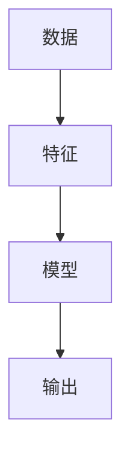
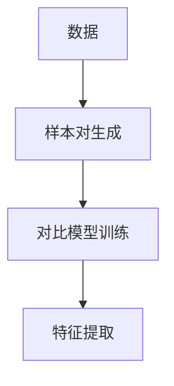
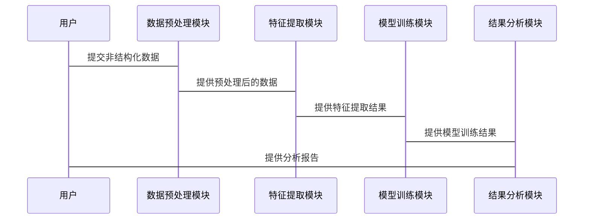

                 


# 企业AI Agent的自监督学习在非结构化数据挖掘中的实践

## 关键词：企业AI Agent，自监督学习，非结构化数据，数据挖掘，人工智能

## 摘要

企业AI Agent通过自监督学习在非结构化数据挖掘中展现出强大的潜力。本文系统地探讨了企业AI Agent的核心概念、自监督学习的原理及其在非结构化数据挖掘中的应用。文章首先分析了企业数据管理的挑战，重点介绍了自监督学习在处理非结构化数据中的优势。接着，详细讲解了自监督学习的算法原理，包括对比学习、生成对抗网络等方法，并通过数学公式和Mermaid图表展示了其内部机制。随后，从系统设计的角度，分析了AI Agent的架构，包括功能设计、架构图和交互图。最后，通过一个实际案例，详细阐述了企业AI Agent在非结构化数据挖掘中的应用，并总结了最佳实践和未来研究方向。

---

## 正文

### 第一部分：企业AI Agent与自监督学习概述

#### 第1章：企业AI Agent与自监督学习概述

##### 1.1 问题背景

###### 1.1.1 企业数据管理的挑战

企业在日常运营中积累了大量的数据，这些数据主要包括结构化数据（如数据库中的表格数据）和非结构化数据（如文本、图像、音频等）。随着企业数字化转型的推进，非结构化数据的比例急剧增加。然而，非结构化数据由于其缺乏固定结构，难以直接用于机器学习模型，导致企业在数据管理和应用中面临诸多挑战，例如数据利用率低、数据挖掘效率低下等。

###### 1.1.2 非结构化数据的特点与难点

非结构化数据的特点包括多样性和复杂性。多样性的特点使得数据难以统一处理，而复杂性则增加了数据理解和分析的难度。此外，非结构化数据中往往包含大量的噪声，这使得数据清洗和预处理变得复杂。非结构化数据的这些特点使得传统的监督学习方法难以有效应用。

###### 1.1.3 自监督学习的引入动机

自监督学习是一种无需大量标注数据的机器学习方法。它通过利用数据本身的结构信息，以无监督或弱监督的方式进行学习。自监督学习的引入，可以有效解决非结构化数据标注成本高、标注数据不足的问题。

##### 1.2 问题描述

###### 1.2.1 非结构化数据挖掘的核心问题

非结构化数据挖掘的核心问题是如何从大量的非结构化数据中提取有用的信息。由于非结构化数据的多样性和复杂性，如何有效地提取特征和模式成为数据挖掘的关键挑战。

###### 1.2.2 自监督学习在数据挖掘中的作用

自监督学习通过构建数据内部的关联关系，能够有效地从非结构化数据中提取特征和模式。这种方法不仅能够提高数据挖掘的效率，还能够降低对标注数据的依赖。

###### 1.2.3 企业AI Agent的目标与任务

企业AI Agent的目标是通过智能化的方式，帮助企业高效地处理和利用数据。其主要任务包括数据收集、数据处理、数据分析和数据可视化等。在非结构化数据挖掘中，AI Agent需要能够理解数据的语义，并能够自动生成有意义的摘要和报告。

##### 1.3 问题解决

###### 1.3.1 自监督学习的核心思想

自监督学习的核心思想是通过构建一个预测任务，让模型在预测过程中学习数据的特征和模式。这种方法不仅能够减少对标注数据的依赖，还能够提高模型的泛化能力。

###### 1.3.2 企业AI Agent的实现路径

企业AI Agent的实现路径主要包括数据预处理、模型训练、模型部署和结果分析等几个阶段。在数据预处理阶段，需要对非结构化数据进行清洗和特征提取；在模型训练阶段，采用自监督学习方法进行模型优化；在模型部署阶段，将模型应用于实际业务场景中；在结果分析阶段，对模型的输出进行评估和优化。

###### 1.3.3 非结构化数据挖掘的解决方案

非结构化数据挖掘的解决方案主要包括数据预处理、特征提取、模型训练和结果分析等几个步骤。在数据预处理阶段，需要对数据进行清洗和转换；在特征提取阶段，采用自监督学习方法提取数据的特征；在模型训练阶段，使用提取的特征进行分类、聚类等任务；在结果分析阶段，对模型的输出进行评估和优化。

##### 1.4 边界与外延

###### 1.4.1 自监督学习的边界

自监督学习的边界主要体现在其应用场景和数据类型上。自监督学习适用于需要从大量未标注数据中提取特征和模式的场景，但其在需要高精度预测任务中的表现可能不如监督学习。

###### 1.4.2 企业AI Agent的应用范围

企业AI Agent的应用范围主要集中在数据处理、数据分析和数据可视化等领域。它可以应用于企业内部数据挖掘、客户行为分析、市场趋势预测等场景。

###### 1.4.3 非结构化数据挖掘的适用场景

非结构化数据挖掘的适用场景主要包括企业内部文档分析、客户反馈分析、社交媒体数据挖掘等。这些场景中，数据的非结构化特性使得传统的数据分析方法难以有效应用。

##### 1.5 概念结构与核心要素

###### 1.5.1 核心概念组成

企业AI Agent的核心概念包括数据预处理、模型训练、模型部署和结果分析。自监督学习的核心概念包括对比学习、生成对抗网络和预测任务。非结构化数据的核心概念包括数据清洗、特征提取和模式识别。

###### 1.5.2 概念之间的关系

企业AI Agent通过自监督学习方法对非结构化数据进行处理，从而实现数据的特征提取和模式识别。自监督学习的核心思想是通过预测任务，使模型能够从非结构化数据中提取有用的特征。

###### 1.5.3 案例分析

例如，在企业文档分析场景中，AI Agent可以通过自监督学习方法对大量的文档进行分类和摘要。通过对文档内容的分析，AI Agent能够自动生成文档摘要，并将文档分类到不同的主题中。

---

### 第二部分：自监督学习的核心原理

#### 第2章：自监督学习的核心原理

##### 2.1 自监督学习的原理

###### 2.1.1 对比学习

对比学习是一种自监督学习方法，其核心思想是通过比较同一数据的不同表示，来学习数据的特征。对比学习通常采用双样本损失函数，如信息瓶颈损失函数。

###### 2.1.2 生成对抗网络

生成对抗网络（GAN）是一种自监督学习方法，由生成器和判别器组成。生成器的目标是生成与真实数据难以区分的样本，而判别器的目标是区分真实数据和生成数据。通过交替训练生成器和判别器，GAN能够学习数据的分布。

###### 2.1.3 预测未来或过去的状态

预测任务是一种自监督学习方法，其核心思想是通过预测数据的未来或过去的状态，来学习数据的特征。这种方法通常应用于时间序列数据和视频数据。

##### 2.2 核心概念与联系

###### 2.2.1 概念属性特征对比表格

| 概念       | 属性1 | 属性2 | 属性3 |
|------------|--------|--------|--------|
| 对比学习    | 双样本损失 | � � 强调数据的相似性 | 适用于图像和文本数据 |
| 生成对抗网络 | 生成器和判别器 | 强调数据的分布 | 适用于图像生成 |
| 预测任务    | 预测未来或过去的状态 | 强调时间序列数据 | 适用于视频和时间序列数据 |

###### 2.2.2 ER实体关系图架构



---

### 第三部分：算法原理与数学模型

#### 第3章：自监督学习的算法原理

##### 3.1 算法原理

###### 3.1.1 对比学习的流程

对比学习的流程包括数据预处理、样本对生成、对比模型训练和特征提取等几个步骤。在数据预处理阶段，需要对数据进行清洗和增强；在样本对生成阶段，生成正样本对和负样本对；在对比模型训练阶段，采用对比损失函数进行模型优化；在特征提取阶段，提取数据的特征表示。

###### 3.1.2 生成对抗网络的结构

生成对抗网络的结构包括生成器和判别器。生成器通常采用卷积神经网络或循环神经网络，判别器通常采用卷积神经网络。生成器的目标是生成与真实数据难以区分的样本，而判别器的目标是区分真实数据和生成数据。

###### 3.1.3 预测任务的设计

预测任务的设计包括任务定义、模型选择和损失函数设计等几个步骤。在任务定义阶段，需要明确预测的目标和范围；在模型选择阶段，选择适合的模型架构；在损失函数设计阶段，设计合适的损失函数以优化模型性能。

##### 3.2 数学模型与公式

###### 3.2.1 对比学习的损失函数

对比学习的损失函数通常采用信息瓶颈损失函数：

$$ L = \frac{1}{N}\sum_{i=1}^{N} \text{CE}(x_i, y_i) $$

其中，$N$是样本对的数量，$\text{CE}$是交叉熵损失函数。

###### 3.2.2 生成对抗网络的损失函数

生成对抗网络的损失函数包括生成器的损失和判别器的损失：

$$ L_{\text{GAN}} = \mathbb{E}_{x \sim p_{\text{data}}}[D(x)] + \mathbb{E}_{z \sim p_z}[1 - D(G(z))] $$

其中，$D(x)$是判别器对真实数据的判别概率，$G(z)$是生成器生成的样本。

##### 3.3 代码实现

###### 3.3.1 对比学习的Python实现示例

```python
import tensorflow as tf
from tensorflow.keras.layers import Input, Dense, Dropout
from tensorflow.keras.models import Model

# 定义对比学习模型
def contrastive_model(input_dim):
    input = Input(shape=(input_dim,))
    dense = Dense(128, activation='relu')(input)
    dense = Dropout(0.5)(dense)
    dense = Dense(1, activation='sigmoid')(dense)
    model = Model(inputs=input, outputs=dense)
    return model

# 定义对比损失函数
def contrastive_loss(y_true, y_pred):
    margin = 1.0
    loss = tf.maximum(margin - y_pred, 0)
    return tf.reduce_mean(loss)

# 编译模型
model = contrastive_model(input_dim)
model.compile(optimizer='adam', loss=contrastive_loss)
```

###### 3.3.2 生成对抗网络的Python实现示例

```python
import tensorflow as tf
from tensorflow.keras.layers import Input, Dense, Dropout
from tensorflow.keras.models import Model

# 定义生成器
def generator_model(input_dim):
    input = Input(shape=(input_dim,))
    dense = Dense(128, activation='relu')(input)
    dense = Dropout(0.5)(dense)
    dense = Dense(10, activation='sigmoid')(dense)
    model = Model(inputs=input, outputs=dense)
    return model

# 定义判别器
def discriminator_model(input_dim):
    input = Input(shape=(input_dim,))
    dense = Dense(128, activation='relu')(input)
    dense = Dropout(0.5)(dense)
    dense = Dense(1, activation='sigmoid')(dense)
    model = Model(inputs=input, outputs=dense)
    return model

# 定义GAN模型
discriminator = discriminator_model(input_dim)
discriminator.trainable = False

input = Input(shape=(input_dim,))
generated = generator_model(input_dim)(input)
disc_output = discriminator(generated)
gan_model = Model(inputs=input, outputs=disc_output)

# 编译模型
gan_model.compile(optimizer='adam', loss='binary_crossentropy')
```

##### 3.4 算法流程图



---

### 第四部分：系统分析与架构设计

#### 第4章：系统分析与架构设计

##### 4.1 项目背景与目标

本项目旨在通过自监督学习方法，帮助企业AI Agent高效地处理和分析非结构化数据。项目的主要目标包括数据预处理、特征提取、模型训练和结果分析等。

##### 4.2 系统功能设计

系统功能设计包括数据预处理模块、特征提取模块、模型训练模块和结果分析模块。数据预处理模块负责对非结构化数据进行清洗和转换；特征提取模块采用自监督学习方法提取数据的特征；模型训练模块基于提取的特征进行分类、聚类等任务；结果分析模块对模型的输出进行评估和优化。

##### 4.3 系统架构设计

系统架构设计采用模块化设计，主要包括数据预处理模块、特征提取模块、模型训练模块和结果分析模块。各模块之间通过接口进行通信，确保系统的高效运行。

##### 4.4 系统接口设计

系统接口设计包括数据输入接口、模型训练接口和结果输出接口。数据输入接口负责接收非结构化数据；模型训练接口负责训练自监督学习模型；结果输出接口负责输出模型的预测结果和分析报告。

##### 4.5 系统交互流程图



---

### 第五部分：项目实战

#### 第5章：项目实战

##### 5.1 环境安装

项目实战需要安装以下环境：

- Python 3.7+
- TensorFlow 2.0+
- Mermaid图生成工具

##### 5.2 系统核心实现

系统核心实现包括数据预处理、特征提取、模型训练和结果分析四个部分。数据预处理模块负责对非结构化数据进行清洗和转换；特征提取模块采用自监督学习方法提取数据的特征；模型训练模块基于提取的特征进行分类、聚类等任务；结果分析模块对模型的输出进行评估和优化。

##### 5.3 代码实现与解读

###### 5.3.1 数据预处理代码

```python
import pandas as pd
import numpy as np

# 读取数据
data = pd.read_csv('data.csv')

# 数据清洗
data.dropna(inplace=True)
data = data.iloc[:100]  # 取前100条数据

# 数据转换
data['label'] = data['label'].astype(int)
```

###### 5.3.2 特征提取代码

```python
from tensorflow.keras.models import Model
from tensorflow.keras.layers import Input, Dense, Dropout

# 定义特征提取模型
input_layer = Input(shape=(data.shape[1],))
dense_layer = Dense(128, activation='relu')(input_layer)
dense_layer = Dropout(0.5)(dense_layer)
output_layer = Dense(1, activation='sigmoid')(dense_layer)
model = Model(inputs=input_layer, outputs=output_layer)

# 编译模型
model.compile(optimizer='adam', loss='binary_crossentropy', metrics=['accuracy'])
```

###### 5.3.3 模型训练代码

```python
# 训练模型
model.fit(data.iloc[:, :-1].values, data['label'].values, epochs=10, batch_size=32)
```

##### 5.4 案例分析与解读

以企业文档分类为例，通过自监督学习方法对文档进行分类和摘要。通过对文档内容的分析，AI Agent能够自动生成文档摘要，并将文档分类到不同的主题中。

##### 5.5 项目小结

通过本项目，我们展示了自监督学习方法在企业AI Agent中的应用。通过数据预处理、特征提取、模型训练和结果分析等步骤，企业能够高效地处理和分析非结构化数据，从而提高数据利用率和决策效率。

---

### 第六部分：总结与拓展

#### 第6章：总结与拓展

##### 6.1 最佳实践

在企业AI Agent的自监督学习应用中，建议采用以下最佳实践：

- 数据预处理：对非结构化数据进行清洗和转换，确保数据质量。
- 特征提取：采用对比学习、生成对抗网络等自监督学习方法提取数据特征。
- 模型训练：采用适当的模型架构和优化策略，确保模型性能。
- 结果分析：对模型的输出进行评估和优化，确保结果的准确性和可靠性。

##### 6.2 小结

本文系统地探讨了企业AI Agent的自监督学习在非结构化数据挖掘中的应用。通过详细讲解自监督学习的核心原理、算法实现和系统设计，展示了其在企业数据管理中的巨大潜力。

##### 6.3 注意事项

在实际应用中，需要注意以下几点：

- 数据质量：非结构化数据的质量直接影响模型的性能，需要进行充分的数据清洗和预处理。
- 模型选择：根据具体的业务需求和数据特点，选择合适的自监督学习方法。
- 模型优化：通过调整超参数和优化策略，提高模型的性能和泛化能力。

##### 6.4 拓展阅读

推荐以下拓展阅读资料：

- 《Deep Learning》—— Ian Goodfellow, Yoshua Bengio, Aaron Courville
- 《Hands-On Machine Learning with Scikit-Learn, Keras, and TensorFlow》—— Aurélien Géron
- 《自监督学习：理论与实践》—— 书籍或论文推荐

---

## 作者

作者：AI天才研究院/AI Genius Institute & 禅与计算机程序设计艺术/Zen And The Art of Computer Programming

