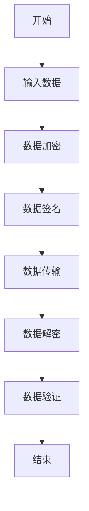
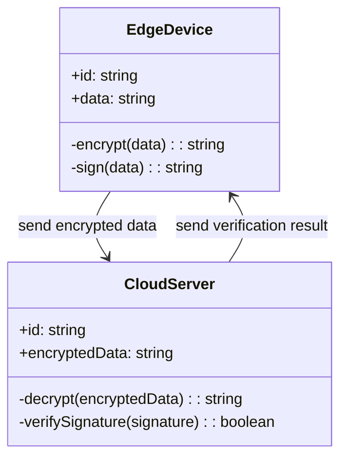

                 


# 如何识别企业的边缘计算安全优势

> 关键词：边缘计算安全、企业安全、数据完整性、网络安全、数学模型

> 摘要：边缘计算作为一种新兴的计算范式，正在迅速改变企业的 IT 架构和业务模式。然而，随着边缘设备的普及和数据处理的 decentralization，安全问题也随之而来。本文将深入探讨如何识别企业的边缘计算安全优势，从核心概念到算法原理，再到系统架构和项目实战，全面解析边缘计算安全的关键要素和实现方法。

---

# 第一部分: 边缘计算安全背景与挑战

## 第1章: 边缘计算安全的背景与挑战

### 1.1 边缘计算的基本概念

#### 1.1.1 什么是边缘计算
边缘计算是一种分布式计算范式，将数据处理和存储从中心服务器转移到靠近数据源的边缘设备。这种模式减少了数据传输的延迟，提高了实时响应能力。

#### 1.1.2 边缘计算的特点与优势
边缘计算具有以下特点：
- **分布式架构**：数据在生成地进行处理，减少对中心服务器的依赖。
- **低延迟**：实时处理数据，提高响应速度。
- **带宽优化**：仅传输关键数据，降低网络负载。

优势包括：
- 提高效率：减少数据传输距离，降低延迟。
- 节省成本：通过边缘设备分担中心服务器的负载。
- 提高安全性：数据在边缘处理，减少传输过程中的潜在风险。

#### 1.1.3 边缘计算的应用场景
边缘计算广泛应用于以下场景：
- **物联网（IoT）**：智能家居、工业物联网等。
- **实时数据分析**：金融交易、实时监控等。
- **边缘AI**：边缘设备上的机器学习和深度学习。

### 1.2 边缘计算安全的重要性

#### 1.2.1 边缘计算中的安全威胁
边缘计算的安全威胁主要来自以下几个方面：
- **数据泄露**：边缘设备可能成为攻击目标，导致数据泄露。
- **设备被操控**：恶意软件或物理篡改可能导致设备被操控。
- **通信被截获**：数据在传输过程中可能被截获或篡改。

#### 1.2.2 安全漏洞对企业的影响
- **经济损失**：数据泄露可能导致财务损失和声誉损害。
- **业务中断**：安全漏洞可能导致系统停机，影响业务连续性。
- **法律责任**：合规性问题可能导致法律纠纷。

#### 1.2.3 边缘计算安全的行业现状
目前，边缘计算安全的行业现状包括：
- **标准化缺失**：缺乏统一的安全标准和规范。
- **技术复杂性**：边缘设备种类繁多，增加了安全管理的难度。
- **人才短缺**：专业安全人才不足，难以应对复杂的威胁。

### 1.3 企业为什么要关注边缘计算安全

#### 1.3.1 企业数字化转型的需求
数字化转型要求企业采用新技术，如边缘计算，以提高效率和竞争力。

#### 1.3.2 边缘计算在企业中的应用趋势
边缘计算在企业中的应用趋势包括：
- **智能化生产**：工业自动化中的实时数据处理。
- **智能物流**：物流节点的实时监控和优化。
- **智能客户服务**：通过边缘设备提供个性化服务。

#### 1.3.3 安全优势对企业竞争力的影响
- **提升客户信任**：数据安全保护增强客户信任。
- **降低运营成本**：通过安全措施减少数据泄露风险。
- **提高市场竞争力**：安全可靠的系统吸引更多客户。

### 1.4 本章小结
本章介绍了边缘计算的基本概念、安全的重要性以及企业关注边缘计算安全的必要性。接下来将深入探讨边缘计算安全的核心概念和原理。

---

## 第2章: 边缘计算安全的核心概念

### 2.1 边缘计算安全模型

#### 2.1.1 安全模型的定义
边缘计算安全模型是一个框架，用于描述数据在边缘设备上的安全保护机制。

#### 2.1.2 安全模型的组成要素
安全模型的组成要素包括：
- **数据**：生成、传输和处理的数据。
- **设备**：边缘设备的物理和逻辑安全。
- **网络**：数据传输过程中的网络安全。
- **用户**：用户的权限和身份验证。

#### 2.1.3 安全模型的实现方式
边缘计算安全模型的实现方式包括：
- **数据加密**：对数据进行加密处理，防止数据泄露。
- **身份验证**：通过身份验证确保只有授权用户可以访问数据。
- **访问控制**：基于角色的访问控制（RBAC）和基于属性的访问控制（ABAC）。

### 2.2 边缘计算安全的关键属性

#### 2.2.1 数据完整性
数据完整性是指数据在传输和处理过程中保持一致性和准确性。通过哈希函数和数字签名等技术可以实现数据完整性。

#### 2.2.2 数据机密性
数据机密性是指确保数据在传输和存储过程中不被未经授权的人员访问。通过加密技术可以实现数据机密性。

#### 2.2.3 数据可用性
数据可用性是指确保数据在需要时可以被访问和使用。通过冗余备份和高可用性架构可以实现数据可用性。

### 2.3 边缘计算安全的核心要素对比

#### 2.3.1 数据安全与网络安全的对比
| 对比维度 | 数据安全 | 网络安全 |
|----------|----------|----------|
| 保护对象 | 数据的机密性、完整性和可用性 | 网络设备、通信通道和数据传输 |
| 实现方式 | 加密、签名、访问控制 | 防火墙、入侵检测系统、VPN |

#### 2.3.2 边缘计算与云计算的安全对比
| 对比维度 | 边缘计算 | 云计算 |
|----------|----------|----------|
| 数据位置 | 数据靠近数据源 | 数据集中在云端 |
| 延迟 | 低延迟 | 高延迟 |
| 安全威胁 | 边缘设备可能被物理篡改 | 云服务器可能遭受网络攻击 |

#### 2.3.3 边缘设备与中心服务器的安全对比
| 对比维度 | 边缘设备 | 中心服务器 |
|----------|----------|----------|
| 资源限制 | 资源有限，处理能力弱 | 资源丰富，处理能力强 |
| 安全需求 | 需要物理和网络安全 | 需要网络和应用安全 |

### 2.4 本章小结
本章分析了边缘计算安全模型的核心概念，包括数据完整性、机密性和可用性，并通过对比分析明确了边缘计算与云计算的安全差异。接下来将深入探讨边缘计算安全的算法原理。

---

## 第3章: 边缘计算安全算法的原理与实现

### 3.1 边缘计算安全算法概述

#### 3.1.1 算法的基本原理
边缘计算安全算法的基本原理是通过对数据进行加密、签名和验证，确保数据在传输和处理过程中的安全。

#### 3.1.2 算法的核心思想
边缘计算安全算法的核心思想是通过数学模型和密码学技术，实现数据的机密性、完整性和可用性。

#### 3.1.3 算法的实现步骤
1. 数据加密：对数据进行加密处理，确保数据机密性。
2. 数据签名：对数据进行签名处理，确保数据完整性。
3. 数据传输：将加密和签名后的数据传输到目标设备。
4. 数据解密：在目标设备上对数据进行解密。
5. 数据验证：验证数据的完整性和真实性。

### 3.2 边缘计算安全算法的数学模型

#### 3.2.1 数据加密模型
数据加密模型可以表示为：
$$ E(x) = x \cdot k $$
其中，\( x \) 是明文，\( k \) 是密钥，\( E(x) \) 是密文。

#### 3.2.2 数据签名模型
数据签名模型可以表示为：
$$ S(x) = h(x) \cdot k $$
其中，\( h(x) \) 是哈希函数，\( k \) 是签名密钥，\( S(x) \) 是签名。

### 3.3 边缘计算安全算法的流程图



### 3.4 本章小结
本章详细讲解了边缘计算安全算法的原理与实现，包括数据加密和签名的数学模型，以及算法的流程图。接下来将探讨边缘计算安全的系统分析与架构设计。

---

## 第4章: 边缘计算安全的系统分析与架构设计

### 4.1 系统功能设计

#### 4.1.1 数据采集模块
数据采集模块负责从边缘设备采集数据，并进行初步处理。

#### 4.1.2 数据处理模块
数据处理模块对采集到的数据进行分析和处理，生成有用的信息。

#### 4.1.3 数据存储模块
数据存储模块负责存储处理后的数据，并提供数据查询功能。

### 4.2 系统架构设计

#### 4.2.1 系统功能设计
系统功能设计可以使用 Mermaid 类图表示：



#### 4.2.2 系统架构图
系统架构图可以使用 Mermaid 架构图表示：


### 4.3 本章小结
本章详细分析了边缘计算安全系统的功能设计和架构设计，明确了各模块之间的关系和交互方式。接下来将探讨边缘计算安全的项目实战。

---

## 第5章: 边缘计算安全的项目实战

### 5.1 环境安装

#### 5.1.1 安装边缘设备
安装边缘设备，例如树莓派或其他支持边缘计算的设备。

#### 5.1.2 安装中心服务器
安装中心服务器，例如基于 Linux 的云服务器。

#### 5.1.3 安装必要的软件
安装必要的软件，例如加密库、签名库和通信协议支持。

### 5.2 核心代码实现

#### 5.2.1 数据加密与签名
以下是数据加密与签名的代码实现：

```python
import hashlib

def encrypt(data, key):
    return data * key

def decrypt(encrypted_data, key):
    return encrypted_data / key

def sign(data, key):
    hash_value = hashlib.sha256(data.encode()).hexdigest()
    return hash_value * key

def verify_signature(signature, data, key):
    expected_hash = hashlib.sha256(data.encode()).hexdigest()
    return signature == expected_hash * key
```

#### 5.2.2 数据传输与验证
以下是数据传输与验证的代码实现：

```python
import socket

def send_data(sender, receiver, data, key):
    encrypted_data = encrypt(data, key)
    signed_data = sign(data, key)
    receiver.send(encrypted_data + ',' + signed_data)

def receive_data(receiver, key):
    data = receiver.recv().split(',')
    decrypted_data = decrypt(data[0], key)
    verified = verify_signature(data[1], decrypted_data, key)
    return decrypted_data, verified
```

### 5.3 案例分析

#### 5.3.1 案例背景
假设我们有一个边缘计算系统，用于实时监测工业设备的运行状态。

#### 5.3.2 案例实现
在边缘设备上安装传感器，采集设备状态数据，加密并签名后传输到中心服务器。

#### 5.3.3 案例分析
通过分析数据，发现设备运行异常，并及时采取措施。

### 5.4 本章小结
本章通过实际案例展示了边缘计算安全的项目实战，包括环境安装、代码实现和案例分析。接下来将总结边缘计算安全的最佳实践。

---

## 第6章: 边缘计算安全的最佳实践与总结

### 6.1 最佳实践

#### 6.1.1 安全策略
制定全面的安全策略，包括数据加密、访问控制和身份验证。

#### 6.1.2 安全培训
对员工进行安全培训，提高安全意识。

#### 6.1.3 定期审计
定期进行安全审计，及时发现和修复安全漏洞。

### 6.2 小结
边缘计算安全的实现需要从硬件、软件和网络等多个层面进行全面考虑。通过合理的安全策略和最佳实践，可以有效提升企业的边缘计算安全优势。

### 6.3 注意事项
- **数据备份**：定期备份数据，防止数据丢失。
- **设备管理**：加强边缘设备的管理，防止设备被篡改。
- **监控与预警**：建立监控系统，及时发现异常行为。

### 6.4 拓展阅读
- **《网络安全实战》**：深入理解网络安全的基本原理和实战技巧。
- **《边缘计算入门》**：系统介绍边缘计算的概念、技术和应用。

---

## 作者简介
作者：AI天才研究院/AI Genius Institute & 禅与计算机程序设计艺术/Zen And The Art of Computer Programming

---

以上是《如何识别企业的边缘计算安全优势》的技术博客文章的完整目录大纲和部分内容。如需进一步扩展或修改，请随时告知！

